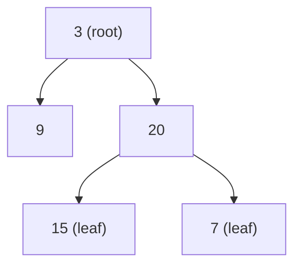
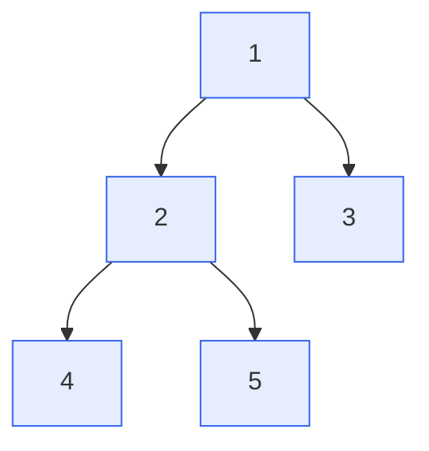
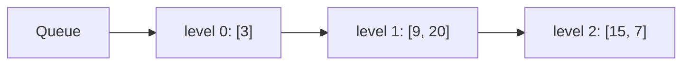
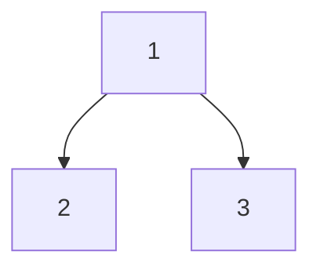
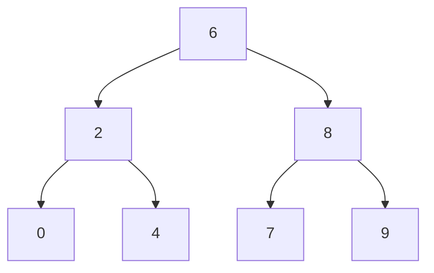
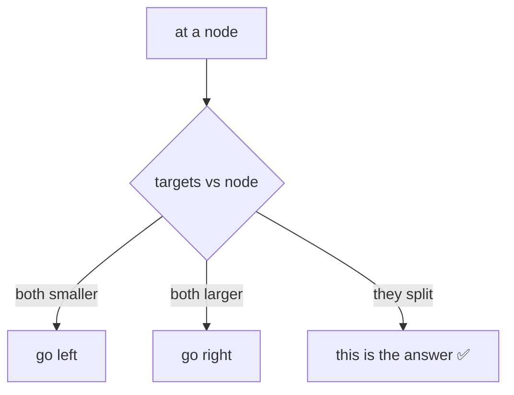
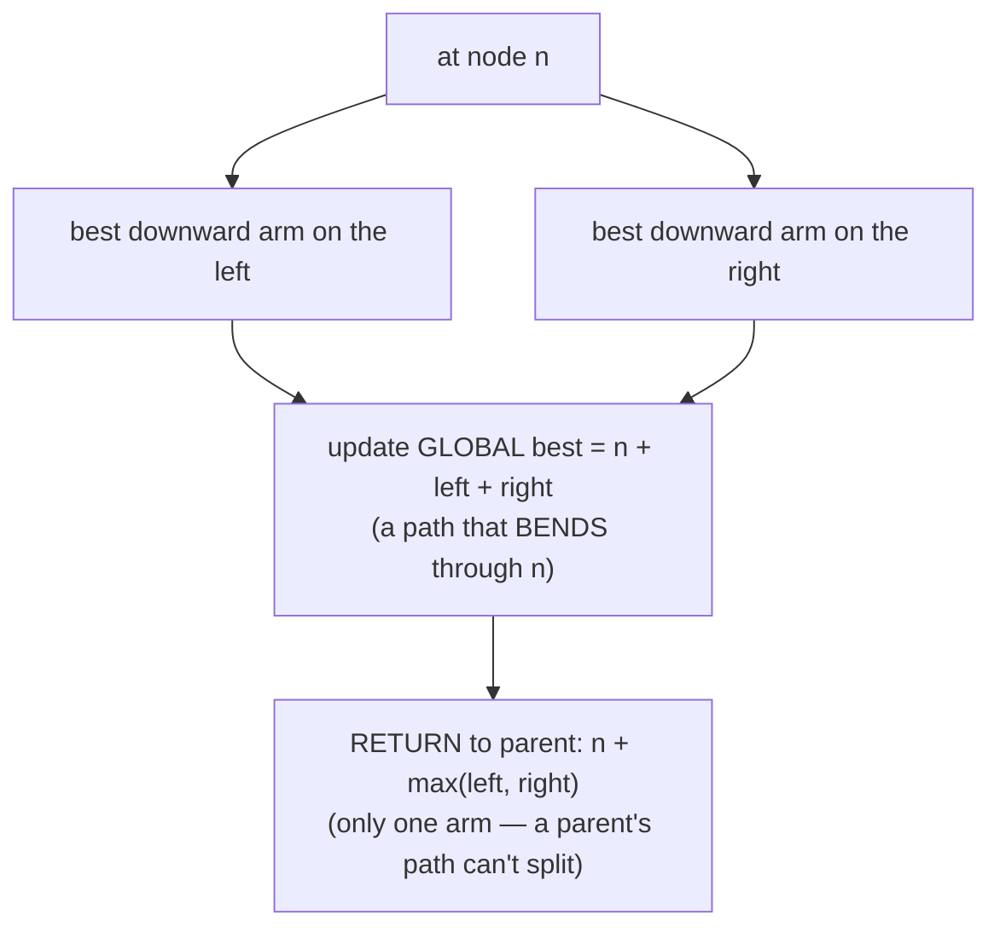
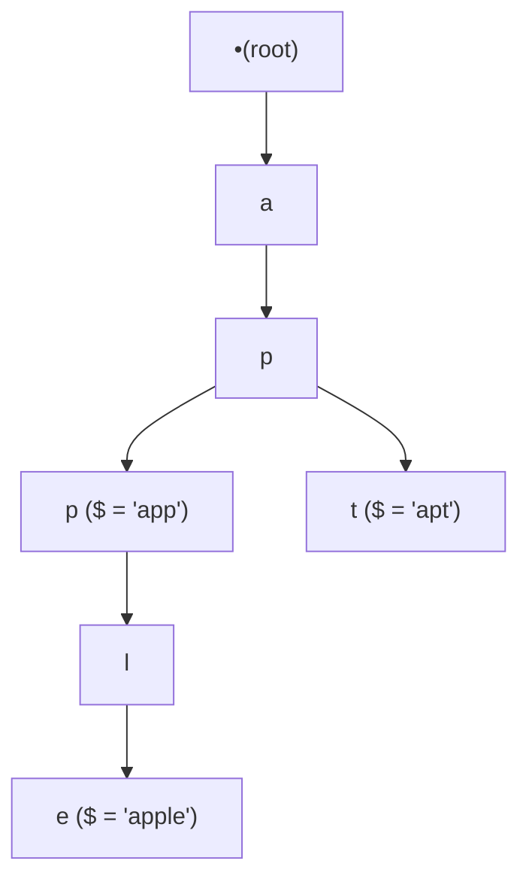
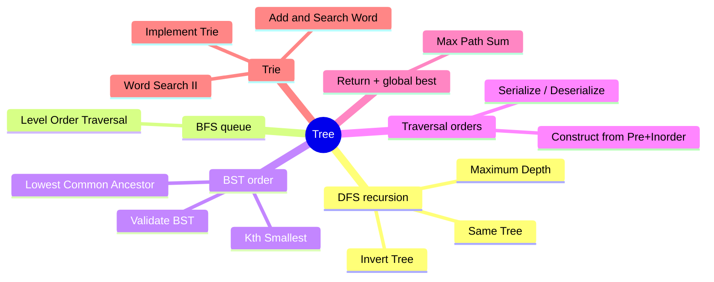

# 🌳 Tree — Concept Tutorial

> A plain-language guide to the ideas behind the Blind 75 **Tree** problems, with diagrams.
> Pair this with `visualizations/Tree/` and `notebooks/Tree/`.

---

## 1. What is a Binary Tree?

A **binary tree** is nodes in a branching shape. Each node holds a value and up to **two children** — a **left** and a **right**. The top node is the **root**; nodes with no children are **leaves**.

- **Height** = the longest path from root to a leaf.
- Most tree problems are solved by **recursion**: *"solve a node by combining the answers of its children."*

---

## 2. The Two Ways to Walk a Tree

### 🌊 DFS (Depth-First Search) — go deep first

Dive down one branch as far as possible, then back up. Written with recursion.

*Visit order (preorder): 1 → 2 → 4 → 5 → 3.*

### 🪣 BFS (Breadth-First Search) — go level by level

Use a **queue**: take a node, add its children to the back, repeat. Perfect for "by level" problems.

**Rule of thumb:** *"level / depth / shortest steps"* → **BFS**. Everything else → **DFS**.

---

## 3. Traversal Orders (and why they matter)

| Order | Rule | On the tree above |
|---|---|---|
| **Preorder** | node, left, right | 1, 2, 3 |
| **Inorder** | left, node, right | 2, 1, 3 |
| **Postorder** | left, right, node | 2, 3, 1 |

Two facts to memorize:
- **Preorder's first value is always the root** → used to rebuild trees.
- **Inorder of a BST comes out sorted** → used to validate and rank.

**Problems:** Construct Binary Tree from Preorder & Inorder, Serialize/Deserialize.

---

## 4. Binary Search Tree (BST) — the ordered tree

In a BST, for **every** node: everything on the **left is smaller**, everything on the **right is larger**.

Two superpowers:
1. **In-order walk = sorted values** (0,2,4,6,7,8,9) → validate a BST, find the k-th smallest.
2. **Navigate by comparison** — to find where two values split, go left if both are smaller, right if both are larger. This is `O(height)`, not `O(n)`.

**Problems:** Validate BST, Kth Smallest in BST, Lowest Common Ancestor of a BST.

---

## 5. The "Return One Thing, Track Another" Trick

For problems where the best answer can appear **anywhere** (not just at the root), a single DFS both **returns** a value to its parent and **updates a global best**.

**Problems:** Binary Tree Maximum Path Sum (and Diameter of a Tree).

---

## 6. Trie (Prefix Tree) — a tree of letters

A **trie** stores words letter by letter, so words sharing a start share a path. A marker (`$`) flags where a word ends.

- Insert / search / prefix-check a word of length L is **O(L)** — no matter how many words are stored.
- Add a small DFS at a `.` wildcard to branch into all children.

**Problems:** Implement Trie, Add and Search Word, Word Search II (trie + grid backtracking).

---

## 7. Which Pattern for Which Problem?

---

## 8. Complexity Cheat Sheet

| Task | Time | Space |
|---|---|---|
| Full traversal (DFS/BFS) | `O(n)` | `O(height)` / `O(width)` |
| BST navigation | `O(height)` | `O(1)`–`O(height)` |
| Trie op (word length L) | `O(L)` | `O(total letters)` |

---

## 9. Interview Playbook

1. **Reach for recursion:** "solve each node by combining its children," and say the **base case** (empty node) out loud.
2. **Spot the tell:** levels → *BFS*; it's a BST → *in-order is sorted* / *navigate by comparison*; rebuild/save → *traversal orders + null markers*; answer anywhere → *return one arm, track a global best*; prefixes/many words → *trie*.
3. **Mind the edges:** empty tree, single node, and very deep (skewed) trees where recursion could get tall.

> ▶ **Next:** open `visualizations/Tree/index.html` to watch these traversals and tricks animate.
