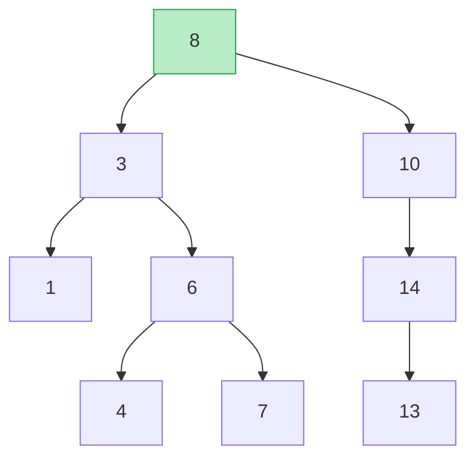
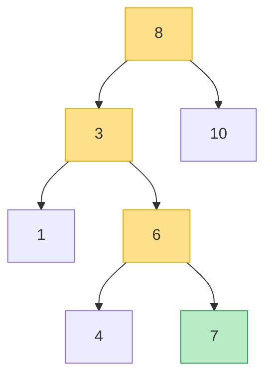
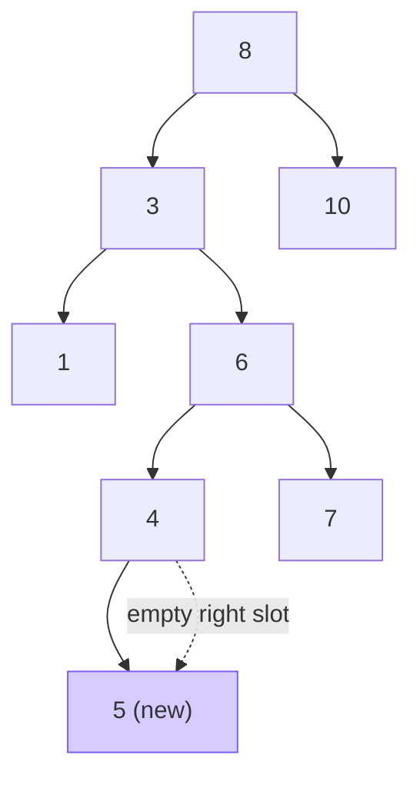
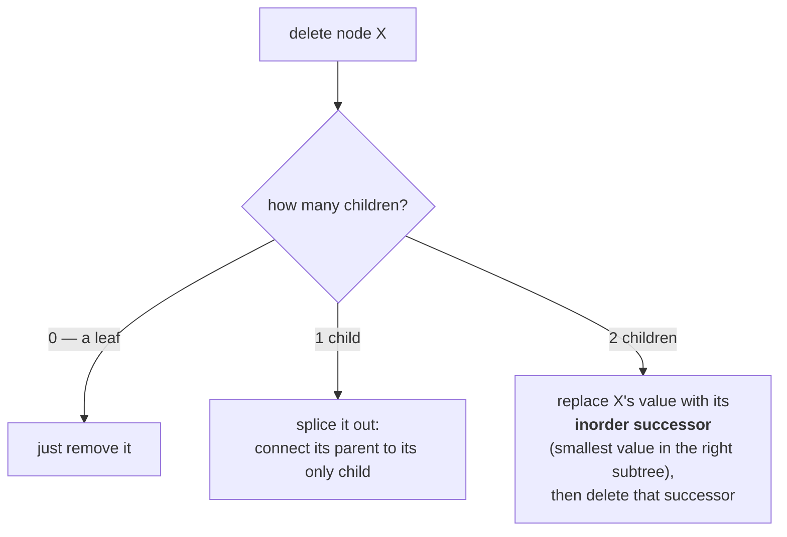
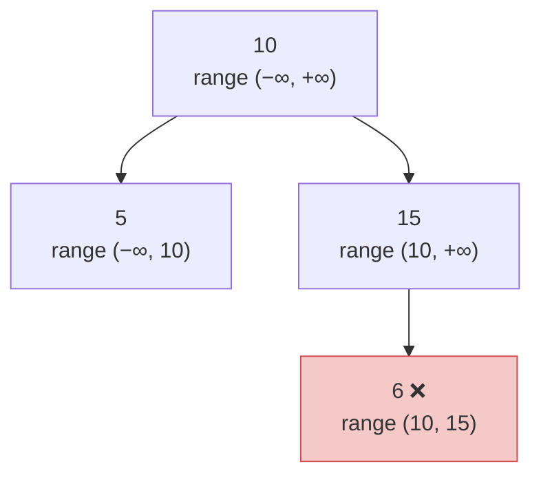
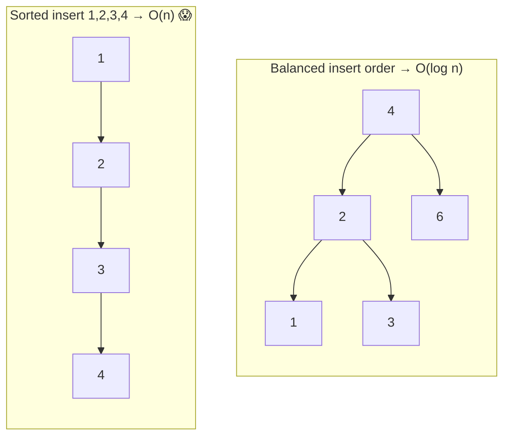

# 🔍 Binary Search Trees (BST) — A Deep Dive

> A **Binary Search Tree** is a binary tree with **one extra rule** that turns it into a searchable, always-sorted
> structure: for every node, **everything on its left is smaller, everything on its right is larger.** That single
> invariant is what gives you `O(log n)` search, insert, and delete — as long as the tree stays balanced.

Prerequisite: [Binary Trees](../02_Binary_Tree/README.md) — nodes, left/right, height, and why height drives cost.

---

## 1. The one rule (the BST invariant)

> **For every node:** all values in its **left subtree** are **< node**, and all values in its **right subtree**
> are **> node**. And this holds *recursively* — for every node, not just the root.



*Everything left of 8 is `< 8` (`{3,1,6,4,7}`); everything right is `> 8` (`{10,14,13}`). This is true at **every** node, not only the root — that's the part beginners miss.*

> **The magic consequence:** at each node you can throw away **half** the tree. Smaller than me? Go left and forget
> the right entirely. Bigger? Go right. That halving is where `O(log n)` comes from — it's binary search, on a tree.

---

## 2. Search — follow the comparisons

```python
def search(node, target):
    while node:
        if target == node.val:
            return node          # found it
        node = node.left if target < node.val else node.right   # go one way, drop the other half
    return None                  # fell off the tree → not present
```



*Searching for **7**: 7 < 8 → left to 3; 7 > 3 → right to 6; 7 > 6 → right to 7 ✅. Just **3 comparisons** in an 8-node tree.*

**Cost:** you walk one root-to-leaf path → **`O(h)`**. Balanced ⇒ `O(log n)`; skewed ⇒ `O(n)`.

### Bonus: the inorder walk prints a BST *sorted*

Because left < node < right everywhere, an **in-order traversal** (Left → Node → Right) visits values in **ascending order** — a free "give me everything sorted". This is the single most useful BST fact.

```
inorder(the tree above)  →  1, 3, 4, 6, 7, 8, 10, 13, 14
```

---

## 3. Insert — search, then hang the new node where the search fell off

Inserting is just a failed search: walk down as if searching; the empty slot you land on is exactly where the value
belongs (so the invariant stays true).

```python
def insert(node, val):
    if node is None:
        return TreeNode(val)                 # empty slot → new node lives here
    if val < node.val:
        node.left = insert(node.left, val)   # belongs on the left
    elif val > node.val:
        node.right = insert(node.right, val) # belongs on the right
    # (val == node.val: usually ignore duplicates, or keep a count)
    return node
```



*Inserting **5**: 5<8→left, 5>3→right, 5<6→left, 5>4→right → land on 4's empty right slot. Hang 5 there.*

---

## 4. Delete — the one with three cases

Deleting must keep the invariant. Which case you're in depends on **how many children** the doomed node has:



**Why the inorder successor?** It's the *next-larger* value — the smallest thing in the right subtree. Swapping it in
keeps "left < me < right" true everywhere, and that successor has **at most one child** (no left child, by
definition), so removing *it* is the easy 0-or-1-child case.

```python
def find_min(node):
    while node.left:                 # smallest value = leftmost node
        node = node.left
    return node

def delete(node, val):
    if node is None:
        return None
    if val < node.val:
        node.left = delete(node.left, val)
    elif val > node.val:
        node.right = delete(node.right, val)
    else:                            # found the node to delete
        if node.left is None:  return node.right    # 0 or 1 child (right)
        if node.right is None: return node.left     # 1 child (left)
        succ = find_min(node.right)  # 2 children → inorder successor
        node.val = succ.val          # copy successor's value up
        node.right = delete(node.right, succ.val)   # then delete the successor
    return node
```

---

## 5. Successor, predecessor, floor & ceil

The ordering makes "neighbour" queries natural:

| Query                         | Meaning                | How                                                                                           |
| ----------------------------- | ---------------------- | --------------------------------------------------------------------------------------------- |
| **Min / Max**           | smallest / largest     | walk all the way**left** / **right**                                              |
| **Inorder successor**   | next-larger value      | if a right subtree exists → its min; else the lowest ancestor you're a*left* descendant of |
| **Inorder predecessor** | next-smaller value     | mirror of the above                                                                           |
| **Floor(x)**            | largest value`≤ x`  | BST walk, remembering the best`≤ x` seen                                                   |
| **Ceil(x)**             | smallest value`≥ x` | BST walk, remembering the best`≥ x` seen                                                   |

---

## 6. Validate a BST (a favourite trap)

The naive check "left child < node < right child" is **wrong** — the rule applies to the *whole* subtree, not just
the immediate children. The clean fix: carry a **(low, high) allowed range** down as you recurse.

```python
def is_valid_bst(node, low=float("-inf"), high=float("inf")):
    if node is None:
        return True                                  # empty is valid
    if not (low < node.val < high):                  # must fit the allowed window
        return False
    # going left tightens the UPPER bound; going right tightens the LOWER bound
    return (is_valid_bst(node.left,  low, node.val) and
            is_valid_bst(node.right, node.val, high))
```



*6 sits to the right of 10, so it must be `> 10` — the range `(10, 15)` catches it. A "only-check-my-children" test would wrongly pass this tree.*

---

## 7. The catch: balance is everything

A BST is only fast if it's **short**. Insert sorted data (`1,2,3,4,5…`) into a plain BST and it degenerates into a
**linked list** — every operation becomes `O(n)`.



**The fix — self-balancing BSTs** automatically rotate to stay short:

| Tree                | Idea                                                        | Guarantee                                                                  |
| ------------------- | ----------------------------------------------------------- | -------------------------------------------------------------------------- |
| **AVL**       | strict height balance (heights differ ≤ 1); more rotations | fast lookups                                                               |
| **Red-Black** | looser balance via colour rules; fewer rotations            | great for frequent inserts/deletes (used in`std::map`, Java `TreeMap`) |

> In interviews you usually implement a **plain** BST and *mention* that production code uses a self-balancing variant
> (or a hash map, if you don't need order). Knowing **why** — skewing → `O(n)` — is the point.

---

## 8. Complexity & cheat sheet

| Operation                | Balanced     | Skewed (worst) |
| ------------------------ | ------------ | -------------- |
| Search / Insert / Delete | `O(log n)` | `O(n)`       |
| Min / Max                | `O(log n)` | `O(n)`       |
| In-order (sorted output) | `O(n)`     | `O(n)`       |
| Space (recursion)        | `O(log n)` | `O(n)`       |

| Question                | Answer                                                                     |
| ----------------------- | -------------------------------------------------------------------------- |
| The invariant?          | left subtree`<` node `<` right subtree — **recursively**.       |
| Why`O(log n)`?        | each comparison discards**half** the tree (binary search on a tree). |
| Sorted output?          | **in-order** traversal.                                              |
| Delete with 2 children? | swap with**inorder successor**, then delete that.                    |
| Validate correctly?     | carry a**(low, high) range** down — not just child comparisons.     |
| Biggest risk?           | **skew** on sorted input → `O(n)`; fix with a self-balancing BST. |

**Next:** [Tree Traversal →](../04_Tree_Traversal/README.md) — the four orders (pre / in / post / level), recursive *and*
iterative, and exactly when to reach for each.
