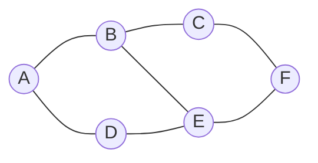
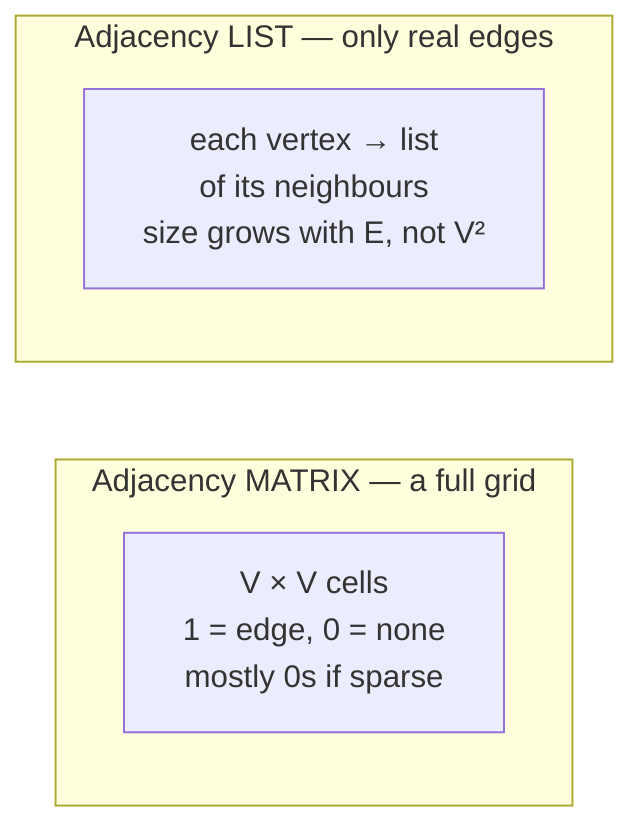
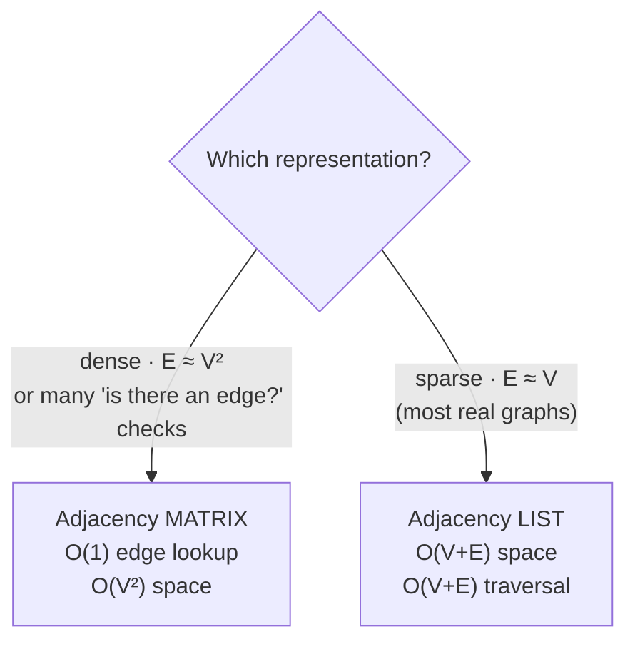

# 🗺️ Graph Representation — Matrix vs List

> 🎯 **Prepping for `Atlassian_Prep/`?** Read [`PRIMARY.md`](PRIMARY.md) instead — it's this tutorial trimmed to only what that problem needs.

> A graph is an abstract idea; to compute with it you must **store** it. There are two main ways — the **adjacency
> matrix** and the **adjacency list** — and choosing between them is one of the most practical decisions in all of
> algorithms. This chapter builds both for the *same* graph and compares them head-to-head.

Prerequisite: [Graph Fundamentals](../05_Graph_Fundamentals/README.md) — vertices, edges, degree, sparse vs dense.

We'll represent this one undirected graph throughout:


*6 vertices (A–F), 7 edges. Neighbours: A:{B,D} · B:{A,C,E} · C:{B,F} · D:{A,E} · E:{B,D,F} · F:{C,E}.*

---

## 1. The adjacency matrix

A **V × V grid**. Cell `matrix[i][j] = 1` if there's an edge from `i` to `j`, else `0`. (For a **weighted** graph,
store the weight instead of 1; use `0`/`∞` for "no edge".)

```
      A  B  C  D  E  F
   A [ 0  1  0  1  0  0 ]
   B [ 1  0  1  0  1  0 ]
   C [ 0  1  0  0  0  1 ]
   D [ 1  0  0  0  1  0 ]
   E [ 0  1  0  1  0  1 ]
   F [ 0  0  1  0  1  0 ]
```

- **Undirected ⇒ symmetric:** `matrix[i][j] == matrix[j][i]` (the grid mirrors across the diagonal).
- **Directed:** set only `matrix[i][j]` — the grid need *not* be symmetric.
- The diagonal is `0` for a simple graph (no self-loops).

```python
# V vertices, indexed 0..V-1
matrix = [[0] * V for _ in range(V)]

def add_edge(u, v, undirected=True):
    matrix[u][v] = 1
    if undirected:
        matrix[v][u] = 1        # mirror it

def has_edge(u, v):
    return matrix[u][v] == 1     # O(1) — the matrix's superpower
```

**The trade-off:** checking "is there an edge u→v?" is instant `O(1)`. But the grid **always** uses `V²` cells — even
if the graph has almost no edges — and listing one vertex's neighbours means scanning a whole row of `V` cells.

---

## 2. The adjacency list

For each vertex, store **just the list of its neighbours**. It's an array (or hash map) of lists.

```
A → [B, D]
B → [A, C, E]
C → [B, F]
D → [A, E]
E → [B, D, F]
F → [C, E]
```

```python
from collections import defaultdict

adj = defaultdict(list)

def add_edge(u, v, undirected=True):
    adj[u].append(v)
    if undirected:
        adj[v].append(u)

def neighbours(u):
    return adj[u]                # O(1) to get the list; O(degree) to walk it

def has_edge(u, v):
    return v in adj[u]           # O(degree(u)) — must scan the list
```

**The trade-off:** it stores **only what exists** — total size `O(V + E)` — and walking a vertex's neighbours costs
`O(degree)`, exactly the work you need. But checking a *specific* edge "u→v?" means scanning `u`'s list.



---

## 3. Head-to-head comparison

| Operation | Adjacency **Matrix** | Adjacency **List** |
|---|---|---|
| **Space** | `O(V²)` always | `O(V + E)` |
| **Add an edge** | `O(1)` | `O(1)` |
| **Remove an edge** | `O(1)` | `O(degree)` (find it in the list) |
| **Check edge `u–v`?** | **`O(1)`** ✅ | `O(degree(u))` |
| **List `u`'s neighbours** | `O(V)` (scan the row) | **`O(degree(u))`** ✅ |
| **Iterate ALL edges** | `O(V²)` | `O(V + E)` ✅ |
| **Best when…** | graph is **dense** (`E ≈ V²`), or you do lots of edge-existence checks | graph is **sparse** (`E ≈ V`) — i.e. **most real graphs** |



### The intuition, in plain words

- A **matrix** is like a **full attendance grid** for every possible pair — instant to check any single pair, but you
  pay for every empty cell. Perfect when the graph is *packed* with edges.
- A **list** is like each person **keeping their own contacts** — compact and exactly the info you need to "visit my
  neighbours", but to ask "do these two specific people know each other?" you flip through one person's contacts.

> **Default choice:** real-world graphs (roads, social networks, the web, dependency graphs) are **sparse**, so the
> **adjacency list is the default** — and it's why graph traversal is quoted as `O(V + E)`. Reach for a matrix only
> when the graph is dense or you need constant-time edge checks (and `V` is small enough that `V²` is affordable).

---

## 4. A third option: the edge list

Just a flat list of the edges: `[(A,B), (A,D), (B,C), …]`. Tiny and simple; great for **feeding an algorithm that
processes edges** (like Kruskal's MST or Union-Find), but slow to answer "who are A's neighbours?" without converting
it first.

```python
edges = [(0,1), (0,3), (1,2), (1,4), (2,5), (3,4), (4,5)]
```

---

## 5. Cheat sheet

| Question | Answer |
|---|---|
| Matrix space? | `O(V²)` always (even if empty). |
| List space? | `O(V + E)` — only real edges. |
| Fastest "edge u–v?" | **matrix**, `O(1)`. |
| Fastest "list neighbours"? | **list**, `O(degree)`. |
| Undirected matrix property? | **symmetric** across the diagonal. |
| Default for real graphs? | **adjacency list** (they're sparse). |
| Why traversal is O(V+E)? | list visits each vertex + each edge once. |
| Edge list good for? | edge-centric algorithms (Kruskal, Union-Find). |

**Next:** [Graph Traversal →](../07_Graph_Traversal/README.md) — BFS and DFS over an adjacency list, the all-important
**visited set**, and what each traversal is good for.
