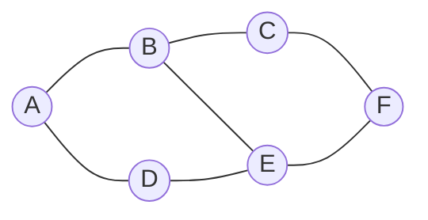
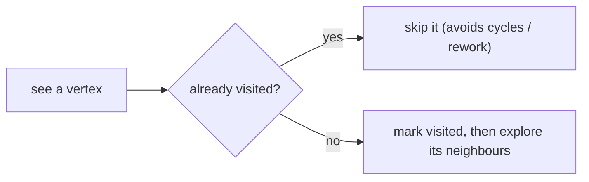
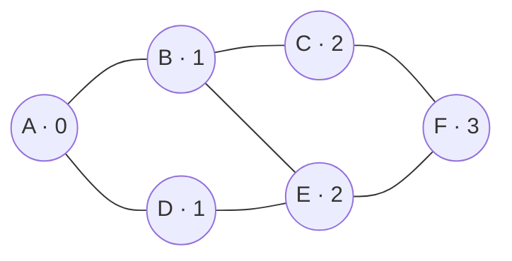
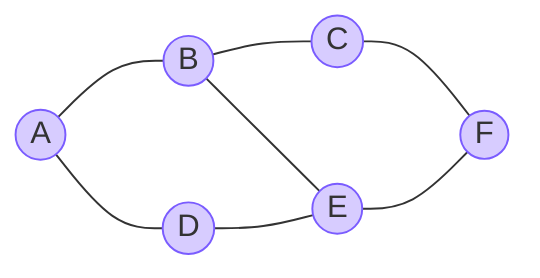
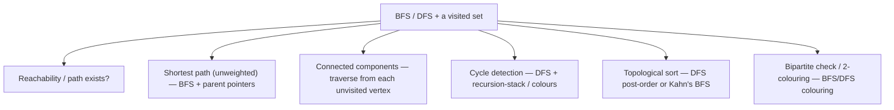

# 🧭 Graph Traversal — BFS & DFS

> 🎯 **Prepping for `Atlassian_Prep/`?** Read [`PRIMARY.md`](PRIMARY.md) instead — it's this tutorial trimmed to only what that problem needs.

> Traversing a graph means **visiting every vertex you can reach**, without going in circles. The two workhorses are
> **BFS** (breadth-first, a queue) and **DFS** (depth-first, a stack/recursion). They look almost identical in code —
> the *only* real difference is the data structure — but they answer different questions.

Prerequisite: [Graph Representation](../06_Graph_Representation/README.md). We'll traverse this graph, stored as an
**adjacency list**:


*Neighbours: A:{B,D} · B:{A,C,E} · C:{B,F} · D:{A,E} · E:{B,D,F} · F:{C,E}.*

---

## 1. The one thing trees didn't need: a **visited set**

Trees have no cycles, so a traversal never revisits a node. **Graphs have cycles** — follow edges blindly and you'll
loop forever (A→B→A→B…). The fix is a **visited set**: mark a vertex the first time you see it and never process it
twice. That single set is what makes graph traversal safe and `O(V + E)`.



---

## 2. BFS — breadth-first (a queue, spreads in rings)

BFS explores **level by level**: the start vertex, then everything one edge away, then two edges away, and so on. It
uses a **queue** (first-in, first-out).

```python
from collections import deque

def bfs(adj, start):
    visited = {start}                # mark on ENQUEUE so nothing is queued twice
    q = deque([start])
    order = []
    while q:
        u = q.popleft()              # oldest waiting vertex (FIFO → wide)
        order.append(u)
        for v in adj[u]:
            if v not in visited:
                visited.add(v)
                q.append(v)
    return order
# from A → A, B, D, C, E, F   (ring by ring)
```


*Numbers = distance from A in edges. BFS visits all the 1s before any 2s — that's why it finds the **fewest-edges path**.*

> **BFS's superpower:** in an **unweighted** graph, the first time BFS reaches a vertex is via a **shortest path**
> (fewest edges). Track a `parent` pointer as you go and you can rebuild that path.

---

## 3. DFS — depth-first (a stack / recursion, dives deep)

DFS follows one path **as far as it goes**, then backtracks and tries the next branch. Recursion is the natural way
(the call stack *is* the stack):

```python
def dfs(adj, start):
    visited = set()
    order = []
    def go(u):
        visited.add(u)               # mark on VISIT
        order.append(u)
        for v in adj[u]:
            if v not in visited:
                go(v)                # dive into the neighbour before trying the rest
    go(start)
    return order
# from A → A, B, C, F, E, D   (deep first, then backtrack)
```

Or **iteratively**, with an explicit stack (useful for very deep graphs that could overflow recursion):

```python
def dfs_iter(adj, start):
    visited, order, stack = set(), [], [start]
    while stack:
        u = stack.pop()              # LIFO → depth-first
        if u in visited:
            continue
        visited.add(u)
        order.append(u)
        for v in reversed(adj[u]):   # reversed so neighbours pop in natural order
            if v not in visited:
                stack.append(v)
    return order
```


*DFS from A dives A→B→C→F, then backtracks to reach E and D. It plunges deep before spreading out.*

---

## 4. BFS vs DFS — same skeleton, different tool

The code is nearly identical. Swap the **queue** for a **stack** and BFS becomes DFS. But they shine at different jobs:

| | **BFS** (queue) | **DFS** (stack / recursion) |
|---|---|---|
| Explores | level by level (rings) | one deep path, then backtracks |
| Data structure | **queue** (FIFO) | **stack** (LIFO) / recursion |
| Finds shortest path? | **Yes** (unweighted) ✅ | No (not necessarily) |
| Extra space | `O(width)` — can be large | `O(depth)` — recursion stack |
| Natural for | shortest reach, level grouping, "nearest" | cycle detection, topological sort, connected components, path existence, backtracking |
| Both cost | `O(V + E)` time (with an adjacency list) | `O(V + E)` |

> **One-line memory hook:** **BFS = queue = wide = shortest path.** **DFS = stack = deep = structure (cycles, order,
> components).**

---

## 5. What traversal unlocks

Once you can traverse, a whole toolbox opens up — each is "a traversal plus a little bookkeeping":



### Connected components (the classic "count the islands")

To handle a **disconnected** graph, don't start once — start a fresh traversal from **every vertex you haven't
visited yet**. Each new start is one more component.

```python
def count_components(adj, vertices):
    visited, count = set(), 0
    for v in vertices:
        if v not in visited:
            count += 1
            dfs_mark(adj, v, visited)   # flood the whole component
    return count
```

---

## 6. Complexity & cheat sheet

**With an adjacency list**, both BFS and DFS are:
- **Time `O(V + E)`** — visit each vertex once, each edge once.
- **Space `O(V)`** — the visited set (+ the queue/stack).

*(With an adjacency **matrix**, listing neighbours costs `O(V)` per vertex, so traversal becomes `O(V²)` — another reason lists are the default.)*

| Question | Answer |
|---|---|
| Why a visited set? | graphs have **cycles** — without it you loop forever. |
| BFS structure / use? | **queue**; **shortest path** (unweighted), level work. |
| DFS structure / use? | **stack/recursion**; cycles, topo sort, components, path existence. |
| Traversal cost (list)? | `O(V + E)` time, `O(V)` space. |
| Disconnected graph? | traverse from **every unvisited vertex** → counts components. |
| Weighted shortest path? | **not** plain BFS — use **Dijkstra** (a later topic). |

**Back to the start:** [Graph Fundamentals](../05_Graph_Fundamentals/README.md) ·
[Graph Representation](../06_Graph_Representation/README.md) · or revisit the [Tree series](../01_Generic_Tree/README.md).
