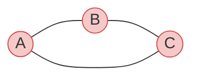
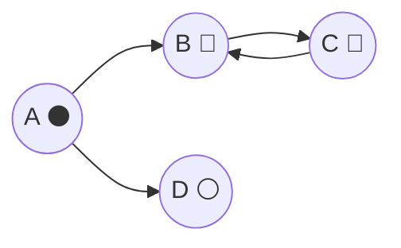
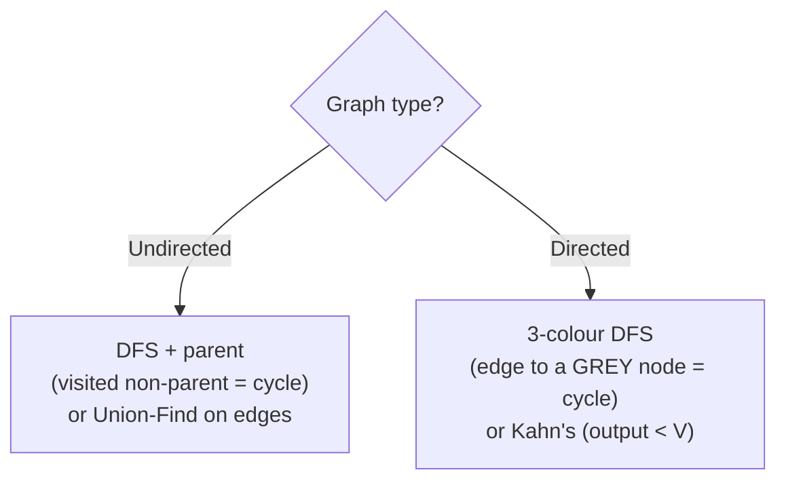

# 🔁 Cycle Detection — Undirected & Directed

> A **cycle** is a path that returns to where it started. Detecting one is a bread-and-butter graph task: "is this
> dependency graph schedulable?", "does this set of constraints contradict itself?", "did adding this edge close a
> loop?". The technique differs in one crucial way between **undirected** and **directed** graphs.

Prerequisite: [Graph Traversal](../07_Graph_Traversal/README.md). This chapter also ties together
[Union-Find](../09_Minimum_Spanning_Tree/README.md) and [Topological Sort](../10_Topological_Sort/README.md).

---

## 1. The key insight: not every "revisit" is a cycle

During a traversal you'll re-encounter visited vertices all the time — but that alone doesn't mean a cycle. The
question is *how* you got back to a visited vertex:

- **Undirected:** revisiting a vertex is a cycle **unless** it's the neighbour you just came from (your parent).
- **Directed:** revisiting is a cycle **only** if that vertex is still **on the current recursion stack** (a "back
  edge"). A vertex you fully finished earlier is fine.

That single distinction is the whole chapter.

---

## 2. Undirected graphs — DFS remembering your parent

In an undirected graph, the edge `u–v` lets you walk back from `v` to `u`. That's not a cycle — it's the same edge.
So during DFS, ignore the neighbour you **came from**; any *other* already-visited neighbour means a real cycle.

```python
def has_cycle_undirected(n, adj):
    """adj[u] = list of neighbours. Returns True if any cycle exists."""
    seen = [False] * n
    def dfs(u, parent):
        seen[u] = True
        for v in adj[u]:
            if not seen[v]:
                if dfs(v, u):            # explore, remembering we came from u
                    return True
            elif v != parent:            # visited AND not our parent → cycle!
                return True
        return False
    for s in range(n):                   # handle disconnected pieces
        if not seen[s] and dfs(s, -1):
            return True
    return False
```


*A–B–C–A: from C we reach A, which is visited and is **not** C's parent (that's B) → cycle detected.*

### Alternative: Union-Find (for undirected)

Process each edge `u–v`: if `u` and `v` are **already in the same group**, this edge closes a cycle. Otherwise
`union` them. (This is the cycle check inside [Kruskal's MST](../09_Minimum_Spanning_Tree/README.md).)

```python
def has_cycle_uf(n, edges):
    uf = UnionFind(n)                    # from the MST chapter
    for u, v in edges:
        if not uf.union(u, v):           # union returns False if already together
            return True                  # → this edge forms a cycle
    return False
```

---

## 3. Directed graphs — the 3-colour DFS (back edges)

In a **directed** graph the parent trick fails (arrows are one-way). Instead, track each vertex's state with **three
colours**:

- ⚪ **white** — not visited yet
- 🔘 **grey** — visited, still on the recursion stack (an *ancestor* of where we are now)
- ⚫ **black** — fully finished (all descendants explored)

A cycle exists exactly when DFS follows an edge to a **grey** vertex — a **back edge** to an ancestor.

```python
def has_cycle_directed(n, adj):
    """adj[u] = list of vertices u points to. Returns True if a directed cycle exists."""
    WHITE, GREY, BLACK = 0, 1, 2
    color = [WHITE] * n
    def dfs(u):
        color[u] = GREY                  # now on the recursion stack
        for v in adj[u]:
            if color[v] == GREY:         # edge to an ancestor → back edge → CYCLE
                return True
            if color[v] == WHITE and dfs(v):
                return True
        color[u] = BLACK                 # finished; safe to leave the stack
        return False
    for s in range(n):
        if color[s] == WHITE and dfs(s):
            return True
    return False
```


*C → B points to a **grey** (on-stack) vertex → back edge → cycle. Contrast with C → A when A is **black**: that's a "cross edge", perfectly fine.*

> **Why grey, not just "visited"?** In a DAG you constantly reach already-**finished** (black) vertices via different
> paths — that's normal, not a cycle. Only an edge to a vertex **currently on your recursion stack** (grey) closes a
> loop. Collapsing grey and black into one "visited" flag would raise false alarms.

### Alternative: Kahn's algorithm

Run [topological sort](../10_Topological_Sort/README.md); if it can't place all `V` vertices (output size `< V`), the leftover
vertices are trapped in a cycle. Same `O(V + E)`, no recursion.

---

## 4. Putting it together



| | Undirected | Directed |
|---|---|---|
| DFS rule | visited & **not parent** → cycle | edge to a **grey** (on-stack) node → cycle |
| Non-DFS option | **Union-Find** on edges | **Kahn's** topo sort (output `< V`) |
| Cost | `O(V + E)` | `O(V + E)` |
| Gotcha | don't flag the edge back to your parent | don't flag edges to **black** (finished) nodes |

---

## 5. Cheat sheet

| Question | Answer |
|---|---|
| Undirected DFS rule? | a visited neighbour that **isn't your parent** = cycle. |
| Undirected without DFS? | **Union-Find**: an edge whose endpoints already share a group = cycle. |
| Directed DFS rule? | an edge to a **grey** (on-recursion-stack) vertex = **back edge** = cycle. |
| Why 3 colours? | reaching a **finished** (black) node is normal; only **grey** means a loop. |
| Directed without DFS? | **Kahn's** topo sort — if it places `< V` vertices, there's a cycle. |
| Cost? | `O(V + E)` either way. |

**Back to the map:** [README](README.md) · or revisit [Topological Sort](../10_Topological_Sort/README.md) and
[MST / Union-Find](../09_Minimum_Spanning_Tree/README.md), which both lean on cycle reasoning.
