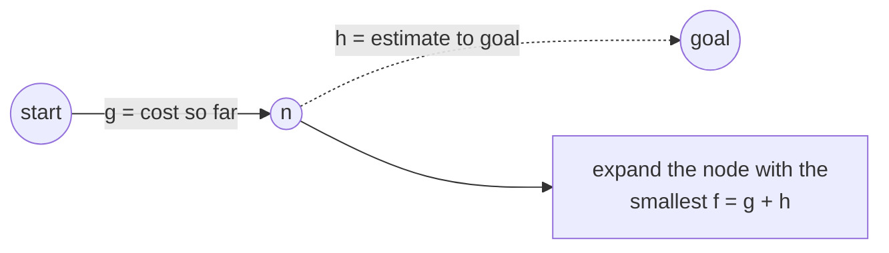
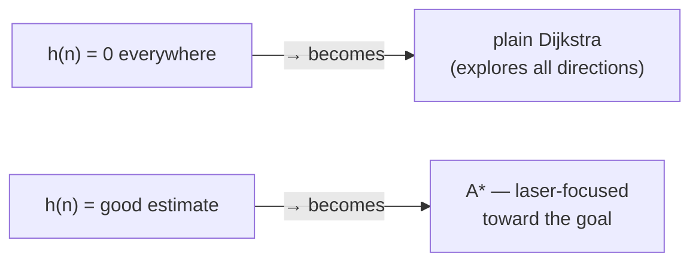
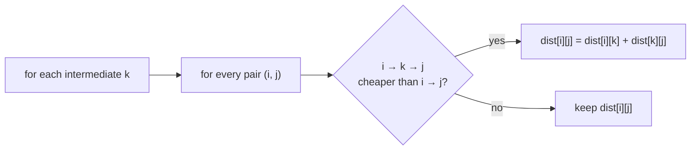
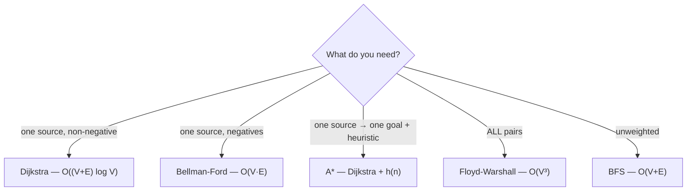

# 🧭 A\* & Floyd-Warshall — Smarter & All-Pairs Shortest Paths

> [Dijkstra](../08_Weighted_Shortest_Paths/README.md) finds the cheapest path from one source. Two important relatives extend
> it: **A\*** adds a *heuristic* to reach a **specific goal** faster, and **Floyd-Warshall** computes the shortest path
> between **every pair** of vertices at once. Same core idea (relaxation), two different goals.

Prerequisite: [Weighted Shortest Paths](../08_Weighted_Shortest_Paths/README.md) — Dijkstra and relaxation.

---

## 1. A\* — Dijkstra with a sense of direction

Dijkstra expands outward in **all** directions equally — wasteful if you only want to reach **one goal**. **A\*** adds
a **heuristic** `h(n)`: an *estimate* of the remaining distance from `n` to the goal. It always expands the node with
the smallest:

```
f(n) = g(n) + h(n)
       │      └── estimated cost from n to the goal  (the heuristic)
       └───────── actual cheapest cost from the start to n (like Dijkstra's dist)
```



So A\* prefers nodes that are both **cheap to reach** and **look close to the goal** — steering the search toward it.

```python
import heapq

def a_star(adj, start, goal, h):
    """adj[u] = list of (v, weight); h(n) estimates distance from n to goal."""
    g = {start: 0}
    pq = [(h(start), start)]                 # ordered by f = g + h
    while pq:
        _f, u = heapq.heappop(pq)
        if u == goal:
            return g[u]                       # reached the goal cheapest-first
        for v, w in adj[u]:
            ng = g[u] + w                      # actual cost to v through u
            if ng < g.get(v, float("inf")):
                g[v] = ng
                heapq.heappush(pq, (ng + h(v), v))   # priority = g + h
    return float("inf")                        # goal unreachable
```

### The heuristic must be **admissible**

`h(n)` must **never overestimate** the true remaining distance (e.g. straight-line distance on a map — you can't
beat a straight line). An admissible (and *consistent*) heuristic guarantees A\* finds the **optimal** path.



> **The spectrum:** with `h = 0`, A\* **is** Dijkstra. With a perfect heuristic, A\* walks straight to the goal. A good
> admissible heuristic keeps it optimal *and* fast — which is why A\* powers game pathfinding and route planners.

---

## 2. Floyd-Warshall — every pair, in one triple loop

Sometimes you need the shortest path between **all** pairs of vertices (a distance matrix). Running Dijkstra from
every source works, but **Floyd-Warshall** is a beautifully simple DP that also handles **negative edges**.

**The idea:** ask, for every pair `(i, j)`, *"can I do better by routing through vertex `k`?"* — trying each `k` in
turn as an allowed intermediate.

```
dist[i][j] = min( dist[i][j],  dist[i][k] + dist[k][j] )
```

```python
def floyd_warshall(n, weight):
    """weight[i][j] = edge cost (INF if none, 0 on the diagonal). Returns all-pairs distances."""
    INF = float("inf")
    dist = [row[:] for row in weight]          # copy the initial edge weights
    for k in range(n):                         # allow k as an intermediate...
        for i in range(n):                     # ...for every pair (i, j)
            for j in range(n):
                if dist[i][k] + dist[k][j] < dist[i][j]:
                    dist[i][j] = dist[i][k] + dist[k][j]   # routing via k is cheaper
    return dist
```



- **Complexity:** `O(V³)` time, `O(V²)` space — great when `V` is small/moderate and you need *all* pairs.
- **Negative edges:** fine (no negative cycles). A **negative cycle** shows up as a **negative value on the diagonal**
  (`dist[i][i] < 0`) — a vertex that can cheapen a path back to itself.
- **Order matters:** the `k` loop must be **outermost** — that's what makes the DP correct.

---

## 3. Which shortest-path tool?



| Algorithm | Scope | Weights | Time |
|---|---|---|---|
| BFS | single-source | unweighted | `O(V+E)` |
| **Dijkstra** | single-source | non-negative | `O((V+E) log V)` |
| **Bellman-Ford** | single-source | any (detects neg cycles) | `O(V·E)` |
| **A\*** | source → goal | non-negative + heuristic | ≤ Dijkstra (often far less) |
| **Floyd-Warshall** | all-pairs | any (no neg cycles) | `O(V³)` |

---

## 4. Cheat sheet

| Question | Answer |
|---|---|
| A\* priority? | **`f = g + h`** — cost so far + heuristic estimate to the goal. |
| Heuristic rule? | **admissible** = never overestimates → A\* stays optimal. |
| A\* with `h = 0`? | it **is** Dijkstra. |
| Floyd-Warshall recurrence? | `dist[i][j] = min(dist[i][j], dist[i][k] + dist[k][j])`. |
| Floyd-Warshall loop order? | **`k` outermost**, then `i`, then `j`. |
| Detect neg cycle (FW)? | some **`dist[i][i] < 0`**. |
| All-pairs cost? | `O(V³)` time, `O(V²)` space. |

**Next:** [Strongly Connected Components →](../15_Strongly_Connected_Components/README.md) — Tarjan & Kosaraju.
