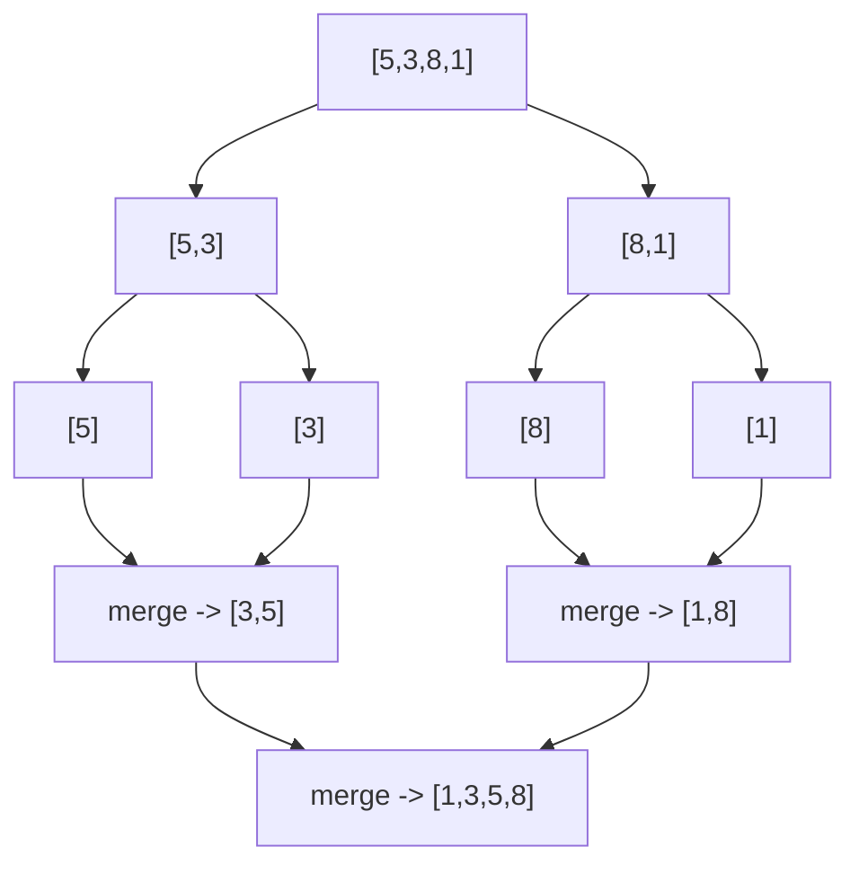
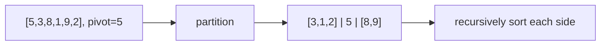
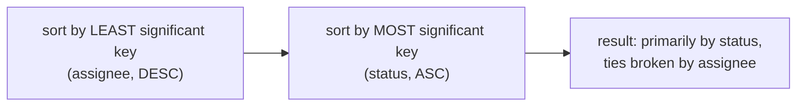

# 🔀 Sorting Algorithms

> 🎯 **Prepping for `Atlassian_Prep/`?** Read [`PRIMARY.md`](PRIMARY.md) instead — it's this tutorial trimmed to only what those problems need.

> Sorting is the most-used subroutine in all of computer science — and the one property people forget to ask about
> is **stability**: does the sort preserve the relative order of equal elements? That single property is what
> makes multi-column sorting ("sort by status, then by assignee") possible without writing a custom comparator.

Prerequisite: none — pure fundamental, but pairs naturally with [Hash Tables](../16_Hash_Tables/README.md).

---

## 1. Why sorting, and the `O(n log n)` wall

Sorting turns unordered data into ordered data, which unlocks binary search, two-pointer techniques, and
"group equal/adjacent things together" tricks used throughout this repo.

**The comparison-sort lower bound:** any sorting algorithm that only compares elements pairwise cannot beat
`O(n log n)` in the worst case — there are `n!` possible orderings, and each comparison narrows the possibilities
by at most half, so you need at least `log2(n!) = O(n log n)` comparisons to distinguish them all.

| Algorithm | Best | Average | Worst | Space | Stable? |
|---|---|---|---|---|---|
| Bubble / Insertion / Selection | `O(n)`\* | `O(n²)` | `O(n²)` | `O(1)` | Insertion: yes |
| **Merge Sort** | `O(n log n)` | `O(n log n)` | `O(n log n)` | `O(n)` | **Yes** |
| **Quicksort** | `O(n log n)` | `O(n log n)` | `O(n²)` | `O(log n)` | No |
| Python's **Timsort** | `O(n)`\* | `O(n log n)` | `O(n log n)` | `O(n)` | **Yes** |

\* Insertion sort and Timsort are `O(n)` on already-sorted (or nearly-sorted) input — a real, common-case win.

---

## 2. The simple `O(n²)` sorts (know them, don't reach for them)

**Insertion sort** — the one worth remembering, because it's how you'd sort a hand of playing cards: take each
element and insert it into its correct position among the already-sorted prefix.

```python
def insertion_sort(a):
    for i in range(1, len(a)):
        key, j = a[i], i - 1
        while j >= 0 and a[j] > key:       # shift larger elements right
            a[j + 1] = a[j]
            j -= 1
        a[j + 1] = key
```

It's `O(n²)` worst case, but `O(n)` if the array is already sorted (or nearly so) — the inner `while` barely runs.
This is why Timsort (§5) uses insertion sort for small sub-arrays.

---

## 3. Merge Sort — divide, conquer, merge

Split the array in half, recursively sort each half, then **merge** the two sorted halves in one linear pass.



```python
def merge_sort(a):
    if len(a) <= 1:
        return a
    mid = len(a) // 2
    left, right = merge_sort(a[:mid]), merge_sort(a[mid:])
    return merge(left, right)

def merge(left, right):
    result, i, j = [], 0, 0
    while i < len(left) and j < len(right):
        if left[i] <= right[j]:            # <= (not <) is what makes this STABLE
            result.append(left[i]); i += 1
        else:
            result.append(right[j]); j += 1
    return result + left[i:] + right[j:]
```

**Why merge sort is stable:** the merge step takes from `left` whenever elements are *equal* (`<=`, not `<`) —
since `left` came first in the original array, ties always resolve in original order.

**Guaranteed `O(n log n)`**, no worst-case surprises — the trade-off is `O(n)` extra space for the merge buffers.

---

## 4. Quicksort — partition around a pivot

Pick a **pivot**, partition the array so everything smaller is on one side and everything bigger on the other,
then recursively sort each side. No merge step needed — partitioning does the work in place.



```python
def quicksort(a, lo=0, hi=None):
    if hi is None:
        hi = len(a) - 1
    if lo < hi:
        p = partition(a, lo, hi)
        quicksort(a, lo, p - 1)
        quicksort(a, p + 1, hi)

def partition(a, lo, hi):
    pivot = a[hi]
    i = lo - 1
    for j in range(lo, hi):
        if a[j] <= pivot:
            i += 1
            a[i], a[j] = a[j], a[i]
    a[i + 1], a[hi] = a[hi], a[i + 1]
    return i + 1
```

`O(n log n)` average (pivot roughly halves the array each time), but **`O(n²)` worst case** if the pivot is
consistently the smallest or largest element (e.g., an already-sorted array with a naive "always pick the last
element" pivot strategy) — random or median-of-three pivot selection avoids this in practice. **Not stable**
(swaps during partitioning can reorder equal elements), and typically `O(log n)` space for the recursion stack
(in-place otherwise) — which is why it usually beats merge sort's `O(n)` space when stability isn't needed.

---

## 5. Python's `sorted()` / `.sort()` — Timsort

Python (and Java) use **Timsort**: a hybrid that finds naturally-occurring sorted "runs" in the data, extends
short runs with insertion sort, then merges runs the way merge sort does. It's `O(n)` on already-sorted data and
`O(n log n)` worst case — and, crucially, **stable**.

```python
nums = [5, 2, 8, 2, 1]
sorted(nums)                       # [1, 2, 2, 5, 8] -- new list
nums.sort()                        # in-place, same result

people = [("bob", 25), ("amy", 30), ("cal", 25)]
sorted(people, key=lambda p: p[1])                    # sort by age
sorted(people, key=lambda p: p[1], reverse=True)       # descending
```

---

## 6. Stability in action: multi-key sorting without a custom comparator

Because `sorted()` is stable, you can sort by **several columns with independent directions** by sorting once
per column, from **least significant to most significant** — the final (most significant) sort's stability
preserves everything the earlier sorts already established.



```python
issues = [
    {"id": "A", "status": "Todo", "assignee": "carol"},
    {"id": "B", "status": "Done", "assignee": "alice"},
    {"id": "C", "status": "Todo", "assignee": "alice"},
]
# Pass 1: sort by the LEAST significant key first (assignee, descending)
step1 = sorted(issues, key=lambda i: i["assignee"], reverse=True)
# Pass 2: sort by the MOST significant key last (status, ascending) -- stability preserves pass 1's order within ties
result = sorted(step1, key=lambda i: i["status"])
# -> B (Done), A (Todo/carol), C (Todo/alice) -- Todo group kept carol-before-alice from pass 1
```

This is exactly the technique used in the *Jira Issue CSV Exporter* problem's custom sort-order follow-up
(`Atlassian_Prep/`), where mixed ASC/DESC directions rule out a single composite sort key.

---

## 7. Cheat sheet

| Question | Answer |
|---|---|
| Comparison-sort lower bound? | **`O(n log n)`** — `log2(n!)` comparisons needed to distinguish all orderings. |
| Stable meaning? | equal elements keep their **original relative order**. |
| Merge sort? | `O(n log n)` guaranteed, `O(n)` space, **stable**. |
| Quicksort? | `O(n log n)` average, `O(n²)` worst, `O(log n)` space, **not stable**. |
| Python's sort? | **Timsort** — `O(n log n)` worst, `O(n)` on nearly-sorted input, **stable**. |
| Multi-key sort trick? | sort once per key, **least significant first**, relying on stability. |
| When does stability matter? | any time you sort by one key after already sorting/grouping by another. |

**Next:** [Binary Search →](../18_Binary_Search/README.md) — once data is sorted, find anything in `O(log n)`.
