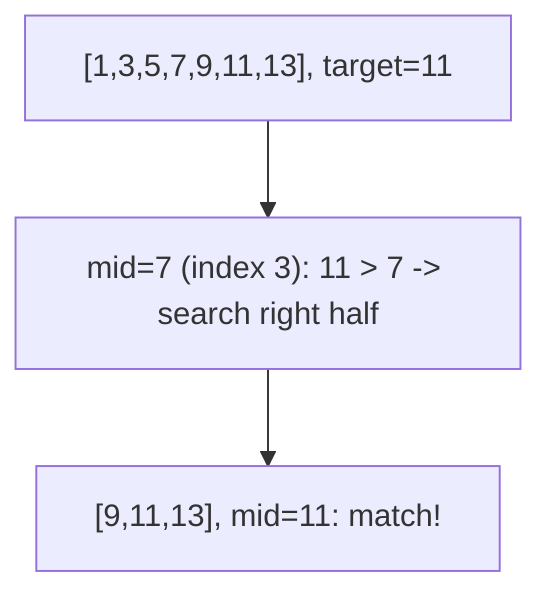
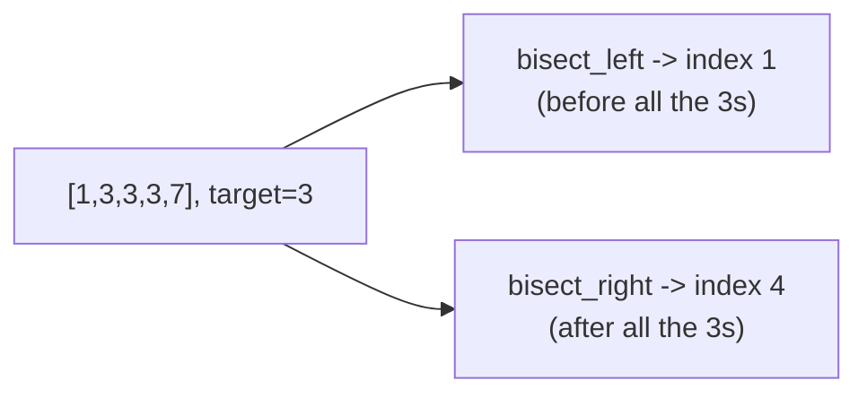

# 🔍 Binary Search

> 🎯 **Prepping for `Atlassian_Prep/`?** Read [`PRIMARY.md`](PRIMARY.md) instead — it's this tutorial trimmed to only what that problem needs.

> Binary search finds a target in a **sorted** sequence by repeatedly cutting the remaining search space in half.
> The bigger idea it generalizes to — **binary search on the answer** — turns "find the smallest/largest value
> satisfying some condition" into a search too, even when there's no literal array to search.

Prerequisite: [Sorting Algorithms](../17_Sorting_Algorithms/README.md) — binary search needs sorted (or otherwise
monotonic) data to work correctly.

---

## 1. The idea: halve the search space

Given a sorted array and a target, compare the target to the **middle** element. If they match, done. If the
target is smaller, it can only be in the left half — throw away the right half entirely. If larger, throw away
the left half. Repeat.



Each comparison eliminates **half** of what's left, so it takes only `O(log n)` comparisons to search `n`
elements — 20 comparisons is enough to search over a **million** items.

---

## 2. The classic implementation

```python
def binary_search(arr, target):
    lo, hi = 0, len(arr) - 1
    while lo <= hi:
        mid = (lo + hi) // 2
        if arr[mid] == target:
            return mid
        elif arr[mid] < target:
            lo = mid + 1               # target is in the right half
        else:
            hi = mid - 1               # target is in the left half
    return -1                          # not found
```

**Common pitfalls:**
- `mid = (lo + hi) // 2` can overflow in languages with fixed-size integers (not a concern in Python, but worth
  knowing) — the safe form is `mid = lo + (hi - lo) // 2`.
- Using `<` instead of `<=` in the loop condition, or forgetting to update `lo`/`hi` to `mid + 1`/`mid - 1`
  (rather than `mid`), are the two most common sources of infinite loops or off-by-one misses.

---

## 3. `bisect_left` vs `bisect_right` — precise insertion points

Real problems rarely ask "does this exact value exist" — more often it's "where would this value go" (to keep the
array sorted), especially when duplicates are involved.



- **`bisect_left(a, x)`** — the leftmost index where `x` could be inserted, keeping `a` sorted. Equivalently: the
  count of elements strictly less than `x`.
- **`bisect_right(a, x)`** — the rightmost such index (skips past any existing entries equal to `x`).
  Equivalently: the count of elements less than *or equal to* `x`.

```python
import bisect

a = [1, 3, 3, 3, 7]
bisect.bisect_left(a, 3)     # 1
bisect.bisect_right(a, 3)    # 4
bisect.bisect_right(a, 3) - 1  # 3 -- the RIGHTMOST index actually equal to 3
```

That last pattern — `bisect_right(a, x) - 1` — is exactly how you find "the latest entry `<= x`" in a sorted list,
which is the core trick behind the *Highest Price* checkpoint-query follow-up (`Atlassian_Prep/`): binary-search a
per-key list of `(checkpoint, value)` pairs for the rightmost checkpoint at or before the one queried.

---

## 4. Binary search on the answer — the real generalization

Binary search doesn't need a literal array. It works on **any monotonic predicate**: a yes/no question whose
answer flips at most once as you scan through candidate answers in order.


**Template — find the smallest `x` for which `predicate(x)` is true** (assuming `False,False,...,False,True,True,...,True`):

```python
def binary_search_answer(lo, hi, predicate):
    while lo < hi:
        mid = lo + (hi - lo) // 2
        if predicate(mid):
            hi = mid                   # mid works -- try to do even better (search left, inclusive)
        else:
            lo = mid + 1                # mid doesn't work -- must go higher
    return lo                          # lo == hi: the smallest x where predicate(x) is True
```

Classic examples: "first bad version" (which build broke things — a boolean flips from good to bad exactly once),
"smallest capacity to ship packages within D days" (larger capacity is always at least as good), "square root of x"
(searching over possible answers, not array indices).

---

## 5. Cheat sheet

| Question | Answer |
|---|---|
| Precondition? | data must be **sorted** (or the predicate must be **monotonic**). |
| Complexity? | **`O(log n)`** — each comparison halves the remaining search space. |
| `bisect_left`? | leftmost valid insertion point — count of elements `< x`. |
| `bisect_right`? | rightmost valid insertion point — count of elements `<= x`. |
| Find latest entry `<= x`? | `bisect_right(a, x) - 1`. |
| Beyond arrays? | **binary search on the answer** — search any monotonic yes/no predicate. |
| Common bugs? | wrong `<=`/`<` in the loop; forgetting `mid ± 1` (infinite loop); off-by-one on the final bound. |

**Next:** [Two Pointers & Sliding Window →](../19_Two_Pointers_Sliding_Window/README.md) — another family of
techniques that turn `O(n²)` scans into `O(n)`.
