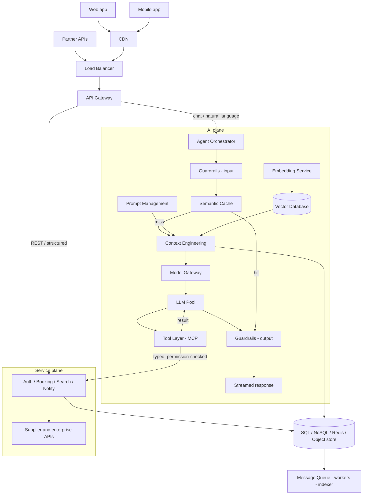

# The 12-Part Framework

> **Level** 🟢 Foundations · **Module** 02 · **Doc** 1 of 5 · **Time** ~60 min
> **Prerequisites:** Module 00, Module 01
> **Source material:** `4. FDE_Related_Preparation/System_Design and Delivery/2. System Design Components.md`

## Why this matters

A system design conversation is not about drawing boxes and arrows. It is about demonstrating structured thinking, trade-off analysis, and the ability to design something scalable, reliable and maintainable — while an interviewer silently asks a sequence of questions. The twelve components below are those questions, in the order they are usually asked. If you can answer each one for any system, you can design any system out loud.

The running example is an **AI travel assistant** — search flights, book hotels, chat with an agent — because it exercises both a traditional transactional core and every AI-specific component. Modules 04 and 05 apply the same twelve parts to enterprise RAG and to an agent platform.

## The framework at a glance

| # | Component | The question the interviewer is silently asking |
|---|---|---|
| 1 | Problem Definition | Do you know what you are building, and for whom? |
| 2 | Functional Requirements | What must it do? |
| 3 | Non-Functional Requirements | How well must it do it — in numbers? |
| 4 | Capacity Estimation | How big is it, roughly? |
| 5 | High-Level Architecture | What are the major blocks and the request path? |
| 6 | Data Design | Where does each kind of data live, and why there? |
| 7 | Component Design | What does each service own? |
| 8 | Data Flow | Can you trace one real request end to end? |
| 9 | Scalability Strategy | What breaks first, and what removes that bottleneck? |
| 10 | Reliability & Availability | What happens when each dependency fails? |
| 11 | Security & Governance | How is it protected, and how would you prove it? |
| 12 | Trade-offs & Future Improvements | What did you give up, and what would you do next? |

## 1 · Problem Definition

Clarify before touching the whiteboard. Five minutes of questions prevents twenty minutes of designing the wrong system — this is [The First Ten Minutes](../00_Orientation/03_The_First_Ten_Minutes.md) applied.

- **What are we building?** Restate it in your own words and get confirmation. A wrong assumption about the product is far more expensive than a wrong choice of database.
- **Who are the users?** Consumers, internal staff and partners have wildly different scale, latency and trust profiles. A million casual readers is a caching problem; a thousand power users writing constantly is a locking problem.
- **What business problem does it solve?** Revenue, retention, cost, compliance. This is what later lets you argue that eventual consistency is acceptable — or that it absolutely is not.
- **What is out of scope?** Park payments, fraud, admin tooling explicitly. "I'll assume payments are handled by an existing service" is a senior move, not a dodge.

> Example: *Design an AI Travel Assistant that helps customers search flights, hotels, and book trips.*

## 2 · Functional Requirements

What the system does — capabilities a user would recognise. Keep the list short, order it by importance, confirm it. For the travel assistant:

| Capability | Why it is architecturally interesting |
|---|---|
| Authentication | Every downstream call depends on knowing the caller; usually the first service you draw |
| Search flights | Read-heavy, latency-sensitive, fans out to supplier APIs — the home of caching, timeouts and partial results |
| Book hotels | A write path with real money and real inventory; needs idempotency keys and transactional guarantees. Double-booking is the failure interviewers probe |
| Cancel bookings | The compensating action, spanning systems that cannot share one transaction — where sagas and outbox patterns earn their keep |
| Chat with the assistant | Natural language → structured intent → tool calls; introduces streaming, memory and non-deterministic latency |
| Travel history | A user-scoped read, ideal for a replica or denormalised view; feeds personalisation |
| Notifications | Asynchronous by nature; behind a queue so a slow provider never blocks a booking |

## 3 · Non-Functional Requirements

How well it performs. **Quantify every one.** "Highly available" means nothing; "99.99% with a 5-minute RTO" is a design constraint.

| NFR | What to state |
|---|---|
| Scalability | Reads, writes or both — they demand different solutions |
| Reliability | Correct results, no data loss under failure; measured by error rate and RPO, not uptime |
| Availability | Nines, justified against business impact — each extra nine multiplies cost |
| Security | A requirement with acceptance criteria, not a layer bolted on at the end |
| Performance | Latency and throughput as percentiles (p50/p95/p99). Averages hide the tail, and the tail is what users complain about |
| Maintainability | How cheaply the team can change it — the requirement that decides whether the design survives year two |
| Cost efficiency | Unit economics: per request, per user, per GB, per million tokens |
| Fault tolerance | Which features may be shed under stress, and which must never fail |
| Observability | Metrics, logs, traces that answer new questions without a deploy — without it you cannot prove any other target |
| Compliance | GDPR, PCI-DSS, HIPAA, residency — these dictate storage location, retention and deletion, so surface them early |

> Example targets: 99.99% availability · < 2 s response · 10M users · GDPR compliant

## 4 · Capacity Estimation

Estimate before choosing technology; the numbers justify the architecture. Round aggressively — the reasoning matters, not the arithmetic.

| Quantity | Example | How to derive it |
|---|---|---|
| Users | 5M MAU · 500K DAU · 10K concurrent | MAU sizes storage and cost; DAU sizes steady traffic; concurrency sizes pools and instances. State the MAU:DAU ratio out loud |
| Traffic | 50K req/s | DAU × actions/user/day ÷ 86,400, × a 2–5× peak factor. Split read vs write — a 100:1 read ratio changes everything |
| Storage | 20 TB/year | records × size, then ×3 for indexes, replicas, backups. Pair with a retention policy |
| Bandwidth | 2 Gbps | req/s × payload, ingress and egress separately. Egress is the expensive direction and the argument for a CDN |

## 5 · High-Level Architecture

The major blocks and the path a request takes.

**Request path:** Users → CDN → Load Balancer → API Gateway → Application Services → Databases → Cache → Message Queue → Monitoring

| Block | Role | The detail that shows judgement |
|---|---|---|
| CDN | Static assets and cacheable responses at the edge | Removes most bytes from origin; absorbs the first wave of a spike |
| Load balancer | Distributes across healthy instances, terminates TLS | Zone-aware routing, connection draining during deploys |
| API gateway | Single entry: auth, rate limiting, routing, shaping | Keeps cross-cutting concerns out of every service |
| Application services | Stateless business logic split by domain | Statelessness is what makes horizontal scaling and rolling deploys trivial |
| Databases | System of record, chosen per access pattern | Call out primary/replica topology and where writes land |
| Cache | In-memory tier in front of expensive reads | Always name the invalidation strategy and TTL — a cache without one is a correctness bug |
| Message queue | Decouples slow or bursty work | Spikes become backlog instead of errors; enables retries with backoff |
| Monitoring | Wired in from day one | Define SLIs and alert thresholds, not "we'll use Prometheus" |

### For AI systems, add

| Component | Role | Treat it as |
|---|---|---|
| **LLM** | Generation, summarisation, intent | A slow, expensive, non-deterministic dependency — design timeouts and fallbacks accordingly |
| **Vector database** | Embeddings + approximate nearest-neighbour search | Index type and recall/latency trade-off are real decisions |
| **Embedding service** | Documents and queries → vectors, batch and online | Version the model; changing it invalidates the whole index |
| **Semantic cache** | Stored answer for semantically close queries | The main cost lever; a false hit is a *wrong* answer, not a slow one |
| **Agent orchestrator** | Plans multi-step tasks, picks tools/sub-agents | Needs step limits and budgets or a loop runs away |
| **Model gateway** | Routes to the right model/provider with fallback | Centralises token accounting, rate limits, per-tenant quotas |
| **Tool integrations** | Connectors that let the model act | Every call needs permission checks, timeouts, audit logging |

### The integrated picture

The AI plane hangs off the same gateway as the traditional services, calls back into them through the tool layer, and shares the data plane underneath:

Six things the picture says:

1. **Two planes, one front door.** Chat routes to the orchestrator; REST goes straight to services — so a model outage never takes down booking.
2. **The tool layer is the boundary.** Everything the agent does to the real world goes through typed, permission-checked tool calls into existing services. The LLM never touches a database directly. That choke point is where authorisation, timeouts and audit are enforced.
3. **Retrieval is a side path, not an extra hop.** Embeddings and the vector DB feed context engineering; retrieval latency is bounded and can be skipped when a task does not need it.
4. **The semantic cache is the main cost lever.** A hit returns with no model call, no retrieval, no tool execution. Tune the threshold conservatively.
5. **Guardrails bracket the model.** Input guardrails handle injection and moderation before the model; output guardrails validate structure and grounding before the user or any action. Both fail closed on transactional requests.
6. **Data and async planes stay shared.** The AI plane adds components on top of the traditional architecture; it does not replace any of it.

## 6 · Data Design

Choose storage per access pattern, and say what is stored, where, for how long.

| Store | For | Trade |
|---|---|---|
| SQL | Transactional, strongly consistent data with joins — bookings, payments, users | Correctness over raw write throughput |
| NoSQL | High-volume, flexible-schema, partition-friendly — sessions, catalogues | You give up joins and multi-record transactions for horizontal scale |
| Graph | Relationship traversal — recommendations, fraud rings, itinerary connections | Use when queries are about paths, not rows |
| Time-series | Append-heavy, timestamp-ordered — metrics, prices, events | Built-in downsampling and retention |

**The one question that actually decides SQL vs NoSQL:** does this write need to be correct *together* with another write, or this read correct *together* with another read? Booking a flight decrements inventory, inserts the booking and charges the payment — and if the charge fails, the decrement must roll back or you sold a seat nobody paid for. That is a transaction, which is exactly what SQL guarantees, and you constantly need joins across users/bookings/payments. A hotel catalogue is the opposite: reading one listing never locks or joins against another, and different hotels genuinely have different shapes (`pet_friendly` vs `conference_rooms`) — forcing that into rigid columns means a table of NULLs. The same logic puts **sessions** in Redis/NoSQL (independent, high-volume, ephemeral) and **bookings and payments** in SQL (interdependent, transactional, permanent).

Data models to name for the travel assistant: Customer (privacy-sensitive; plan for export and deletion), Booking (a state machine with immutable event history, not a mutable row), Flight (external, cache-heavy, short TTLs), Hotel (slower cadence, rich content → search index + CDN), Payment (strictest consistency and audit; store tokens, never card data).

Storage decisions to state: **hot vs cold** tiering (often the largest cost lever), **partitioning** key (a bad one creates hotspots you cannot fix without migration), **replication** mode (synchronous = safer/slower; asynchronous = faster/risks recent writes), **backup** with defined RPO/RTO and periodic restore drills — a backup you have never restored is a hypothesis.

## 7 · Component Design

Zoom into each service: responsibilities, interfaces, data ownership.

**Authentication service** — login (credentials or OIDC; rate limiting and lockout live here), JWT issuance (short-lived access + longer refresh; rotation and revocation need a plan), MFA (step-up before payment or cancellation is a good detail to volunteer), session validation (at the gateway, fast, cacheable).

**Booking service** — reserve seats atomically with an idempotency key so retries never double-book, with reservations that expire if payment does not complete; handle payments as a saga with compensating actions since the provider is external; cancellation that is idempotent and auditable because partial failures here are customer-visible.

**AI agent** — intent classification with a confidence score (low confidence → clarifying question, not a guess); planning with a step and token cap; tool invocation with validated arguments and explicit permission checks on every write-capable tool; memory retrieval scoped strictly per user and selective rather than a dump.

## 8 · Data Flow

Trace one request end to end. Interviewers love this because it proves the pieces actually interact.

> User → API Gateway → Authentication → Supervisor Agent → Semantic Cache → Travel Agent → Flight API → Hotel API → Booking Service → LLM → Response

| Stage | What happens | The detail to mention |
|---|---|---|
| User | "find me a flight to Delhi next Friday" | Client attaches auth token and a trace ID that follows the call everywhere |
| Gateway | TLS, rate limits, route to assistant | Where the trace begins and the global timeout budget is set |
| Authentication | Resolve identity, roles, entitlements | Everything downstream runs under that scope — this is what keeps memory user-isolated |
| Supervisor agent | Interpret, plan, delegate | Owns the step budget and decides when the task is done |
| Semantic cache | Similar request answered recently? | A hit skips the expensive path entirely; a miss continues and populates |
| Travel agent | Domain specialist; knows which tools to combine | Normalises supplier differences into one internal shape |
| Flight API | Suppliers/GDS, usually in parallel | Slow suppliers get a timeout and a partial result |
| Hotel API | Properties, rooms, rates | Cached briefly — prices move, but not by the second |
| Booking service | Only on user confirmation | Idempotent create + payment; emits events for notifications and history |
| LLM | Structured results → grounded natural language | Ground strictly in retrieved data; validate before it reaches the user |
| Response | Streamed | Log latency and token cost per stage |

## 9 · Scalability Strategy

Name the bottleneck, then the technique that removes it.

| Technique | Removes | Cost |
|---|---|---|
| Horizontal scaling | The single-machine ceiling | Requires stateless services |
| Auto scaling | Manual capacity management | Tune warm-up and cooldown, or you scale after the spike |
| Load balancing | Uneven instance load | Least-connections or latency-aware usually beats round-robin |
| Caching (edge, gateway, app, DB) | Load on the layer behind | Another invalidation problem per layer |
| Sharding | Write volume or dataset size beyond one node | Cross-shard queries |
| Read replicas | Write-node pressure from reads | Replication lag; say which reads must hit the primary |
| Message queues | Producers waiting on consumers | Eventual processing |
| Event-driven architecture | Synchronous coupling and fan-out latency | Eventual consistency, harder end-to-end debugging |
| CDN | Origin load and geographic latency | The cheapest win; mention it first |

**Why statelessness is the prerequisite, not a nice-to-have.** A load balancer can route a user's requests to a different instance every time. If an instance keeps request-specific state locally — a session, a cart, a file mid-upload — a request landing on the wrong instance breaks. Stateless design pushes all of that into shared stores (Redis/DB for sessions, a signed JWT the client carries, S3 instead of local disk) so any instance can serve any request. That interchangeability is what gives near-linear scaling *and* safe rolling deploys.

### For AI

| Technique | Effect |
|---|---|
| Model routing | Small fast models for simple requests, frontier models for hard ones — often an order of magnitude cost cut |
| Semantic cache | Reuse answers for similar queries; conservative threshold |
| Multi-region vector DBs | Retrieval near users; survive a region loss; acknowledge rebuild and lag costs |
| Token optimisation | Trim prompts, compress history, retrieve selectively — tokens are both latency budget and bill |
| Request batching | Group embedding/inference calls for GPU utilisation; milliseconds of queueing for a large per-request gain |
| **Short-circuiting** | Stop the pipeline the moment a step already satisfies the task |

**Short-circuiting in agentic design** is boolean short-circuit evaluation (`a && b` skips `b` once `a` is false) applied to orchestration. It appears as: a cache hit or guardrail check that skips the LLM entirely; a verifier failing early in a planner → retriever → verifier → synthesiser chain so downstream agents never burn tokens on doomed input; a tool loop stopping when a result meets the success criteria rather than running to the step budget; a parallel ensemble returning once N of M agree; a policy filter blocking unsafe input before any tool or model runs, so a reasoning chain never gets the chance to justify an irreversible action. Implemented with confidence thresholds between steps, conditional edges in the orchestrator graph, or a circuit breaker. The skill is picking the checkpoint: too early loses correctness, too late loses the cost, latency and safety benefit.

## 10 · Reliability & Availability

Assume every dependency will fail; describe what happens when it does.

| Technique | Protects | Detail |
|---|---|---|
| Retry with backoff + jitter | Transient failures | Only for idempotent operations; cap attempts or retries become self-inflicted DoS |
| Circuit breakers | Cascading failure | See below |
| Timeouts | Full-system hangs | Explicit deadline on every network call; propagate a shrinking budget downstream |
| Dead-letter queues | Losing failed work | Park repeated failures for inspection and replay |
| Multi-AZ | Losing one data centre | The most common real-world failure |
| Multi-region failover | Losing a region | State RTO, how traffic shifts, how data replicates |
| Health checks | Routing to sick instances | Readiness must check real dependencies |
| Leader election | Duplicate singleton work | Consensus systems (etcd, ZooKeeper) |
| Graceful degradation | Total failure under stress | Keep search working if personalisation or reviews are down |
| Backup & restore | Data loss | Rehearse the restore |
| Chaos testing | Assumed resilience | Convert it into verified resilience |

**How a circuit breaker actually works.** It wraps a dependency call and tracks failure rate through three states. **Closed** — calls go through, failures counted. **Open** — once failures cross a threshold, every call fails *instantly* for a cooldown window without touching the dependency. **Half-open** — after cooldown, a few trial requests go through; success closes the breaker, failure reopens it. The failure it targets: a timeout alone still makes every caller wait the full deadline on every request to a dead dependency, tying up a thread each time — under load that exhausts the caller's own pool and takes down a healthy service. Failing fast breaks the cascade; the cooldown gives the dependency room to recover instead of being hit by retry traffic the instant it responds.

**Reliability and availability are different targets.** Availability is *whether the system responds* — nines, won by redundancy: multi-AZ, multi-region, health checks, load balancing all route around something that is down. Reliability is *whether the response is correct and no data is lost*, even mid-failure — won by containment: timeouts, circuit breakers, retries, dead-letter queues all stop one failure from corrupting or cascading. A system can be highly available and unreliable (fast, sometimes wrong) or reliable and unavailable (correct when up, down often). Backup & restore is reliability's safety net (bounded by RPO); multi-region failover is availability's (bounded by RTO). Naming which technique buys which property is what separates a checklist from a design.

## 11 · Security & Governance

| Control | What to say |
|---|---|
| Authentication | Federate with an IdP; short-lived credentials; never build password handling from scratch |
| Authorization | Least-privilege roles or attribute-based rules; checked at the service, not only the UI or gateway |
| Encryption at rest / in transit | Managed keys with rotation; TLS everywhere, mTLS between services |
| Secrets management | Vault with rotation and audited access; prefer dynamically issued credentials |
| Audit logs | Immutable, timestamped, retained per policy |
| Rate limiting | Per user, IP, tenant — for AI, meter tokens and cost too |
| API security | Validation, schema enforcement, injection and SSRF defence; deprecate old paths deliberately |
| PII protection | Classify, minimise, mask in logs; export and deletion as first-class features |
| Compliance | Map obligations to controls and evidence; automate evidence collection |

### For AI

| Control | What to say |
|---|---|
| Prompt injection protection | Retrieved documents and tool output are untrusted *data*, never instructions; separate system, user and retrieved content; constrain what tools can do |
| Guardrails | Input and output policy checks; fail closed for anything that moves money or changes a booking |
| Content moderation | Screen input and output; log decisions so false positives can be tuned |
| **Tool permission checks** | Authorise every tool call against the *calling user's* entitlements, not the agent's — an agent must never act beyond the person it serves |
| Output validation | Schema-valid, grounded; human confirmation for anything transactional |
| Data masking | Redact PII before prompts, logs, traces, third-party providers |
| Model governance | Track model versions, prompts, evaluations, approvals — "which model and prompt produced this?" |

## 12 · Trade-offs & Future Improvements

This is where senior candidates stand out. Do not name a technology; name its trade.

- Instead of "we use Redis" → *"Redis takes read latency from hundreds of milliseconds to single digits, but introduces cache-consistency challenges"* — now you must reason about invalidation, stale reads, and a cache-wide eviction.
- Instead of "we use Kafka" → *"Kafka improves throughput and decouples services, but increases operational complexity"* — partition management, consumer lag, eventual consistency.

Future improvements worth naming: multi-region (replication complexity, write conflicts); event sourcing (perfect auditability, higher storage and read complexity); active-active (no failover delay, demands conflict-free data design); layered caching; AI cost optimisation (route by difficulty, cache semantically, shorten prompts, batch); model distillation; autonomous agents (raises the bar on guardrails and human-in-the-loop).

**Active-active vs active-passive, and what it costs.** Active-passive keeps one region live and a standby replicating; losing the primary means *detecting* the failure, *promoting* the standby and *repointing* traffic — real downtime, measured by RTO. Active-active removes the failover step: every region already serves traffic, so losing one means the global load balancer stops routing there. The price is on the data layer: two-plus regions accepting writes to the same logical data means concurrent writers and something must reconcile them. Three ways out: (1) partition writes by region so they never overlap — the AMER/EMEA/APJ pattern; (2) CRDTs or last-writer-wins for data genuinely written from multiple regions; (3) accept eventual consistency and resolve in application logic. And a capacity cost: every live region must be sized for real traffic, with enough headroom to absorb a failed region's load.

## The AI additions, collected

For modern AI systems, expect to be asked about all of these by name:

| Component | One line |
|---|---|
| Model gateway | Routes each request to the right LLM; centralises retries, fallbacks, quotas, token accounting |
| Prompt management | Prompts as versioned, reviewable artefacts — A/B tests, instant rollback, audit trail |
| Context engineering | Builds the window from history, retrieved docs and tool output within a token budget — what to include, in what order, what to drop |
| Embedding service | Versioned; changing the model invalidates the index |
| Vector database | Index type, dimensionality, recall vs latency |
| Semantic cache | Cost and tail-latency lever; threshold must be tuned |
| Agent orchestrator (supervisor) | Plans, coordinates sub-agents, enforces step and token limits, decides when done |
| Tool layer (MCP or function calls) | Typed interfaces to Jira, Salesforce, internal APIs — schema validation, permission checks, timeouts, audit |
| LLM observability | Latency, tokens, cost, hallucination rate, quality per request and per prompt version |
| Safety & guardrails | Injection, moderation, policy on input and output; fail closed on money or customer data |

## A simple mental model

1. Define the problem — scope, users, what you are not building.
2. Gather requirements — functional capabilities vs quantified quality attributes.
3. Estimate scale — users, RPS, storage, bandwidth, assumptions stated.
4. Design the high-level architecture — blocks and request path.
5. Design data storage and services — stores per access pattern, service boundaries.
6. Explain end-to-end data flow — one real request through every component.
7. Address scalability — bottleneck first, then technique.
8. Address reliability — what happens when each dependency fails.
9. Address security and governance.
10. Discuss trade-offs and what you would do next.

## Interview lens

The framework is a checklist only if you walk it mechanically. Used well, it is a guarantee that you never leave a silent question unanswered — and the AI additions are the ones most often left silent. The habit that makes it sound like design rather than recitation: every time you name a component, name what it *costs*.

## Checkpoint

- List the twelve parts in order and the silent question behind each.
- Explain the one question that decides SQL vs NoSQL, with the booking and catalogue examples.
- Describe the three states of a circuit breaker and the specific cascade it prevents.
- Distinguish reliability from availability and assign four techniques to each.
- Give five places short-circuiting appears in an agent pipeline.
- Name the seven AI-specific components and the risk each introduces.

**Next →** [The 15 Principles](02_The_15_Principles.md)
