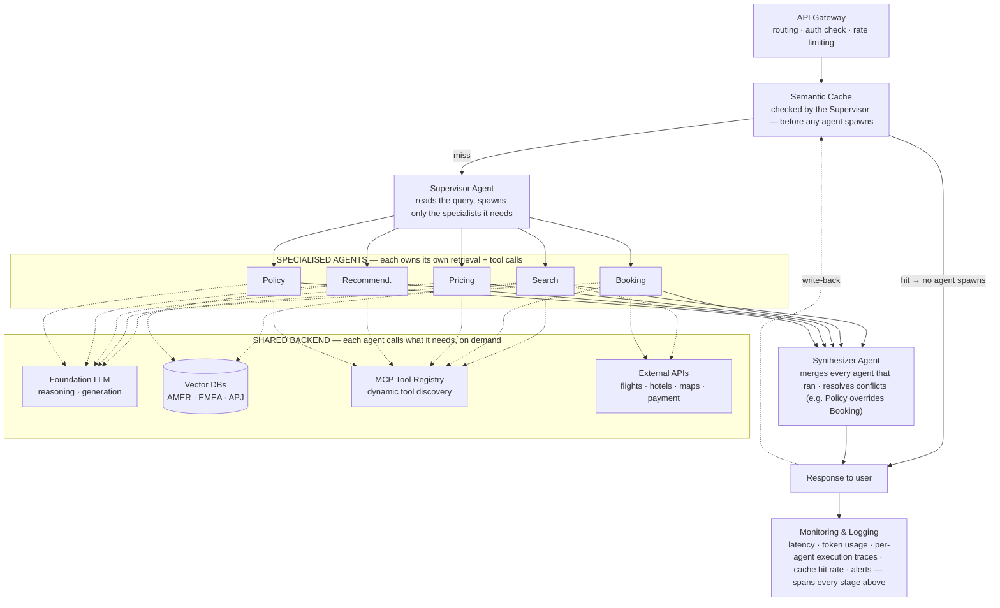

# Worked Example — The Travel Agent

> **Level** 🟢 Foundations · **Module** 02 · **Doc** 4 of 5 · **Time** ~30 min
> **Prerequisites:** [The 12-Part Framework](01_The_12_Part_Framework.md), [The 15 Principles](02_The_15_Principles.md)
> **Source material:** `4. FDE_Related_Preparation/System_Design and Delivery/1. System Design Overview.md`

## Why this matters

The framework and principles are abstract until you watch them correct a real diagram. This document does exactly that: it takes a published reference architecture for an agentic travel assistant, shows five structural mistakes a careful reviewer found in it, and rebuilds it. Learning to *spot* those mistakes is more valuable than memorising the corrected diagram, because the same five errors appear in most first-draft multi-agent designs — including ones you will draw under time pressure.

The system: an agentic AI travel assistant serving customers across AMER, EMEA and APJ, with specialised agents for search, booking, pricing, recommendation and policy.

## The original, and what was wrong with it

The original drew a strict pipeline: five agents fan out, then *everything* funnels through one shared cache, one retrieval stage, one LLM step and one tool-calling stage in sequence. Five fixes:

### 1 · Rate limiting belongs inside the API gateway

The original drew Rate Limiter as a second box off the load balancer, parallel to the gateway, with no line continuing downstream — a dead end. Rate limiting is a *policy the gateway enforces on every request*, not an alternate route. Drawing it as a peer box suggests you think of it as a component rather than a behaviour.

### 2 · The semantic cache is checked before any agent spawns

The original placed the cache *after* all five agents had already run. A cache meant to reduce LLM latency and cost has to sit in front of the expensive work, not after it. Corrected: the cache is the supervisor's first move, and a hit returns without spawning a single agent. This is the short-circuiting principle from the 12-part framework, and it is the difference between a cache that saves money and one that saves nothing.

### 3 · Retrieval is owned by each agent, not a shared stage

One mandatory retrieval box downstream of all five agents forced a vector-DB lookup onto agents that never needed one. Search and Recommendation pull regional travel content; Booking and Policy mostly do not. Corrected: retrieval is a call each agent makes for itself, inside its own loop, when its task requires it.

### 4 · Tool calling, MCP and external APIs sit alongside the agents

The original funnelled every agent into one shared LLM step, then one tool-calling step, then one MCP registry — as if the whole request got a single turn. A Booking agent needs the Payment and Flight MCP servers *during its own turn*, not after four unrelated agents finish. Corrected: the shared backend (LLM, vector DBs, MCP registry, external APIs) is something each agent calls on demand.

### 5 · A synthesiser agent replaces the missing aggregation step

The original never showed how five parallel agent outputs become one response — the diagram just continued as a single line as if that were automatic. It is not. Corrected: a named Synthesiser Agent merges every agent that actually ran and resolves conflicts between them — a Policy decision overriding a Booking choice, for instance — before anything reaches the user.

## The corrected architecture

A cache hit returns before the supervisor spawns anything. On a miss, the supervisor spawns only the agents the query needs; each independently calls the shared backend for exactly what its task requires. The synthesiser merges whatever ran into one response, which is written back to the cache.

## Components

| Component | Purpose |
|---|---|
| Client | Web / mobile surface for search, booking, itinerary management |
| Authentication | OAuth, JWT or SSO before anything else runs |
| Load balancer | Spreads traffic across API instances |
| **API gateway** | Routing, request validation and throttling as *one* policy layer |
| **Supervisor agent** | Reads the query, checks the cache, and only on a miss decides which specialists to spawn |
| **Semantic cache** | Checked immediately; a hit returns without spawning an agent |
| **Specialised agents** | Each retrieves its own domain context and calls its own tools — Booking reaches the payment gateway directly |
| Regional vector DBs | Shared retrieval infrastructure that agents call into, not a stage every request passes through |
| MCP tool registry | Dynamic tool discovery, reached by whichever agent needs it |
| External APIs | Flights, hotels, maps, payment, via MCP servers |
| **Synthesiser agent** | Merges outputs, resolves conflicts, produces one coherent response |
| Monitoring & logging | Latency, tokens, failures, per-agent traces |

## Data flow, in order

1. User submits a request.
2. Authentication validates identity; the load balancer routes; the gateway applies rate limiting and forwards to the supervisor.
3. The supervisor checks the semantic cache **first**.
4. On a hit, return immediately — no agent spawned.
5. On a miss, spawn only the agents the query needs.
6. Each agent retrieves its own context from the relevant regional vector DB, as a tool call inside its own loop.
7. Each agent calls the external APIs it needs through the MCP registry, inside its own loop.
8. The synthesiser collects outputs, resolves conflicts, composes one grounded response.
9. The response returns to the user and is written back to the cache.
10. Monitoring captures latency, tokens and per-agent traces across the request.

## Non-functional requirements

| Requirement | Solution |
|---|---|
| Scalability | Horizontal scaling, auto-scaling, load balancing |
| Reliability | Multi-region deployment, retries, failover |
| Availability | Active-active regional architecture |
| Performance | Semantic caching *before* fan-out, Redis, CDN, optimised vector search |
| Security | OAuth, JWT, encryption, RBAC, secrets management |
| Cost | A cache-first strategy that actually gates spawn; smaller models for simple tasks; regional routing |
| Observability | Metrics, logs, distributed tracing per agent, dashboards, alerts |
| Maintainability | Modular agents that own their own tools, CI/CD, infrastructure as code |

## Trade-offs worth naming out loud

**Shared retrieval service vs per-agent RAG.** A shared layer centralises data-residency and guardrail enforcement but couples every agent to one service. Per-agent retrieval matches how LangGraph- and CrewAI-style frameworks wire tools, at the cost of duplicated embedding infrastructure if ungoverned. Either is defensible. Treating RAG as a *peer of the agents* instead of as infrastructure or a tool is the actual mistake.

**Single agent vs multi-agent.** Multi-agent adds coordination and synthesis overhead. It earns its keep when sub-tasks need different tools, different guardrails, or independent scaling — as Booking and Policy clearly do here. Module 07 gives the full decision rule.

**Semantic cache vs traditional cache.** Semantic caching matches near-duplicate queries, not just exact ones, which is why it can short-circuit the entire fan-out rather than one downstream call.

**Global vs regional vector DBs.** Regional stores buy data-residency compliance and lower latency; a global store buys simpler operations and cross-region consistency.

## A mental model: the international airport

| Airport | System |
|---|---|
| Passengers | Users |
| Airport entrance | Authentication |
| Security check and baggage scanner — one line, not two | API gateway with rate limiting built in |
| Information desk: "have we answered this before?" | Semantic cache, checked before any staff is dispatched |
| Air traffic control tower | Supervisor agent |
| Airline staff, each with their own manuals and radios | Specialised agents with their own retrieval and tools |
| Flight information binders each desk keeps | Vector databases, consulted by whichever desk needs them |
| Ground crew, catering, fuel trucks | External APIs |
| Dispatch officer compiling one departure report | Synthesiser agent |
| CCTV and operations centre | Monitoring and observability |

## Interview lens

The five fixes generalise into five questions to ask of any multi-agent diagram, including your own:

1. Is every "component" actually a component, or is it a policy that belongs inside something else?
2. Does the cache sit *before* the expensive work it claims to save?
3. Is retrieval forced on agents that do not need it?
4. Does each agent get its own turn with its own tools, or is the whole request funnelled through one shared step?
5. Where do parallel outputs converge, and who resolves conflicts?

## Checkpoint

- State the five structural fixes and, for each, the principle from the previous document it applies.
- Why does cache placement decide whether a semantic cache saves anything?
- What is the actual mistake in the shared-vs-per-agent RAG debate?
- What does the synthesiser do that "the diagram continues as a single line" hides?
- Draw the corrected architecture from memory.

**Next →** [The 60-Minute Whiteboard Method](05_The_60_Minute_Whiteboard_Method.md)
