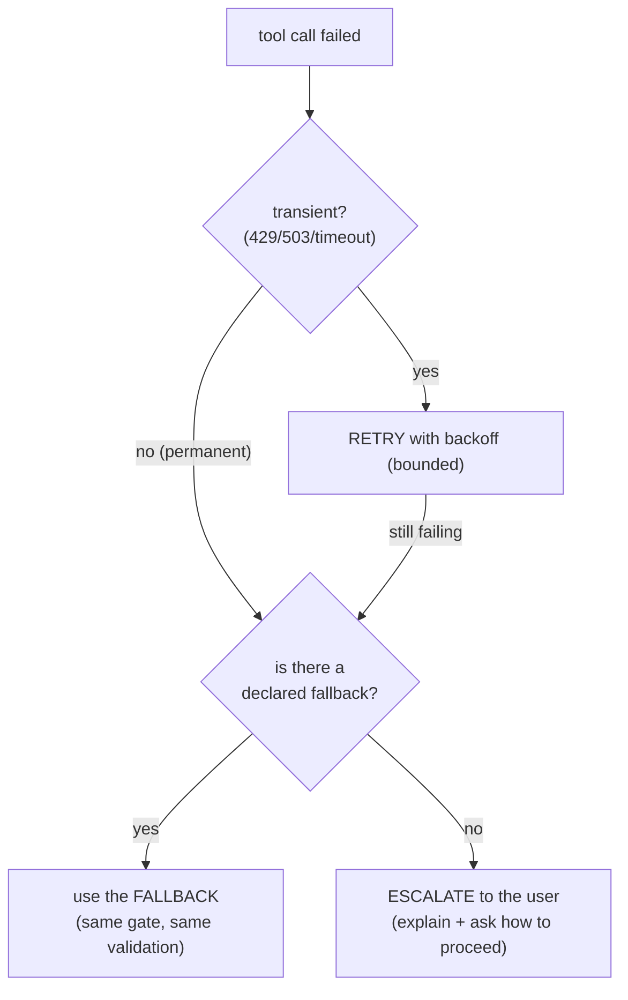

# Retry, Fallback, Memoization and the Confirmation Gate

> **Level** 🟡 Building Production Systems · **Module** 03 · **Doc** 1 of 5 · **Time** ~35 min + lab
> **Prerequisites:** Module 01 (especially [The Tool-Calling Loop From Scratch](../01_LLM_Systems_Foundations/04_Tool_Calling_Loop_From_Scratch.md))
> **Source material:** `1. Company_Wise_Preparation/2. DevRev/Coding_Round/agent_tool_calling_demo/src/robustness.py`, `docs/DESIGN.md` §4, `tests/test_agent.py`
> **Lab:** `../01_LLM_Systems_Foundations/project/src/robustness.py` and its tests

## Why this matters

In Module 01 the loop called `execute_tool(...)` and treated it as a black box. That box is where a toy loop becomes a real agent. Four things live inside it, and each one exists because of a specific way agents fail in production:

| Mechanism | The incident it prevents |
|---|---|
| **Confirmation gate** | A refund, delete or send fired because the model was "pretty sure" |
| **Memoization** | The same read re-run, re-billed and re-waited-for every time the brain asks again |
| **Retry** | One network blip turning into a failed run |
| **Fallback** | One permanently dead dependency turning into a full outage instead of a degraded answer |

This document opens the box. The code is short — under 130 lines — and every line is a decision.

## The composed executor

```python
def execute_tool(tool, args, *, logger, memo=None, confirm=None, retries=3):
    """Run a tool safely: confirmation gate -> cache -> retry."""

    # 1) CONFIRMATION GATE — block destructive tools unless approved.
    if tool.destructive:
        approved = confirm(tool, args) if confirm else False
        if not approved:
            logger.log(tool.name, args, status="blocked", error="needs confirmation")
            raise ConfirmationRequired(tool.name, args)

    # 2) MEMOIZATION — identical call this session? serve the cached result.
    key = _args_key(tool.name, args)
    if memo is not None and key in memo:
        logger.log(tool.name, args, status="cache_hit", result=memo[key])
        return memo[key]

    # 3) RETRY — transient errors get a few attempts (exponential-ish backoff).
    attempt = 0
    while True:
        t0 = time.perf_counter()
        try:
            result = tool(**args)
            ms = (time.perf_counter() - t0) * 1000
            logger.log(tool.name, args, status="ok", result=result, ms=ms)
            if memo is not None:
                memo[key] = result
            return result
        except Exception as exc:
            if is_retryable(exc) and attempt < retries:
                attempt += 1
                logger.log(tool.name, args, status="retry", error=str(exc))
                time.sleep(0.01 * attempt)        # tiny backoff (real code: + jitter)
                continue
            logger.log(tool.name, args, status="error", error=str(exc))
            raise
```

The **order** of the three sections is the design. Read it as a sequence of questions asked of every call:

1. *Is this destructive, and if so, has someone said yes?* — before anything else.
2. *Have I already done exactly this?* — only reached by non-destructive calls, or approved destructive ones.
3. *Run it; if it fails transiently, try again a bounded number of times.*

## 1 · The confirmation gate

```python
ConfirmPolicy = Callable[[Tool, dict], bool]     # "may this destructive tool run with these args?"

def deny_destructive(tool, args) -> bool:  return False    # the SAFE default
def always_approve(tool, args) -> bool:    return True     # for tests / trusted flows
```

Three properties make this gate reliable rather than decorative:

**The flag is declared, not inferred.** `tool.destructive` was set when the tool was registered. The gate at call time asks "is this one of the tagged ones?" — never "does this call look risky?" A judgement made fresh each time is a judgement that will eventually be made wrong.

**The default is deny.** With no policy supplied, `approved` is `False`. An agent constructed carelessly cannot act destructively; someone has to opt in.

**The gate raises rather than returns.** `ConfirmationRequired` carries the tool name and the exact arguments. The scratch loop turns that into `RunResult.blocked_on` — a pause the caller can present to a human, then resume. Nothing is silently skipped; nothing proceeds.

One implementation detail worth knowing because it will bite you: the exception stores arguments on `call_args`, not `args`, because `BaseException.args` is a reserved tuple attribute. Small, but it is the kind of thing an interviewer notices you know.

## 2 · Memoization

```python
def _args_key(tool_name, args) -> str:
    return tool_name + "::" + json.dumps(args, sort_keys=True, default=str)
```

A stable key — same tool, same arguments in any order — maps to the first result. Within a session, `search_tickets("billing")` runs once; the brain can ask again for free. The `Session.memo` dict is shared across turns, so turn 3 benefits from turn 1.

**The rule that keeps it safe: only non-destructive calls reach the cache.** Look at the ordering again. A destructive call either raised at the gate or was approved; an approved destructive call *does* proceed to the memo check in this implementation — but its key includes its arguments, and a second `close_ticket("TKT-3")` returning the cached "closed" result is the correct answer for an idempotent close. What must never happen is a destructive call *skipping the gate* because of a cache hit, and the ordering makes that impossible: the gate runs first, unconditionally.

The general principle, stated in the cross-cutting guard material: *caching a destructive action's result would mean a second, differently-intentioned request silently returns a stale answer instead of being evaluated fresh — the cache would quietly override the gate.* Destructive calls go through the full authorisation path every single time.

## 3 · Retry — and what is retryable

```python
def is_retryable(exc) -> bool:
    return isinstance(exc, TransientError)
```

The tools declared two failure types in Module 01, and here is why:

| Exception | Meaning | On failure |
|---|---|---|
| `TransientError` | Network blip, 503, rate limit — the call was fine, the moment was not | **Retry** with backoff, up to `retries` attempts |
| `NotFoundError` (or anything else) | The call itself cannot succeed — no such record, bad request | **Do not retry.** Raise immediately; the caller decides on fallback or escalation |

Retrying a permanent failure wastes time and, worse, hammers a dependency that is telling you clearly what is wrong. Retrying a transient failure without a bound turns a brief outage into a tight loop against a dead service. The budget (`retries=3`) and the growing delay (`0.01 * attempt`; production adds jitter) are both there so a short outage is absorbed and a long one is not amplified.

The test that proves it: `test_retry_on_flaky_tool` wraps search to fail twice, then asserts two `retry` records and one `ok`.

## 4 · Fallback

```python
def with_fallback(primary, fallback, args, *, adapt=None, logger, **kwargs):
    try:
        return execute_tool(primary, args, logger=logger, **kwargs)
    except ConfirmationRequired:
        raise                                   # confirmation is not an error to fall back on
    except Exception:
        fb_args = adapt(args) if adapt else args
        logger.log(primary.name, args, status="error", error=f"falling back to {fallback.name}")
        return execute_tool(fallback, fb_args, logger=logger, **kwargs)
```

When the primary fails *permanently* (retries exhausted, or a non-retryable error), route to a declared alternative — an archival source instead of the live one, a search instead of a direct lookup. `adapt` remaps the arguments when the fallback has a different signature. The test: `get_ticket("NOPE")` raises `NotFoundError`; the fallback searches for "login" and returns TKT-3.

Two subtleties the code encodes:

- **A confirmation pause is not a failure.** `ConfirmationRequired` is re-raised, never caught as a reason to try another tool. Otherwise a blocked destructive call could be "fixed" by falling back to something that was not blocked.
- **The fallback goes through `execute_tool` too.** It gets the same gate, the same cache, the same retry. A fallback is a real tool call, not a free pass around the checks that applied to the tool it replaces.

## The failure policy, as a decision

Put together, the policy for any failed tool call is:



Two rules never bend: **never silently swallow a failure inside an agent loop** — recover, or surface it so a human or the next turn can decide — and **never auto-retry a destructive call without re-checking the confirmation.**

## In the code

| Concept | Where |
|---|---|
| Composed executor | `project/src/robustness.py` → `execute_tool` |
| Policies | `deny_destructive`, `always_approve`, the `ConfirmPolicy` type |
| Pause signal | `ConfirmationRequired` (note `call_args`) |
| Cache key | `_args_key` |
| Retryable classification | `is_retryable`, `TransientError` in `tools.py` |
| Fallback | `with_fallback` |
| Flaky-dependency simulator | `tools.py` → `make_flaky`, `build_registry(flaky_search=True)` |
| Tests | `test_confirmation_blocks_destructive`, `test_confirmation_allows_when_approved`, `test_retry_on_flaky_tool`, `test_memoization`, `test_fallback`, `test_session_memo_persists_across_turns` |

## Interview lens

When asked "how do you make tool calls robust?", the answer is the executor's three sections in order, plus fallback, plus the two rules. The sentence that carries it:

> *"Gate first, cache second, retry third — and the fallback goes through the same gate. Retry only what's transient, bound it, and never let a cache hit or a fallback route around the destructive check."*

## Checkpoint

- Why does the confirmation gate run before the cache check, and what would go wrong if the order were reversed?
- What is the difference between `TransientError` and `NotFoundError` in the retry policy?
- Why does `with_fallback` re-raise `ConfirmationRequired` instead of falling back?
- Write `execute_tool` from memory.
- A tool fails with a 503 four times in a row. Walk through exactly what happens with `retries=3` and a declared fallback.

**Next →** [State, Memory and Sessions](02_State_Memory_Sessions.md)
