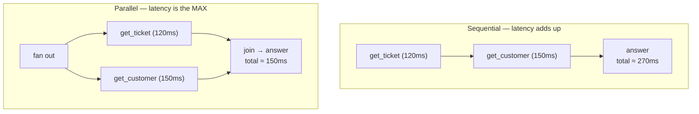

# Parallel vs Sequential Tool Calls

> **Level** 🟡 Building Production Systems · **Module** 03 · **Doc** 3 of 5 · **Time** ~15 min
> **Prerequisites:** [Retry, Fallback, Memoization and the Confirmation Gate](01_Retry_Fallback_Memo_Confirm.md)
> **Source material:** `1. Company_Wise_Preparation/2. DevRev/Coding_Round/agent_tool_calling_demo/docs/DESIGN.md` §3

## Why this matters

Sometimes the brain needs several *independent* facts before it can answer — a ticket's details *and* the customer's plan. Those calls have no ordering dependency, and running them one after another adds their latencies together for no reason. But parallelism is not free: it complicates error handling, it hits rate limits harder, and it is simply wrong for calls that depend on each other. Knowing which is which is a design decision the model should not be making alone.

## The latency arithmetic

| | Sequential | Parallel |
|---|---|---|
| Latency | sum of all calls | max of the calls |
| Use when | later calls **depend on** earlier results (search → then close) | calls are **independent** |
| Cost | same total work | same total work, but watch **rate limits** — N calls at once |
| Complexity | trivial | fan-out / fan-in, error aggregation |

## Rules of thumb

1. **Dependent steps stay sequential.** You cannot close a ticket before you have searched for it. The scratch agent's `close_by_topic` plan is inherently two steps.
2. **Independent reads go parallel** — `asyncio.gather`, a thread pool, or a LangGraph fan-out. Recall that the `tools` node in Module 01's graph already iterates over *all* tool calls in one `AIMessage`; making that loop concurrent is the natural place.
3. **Parallel calls hit the rate limiter harder.** Coordinate them through the *same* token bucket so a burst does not get you throttled — and remember that a 429 is a `TransientError`, so an uncoordinated fan-out can trigger a wave of retries that makes things worse.
4. **Keep a latency budget.** If one parallel branch is slow, return a partial answer rather than blocking the whole response. The 12-part framework's flight-search example says the same: slow suppliers get a timeout and a partial result.
5. **Never parallelise destructive calls casually.** Two writes racing each other is how you get the double refund. Module 05's orchestrator takes an exclusivity lock on the target entity for exactly this reason.

## Who decides?

An LLM can emit several tool calls in one turn, and that is a useful signal — it is the model saying "these are independent." But the *system* should hold the final say: a fan-out policy that checks none of the calls is destructive, that the combined rate-limit cost fits the budget, and that a join timeout exists. Treat the model's parallel proposal the way you treat every tool call: as a proposal.

## Interview lens

> *"Independent reads fan out and the latency becomes the max instead of the sum; dependent steps stay sequential; writes never race. And a fan-out shares one rate limiter and has a join timeout, so a burst degrades into a partial answer rather than a throttled failure."*

## Checkpoint

- Give one example each of calls that should and should not be parallelised, from the ticket domain.
- Why does parallelism interact badly with retry policies under rate limits?
- What is a join timeout and what does it buy you?
- Where in the LangGraph version would parallel execution naturally live?

**Next →** [Observability for Tool Calls](04_Observability_For_Tool_Calls.md)
