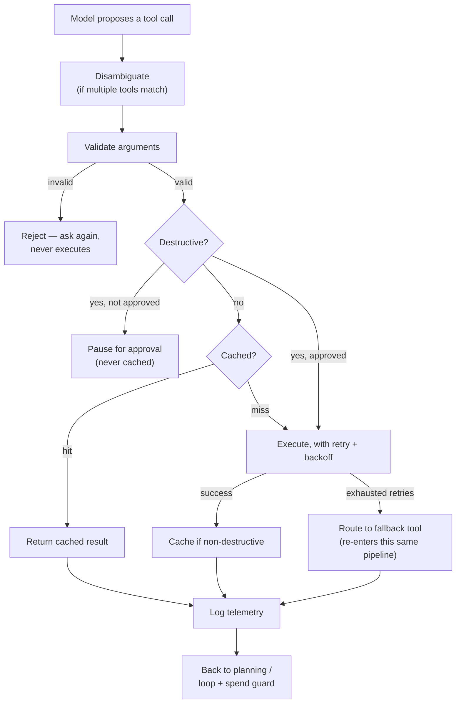

# The Eight Guard Checks

> **Level** 🟡 Building Production Systems · **Module** 03 · **Doc** 5 of 5 · **Time** ~30 min
> **Prerequisites:** the four preceding documents in this module
> **Source material:** `3. AI_Engineer_Interview_Preparation/Cross Cutting Preparation/05-guarding-tool-calls.md`; `agent_tool_calling_demo/src/robustness.py` → `disambiguate`

## Why this matters

One sentence generates everything in this document:

> **A model deciding to call a tool is a proposal, never an authorisation.**

The model can suggest an action. Something else has to decide whether it is allowed to happen, whether it is worth re-doing, and whether it needs a fallback. The previous four documents built five of those "something elses" in code. This document names all eight, shows where each sits in one pipeline, and makes the point that matters most in a design review: **none of them substitute for another.** Each closes a gap the rest do not.

## The eight

| # | Check | Protects against | If skipped |
|---|---|---|---|
| 1 | **Argument validation** | A malformed or hallucinated argument reaching a real system | A typo'd ID or wrong-typed field silently corrupts a downstream call instead of failing fast |
| 2 | **Destructive-action gate** | An irreversible action executing without authorisation | A refund, delete or send fired because the model was "pretty sure" |
| 3 | **Step / loop guard** | A run that never terminates | A planning-execution cycle repeats until someone notices the bill |
| 4 | **Spend / cost guard** | One action spending more than it should | A single call commits real money or quota past what the run was allowed |
| 5 | **Retry with fallback** | A transient failure killing the whole run | One flaky dependency becomes a full outage instead of a graceful degrade |
| 6 | **Memoization** | Redundant, wasted re-execution | The same read re-run, re-billed, re-waited every time it is asked again |
| 7 | **Disambiguation** | Silent, undebuggable tool selection | Two tools could satisfy the intent; which runs depends on undocumented model whim |
| 8 | **Per-call telemetry** | Nobody being able to answer "what actually happened" | A bad outcome with no record of which tool ran, with what, how long, or whether it was cached, retried or replaced |

Checks 2, 3 and 4 — the **guardrail trio** — operate on the *whole run* and are the heart of Module 05's guardrail engine (approvals, step budgets, spend caps per tenant). Checks 1, 5, 6, 7 and 8 live *around an individual tool call*. Module 01's loop has the step guard; Module 03 so far has built 2, 5, 6 and 8. Two remain to describe.

## 1 · Argument validation

Before a tool call executes, its arguments are checked against a strict shape — required fields present, correct types, values within declared constraints — *before* anything downstream sees them. This is the "constrained schema, not free text" instinct that runs through the whole handbook, applied to the model's tool-call arguments: a typed signature is checked before execution the same way a citation is checked before it is shown, or a workflow spec is checked before it is promoted.

Why it must be a separate, explicit step: a model can be extremely confident about an argument that is still wrong-shaped — a ticket ID that does not match the expected pattern, an amount that is a string. Catching it here means the failure is "invalid input, try again" — cheap and safe — instead of a downstream system choking on garbage it never expected. Module 05's `tools.py::validate_args()` is the full implementation.

## 2–4 · The guardrail trio, restated for tool calls

Covered in depth in Module 05. One addition worth restating here: **the destructive/non-destructive distinction must be a declared property of the tool**, tagged once at registration. The call-time check is "is this one of the tagged ones?", never a fresh judgement about whether this particular call looks risky. That is what makes the gate reliable.

## 5 · Retry with fallback — the subtlety

Built in the first document of this module. The easy-to-miss point: **a fallback tool is still a real tool call.** It needs the same argument validation and destructive check the primary would have had. A fallback is not a free pass around the checks that applied to the tool it replaces — and the code enforces that by routing the fallback through the same `execute_tool`.

## 6 · Memoization — the ordering rule

Built in the first document. The rule: **only read/non-destructive calls are safely memoized**, and the cache check must come *after* the destructive gate so a cache hit can never route around authorisation.

## 7 · Disambiguation between overlapping tools

Sometimes more than one registered tool could plausibly satisfy the same intent — a primary search and an archival fallback both "search for X"; a `search_tickets` and a `close_ticket` when the user says "find and close". Rather than leaving the choice to whatever the model happens to pick, resolve it deterministically:

```python
def disambiguate(candidates: List[Tool], query: str) -> Tool:
    """Prefer a NON-destructive tool, then the one whose description shares the most words with the query."""
    words = set(query.lower().split())
    def score(t):
        overlap = len(words & set(t.description.lower().split()))
        return (0 if t.destructive else 1, overlap)     # safe tools win ties
    return max(candidates, key=score)
```

The demo's policy is a priority tuple: safety first, then description overlap. Production systems typically carry a declared priority per tool. Either way the property that matters is the same: tool selection becomes **auditable and reproducible**. The same intent always resolves to the same tool, and if the wrong one is picked, the fix is changing a declared number, not debugging why the model felt like using a different tool this time. And the tie-break rule never bends: *never silently run a destructive tool on a tie.*

## 8 · Per-call telemetry

Built in the previous document. Every call logged individually — the finer-grained sibling of the run-level trace, complementary rather than redundant.

## The pipeline, in order



Read the diagram top to bottom and you have the executor from the first document with two checks added in front (disambiguation, validation) and the run-level guards closing the loop at the bottom. The one line that ties it together: every check exists at a different point in the same pipeline, and skipping any one is *not* caught by the others.

## Where each check lives across the handbook

| Check | Module 01 demo | Module 05 agent platform |
|---|---|---|
| 1 Argument validation | — | `tools.py::validate_args()` |
| 2 Destructive gate | `robustness.execute_tool` (confirmation policy) | `guardrails.py` (role-gated approval, autonomous allow-list) |
| 3 Step guard | `Agent.run` `while` bound | `guardrails.py::authorize_step()` (max steps) |
| 4 Spend guard | — | `guardrails.py::authorize_step()` (spend cap at every status) |
| 5 Retry + fallback | `execute_tool`, `with_fallback` | idempotent step retry in `orchestrator.py` |
| 6 Memoization | `execute_tool` + `Session.memo` | — |
| 7 Disambiguation | `robustness.disambiguate` | `routing.py` priority ordering (for workflows) |
| 8 Per-call telemetry | `observability.ToolCallLogger` | `observability.py` run store |

## Interview lens

The source material's direct answer, worth learning close to verbatim:

> *"A tool call gets checked at several independent points, not one big gate: arguments are validated against a schema before anything executes; destructive actions are gated on approval, checked every single time, never served from cache; non-destructive calls are memoized within a session; a failed call retries with backoff and falls back to a declared alternate tool if it's still failing — and that fallback goes through the exact same validation and destructive checks. Every call is logged individually. None of these checks replace each other — each one catches a different failure mode, and skipping any one leaves that specific gap open."*

## Checkpoint

- Name all eight checks and, for each, the failure it prevents.
- Which three operate on the whole run rather than one call, and where are they built?
- Why must disambiguation prefer non-destructive tools on a tie?
- Trace a proposed destructive call with a malformed argument through the pipeline diagram. Where does it stop?
- Argue, in one sentence, why no check can be dropped on the grounds that another covers it.

**Next →** [Module 04 · Enterprise RAG](../04_Enterprise_RAG/README.md)
