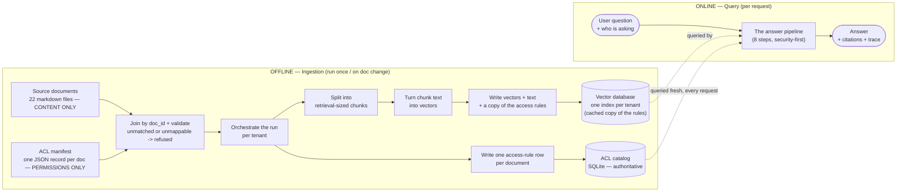
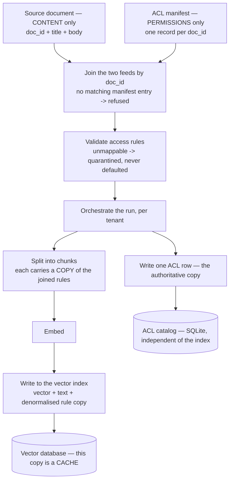

# The Ingestion Pipeline

> **Level** 🟡 Building Production Systems · **Module** 04 · **Doc** 3 of 10 · **Time** ~35 min
> **Prerequisites:** [Access Control with ABAC](02_Access_Control_ABAC.md); Module 01 doc 2 (chunking)
> **Source material:** `3. AI_Engineer_Interview_Preparation/Enterprise RAG Platform/docs/06-architecture-end-to-end.md` §1–2; `docs/05-src-modules-reference.md` (`ingest/*`); `docs/07-system-design-coverage-map.md` §4.2
> **Lab:** `project/notebooks/02-hands-on-parts/part04-chunking-and-ingestion.ipynb`, `project/scripts/ingest.py`, `demo_second_connector.py`, `demo_incremental_sync.py`, `demo_acl_catalog_update.py`

## Why this matters

Ingestion is the offline half of RAG, and it is where enterprise RAG leaks are *born*. A document indexed with the wrong permissions will be found by the wrong person no matter how good the query-time checks are. So the ingestion pipeline in this project has one non-negotiable property: **it refuses what it cannot classify**, and it keeps permissions and content in separate stores because they change for different reasons.

## The 30,000-foot picture

Content and permissions are **two separate feeds**. Markdown files hold document text and identity only; a separate ACL manifest holds every access-control field; the pipeline joins them by `doc_id`. From that join, documents are chunked and embedded once into a per-tenant Chroma collection, and the joined access rules are written once into a separate SQLite catalog. The vector store's copy of the rules is a *cache* that feeds Layer 1; the catalog is *authoritative* and feeds Layer 2.

## Step by step

| Step | What happens | Why it is designed that way |
|---|---|---|
| **A1 · Source content** | Raw markdown, frontmatter carries only `doc_id` and `title` | No ACL fields live in the corpus files, so a content edit can never touch a permission |
| **A2 · ACL manifest** | One JSON record per `doc_id`: `source`, `sensitivity`, `allowed_groups`, `region`, `need_to_know`, `valid_from`/`valid_until`, `contains_pii`, `owner` | Stands in for whatever owns entitlements in production — an admin console, HR system, permissions export |
| **J · Join** | Match content to manifest by `doc_id`; a content file with no manifest record is **refused** | This is the connector's real job: translating each source's permission model into ours. Unmatched means unclassifiable |
| **B · Validate** | Known sensitivity, non-empty `allowed_groups`, known region, `public` consistency; otherwise **quarantined** | *"An unmappable document is quarantined, not defaulted to `internal`."* Defaulting is how a latent leak gets indexed. Every rejection is persisted (a real dead-letter queue), and every source with at least one accepted document has its last-sync timestamp bumped |
| **D · Orchestrate** | Per tenant; hands each validated document down two independent paths | Tenant-scoped so one tenant's ingest cannot touch another's data |
| **C · Chunk** | Structure-aware: split on headings, pack to target size with overlap, prefix with title and section; each chunk inherits the parent's rules | Module 01's four rules, implemented. The title prefix measurably improves both dense and lexical retrieval |
| **E · Embed** | Batched embedding calls, through an in-process `(model, text)` cache | The expensive, content-dependent step; only genuinely new text is billed |
| **F/H · Vector index** | Upsert ids, vectors, text and a flattened rule copy into the tenant's collection | Chroma metadata must be scalar, so `allowed_groups` becomes `grp__<group>: True` columns |
| **G/I · ACL catalog** | One row per document into SQLite | No vectors involved. A permission change edits this row and nothing else |

## Why two stores

The vector index's rule copy and the catalog are the same idea as Layer 1 and Layer 2: they change for different reasons, on different schedules, owned by different people.

- A markdown edit (fixing a typo) should never touch an access rule.
- A permission change (revoking a group) should never touch document text or require re-embedding.

With two stores, an ACL change is a manifest edit feeding one SQLite write — `scripts/demo_acl_catalog_update.py` shows the next `enforce()` seeing it immediately, with no Chroma write. Without the separate catalog, "Layer 2" would just re-read the same cached copy Layer 1 used — running the policy twice against stale data, not a genuine second opinion.

## Beyond the first connector

Three capabilities were added to prove the pipeline is a pipeline, not a script:

**A second connector.** `load_ticket_export()` parses a Zendesk-shaped JSON array — no frontmatter, `subject`/`description` instead of a body — joins it against its own manifest, and feeds the identical `pipeline.ingest(loader=...)` path into its own tenant. Same refuse-on-no-match discipline. The point: the validate → chunk → embed → index path is format-agnostic.

**Incremental sync.** `ingest(incremental=True)` computes a SHA-256 of each document's *text only* and skips chunking and embedding for anything unchanged since it was last embedded. The hash deliberately excludes attributes: an ACL-only change never needs the skip logic, because the catalog is refreshed unconditionally regardless.

**Freshness and a dead-letter queue.** `freshness.py` records per-source `last_synced_at` and every rejected document with its reason — queryable after the process exits, not just printed.

## Two real bugs, worth knowing

Both were caught building the additions above, and both are the kind of thing that happens in any long-lived data system:

1. **An unscoped reset cross-contaminated tenants.** Ingesting the new `acme_helpdesk` tenant with `reset=True` silently wiped the unrelated `meridian` corpus, because `reset_store()` deleted the whole Chroma directory and `reset_catalog()` the whole SQLite file. Fix: both take a `tenant_id` and scope the reset; `ingest()` passes its own through.
2. **A stored content hash survived a reset it should not have.** `reset=True` combined with `incremental=True` skipped re-embedding 21 of 22 documents into a freshly *emptied* index, because their hashes matched records from before the reset — a near-empty index reporting success. Fix: incremental skipping applies only when `reset=False`.

And a third, smaller one: adding a column to the catalog needed a schema *migration* (`PRAGMA table_info` + `ALTER TABLE`), because `CREATE TABLE IF NOT EXISTS` does not add columns to a table that already exists.

## What this deliberately does not do

- Ingestion is batch, not streaming CDC — but no longer full-refresh-only.
- Two connectors exist, not a real Confluence/Zendesk/SharePoint integration.
- Identity is a JSON file, not live OIDC/SCIM.

Module 06 covers scaling ingestion to twenty million documents; Module 08 covers the Databricks version where much of this becomes a platform primitive.

## In the code

| Concept | Where |
|---|---|
| Load + join | `ingest/loader.py` → `load_corpus`, `load_ticket_export` |
| Manifest | `ingest/acl_manifest.py` → `load_acl_manifest` |
| Validation | `ingest/pipeline.py` → `validate_acl` |
| Orchestration, incremental, tenant-scoped reset | `ingest/pipeline.py` → `ingest`, `_content_hash` |
| Chunking | `ingest/chunker.py` → `_split_by_heading`, `_pack`, `chunk_document` |
| Vector store | `ingest/store.py` → `upsert_chunks`, `reset_store(tenant_id=...)` |
| ACL catalog | `ingest/catalog.py` → `upsert_many`, `get_doc_attrs`, `update_attr`, `_migrate` |
| Freshness / DLQ / hashes | `ingest/freshness.py` |
| Embedding cache | `llm/client.py` → `embed`, `_EMBED_CACHE` |

## Interview lens

> *"The connector's real job is translating each source system's permission model into ours — that translation is the number one cause of enterprise RAG leaks. If a document arrives with no usable permissions, we refuse to index it rather than defaulting it to 'internal' and hoping. And permissions live in their own store, so a revocation is one row write, never a re-embed."*

## Checkpoint

- Why are content and permissions two separate feeds, and what would go wrong with one?
- What happens to a document whose permissions cannot be mapped, and why is defaulting dangerous?
- Explain why the content hash excludes ACL attributes.
- Describe the tenant-scoped reset bug and its fix.
- What makes the catalog a *genuine* second opinion rather than a re-read?

**Next →** [Retrieval — Hybrid, Expansion, Rerank](04_Retrieval_Hybrid_Rerank.md)
