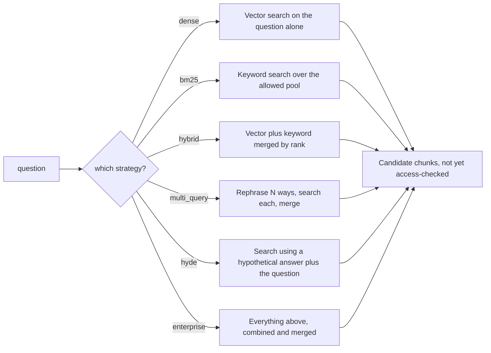

# Retrieval — Hybrid, Expansion, Rerank

> **Level** 🟡 Building Production Systems · **Module** 04 · **Doc** 4 of 10 · **Time** ~35 min
> **Prerequisites:** Module 01 doc 2; [The Ingestion Pipeline](03_Ingestion_Pipeline.md)
> **Source material:** `3. AI_Engineer_Interview_Preparation/Enterprise RAG Platform/docs/06-architecture-end-to-end.md` §4–5; `docs/05-src-modules-reference.md` (`retrieval/*`); `README.md` (strategy comparison)
> **Lab:** `project/notebooks/02-hands-on-parts/part05-hybrid-search.ipynb`, `part06-query-transformation.ipynb`, `part07-reranking.ipynb`

## Why this matters

Module 01 taught the retrieval techniques as concepts. This document is how they are *engineered*: six interchangeable strategies behind one signature, so the pipeline can pick one at runtime and the evaluation harness can A/B them on the same question set. Two constraints shape everything: every strategy searches **only within what this principal is allowed to see** — there is no path that skips the filter — and reranking runs **after** access enforcement, never before.

## The six strategies

| Strategy | What it does | The failure it targets |
|---|---|---|
| `dense` | Vector search on the raw question — the baseline everything is compared against | — |
| `bm25` | Keyword search over the already-authorised pool | Exact identifiers, error codes, ticket IDs |
| `hybrid` | Dense + BM25, merged by rank with RRF | Identifiers *and* paraphrase in one corpus |
| `multi_query` | N LLM rephrasings, search each, fuse (RAG-Fusion) | User's wording ≠ corpus wording |
| `hyde` | A hypothetical answer embedded as the probe, fused with the literal question as an anchor | Question/answer register mismatch |
| `enterprise` | The production default: multi-query rewrites + HyDE probe + sub-questions through dense; original question + sub-questions through BM25; all fused | Everything above; then reranked downstream |

All six share a `RetrievalContext` that bundles the principal, the compiled `where` filter, the LLM client, and mutable fields for tracing (generated queries, HyDE passage, sub-questions). Every store call inside any strategy carries that filter.

## Three engineering details that matter

### BM25 is built over the authorised pool

A lexical index cannot push an ACL filter down the way a vector store can. So `bm25_only` first calls `store.fetch_all_allowed(tenant, where)` — every chunk matching the Layer 1 filter, no vector query — and builds the BM25 index over *that*. Correct, and it does not scale: the index is rebuilt per request. The project names this as its first scaling limit; the production answer is a lexical store with native document-level security (OpenSearch DLS) or a cached per-group shard. Module 06 returns to it.

The tokenizer keeps hyphenated identifiers like `MRD-5031` as single tokens rather than splitting on the hyphen — which is the whole reason BM25 is in the system.

### The enterprise strategy is deliberately asymmetric

Dense search fans out across multi-query rewrites, the HyDE probe and any sub-questions. BM25 fans out across the original question and sub-questions — **not** the paraphrased rewrites, because paraphrases dilute the rare identifiers BM25 exists to catch. Knowing *why* the fan-outs differ is the kind of detail that shows you have built it.

### Every LLM-dependent step degrades

`generate_multi_queries`, `generate_hyde_passage` and `decompose` all catch `LLMUnavailable` and degrade — to `[original]`, to `None` (falling back to `dense_only`), to `[]` — rather than failing retrieval. The graph node marks the run `degraded` so the trace records it. Nothing in retrieval is allowed to turn a provider blip into a failed request.

## Fusion

`reciprocal_rank_fusion(ranked_lists, k, top_n)` sums `1 / (k + rank + 1)` for each chunk across every list it appears in, with `k` damping the influence of top ranks so *agreement across retrievers* beats topping a single list. It merges provenance too — each surviving chunk records which retrievers found it (`retrieved_by`), which the trace surfaces.

## Reranking — the biggest single quality win

Retrieval optimises for **recall** cheaply across the whole corpus: over-fetch 40 dense + 40 BM25, fuse to 50. Reranking optimises for **precision** expensively over that small set: score each candidate 0–10 on *does this passage actually answer this question* — not "is it well-written" or "is it important" — and keep the top 6.

Why it catches what retrieval misses: dense search embeds query and chunk *separately* and compares two vectors. A reranker sees query and passage *together* and judges relevance directly — strictly more information.

Two implementations behind one `rerank()` interface:

- **`LLMReranker`** (default) — one batched JSON call scores every candidate with a one-line reason. Explainable; no model hosting. Degrades to fusion order if the model is unavailable.
- **`CrossEncoderReranker`** — a local `ms-marco-MiniLM` cross-encoder. No API cost, faster at scale. A one-line swap.

### The interaction worth naming

**Reranking runs after ACL enforcement.** A restricted user's top-6 is the best of *their* authorised pool — not a diluted version of someone else's. If you post-filtered, you would rerank documents they cannot see, waste top-k slots on them, and hand the user an empty or thin context. The next document shows where this sits in the graph.

## What the numbers actually say

The project ran all six strategies against the same golden set:

| strategy | recall@k | MRR | grounded | refusal_acc | **leaks** | p50 ms | cost |
|---|---|---|---|---|---|---|---|
| dense | 1.00 | 0.958 | 1.00 | 0.917 | **0** | 6259 | $0.0133 |
| bm25 | 1.00 | 0.944 | 1.00 | 1.000 | **0** | 5200 | $0.0157 |
| hybrid | 1.00 | 0.958 | 1.00 | 0.917 | **0** | 7339 | $0.0153 |
| multi_query | 1.00 | 0.958 | 1.00 | 1.000 | **0** | 8313 | $0.0153 |
| hyde | 1.00 | **1.000** | 0.929 | 0.917 | **0** | 8850 | $0.0163 |
| enterprise | 1.00 | 0.958 | 1.00 | 0.917 | **0** | 10908 | $0.0200 |

**Read these honestly.** The corpus is 22 documents. Retrieval is easy at that size; every strategy scores near-perfectly and the differences are noise. Do *not* read this as proof that HyDE or multi-query earn their keep — `enterprise` is simply the slowest and most expensive here, and `dense` would be the right production choice *for this corpus*. The value is that the harness **exists and gates the release**: on a 200,000-document corpus the same table is what tells you whether HyDE earns its latency. The number that matters here is the zero-leak column.

That paragraph is itself a lesson: the discipline of not overclaiming what a demo proves runs through the whole project and gets its own treatment in Module 11.

## In the code

| Concept | Where |
|---|---|
| Strategy registry and context | `retrieval/strategies.py` → `STRATEGIES`, `RetrievalContext`, `enterprise` |
| BM25 over the allowed pool | `retrieval/lexical.py` → `BM25Index`, `tokenize`; `ingest/store.py` → `fetch_all_allowed` |
| Multi-query, HyDE, decomposition (history-aware) | `retrieval/expansion.py` |
| RRF | `retrieval/fusion.py` → `reciprocal_rank_fusion` |
| Rerankers | `retrieval/rerank.py` → `LLMReranker`, `CrossEncoderReranker` |
| Pool sizes | `config.py` → `dense_k`/`bm25_k` = 40, `fusion_k` = 50, `rerank_k` = 6 |
| Strategy comparison | `project/scripts/evaluate.py --compare dense bm25 hybrid multi_query hyde enterprise` |

## Interview lens

> *"Hybrid is the baseline, not the advanced option — enterprise text is full of identifiers and users ask in prose. Fuse by rank because the scores aren't comparable. Over-retrieve 40–50, rerank to 6 with a cross-encoder or an LLM, and do it after enforcement so a restricted user's top-6 is the best of their own pool. Every expansion step degrades to plain dense if the model is down."*

## Checkpoint

- Why is BM25 built over `fetch_all_allowed()` rather than over the whole collection, and what does that cost at scale?
- Why does the enterprise strategy not send paraphrased rewrites through BM25?
- What does RRF's `k` parameter do?
- State the interaction between reranking and ACL enforcement in one sentence.
- Why should the strategy-comparison table *not* be used to justify HyDE?

**Next →** [The Query Graph](05_The_Query_Graph.md)
