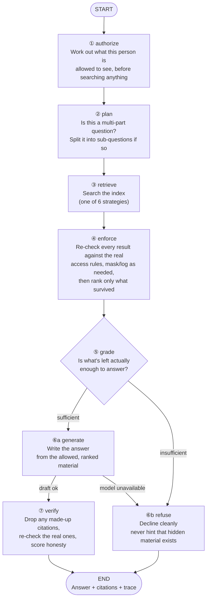
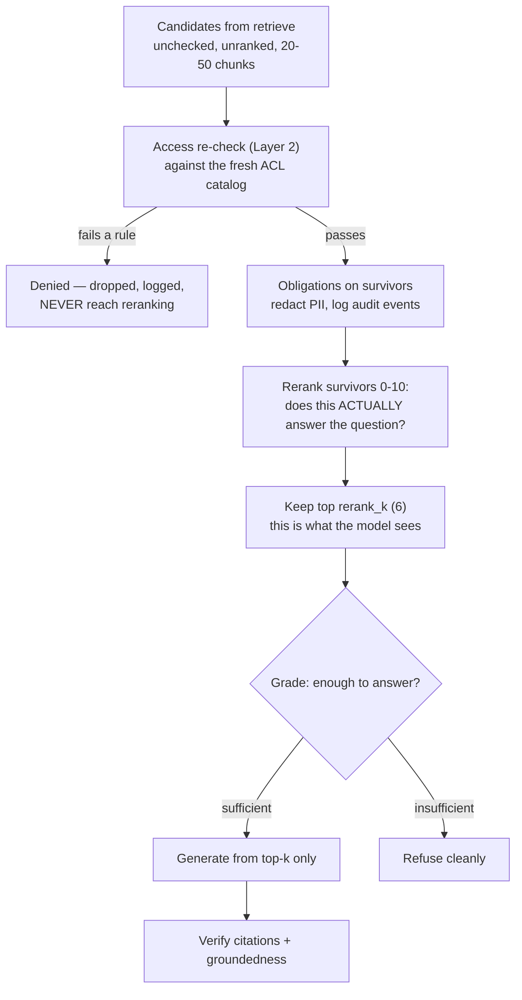
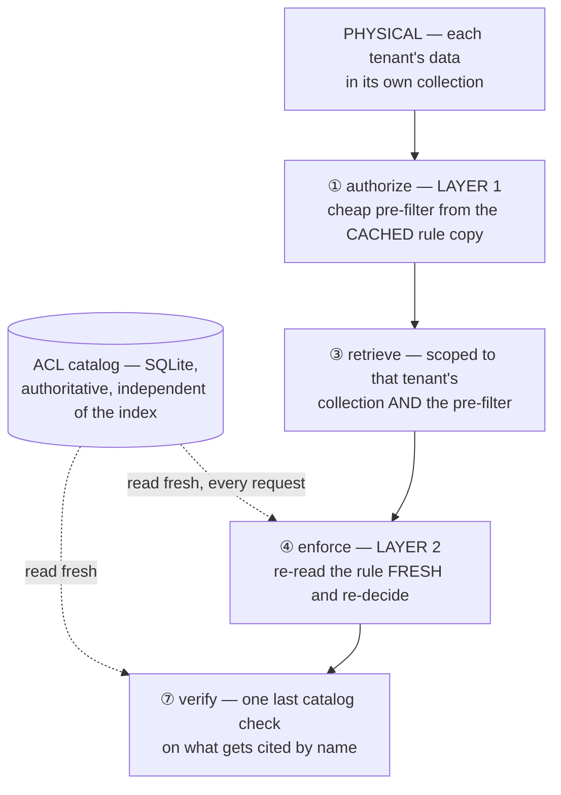

# The Query Graph

> **Level** 🟡 Building Production Systems · **Module** 04 · **Doc** 5 of 10 · **Time** ~40 min
> **Prerequisites:** docs 2–4 of this module; Module 01 doc 5 (LangGraph)
> **Source material:** `3. AI_Engineer_Interview_Preparation/Enterprise RAG Platform/docs/06-architecture-end-to-end.md` §3, §5, §6; `docs/05-src-modules-reference.md` (`graph/*`, `authz/rate_limit.py`, `llm/client.py`)
> **Lab:** `project/notebooks/02-hands-on-parts/part08-full-graph.ipynb`, `project/scripts/ask.py`

## Why this matters

Everything so far — the policy, the ingestion, the strategies — is assembled here into the per-request pipeline. It is a LangGraph state machine of eight nodes, and its defining property is one sentence, taken verbatim from the node module's docstring:

> *"`authorize` runs first, `enforce` runs before anything reaches the model — that ordering is encoded in the graph edges, not left to a convention someone can forget."*

This is the diagram to be able to draw from memory.

## The graph

## Node by node

| # | Node | What it does | The detail that matters |
|---|---|---|---|
| ① | **authorize** | Compiles the principal's ABAC policy into a Chroma `where` clause (Layer 1); ANDs on any optional caller-supplied content filter (source, doc type, recency) | `merge_filters` is safe by construction, not validation — `$and` can only narrow a result set, so a caller's filter can never see past the ACL clause |
| ② | **plan** | A cheap regex ("and", "also", ";") decides if the question *looks* multi-hop; only then, and only under `enterprise`, does it call the LLM to decompose | Saves an LLM call on the common single-hop path |
| ③ | **retrieve** | Runs the selected strategy; every store call carries the compiled filter | If expansion fails with `LLMUnavailable`, degrades to `dense` and marks the state `degraded` |
| ④ | **enforce** | Re-runs the full policy on every candidate against the **fresh** ACL catalog (Layer 2); applies redaction and audit obligations; **then** reranks the survivors to `rerank_k` | Denied chunks are dropped, logged, and never reach the reranker. Disagreements with Layer 1 become security events |
| ⑤ | **grade** | Returns insufficient immediately if there is no context or the best rerank score is below threshold; otherwise an LLM judges `sufficient` / `partial` / `insufficient` | `partial` proceeds with a coverage note rather than refusing — which part of a question you can see is itself role-dependent. On grader failure, trusts the reranker score |
| ⑥a | **generate** | Checks the run's spend against a cost ceiling and routes to refuse if already over; checks a response cache; otherwise synthesises with inline citations | The cache key is the question + the compiled filter + the *exact* chunk ids that survived enforcement + the coverage note — so a hit is only ever served for a genuinely identical, freshly-enforced situation |
| ⑥b | **refuse** | The clean no-answer path with a role-appropriate next step | **Never reveals that a withheld document exists** — that is itself a disclosure |
| ⑦ | **verify** | Extracts cited doc ids; drops any not in context (hallucinated) or failing a live policy re-check; strips their markers; scores groundedness | A citation is a disclosure — "this document exists and is relevant" — so it gets its own catalog lookup |

## After retrieval, in detail

Step ③ hands back a pile of candidates — unchecked, unranked, 20–50 chunks. Everything that turns the pile into an answer happens in ④–⑦:

Why enforce comes *before* rerank: the reranker must only ever see chunks this principal may read. Otherwise the "best" answer could be shaped by content the user never sees, and top-k slots are wasted scoring material that will be thrown away.

## Security checkpoints, overlaid

Four checkpoints, two of them reading the catalog fresh. No LLM is an enforcement point anywhere in this diagram: unauthorised text is removed at ④ before ⑥ ever runs, so there is nothing in the prompt to leak.

## The entry point

`RAGPlatform.ask(question, principal, strategy="enterprise", as_of=None, filters=None, history=None)` is the single public method. Before anything else it checks a **per-tenant rate limit** — a fixed-window counter — and a denial returns a refused answer before an LLM client is even constructed, so a rate-limited request costs nothing (verified: `trace.cost_usd == 0.0`). Then it builds a fresh LLM client, usage tracker and trace, seeds `RAGState`, invokes the compiled graph, finalises the trace and returns `{"answer", "trace", "state"}`.

`RAGState` is a single `TypedDict` that flows through every node — request, infrastructure handles, authorisation output, plan, retrieval and enforcement results, generation outcome. It is what lets any node be tested in isolation and lets the trace be reconstructed from state alone.

## Degradation, everywhere

The graph is built so that a provider outage produces a *degraded* answer or a clean refusal, never an exception:

| Fails | Behaviour |
|---|---|
| Query expansion LLM call | Retrieve degrades to `dense`; run marked degraded |
| Reranker | Fusion order used; `rerank_score=None` |
| Grader | Trusts the reranker score and proceeds |
| Synthesis | Routes to `refuse`, marked degraded |
| Run cost already over ceiling before synthesis | Routes to `refuse` — halt and escalate, not spend more |
| Provider down repeatedly | The LLM client's **circuit breaker** trips after 3 consecutive genuine-outage exhaustions and short-circuits every call for 30 s with zero network attempts, then allows a half-open trial |
| **Policy engine unavailable** | **Fail closed. Refuse.** Never fail open on authorisation |

The LLM client distinguishes 5xx (retry with backoff and jitter; counts toward the breaker) from 4xx (a bug in the request, not an outage — raise immediately, never trip the breaker). That is Module 03's transient-vs-permanent distinction, applied to the model provider.

## Prompts are versioned artefacts

`graph/prompts.py` holds every template as a named constant with a `PROMPT_VERSION` stamped onto every trace. The synthesis prompt enforces citation format, no-guessing, partial-answer behaviour, and a conflict rule: when two passages disagree on the same fact, prefer the higher-`authority` then the more recently updated one, and name the conflict. Live-verified: the model reliably *picks* the right value; it only reliably *names* the conflict when the question hints one exists — an honest, observed gap in disclosure, recorded rather than hidden.

## In the code

| Concept | Where |
|---|---|
| Nodes | `graph/nodes.py` → `authorize`, `plan`, `retrieve`, `enforce`, `grade`, `route_after_grade`, `generate`, `verify`, `refuse` |
| Wiring, entry point, rate-limit short-circuit | `graph/build.py` → `build_graph`, `RAGPlatform.ask` |
| State contract | `graph/state.py` → `RAGState` |
| Prompts | `graph/prompts.py` → `PROMPT_VERSION`, `SYNTHESIS_SYSTEM`, `SUFFICIENCY_SYSTEM`, `GROUNDEDNESS_SYSTEM`, `REFUSAL_TEMPLATE` |
| Response cache | `graph/nodes.py` → `_RESPONSE_CACHE`, `_response_cache_key` |
| Cost ceiling | `config.py` → `max_cost_per_run_usd`; checked in `generate` |
| Rate limit | `authz/rate_limit.py` → `check` |
| Circuit breaker, retries | `llm/client.py` → `_CircuitBreaker`, `LLMClient._with_retries`, `LLMUnavailable` |
| Try it | `python scripts/ask.py --user u_marco_t3 "Why did EU ingest degrade on 14 March?"` |

## Interview lens

Draw the eight nodes, say the docstring sentence, and then say the failure-mode table — especially the last row, slowly. The response-cache key is a detail worth volunteering: *"the key includes the chunk ids that survived enforcement this request, so a revoked document changes the context and therefore the key — a stale cache entry is structurally unreachable, not just avoided by convention."*

## Checkpoint

- Draw the eight-node graph with its conditional edges.
- Why is `merge_filters` safe by construction?
- What does `grade` do with a `partial` verdict, and why?
- List the components of the response-cache key and explain what each one protects against.
- Which failure fails closed, and why is that different from every other row?
- How does the LLM client treat a 4xx differently from a 5xx, and why?

**Next →** [Output Guardrails](06_Output_Guardrails.md)
