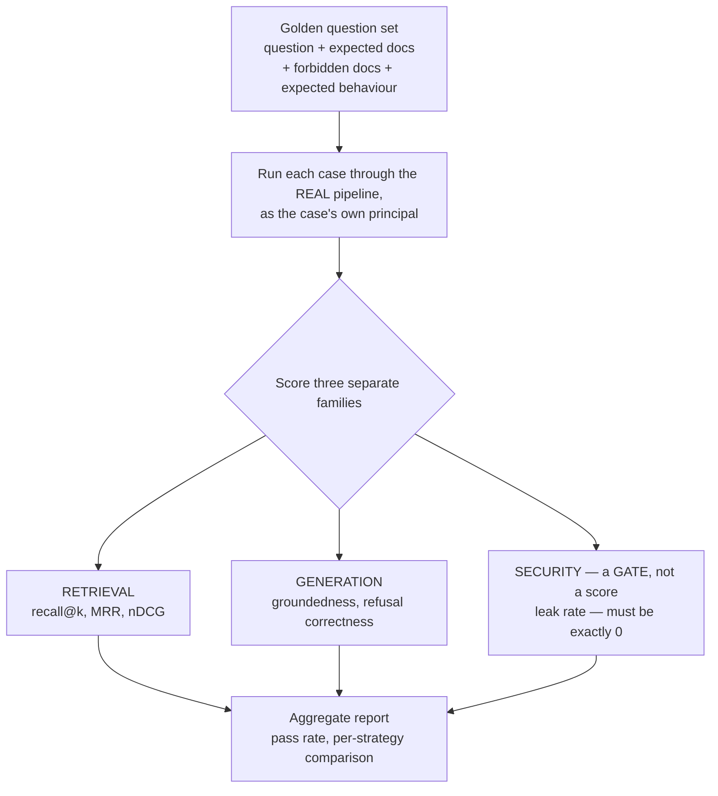

# Evaluation — Golden Sets, Judges and the Gate

> **Level** 🟡 Building Production Systems · **Module** 04 · **Doc** 7 of 10 · **Time** ~35 min
> **Prerequisites:** [The Query Graph](05_The_Query_Graph.md), [Output Guardrails](06_Output_Guardrails.md)
> **Source material:** `3. AI_Engineer_Interview_Preparation/Enterprise RAG Platform/docs/01-theory.md` §9; `docs/06-architecture-end-to-end.md` §7; `docs/05-src-modules-reference.md` (`evaluation/harness.py`); `README.md` ("Verified results", "Read these numbers honestly"); `docs/07-system-design-coverage-map.md` §4.5
> **Lab:** `project/notebooks/02-hands-on-parts/part10-evaluation.ipynb`, `project/scripts/evaluate.py`, `calibrate_judge.py`, `project/tests/test_golden_set.py`

## Why this matters

"It works on my question" is not evidence. An enterprise RAG system must work on thousands of questions, measurably, and it must *never* show a user a document they may not read. Those are different kinds of claim, and the single most important idea in this document is that they are scored differently: quality is a **metric** you track and improve; security is a **gate** that blocks a release. Averaging the two together lets a leak hide inside "pretty good this week".

## Three families, kept separate

| Family | Metrics | Answers |
|---|---|---|
| **Retrieval** | recall@k, MRR, nDCG | Did the right document reach the context? |
| **Generation** | groundedness, refusal correctness | Did the answer use it honestly? |
| **Security** | **leak rate — must be exactly 0** | Did a forbidden document ever surface? |

Keep retrieval and generation separate: if the answer is wrong, you need to know *which half* broke. And keep security out of the average entirely.

## The golden set

A fixed JSON file of cases. Each has a question, the principal who asks it, the strategy, and some combination of:

- `expected_docs` — must all reach the context (recall must be 1.0 to pass)
- `forbidden_docs` — must never be retrieved *or cited* (a leak fails the run)
- `distractor_docs` — allowed but irrelevant; retrieving one is a precision miss, tracked but **not** gating
- `expect_refusal`, `must_contain` — behavioural assertions

In production this is built with the customer's own experts — real questions with known-correct source documents — and it is the artefact that makes any of this possible. The demo has 22 synthetic cases; the source is explicit that the *mechanism* is real and the *scale* is not.

## The harness

`run_eval()` calls the real `RAGPlatform.ask()` for each case — no mocked retrieval, no shortcuts. `compare_strategies()` runs the same set through several strategies against one shared platform and returns one summary row per strategy: the artefact used to justify "strategy X is measurably better".

nDCG here is binary-relevance (each retrieved doc is relevant or not against `expected_docs`, discounted by `1/log2(rank+1)`). Graded relevance would need every case re-authored with per-document scores — a content change, deliberately left out, and named as such.

## Why security is a gate

A retrieval regression is a bug — recall drops, someone notices, it gets fixed next sprint. A leak is an incident. So:

- **Any** forbidden document reaching the context *or being cited* counts as a leak. A citation alone leaks, because naming a document confirms it exists and is relevant.
- A single leak fails the whole run, full stop. It does not lower a number.
- The leak decision is made by the **policy engine directly** — deterministic, no model judgement involved — which is what makes it trustworthy enough to block a release on.

And two things are deliberately **not** gated:

- **`distracted`** — an allowed document that did not answer the question. A quality miss, not a security miss. If it gated too, people would start treating every gate failure as "probably noise" and stop trusting the alarm.
- **Refusal correctness on security cases** — whether the model's *wording* was the ideal refusal vs a thinner but still-safe answer from public material is an LLM judgement. Recorded as an advisory. *Security must never hinge on a coin flip.*

## Calibrating the judge

Groundedness is scored by an LLM. An uncalibrated judge is an unmeasured metric. `scripts/calibrate_judge.py` runs the real `GROUNDEDNESS_SYSTEM` prompt against six hand-labelled cases spanning fully-grounded, fabricated, wrong-date and partial, and reports agreement rate and mean absolute error against the human labels. Live run: 100% agreement, MAE 0.033. Module 08 shows the Databricks-native version of the same idea.

## What the evaluation caught — five war stories

Every one of these is in the project's history rather than quietly fixed, and each teaches something about evaluation itself.

**1 · A false security alarm.** `bm25` was reported as leaking `CT-VTX-001` to the account manager — but she is *permitted* to read it; it was simply the wrong document for a pricing question. The label had conflated "unauthorised" with "irrelevant". Fix: split into `forbidden_docs` (gates) and `distractor_docs` (precision), with `tests/test_golden_set.py` asserting every `forbidden_docs` entry is genuinely policy-denied so the labels cannot drift again. *A false security alarm is worse than no alarm — it trains people to ignore the real one.*

**2 · A shadowed policy rule.** A coverage test showed no security case actually exercised `external_restriction`: for the contractor persona, `clearance` denied first every time. Fix: a high-clearance external consultant (`u_dana_ext`) and case `S09`, where that rule is the *only* thing between her and the contracts.

**3 · A flaky gate.** Case `S05` refuses on most runs and occasionally answers thinly from public help-centre docs, because the sufficiency verdict is an LLM judgement. Zero leaks either way. Fix: security cases gate *only* on the deterministic leak property; the refusal expectation became an advisory.

**4 · An unscoped reset.** Covered in the ingestion document — caught because the golden set suddenly could not find documents that should have been there.

**5 · A stale content hash.** Also in the ingestion document — a near-empty index reporting success, caught the same way.

## The results, read honestly

Golden set, `enterprise` strategy: **22/22 pass** — recall@k 1.00, MRR 1.00, groundedness 1.00, refusal accuracy 100%, **leaks 0**, p50 10.7 s, cost $0.0196.

The corpus is 22 documents, so the quality numbers say almost nothing about strategy choice. The value is that the harness exists, gates the release, and would say something on a 200,000-document corpus. The number that matters is the zero.

## What is not built

- Golden set of 100–300 *real* customer questions — the mechanism exists; the content is synthetic, and can only ever be synthetic without a real customer.
- **Online signals** — thumbs up/down, escalation rate, unanswered-query clustering. This is an offline harness with no serving surface. The answer to give: *"every answer captures feedback tied to the same `run_id` the trace produces; escalation-to-human rate becomes a proxy for retrieval failure; refused questions get embedded and clustered periodically, and a cluster is a content gap that becomes a backlog item for whoever owns that source. I'd reuse the harness's `EvalReport` shape sourced from live traffic rather than build a second metrics system."*

## In the code

| Concept | Where |
|---|---|
| Harness | `evaluation/harness.py` → `run_eval`, `_score_case`, `compare_strategies`, `_ndcg_binary` |
| Pass/fail semantics | `CaseResult.passed`, `refusal_advisory`; `EvalReport.leak_count`, `leak_rate`, `pass_rate` |
| Golden set | `project/data/golden_set.json`; integrity test `project/tests/test_golden_set.py` |
| Judge calibration | `project/scripts/calibrate_judge.py`; `project/data/judge_calibration_set.json` |
| Run it | `python scripts/evaluate.py --kinds security` (the gate) · `python scripts/evaluate.py --compare ...` |

## Interview lens

> *"Three families, scored separately. Retrieval and generation are metrics — if the answer's wrong I need to know which half broke. Security is a gate: leak rate must be exactly zero, decided by the policy engine with no model involved, and one leak blocks the release. And I keep 'irrelevant but allowed' out of the gate on purpose, because a false security alarm trains people to ignore the real one."*

The false-alarm war story is worth telling in full when evaluation comes up.

## Checkpoint

- Name the three families and say why they are never averaged together.
- What counts as a leak, and why does a citation alone qualify?
- Why is `distracted` tracked but not gating?
- Why do security cases not gate on refusal correctness?
- Tell the false-security-alarm story and its fix in under a minute.
- What would you say when asked about online evaluation signals?

**Next →** [Observability](08_Observability.md)
