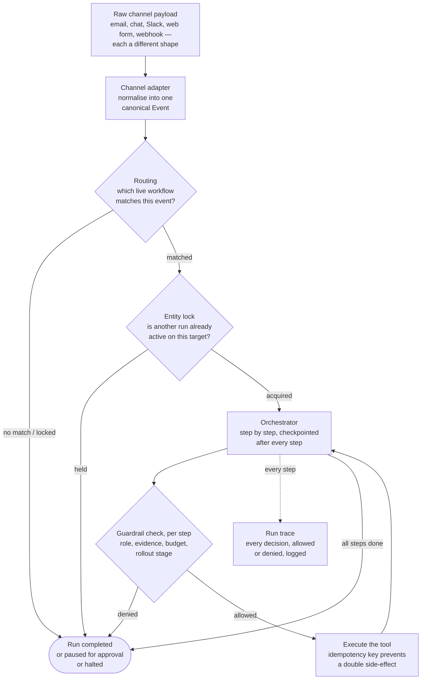
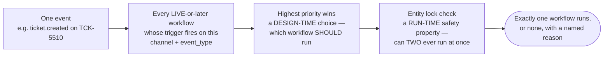

# Canonical Events, Channels and Routing

> **Level** 🟡 Building Production Systems · **Module** 05 · **Doc** 2 of 7 · **Time** ~25 min
> **Prerequisites:** [The Problem in Plain English](01_The_Problem_In_Plain_English.md)
> **Source material:** `3. AI_Engineer_Interview_Preparation/Enterprise Agentic Workflow Automation Platform/docs/01-theory.md` §B.1–B.2; `docs/02-architecture-end-to-end.md` §1–2; `docs/03-src-modules-reference.md` (`channels.py`, `routing.py`, `models.py`)
> **Lab:** `project/src/agent_platform/channels.py`, `routing.py`; `project/notebooks/02-hands-on.ipynb`

## Why this matters

"Multiple channels" is doing real work in the prompt. The same logical workflow must fire from email, chat, Slack, a web form and a webhook — each with a wildly different payload shape and a different notion of "what is this about". If channel-specific logic leaks past the first layer of the system, every subsequent component has to know about every channel, forever. This document is Layer 1: translate once, at the edge, into one shape — and then decide, deterministically, which workflow runs.

## The 30,000-foot picture



This document covers the first three boxes. Doc 4 is the orchestrator and tool execution; doc 5 is the guardrail check.

## The canonical event

```python
@dataclass
class Event:
    channel: Channel          # email | chat | slack | web_form | webhook
    event_type: str           # e.g. "ticket.created", "urgent_message"
    tenant_id: str
    target_entity_id: str     # the ticket, order, account this is about
    payload: dict             # the normalised content
    raw_ref: str              # pointer back to the original, for audit
```

Five fields carry the design. `channel` and `event_type` are what triggers match on. `tenant_id` scopes everything downstream. `target_entity_id` is what the entity lock keys on. `raw_ref` means the original is never lost — normalisation is not destruction.

## Adapters: translate once, at the edge

One function per channel, each producing an `Event`:

| Adapter | Input | What it does |
|---|---|---|
| `from_webhook(payload)` | A Zendesk-shaped webhook | Maps ticket fields to the canonical shape |
| `from_slack(payload)` | A Slack event | Maps message fields; also classifies `urgent_message` vs plain `message` from the raw flag |
| `from_email(payload)` | An email | Maps sender, subject, body |

Downstream of these three functions, **nothing knows which channel an event came from** except by reading `event.channel`. Routing, guardrails, the orchestrator and the trace all operate on one shape. Adding a sixth channel is one new adapter and zero changes anywhere else.

## Routing: which workflow runs?



Three steps:

1. **Match.** `matching_workflows(event, workflows)` returns every workflow whose tenant, status and trigger fit. A workflow's `Trigger` is `(channel, event_type, priority)`. Status matters: **a `DRAFT` workflow never matches a real event.** That single rule is what makes it safe to author.
2. **Prioritise.** If several match, the highest `priority` wins. This is a *design-time* decision an admin makes on purpose: "if two workflows both want this event, which is right?"
3. **Lock.** `acquire_lock(target_entity_id, run_id)` refuses if another run is already active on the same entity. This is a *run-time safety property*: "can two workflows ever both be mutating the same ticket at once?"

`route()` returns either the selected workflow or a named reason nothing ran — `no_trigger_match` or `entity_locked`. Never a silent no-op.

## Why two mechanisms, not one

Priority ordering and the entity lock answer independent questions, so they are independent checks. Priority is configuration; the lock is safety. The lock holds **even if priority was misconfigured** or two workflows were accidentally given the same priority. If you built only priority, a configuration mistake becomes a concurrent-mutation bug. If you built only the lock, you would have no way to say which workflow *should* win. Both, always.

This is the same defence-in-depth instinct as Module 04's tenant partition plus pre-filter: a correctness mechanism and a safety mechanism that do not depend on each other.

## Where the honest gap is

Everything above is real and tested. What is *not* built is the authoring surface: a non-technical user does not construct `Event`s or `Trigger`s — they would use a visual builder or a natural-language-to-spec compiler. The project's `WorkflowSpec` objects are built directly in Python, standing in for what either would emit. Doc 7's coverage map sizes that gap; doc 3 shows why the spec shape is already what a builder would serialise to.

## In the code

| Concept | Where |
|---|---|
| The canonical event and the channel enum | `models.py` → `Event`, `Channel` |
| Adapters | `channels.py` → `from_webhook`, `from_slack`, `from_email` |
| Trigger | `models.py` → `Trigger` |
| Matching, priority, named non-selection | `routing.py` → `matching_workflows`, `route`, `selected_workflow` |
| Entity lock | `routing.py` → `acquire_lock`, `release_lock` |
| Tests | `tests/test_platform.py` — routing conflict, `entity_locked` |

## Interview lens

> *"Every channel is translated once, at the edge, into a canonical event; nothing downstream knows about channels. Routing picks the highest-priority live workflow — a design-time choice — and an entity lock refuses a second concurrent run on the same target — a run-time safety property. Two mechanisms because they answer two different questions, and the lock holds even when priority is misconfigured."*

## Checkpoint

- Name the fields of the canonical `Event` and what each is for.
- Why does a `DRAFT` workflow never match a real event?
- Distinguish priority ordering from the entity lock in one sentence each. Why both?
- What does `route()` return when nothing runs, and why does that matter?
- What is the honest gap at this layer?

**Next →** [Determinism Over Free Text](03_Determinism_Over_Free_Text.md)
