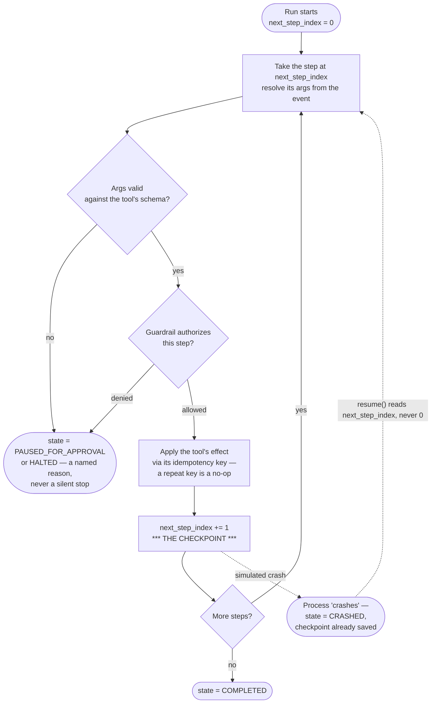
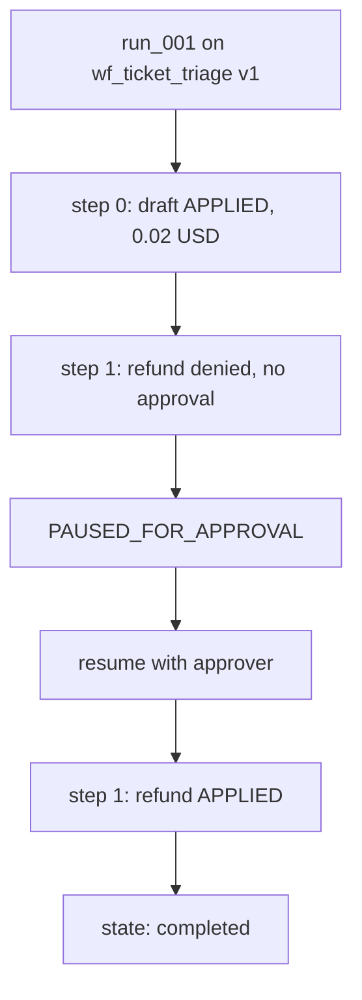

# Durability and Idempotency

> **Level** 🟡 Building Production Systems · **Module** 05 · **Doc** 4 of 7 · **Time** ~35 min
> **Prerequisites:** [Determinism Over Free Text](03_Determinism_Over_Free_Text.md); Module 03 doc 2 (checkpointers)
> **Source material:** `3. AI_Engineer_Interview_Preparation/Enterprise Agentic Workflow Automation Platform/docs/02-architecture-end-to-end.md` §3; `docs/03-src-modules-reference.md` (`orchestrator.py`); `docs/01-theory.md` §B.5; `README.md` (verified results)
> **Lab:** `project/src/agent_platform/orchestrator.py`; `project/scripts/run_workflow_demo.py`

## Why this matters

Two questions decide whether an agent platform is safe to point at real money:

1. **A workflow has been running for two hours when the orchestrator restarts. What happens?**
2. **A refund step is retried — flaky network, duplicate webhook, rewound checkpoint. Is the customer refunded twice?**

This document is the orchestrator that answers both, and it is *the* diagram to be able to draw from memory in this module. It also carries two real bugs that were found building it, and each teaches something about idempotency that most explanations miss.

## The loop



## Durability: the checkpoint is `next_step_index`

The orchestrator executes one step, checkpoints, executes the next — never the whole run at once. The checkpoint is not a separate mechanism; it is one integer on the `Run`:

> *"`resume()` and a fresh `run_workflow()` call the exact same execution loop. There is no special 'recovery path' with its own bugs; there's just one loop that always starts wherever `next_step_index` says to start, whether that's 0 or mid-run."*

That sentence is the design. A recovery path that is *different code* from the normal path is a second implementation of the same logic, and its bugs are only found during incidents. Making resume and run the same loop means the recovery path is exercised on every single run.

The demo proves it by *actually crashing*: `run_workflow(..., crash_after_step=0)` sets state to `CRASHED` after the checkpoint is saved; `resume(run, ...)` continues from step 1. Step 0 does not run again — verified by the external call count.

## Idempotency: a key on the action, not a flag on the run

```
idempotency_key = f"{run_id}:{step_name}"
```

`_apply_side_effect(idempotency_key, tool_name, args)` returns `True` only the first time a key is seen. Every subsequent call with the same key is a no-op, and `external_call_count(tool_name)` does not increment.

Why the key is on the *action* and not a run-level "already started" flag: a run legitimately retries after a transient failure, and a run-level flag would still let two attempts at the *same step* both fire. Keying by `{run_id}:{step_name}` deduplicates the specific side effect. Reruns of the *loop* are fine and expected; reruns of one already-applied *side effect* are not — and the two are told apart precisely.

## Three honest outcomes

A run ends in exactly one of: `COMPLETED`, `PAUSED_FOR_APPROVAL`, or `HALTED` (budget) — plus `CRASHED` as a transient state that `resume()` clears. There is no fourth "it just stopped and nobody knows" path. Every non-completion carries a named reason on the trace. This is the same property as Module 01's three loop exits, at platform scale.

## Two bugs that make the point

Both were caught building this project. Both are worth telling in a design conversation because they show what "idempotent" actually has to mean.

### Bug 1 — the spend cap was checking the wrong number

`_step_cost(tool_name, args)` is what counts against the spend cap. For `issue_refund` it must be the **actual dollar amount** — `args["amount_usd"]` — not a nominal per-call fee. The first version used a hardcoded operational cost for every tool, so a refund of *any size* passed an intentionally tiny cap, because the cap check was looking at $0.00. Now every other tool uses a small fixed operational cost, and a financial tool's cost is the money it moves.

### Bug 2 — idempotency covered the side effect but not the cost

The first `_continue()` let an idempotent replay skip the *side effect* but still ran the step through `authorize_step()` and still added `_step_cost()` to `run.total_cost_usd` again. A legitimately approved run whose already-completed refund step was retried could be pushed into `spend_cap_exceeded` *on the retry* — even though no money moved a second time, because nothing about the outside world had changed.

The fix moves the idempotency check **before** authorisation: a replay of an already-applied key is recorded as a free, pre-authorised no-op and never re-enters `authorize_step()` or the cost accumulator. The lesson:

> **Idempotency has to cover every side effect of a step, not just its most obvious one.** Cost accounting is a side effect too, and forgetting that made a correct-looking idempotency guarantee false under retry.

## Verified

From `scripts/run_workflow_demo.py`:



Idempotency: before retry, 1 apply; after retry, still 1 apply. Durability: crash after step 0, resume, step 0 never re-ran, run completed.

## Where the honest gap is

The lock store, the idempotency-key store and the version store are plain in-process dicts — correct in shape, wrong in storage for anything past one process. A real deployment needs a distributed lock (Redis, or a database row with a unique constraint) and a durable idempotency-key store shared across workers and surviving restarts. The mechanism does not change, only where it is persisted — which is why the logic sits behind two thin functions, `acquire_lock`/`release_lock`, and a single `_apply_side_effect`. Doc 7 carries the full "what to say".

Module 03 introduced LangGraph checkpointers as the framework's version of this. Having built it by hand here, you know exactly what a checkpointer is persisting and why a checkpoint after every node is the right granularity.

## In the code

| Concept | Where |
|---|---|
| Start a run (acquires the lock, executes from 0) | `orchestrator.py` → `run_workflow` |
| Resume from the checkpoint, never from 0 | `orchestrator.py` → `resume` |
| The one loop | `orchestrator.py` → `_continue` |
| Idempotent side effect | `orchestrator.py` → `_apply_side_effect`, `external_call_count` |
| Real cost for financial tools | `orchestrator.py` → `_step_cost` |
| The checkpoint field and run states | `models.py` → `Run.next_step_index`, `RunState`, `RunStep` |
| Tests | `tests/test_platform.py` — idempotent retry, crash and resume, `external_call_count` assertions |

## Interview lens

For the two-hour-restart question: *"`run.next_step_index` is the checkpoint; `resume()` continues from it, never from step 0 — and it's the same loop as a fresh run, so there's no separate recovery path to have its own bugs. Demoed by actually crashing a run mid-way."*

For the double-refund question: *"The idempotency key is on the action — `{run_id}:{step_name}` — not on the run, so a retried loop is fine and a retried side effect is a no-op. And the replay check runs before authorisation and before cost accounting, because cost is a side effect too."*

## Checkpoint

- Draw the orchestrator loop with the checkpoint, the three exits and the crash/resume edge.
- Why must `resume()` and `run_workflow()` share one loop?
- Why is the idempotency key on the action rather than the run?
- Explain bug 2 and state the lesson in one sentence.
- What is the storage gap, and why does it not change the mechanism?

**Next →** [Approvals, Spend Caps and Staged Rollout](05_Approvals_Spend_Caps_Staged_Rollout.md)
