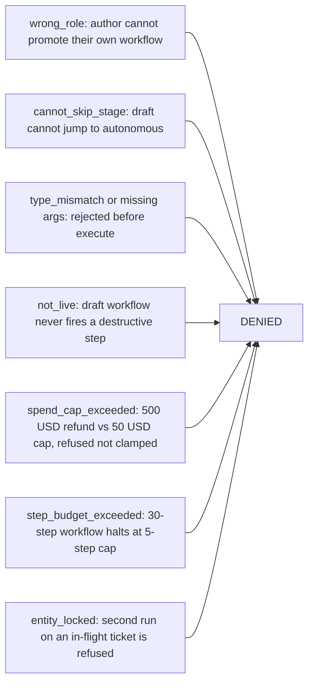

# Approvals, Spend Caps and Staged Rollout

> **Level** 🟡 Building Production Systems · **Module** 05 · **Doc** 5 of 7 · **Time** ~40 min
> **Prerequisites:** [Durability and Idempotency](04_Durability_And_Idempotency.md); Module 03 doc 5
> **Source material:** `3. AI_Engineer_Interview_Preparation/Enterprise Agentic Workflow Automation Platform/README.md` (guardrail rules, staged rollout); `docs/01-theory.md` §A.6–A.7, §B.4; `docs/03-src-modules-reference.md` (`guardrails.py`, `workflows.py`, `identity.py`)
> **Lab:** `project/scripts/demo_guardrail_failure.py` — the negative-control demo

## Why this matters

Layer 3: *is this user allowed to configure or run this, and did we ask a human when we should have?* This is where the "trust" in "the hard part is trust" is actually implemented. Two mechanisms: a **per-step guardrail decision** that runs on every step of every run, and a **staged rollout** that governs how a workflow earns the right to act at all. The project's three headline claims all live here:

1. A destructive action never executes without either an explicit human approval or an explicit per-tenant allow-list entry — even on a fully autonomous workflow.
2. A $500 refund against a $50 cap is refused outright, never silently clamped.
3. Nobody can promote their own workflow.

## The guardrail decision, in order

`authorize_step(workflow, run, step, tool, step_cost_usd, policy, approval=None)` returns a `Decision(allowed, rule, reason)`. Deny overrides:

| # | Rule | Denies when |
|---|---|---|
| 1 | `step_budget_exceeded` | The run has used its step allowance — the *tighter* of the workflow's `max_steps` and the tenant policy's |
| 2 | `spend_cap_exceeded` | This step's **real** cost (the actual refund amount, for a financial tool) would exceed the cap — again the tighter of workflow and tenant |
| 3 | `shadow_mode` | The workflow is in `SHADOW` — destructive steps never execute here, **unconditionally**, regardless of role or approval |
| 4 | `not_live` | The workflow has not been promoted to `LIVE` yet |
| 5 | `needs_human_approval` | Destructive, not allow-listed for autonomous use on this tenant, and no approver present |
| — | `autonomous_allowlisted` / `human_approved` | The two ways a destructive step is actually allowed to run |

Non-destructive steps pass through after the budget checks. Destructive steps must clear all five and then match one of the two allows.

### Step budget vs spend cap — two quantities, not two severities

The step budget counts *how many steps* a run has taken — a quantity limit that guards against a run looping forever, regardless of what each step costs. The spend cap counts *actual dollars* one step is about to spend — a money limit that guards against one costly action, regardless of how many steps came before. A run can trip one without touching the other: a long chain of cheap steps trips the step budget without approaching the spend cap; a single large refund trips the spend cap on step one having barely used any step budget.

Both **halt and escalate rather than loop**. A denied step pauses the run with a named reason; it does not retry, and it does not clamp the amount down to fit.

### Autonomous does not mean unlimited

A subtlety worth stating out loud: a destructive tool not explicitly allow-listed for autonomous execution still needs a human, *even on a fully autonomous workflow* — and the spend cap applies at every status, including autonomous. Autonomy raises the ceiling on *which* actions may skip approval; it never removes the ceiling itself. That is exactly why Cascade Robotics' $500 refund did not fire: the workflow was autonomous, but `issue_refund` was not on the tenant's allow-list, and $500 exceeded the $50 cap anyway.

### The tenant policy

```python
@dataclass
class GuardrailPolicy:
    spend_cap_usd: float
    max_steps: int
    allowed_destructive_tools_autonomous: List[str]
```

Per tenant. The workflow can be *tighter* than the policy but never looser — the guardrail takes the minimum of the two for budgets, and the allow-list is the tenant's alone.

## Staged rollout

`DRAFT → TESTING → SHADOW → LIVE → AUTONOMOUS`, one stage at a time, promoted only by an `approver` or `admin` — never by the workflow's own author.

| Stage | The one question it answers | What breaks if you skipped it |
|---|---|---|
| `DRAFT` | "Is this even wired correctly?" — right trigger, right condition, right tool, no typos | You would test your first idea against real customer messages |
| `TESTING` | "Does it behave correctly on realistic input?" — run against sample or historical data, off to the side | You would find out it is wrong only after it is already watching live traffic |
| `SHADOW` | "Does it decide correctly on *live* traffic?" — watches real events as they happen, decides what it *would* do, but every write is mocked | You would discover bad *decisions* on live traffic only after it had already refunded someone for real |
| `LIVE` | "Is a human still willing to vouch for each individual action?" — acts for real, but every destructive step needs a person to approve it before it fires | You would go straight from "looked fine in shadow" to acting alone, with nobody ever watching one real action first |
| `AUTONOMOUS` | "Has this earned the right to act without asking every time?" — same guardrails still apply; only the *default* flips from ask-first to act-first | Not skippable in the same sense — it is the destination, not a gate |

### Why four gates, specifically

Each stage exists to answer exactly one question, and removing any of them leaves that question unanswered until real customers find out the hard way.

**Why not fewer?** Collapse `TESTING` into `SHADOW` and you lose the difference between replaying old data (cheap, repeatable, no real-time pressure) and watching live traffic (the first time it sees today's actual weirdness). Collapse `SHADOW` into `LIVE` and you lose the ability to ever watch a workflow's *decisions* without also exposing customers to its *mistakes* — you would be debugging in production. Skip `LIVE`'s human approval and the very first time a human sees the workflow's real-world behaviour is also the first time nobody is watching it.

**Why not more?** Each extra stage is a stage someone has to remember to promote through. More stages without a distinct question behind them is process for its own sake — and the guardrail policy already scales risk *within* a stage, so there is no need to carve out extra stages for "a little more trusted".

One line for a whiteboard: **each stage removes exactly one kind of "we don't actually know yet" — first "is it wired right", then "does it decide right on realistic data", then "does it decide right on live data", then "will a human still catch a bad individual action" — and only once all four are answered does it earn the right to act alone.**

### How a non-technical user actually moves through it

None of this is code. It is a status a business user clicks through, one stage at a time: build or clone → `DRAFT`; "run against sample data" → `TESTING`; promote → `SHADOW`, where trust is built at zero risk by comparing what the workflow *would* have done against what a human did; promote → `LIVE`, where every destructive step pauses for "approve"; and only after a track record, promote → `AUTONOMOUS` for the specific actions pre-approved for it.

### Separation of duties

`promote(store, workflow_id, to_status, signer)` advances exactly one stage and denies two things: `wrong_role` — the author cannot promote their own work, and only an approver or admin can promote at all — and `cannot_skip_stage` — no jumping `DRAFT` straight to `LIVE`. The person iterating on the workflow and the person who says "this has earned the next level of trust" are always two different people. Same instinct as requiring a second reviewer, applied to rollout instead of code review. The identity file includes `u_author_wrong_hat`, a negative control proving an author cannot approve their own work regardless of how the request is framed.

## The negative-control demo

`scripts/demo_guardrail_failure.py` is the one to run in front of anyone who asks whether the guardrails are real. Every one of these is correctly denied:



A demo that shows things *working* proves less than a demo that shows things being *stopped*. Build the negative control for anything you claim is safe.

## In the code

| Concept | Where |
|---|---|
| The five rules and two allows | `guardrails.py` → `authorize_step` |
| Tenant policy | `guardrails.py` → `GuardrailPolicy` |
| Real cost for financial tools | `orchestrator.py` → `_step_cost` |
| Promotion, one stage, role-gated | `workflows.py` → `promote` |
| Stage order | `models.py` → `WorkflowStatus`, `STATUS_ORDER` |
| Roles and the negative-control principal | `identity.py` → `get_principal`, `u_author_wrong_hat` |
| Negative-control demo and tests | `scripts/demo_guardrail_failure.py`; `tests/test_platform.py` |

## Interview lens

> *"Every step goes through the same decision: budget, spend cap using the real dollar amount, shadow block, live check, then either an autonomous allow-list match or a role-checked human approval. Autonomous raises the ceiling on which actions skip approval — it never removes the cap. And the rollout is four gates, each answering one question, promoted only by someone who isn't the author."*

## Checkpoint

- List the five deny rules in order and the two allows.
- Why are the step budget and the spend cap different quantities? Give an example that trips each alone.
- Why did the $500 refund not fire on an autonomous workflow? Two reasons.
- For each of the four gates, name the question it answers and what skipping it costs.
- What two things does `promote()` deny, and why does `u_author_wrong_hat` exist?

**Next →** [Module Reference](06_Module_Reference.md)
