# Consolidated Quick Reference — Cross-Cutting System Design

> **Level** 🟠 Scale, Security, Operations · **Module** 06 · **Doc** 7 of 7 · **Time** reference — revise from it before a design round
> **Prerequisites:** docs 1–6 of this module
> **Source material:** `3. AI_Engineer_Interview_Preparation/Cross Cutting Preparation/Cross_Cutting_System_Design_Quick_Reference_v2.md` — kept as a reference artefact: the nine cross-cutting topics of this module condensed into templates, red flags and answer scripts. Read the teaching docs first; revise from this.

---

**Purpose:** Rapid review of key architectural patterns for multi-tenant AI platform interviews. Each section links to detailed docs for deeper preparation.

---

## 1. Real Identity: SSO/OIDC vs. Local User Tables

**The Core Insight:**
Production authentication isn't just "a bigger lookup table" — it's a **verification problem**. You're not asking "what are this user's attributes?" but rather "**is this token genuinely from the customer's IDP, still valid, and who does it represent?**"

### Why This Matters

- **Local user tables** work for demos, but break in multi-tenant SaaS where each customer brings their own identity provider (Okta, Azure AD, Google Workspace)
- **Role invention is a red flag:** If you're creating roles locally instead of mapping them from the customer's IDP, you've created an integration nightmare

### The Three Verification Steps

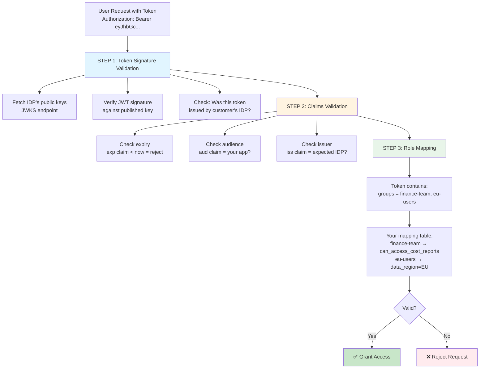
```mermaid
graph TD
    A[User Request with Token<br/>Authorization: Bearer eyJhbGc...] --> B[STEP 1: Token Signature Validation]
  
    B --> B1[Fetch IDP's public keys<br/>JWKS endpoint]
    B --> B2[Verify JWT signature<br/>against published key]
    B --> B3[Check: Was this token<br/>issued by customer's IDP?]
  
    B --> C[STEP 2: Claims Validation]
  
    C --> C1[Check expiry<br/>exp claim < now = reject]
    C --> C2[Check audience<br/>aud claim = your app?]
    C --> C3[Check issuer<br/>iss claim = expected IDP?]
  
    C --> D[STEP 3: Role Mapping]
  
    D --> D1[Token contains:<br/>groups = finance-team, eu-users]
    D1 --> D2[Your mapping table:<br/>finance-team → can_access_cost_reports<br/>eu-users → data_region=EU]
  
    D2 --> E{Valid?}
    E -->|Yes| F[✅ Grant Access]
    E -->|No| G[❌ Reject Request]
  
    style B fill:#e1f5ff
    style C fill:#fff4e1
    style D fill:#e8f5e9
    style G fill:#ffebee
    style F fill:#c8e6c9
```

### Token Structure Example

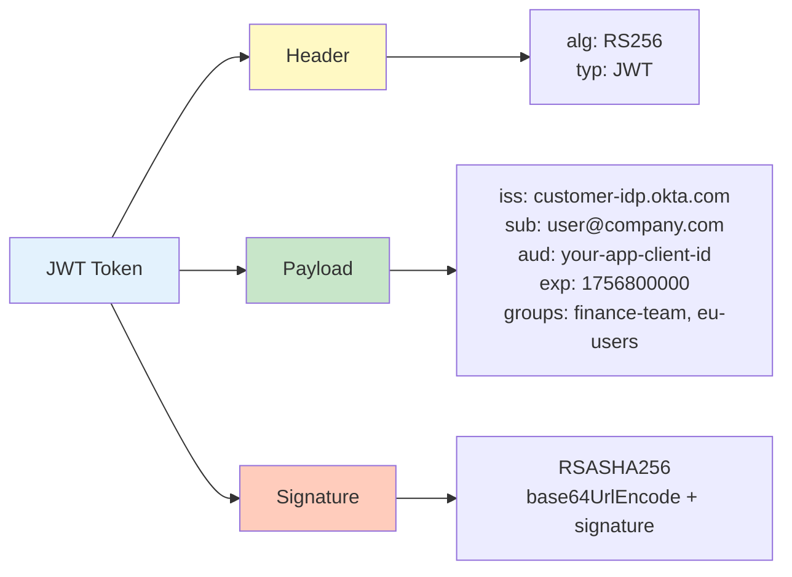
```mermaid
graph LR
    A[JWT Token] --> B[Header]
    A --> C[Payload]
    A --> D[Signature]
  
    B --> B1[alg: RS256<br/>typ: JWT]
    C --> C1[iss: customer-idp.okta.com<br/>sub: user@company.com<br/>aud: your-app-client-id<br/>exp: 1756800000<br/>groups: finance-team, eu-users]
    D --> D1[RSASHA256<br/>base64UrlEncode + signature]
  
    style A fill:#e3f2fd
    style B fill:#fff9c4
    style C fill:#c8e6c9
    style D fill:#ffccbc
```

### Interview Red Flags to Avoid

- ❌ "We'll store usernames and passwords in our database"
- ❌ "We'll create a 'roles' table and let admins assign roles in our UI"
- ✅ "We integrate via OIDC; roles come from customer's IDP groups"

### Interview Answer Template

> "We use OIDC for authentication. When a token arrives, we validate it in three steps: first, verify the JWT signature against the customer's IDP public keys; second, check claims—expiry, audience, issuer; third, map the IDP groups to our capabilities. We never invent roles locally. For example, if the token has `groups: ['finance-team']`, we map that to `can_access_cost_reports: true` in our authorization layer. This means each customer brings their own identity system—Okta, Azure AD, whatever they use—and we just validate and map."

**[Full details: 01-identity-secrets-and-tenant-fairness.md](https://www.genspark.ai/api/files/s/i9WZXxGX)**

---

## 2. Standard Tracing: OpenTelemetry vs. Bespoke Logs

**The Core Insight:**
A custom log format that captures every step is **good for debugging your system**. But if every customer needs a custom integration to view your traces in their monitoring tool (Datadog, Honeycomb, New Relic), you've created an **integration tax that doesn't scale**.

### Why Standards Matter

You're not building logs for yourself — you're building observability for customers who already have monitoring infrastructure. They want **one pane of glass** showing their requests flowing through their services AND your AI platform.

### OpenTelemetry Span Structure

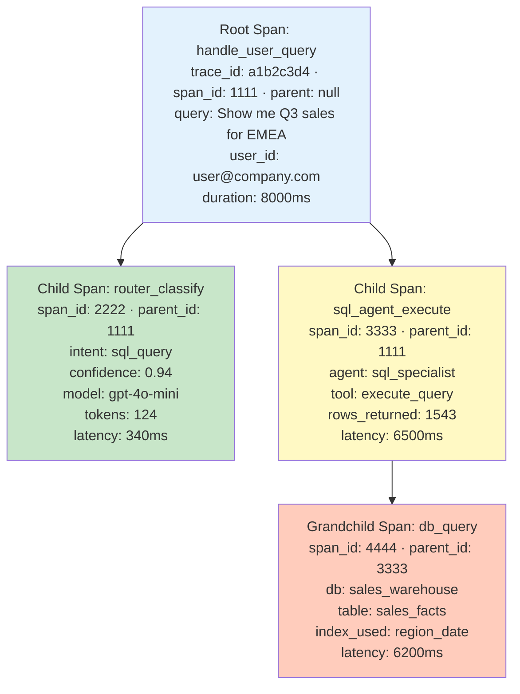
```mermaid
graph TD
    A["Root Span: handle_user_query<br/>trace_id: a1b2c3d4 · span_id: 1111 · parent: null<br/>query: Show me Q3 sales for EMEA<br/>user_id: user@company.com<br/>duration: 8000ms"] --> B["Child Span: router_classify<br/>span_id: 2222 · parent_id: 1111<br/>intent: sql_query<br/>confidence: 0.94<br/>model: gpt-4o-mini<br/>tokens: 124<br/>latency: 340ms"]

    A --> C["Child Span: sql_agent_execute<br/>span_id: 3333 · parent_id: 1111<br/>agent: sql_specialist<br/>tool: execute_query<br/>rows_returned: 1543<br/>latency: 6500ms"]

    C --> D["Grandchild Span: db_query<br/>span_id: 4444 · parent_id: 3333<br/>db: sales_warehouse<br/>table: sales_facts<br/>index_used: region_date<br/>latency: 6200ms"]

    style A fill:#e3f2fd
    style B fill:#c8e6c9
    style C fill:#fff9c4
    style D fill:#ffccbc
```

### What You Capture Per Span

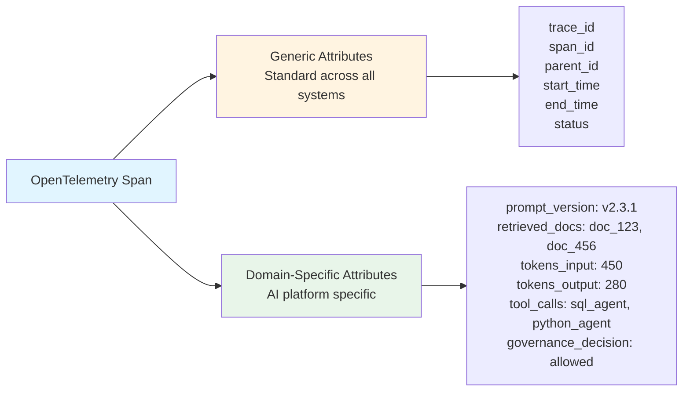
```mermaid
graph LR
    A[OpenTelemetry Span] --> B[Generic Attributes<br/>Standard across all systems]
    A --> C[Domain-Specific Attributes<br/>AI platform specific]
  
    B --> B1[trace_id<br/>span_id<br/>parent_id<br/>start_time<br/>end_time<br/>status]
  
    C --> C1[prompt_version: v2.3.1<br/>retrieved_docs: doc_123, doc_456<br/>tokens_input: 450<br/>tokens_output: 280<br/>tool_calls: sql_agent, python_agent<br/>governance_decision: allowed]
  
    style A fill:#e1f5ff
    style B fill:#fff4e1
    style C fill:#e8f5e9
```

### The Customer Integration Win

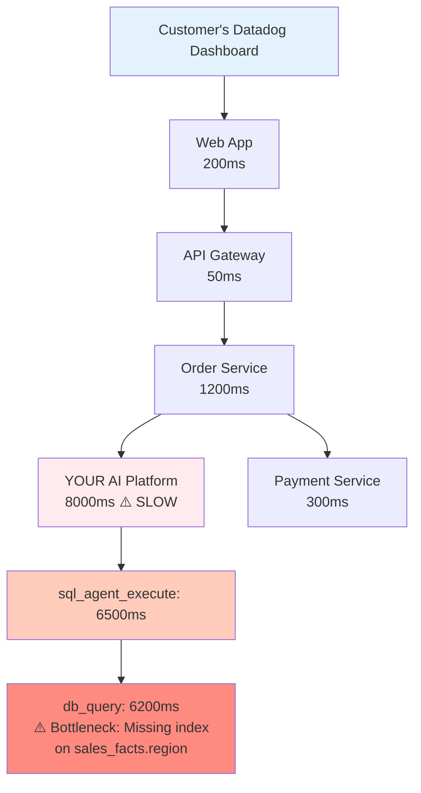
```mermaid
graph TD
    A[Customer's Datadog Dashboard] --> B[Web App<br/>200ms]
    B --> C[API Gateway<br/>50ms]
    C --> D[Order Service<br/>1200ms]
    D --> E[YOUR AI Platform<br/>8000ms ⚠️ SLOW]
    D --> F[Payment Service<br/>300ms]
  
    E --> E1[sql_agent_execute: 6500ms]
    E1 --> E2[db_query: 6200ms<br/>⚠️ Bottleneck: Missing index<br/>on sales_facts.region]
  
    style E fill:#ffebee
    style E1 fill:#ffccbc
    style E2 fill:#ff8a80
    style A fill:#e3f2fd
```

**Without OpenTelemetry:** Customer sees "8 second black box" — they have to contact your support to debug.
**With OpenTelemetry:** Customer's ops team sees the slow query, opens a ticket with your DB team, problem solved in one iteration.

### Interview Answer Template

> "We emit OpenTelemetry spans so customers can ingest our traces into their existing monitoring stack—Datadog, Honeycomb, whatever they already run. Each agent call, tool execution, and DB query gets its own span with parent-child relationships. We add domain-specific attributes like prompt version, retrieved doc IDs, and token counts. The customer gets end-to-end visibility from their UI to our AI backend without a custom integration."

**[Full details: 02-observability-standards-and-failure-patterns.md](https://www.genspark.ai/api/files/s/STEpq2X1)**

---

## 3. Semantic Caching: Beyond Exact-Match

**The Core Insight:**
Exact-match caching (keyed on the literal question string) treats **"What's your refund policy?"** and **"How do I get a refund?"** as two different cache keys, even though they ask the same thing. You recompute the answer from scratch, wasting tokens and adding latency. **Semantic caching** embeds the question, checks similarity against previously cached questions, and serves the prior answer if they're close enough.

### The Exact-Match Problem

```mermaid
graph TD
    A[Cache State] --> A1["Key: What is your return policy?<br/>Value: You can return items within 30 days...<br/>Computed: 2026-09-01 09:45:00"]
  
    B[Incoming Query:<br/>How do I return a product?] --> C{Exact Match Check}
  
    C -->|String comparison| D[How do I return a product?<br/>≠<br/>What is your return policy?]
  
    D --> E[❌ CACHE MISS]
    E --> F[Recompute Answer<br/>1200 tokens | $0.024 | 3.2s]
  
    style E fill:#ffebee
    style F fill:#ffccbc
```

### Semantic Caching Architecture

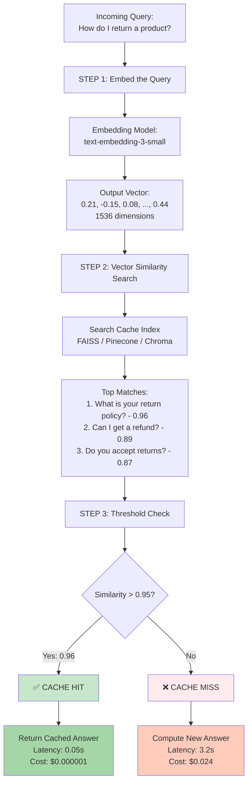
```mermaid
graph TD
    A[Incoming Query:<br/>How do I return a product?] --> B[STEP 1: Embed the Query]
  
    B --> B1[Embedding Model:<br/>text-embedding-3-small]
    B1 --> B2[Output Vector:<br/>0.21, -0.15, 0.08, ..., 0.44<br/>1536 dimensions]
  
    B2 --> C[STEP 2: Vector Similarity Search]
  
    C --> C1[Search Cache Index<br/>FAISS / Pinecone / Chroma]
    C1 --> C2[Top Matches:<br/>1. What is your return policy? - 0.96<br/>2. Can I get a refund? - 0.89<br/>3. Do you accept returns? - 0.87]
  
    C2 --> D[STEP 3: Threshold Check]
  
    D --> D1{Similarity > 0.95?}
    D1 -->|Yes: 0.96| E[✅ CACHE HIT]
    D1 -->|No| F[❌ CACHE MISS]
  
    E --> G[Return Cached Answer<br/>Latency: 0.05s<br/>Cost: $0.000001]
    F --> H[Compute New Answer<br/>Latency: 3.2s<br/>Cost: $0.024]
  
    style E fill:#c8e6c9
    style G fill:#a5d6a7
    style F fill:#ffebee
    style H fill:#ffccbc
```

### The Correctness Risk (Why This Isn't Trivial)

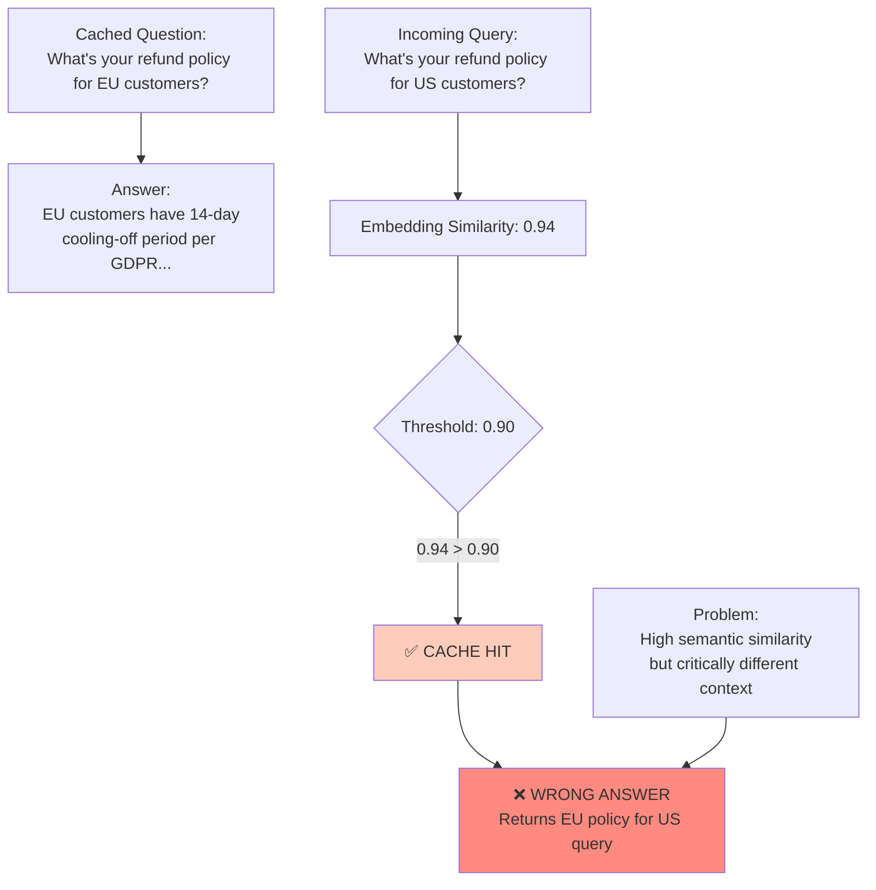
```mermaid
graph TD
    A[Cached Question:<br/>What's your refund policy for EU customers?] --> A1[Answer:<br/>EU customers have 14-day<br/>cooling-off period per GDPR...]
  
    B[Incoming Query:<br/>What's your refund policy for US customers?] --> C[Embedding Similarity: 0.94]
  
    C --> D{Threshold: 0.90}
    D -->|0.94 > 0.90| E[✅ CACHE HIT]
  
    E --> F[❌ WRONG ANSWER<br/>Returns EU policy for US query]
  
    style F fill:#ff8a80
    style E fill:#ffccbc
  
    G[Problem:<br/>High semantic similarity<br/>but critically different context] --> F
```

### Mitigation Strategies

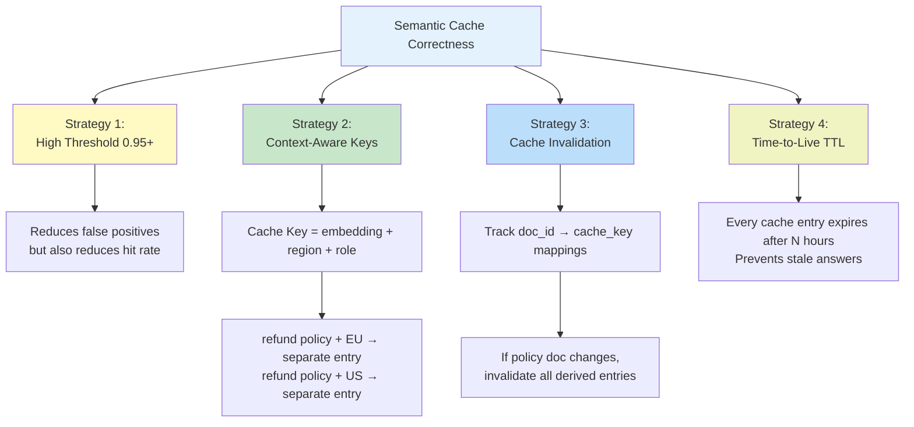
```mermaid
graph TD
    A[Semantic Cache Correctness] --> B[Strategy 1:<br/>High Threshold 0.95+]
    A --> C[Strategy 2:<br/>Context-Aware Keys]
    A --> D[Strategy 3:<br/>Cache Invalidation]
    A --> E[Strategy 4:<br/>Time-to-Live TTL]
  
    B --> B1[Reduces false positives<br/>but also reduces hit rate]
  
    C --> C1[Cache Key = embedding + region + role]
    C1 --> C2[refund policy + EU → separate entry<br/>refund policy + US → separate entry]
  
    D --> D1[Track doc_id → cache_key mappings]
    D1 --> D2[If policy doc changes,<br/>invalidate all derived entries]
  
    E --> E1[Every cache entry expires after N hours<br/>Prevents stale answers]
  
    style A fill:#e3f2fd
    style B fill:#fff9c4
    style C fill:#c8e6c9
    style D fill:#bbdefb
    style E fill:#f0f4c3
```

### When to Use Semantic Caching

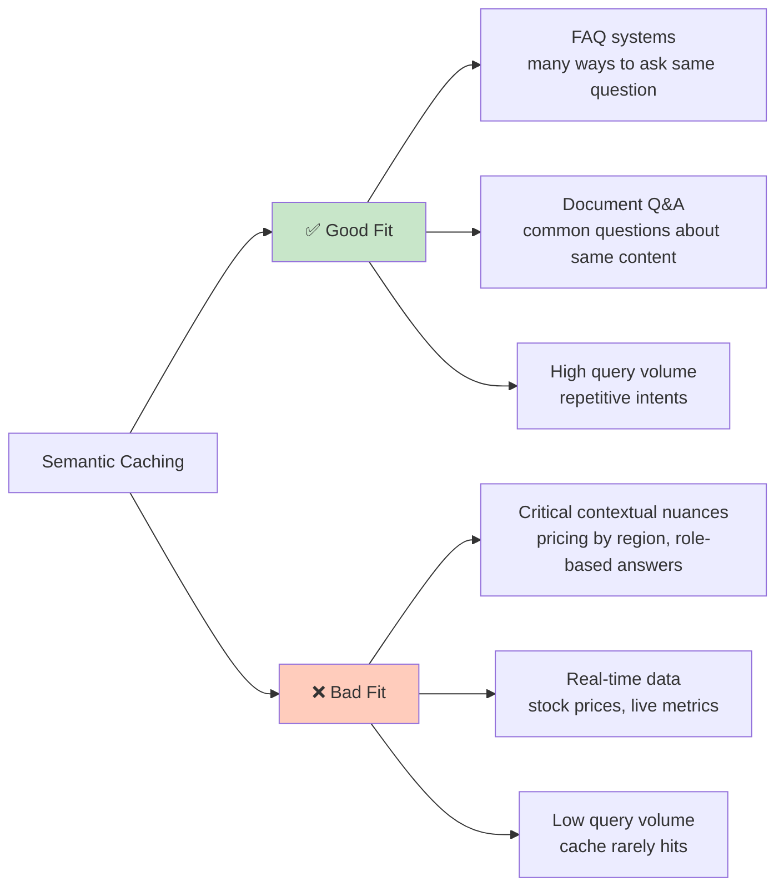
```mermaid
graph LR
    A[Semantic Caching] --> B[✅ Good Fit]
    A --> C[❌ Bad Fit]
  
    B --> B1[FAQ systems<br/>many ways to ask same question]
    B --> B2[Document Q&A<br/>common questions about same content]
    B --> B3[High query volume<br/>repetitive intents]
  
    C --> C1[Critical contextual nuances<br/>pricing by region, role-based answers]
    C --> C2[Real-time data<br/>stock prices, live metrics]
    C --> C3[Low query volume<br/>cache rarely hits]
  
    style B fill:#c8e6c9
    style C fill:#ffccbc
```

### Interview Answer Template

> "We use semantic caching: embed the incoming query, check similarity against cached questions' embeddings via vector search, serve the cached answer if similarity exceeds 0.95. This catches synonymous queries that exact-match misses—like 'refund policy' vs. 'return policy'—and cuts latency from 3 seconds to 50ms. The risk is false positives: two similar questions needing different answers. We mitigate with high thresholds, context-aware cache keys (region, role), and TTL-based invalidation. We also track cache hit rate and false positive rate as metrics—if false positives spike, we raise the threshold."

**[Full details: 03-cost-latency-cicd-rigor-and-build-vs-buy.md](https://www.genspark.ai/api/files/s/F8JShs7i)**

---

## 4. AgentOps on Databricks: Prompt Versioning, Canary Rollout, Drift Detection

**The Core Insight:**
Saying "we version our prompts in Git" is table stakes. Production AI systems need **prompt as deployable artifact**: version it, test it, roll it out to 5% of traffic, measure success rate, and rollback automatically if it degrades. This is MLOps for prompts, not just source control.

### Why This Matters

- A prompt change can silently break 30% of queries without raising an error
- You need the same rigor for prompt deployments as you do for code deployments: canary rollout, A/B testing, automated rollback
- **Databricks gives you the primitives to do this for real, not theoretically**

### Prompt Lifecycle on Databricks

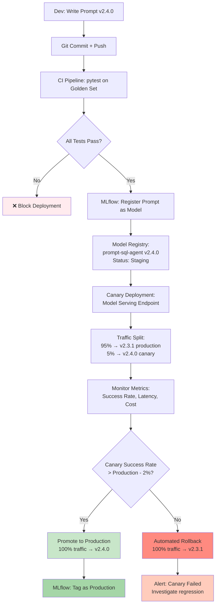
```mermaid
graph TD
    A[Dev: Write Prompt v2.4.0] --> B[Git Commit + Push]
    B --> C[CI Pipeline: pytest on Golden Set]
  
    C --> D{All Tests Pass?}
    D -->|No| E[❌ Block Deployment]
    D -->|Yes| F[MLflow: Register Prompt as Model]
  
    F --> F1[Model Registry:<br/>prompt-sql-agent v2.4.0<br/>Status: Staging]
  
    F1 --> G[Canary Deployment:<br/>Model Serving Endpoint]
  
    G --> G1[Traffic Split:<br/>95% → v2.3.1 production<br/>5% → v2.4.0 canary]
  
    G1 --> H[Monitor Metrics:<br/>Success Rate, Latency, Cost]
  
    H --> I{Canary Success Rate<br/>> Production - 2%?}
  
    I -->|Yes| J[Promote to Production<br/>100% traffic → v2.4.0]
    I -->|No| K[Automated Rollback<br/>100% traffic → v2.3.1]
  
    J --> L[MLflow: Tag as Production]
    K --> M[Alert: Canary Failed<br/>Investigate regression]
  
    style E fill:#ffebee
    style K fill:#ff8a80
    style M fill:#ffccbc
    style J fill:#c8e6c9
    style L fill:#a5d6a7
```

### Databricks Primitives Mapping

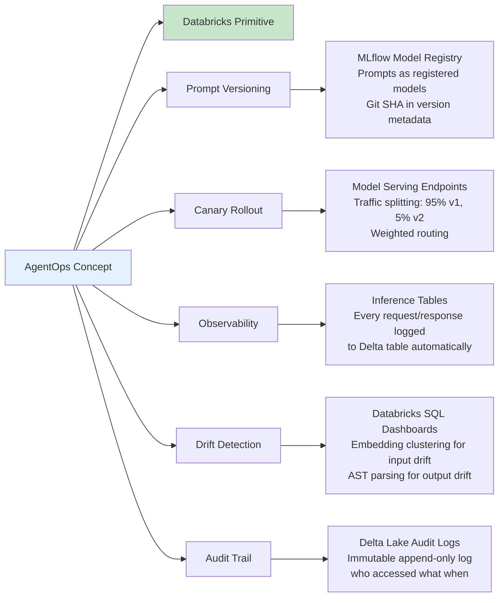
```mermaid
graph LR
    A[AgentOps Concept] --> B[Databricks Primitive]
  
    A --> A1[Prompt Versioning]
    A --> A2[Canary Rollout]
    A --> A3[Observability]
    A --> A4[Drift Detection]
    A --> A5[Audit Trail]
  
    A1 --> B1[MLflow Model Registry<br/>Prompts as registered models<br/>Git SHA in version metadata]
  
    A2 --> B2[Model Serving Endpoints<br/>Traffic splitting: 95% v1, 5% v2<br/>Weighted routing]
  
    A3 --> B3[Inference Tables<br/>Every request/response logged<br/>to Delta table automatically]
  
    A4 --> B4[Databricks SQL Dashboards<br/>Embedding clustering for input drift<br/>AST parsing for output drift]
  
    A5 --> B5[Delta Lake Audit Logs<br/>Immutable append-only log<br/>who accessed what when]
  
    style A fill:#e3f2fd
    style B fill:#c8e6c9
```

### Metrics Dashboard Example

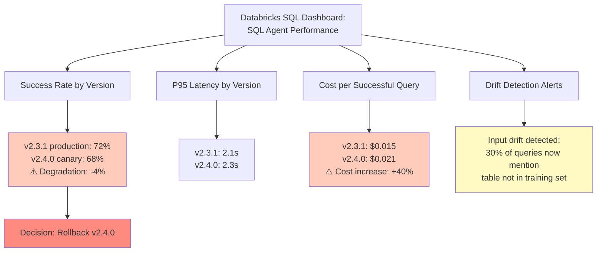
```mermaid
graph TD
    A[Databricks SQL Dashboard:<br/>SQL Agent Performance] --> B[Success Rate by Version]
    A --> C[P95 Latency by Version]
    A --> D[Cost per Successful Query]
    A --> E[Drift Detection Alerts]
  
    B --> B1[v2.3.1 production: 72%<br/>v2.4.0 canary: 68%<br/>⚠️ Degradation: -4%]
  
    C --> C1[v2.3.1: 2.1s<br/>v2.4.0: 2.3s]
  
    D --> D1[v2.3.1: $0.015<br/>v2.4.0: $0.021<br/>⚠️ Cost increase: +40%]
  
    E --> E1[Input drift detected:<br/>30% of queries now mention<br/>table not in training set]
  
    B1 --> F[Decision: Rollback v2.4.0]
  
    style B1 fill:#ffccbc
    style D1 fill:#ffccbc
    style E1 fill:#fff9c4
    style F fill:#ff8a80
```

### Drift Detection Deep Dive

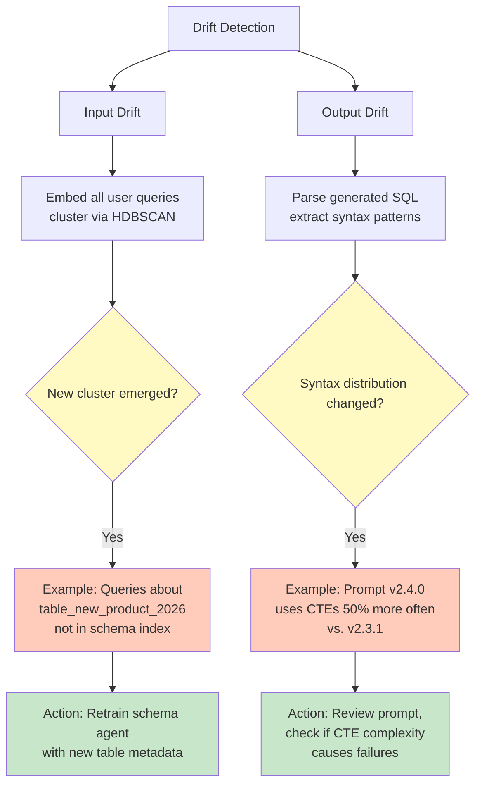
```mermaid
graph TD
    A[Drift Detection] --> B[Input Drift]
    A --> C[Output Drift]
  
    B --> B1[Embed all user queries<br/>cluster via HDBSCAN]
    B1 --> B2{New cluster emerged?}
    B2 -->|Yes| B3[Example: Queries about<br/>table_new_product_2026<br/>not in schema index]
    B3 --> B4[Action: Retrain schema agent<br/>with new table metadata]
  
    C --> C1[Parse generated SQL<br/>extract syntax patterns]
    C1 --> C2{Syntax distribution changed?}
    C2 -->|Yes| C3[Example: Prompt v2.4.0<br/>uses CTEs 50% more often<br/>vs. v2.3.1]
    C3 --> C4[Action: Review prompt,<br/>check if CTE complexity<br/>causes failures]
  
    style B2 fill:#fff9c4
    style B3 fill:#ffccbc
    style B4 fill:#c8e6c9
    style C2 fill:#fff9c4
    style C3 fill:#ffccbc
    style C4 fill:#c8e6c9
```

### Interview Answer Template

> "We treat prompts as deployable artifacts in MLflow Model Registry. Each version is Git-tracked with a SHA, and we run regression tests on a golden set before deployment. Canary rollout: we use Model Serving endpoints to route 5% of traffic to the new version, monitor success rate and latency in Databricks SQL dashboards. If the canary degrades by more than 2%, we automatically roll back to the previous version. For drift detection, we embed all queries, cluster them, and alert if a new cluster emerges—that means users are asking about something outside our training set, so we retrain the schema agent. All requests go to inference tables, giving us an immutable audit trail for compliance."

**[Full details: 04-agentops-on-databricks.md](https://www.genspark.ai/api/files/s/N8IDF7MT)**

---

## 5. Guarding Tool Calls: The 8-Step Guard Pipeline

**The Core Insight:**
A model deciding to call a tool is a **proposal, never an authorization**. The model can suggest `delete_user(user_id="admin")` — something else has to decide whether it's actually allowed, whether it needs retry-with-fallback, and whether to log it for audit.

### Why This Matters

- LLMs hallucinate tool arguments (malformed IDs, non-existent fields)
- LLMs can propose destructive actions without understanding consequences
- LLMs retry the same failing call in a loop without fallback logic
- **You need a guard pipeline between "model proposes tool call" and "tool executes"**

### The 8-Step Guard Pipeline

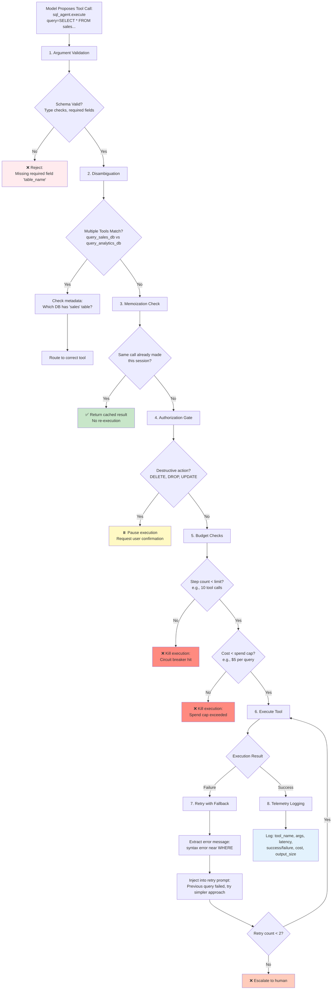
```mermaid
graph TD
    A[Model Proposes Tool Call:<br/>sql_agent.execute<br/>query=SELECT * FROM sales...] --> B[1. Argument Validation]
  
    B --> B1{Schema Valid?<br/>Type checks, required fields}
    B1 -->|No| B2[❌ Reject:<br/>Missing required field 'table_name']
    B1 -->|Yes| C[2. Disambiguation]
  
    C --> C1{Multiple Tools Match?<br/>query_sales_db vs query_analytics_db}
    C1 -->|Yes| C2[Check metadata:<br/>Which DB has 'sales' table?]
    C2 --> C3[Route to correct tool]
    C1 -->|No| D[3. Memoization Check]
  
    D --> D1{Same call already made<br/>this session?}
    D1 -->|Yes| D2[✅ Return cached result<br/>No re-execution]
    D1 -->|No| E[4. Authorization Gate]
  
    E --> E1{Destructive action?<br/>DELETE, DROP, UPDATE}
    E1 -->|Yes| E2[⏸️ Pause execution<br/>Request user confirmation]
    E1 -->|No| F[5. Budget Checks]
  
    F --> F1{Step count < limit?<br/>e.g., 10 tool calls}
    F1 -->|No| F2[❌ Kill execution:<br/>Circuit breaker hit]
    F1 -->|Yes| F3{Cost < spend cap?<br/>e.g., $5 per query}
    F3 -->|No| F4[❌ Kill execution:<br/>Spend cap exceeded]
    F3 -->|Yes| G[6. Execute Tool]
  
    G --> H{Execution Result}
    H -->|Success| I[8. Telemetry Logging]
    H -->|Failure| J[7. Retry with Fallback]
  
    J --> J1[Extract error message:<br/>syntax error near WHERE]
    J1 --> J2[Inject into retry prompt:<br/>Previous query failed, try simpler approach]
    J2 --> J3{Retry count < 2?}
    J3 -->|Yes| G
    J3 -->|No| J4[❌ Escalate to human]
  
    I --> K[Log: tool_name, args, latency,<br/>success/failure, cost, output_size]
  
    style B2 fill:#ffebee
    style D2 fill:#c8e6c9
    style E2 fill:#fff9c4
    style F2 fill:#ff8a80
    style F4 fill:#ff8a80
    style J4 fill:#ffccbc
    style K fill:#e3f2fd
```

### Example: Argument Validation Failure

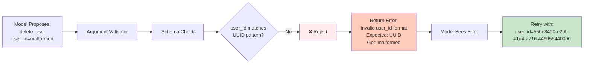
```mermaid
graph LR
    A[Model Proposes:<br/>delete_user<br/>user_id=malformed] --> B[Argument Validator]
  
    B --> B1[Schema Check]
    B1 --> B2{user_id matches<br/>UUID pattern?}
    B2 -->|No| C[❌ Reject]
  
    C --> D[Return Error:<br/>Invalid user_id format<br/>Expected: UUID<br/>Got: malformed]
  
    D --> E[Model Sees Error]
    E --> F[Retry with:<br/>user_id=550e8400-e29b-41d4-a716-446655440000]
  
    style C fill:#ffebee
    style D fill:#ffccbc
    style F fill:#c8e6c9
```

### Example: Step Budget Circuit Breaker

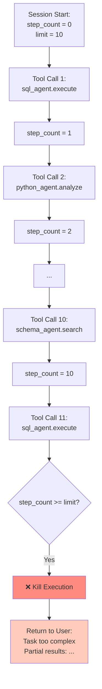
```mermaid
graph TD
    A[Session Start:<br/>step_count = 0<br/>limit = 10] --> B[Tool Call 1:<br/>sql_agent.execute]
    B --> C[step_count = 1]
  
    C --> D[Tool Call 2:<br/>python_agent.analyze]
    D --> E[step_count = 2]
  
    E --> F[...]
    F --> G[Tool Call 10:<br/>schema_agent.search]
    G --> H[step_count = 10]
  
    H --> I[Tool Call 11:<br/>sql_agent.execute]
    I --> J{step_count >= limit?}
  
    J -->|Yes| K[❌ Kill Execution]
    K --> L[Return to User:<br/>Task too complex<br/>Partial results: ...]
  
    style K fill:#ff8a80
    style L fill:#ffccbc
```

### Memoization Example

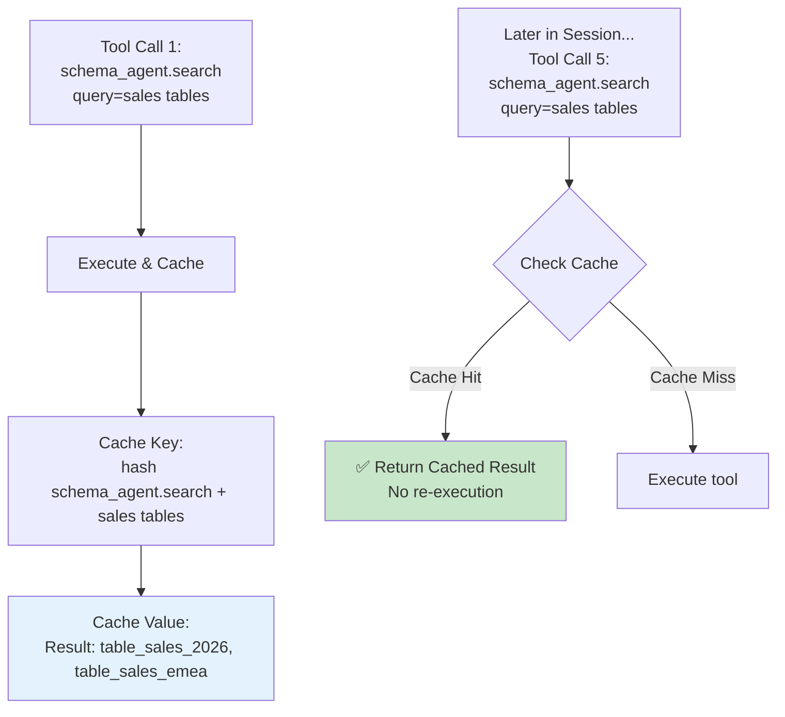
```mermaid
graph TD
    A[Tool Call 1:<br/>schema_agent.search<br/>query=sales tables] --> B[Execute & Cache]
    B --> C[Cache Key:<br/>hash schema_agent.search + sales tables]
    C --> D[Cache Value:<br/>Result: table_sales_2026, table_sales_emea]
  
    E[Later in Session...<br/>Tool Call 5:<br/>schema_agent.search<br/>query=sales tables] --> F{Check Cache}
  
    F -->|Cache Hit| G[✅ Return Cached Result<br/>No re-execution]
    F -->|Cache Miss| H[Execute tool]
  
    style G fill:#c8e6c9
    style D fill:#e3f2fd
```

### Per-Call Telemetry Schema

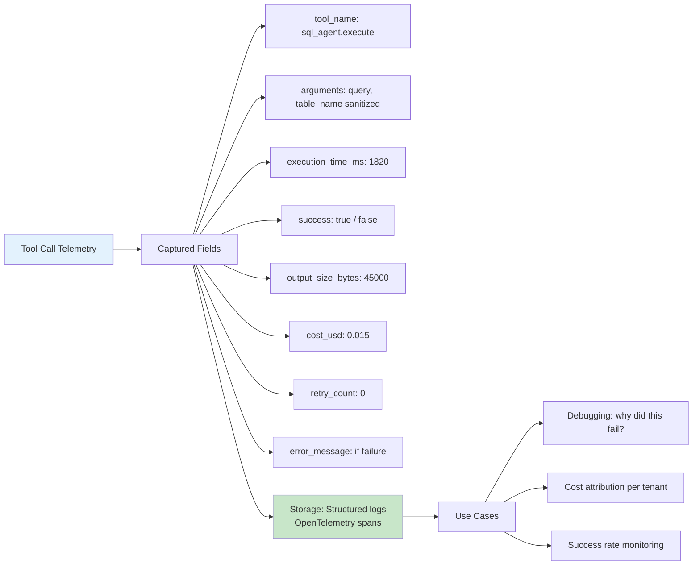
```mermaid
graph LR
    A[Tool Call Telemetry] --> B[Captured Fields]
  
    B --> B1[tool_name: sql_agent.execute]
    B --> B2[arguments: query, table_name sanitized]
    B --> B3[execution_time_ms: 1820]
    B --> B4[success: true / false]
    B --> B5[output_size_bytes: 45000]
    B --> B6[cost_usd: 0.015]
    B --> B7[retry_count: 0]
    B --> B8[error_message: if failure]
  
    B --> C[Storage: Structured logs<br/>OpenTelemetry spans]
  
    C --> D[Use Cases]
    D --> D1[Debugging: why did this fail?]
    D --> D2[Cost attribution per tenant]
    D --> D3[Success rate monitoring]
  
    style A fill:#e3f2fd
    style C fill:#c8e6c9
```

### Interview Answer Template

> "We treat every model-proposed tool call as a proposal, not authorization. It goes through an 8-step guard pipeline: argument validation checks schema and business rules; disambiguation picks the right tool if multiple match; memoization returns cached results for duplicate calls; authorization gates destructive actions for user confirmation; budget checks enforce step count and spend caps; then we execute. On failure, retry-with-fallback injects the error into a retry prompt with simpler instructions, max 2 retries. Every call logs telemetry—tool name, args, latency, success, cost—for debugging and monitoring. This prevents runaway loops, invalid executions, and untracked spend."

**[Full details: 05-guarding-tool-calls.md](https://www.genspark.ai/api/files/s/JGn3UwmS)**

---

## 6. Fair Resource Sharing: Per-Tenant Limits & Spend Caps

**The Core Insight:**
Multi-tenant SaaS isn't just "multiple customers using the same app"—it's **shared infrastructure where one tenant's expensive query can starve everyone else**. Without per-tenant resource limits, a single customer running a 10-minute query with 1M token context blocks other customers' requests.

### Why This Matters

- **The noisy neighbor problem:** Tenant A submits a heavy workload → consumes all available resources → Tenant B's requests time out or queue indefinitely
- **Cost attribution:** Without per-tenant tracking, you can't identify which customer is driving your cloud bill
- **Fair queuing:** Tenants should get proportional access to resources, not first-come-first-served

### Fair Sharing Architecture

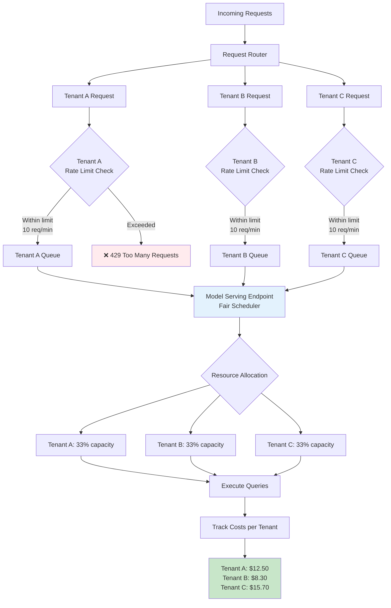
```mermaid
graph TD
    A[Incoming Requests] --> B[Request Router]
  
    B --> C[Tenant A Request]
    B --> D[Tenant B Request]
    B --> E[Tenant C Request]
  
    C --> F{Tenant A<br/>Rate Limit Check}
    F -->|Within limit<br/>10 req/min| G[Tenant A Queue]
    F -->|Exceeded| H[❌ 429 Too Many Requests]
  
    D --> I{Tenant B<br/>Rate Limit Check}
    I -->|Within limit<br/>10 req/min| J[Tenant B Queue]
  
    E --> K{Tenant C<br/>Rate Limit Check}
    K -->|Within limit<br/>10 req/min| L[Tenant C Queue]
  
    G --> M[Model Serving Endpoint<br/>Fair Scheduler]
    J --> M
    L --> M
  
    M --> N{Resource Allocation}
    N --> O[Tenant A: 33% capacity]
    N --> P[Tenant B: 33% capacity]
    N --> Q[Tenant C: 33% capacity]
  
    O --> R[Execute Queries]
    P --> R
    Q --> R
  
    R --> S[Track Costs per Tenant]
    S --> T[Tenant A: $12.50<br/>Tenant B: $8.30<br/>Tenant C: $15.70]
  
    style H fill:#ffebee
    style M fill:#e3f2fd
    style T fill:#c8e6c9
```

### Rate Limiting Strategies

```mermaid
graph LR
    A[Rate Limiting] --> B[Per-Tenant Quotas]
    A --> C[Circuit Breakers]
    A --> D[Query Timeout]
  
    B --> B1[Free Tier:<br/>10 requests/min<br/>1000 tokens/request]
    B --> B2[Pro Tier:<br/>100 requests/min<br/>10000 tokens/request]
    B --> B3[Enterprise:<br/>Custom limits]
  
    C --> C1[If tenant exceeds<br/>error rate threshold<br/>e.g., 50% failures]
    C1 --> C2[Open circuit:<br/>block requests for 60s<br/>return cached error]
    C2 --> C3[After cooldown,<br/>close circuit, allow traffic]
  
    D --> D1[Max execution time:<br/>30s per query]
    D1 --> D2[If exceeded:<br/>kill query, return partial results]
  
    style A fill:#e3f2fd
    style B1 fill:#fff9c4
    style B2 fill:#c8e6c9
    style B3 fill:#bbdefb
    style C2 fill:#ffccbc
```

### Cost Attribution & Spend Caps

```mermaid
graph TD
    A[Query Execution] --> B[Track Costs]
  
    B --> C[Input Tokens: 450<br/>Output Tokens: 280<br/>Model: gpt-4o<br/>Cost: $0.0195]
  
    C --> D[Aggregate by Tenant]
  
    D --> E[Tenant A Daily Spend:<br/>$12.50 / $50.00 cap]
    D --> F[Tenant B Daily Spend:<br/>$48.90 / $50.00 cap ⚠️]
    D --> G[Tenant C Daily Spend:<br/>$52.10 / $50.00 cap ❌]
  
    F --> H{Approaching Cap?<br/>Spend > 90% of limit}
    H -->|Yes| I[Alert: Tenant B<br/>You've used 97% of daily quota]
  
    G --> J{Exceeded Cap?<br/>Spend > 100% of limit}
    J -->|Yes| K[❌ Block New Requests<br/>Return: Quota exceeded<br/>Resets at midnight UTC]
  
    E --> L[Continue Normally]
  
    style F fill:#fff9c4
    style G fill:#ffebee
    style I fill:#ffccbc
    style K fill:#ff8a80
    style L fill:#c8e6c9
```

### Databricks Implementation

```mermaid
graph LR
    A[Fair Sharing on Databricks] --> B[Model Serving Quotas]
    A --> C[Unity Catalog ACLs]
    A --> D[Inference Table Cost Tags]
  
    B --> B1[Per-endpoint rate limits<br/>queries per second QPS]
    B --> B2[Per-tenant routing tags<br/>route to dedicated pools]
  
    C --> C1[Row-level security<br/>Tenant A sees only their data]
    C --> C2[Dynamic views with<br/>is_account_group_member]
  
    D --> D1[Every request tagged:<br/>tenant_id, cost, tokens]
    D1 --> D2[Delta table aggregation:<br/>SELECT tenant_id, SUM cost<br/>GROUP BY tenant_id, date]
  
    style A fill:#e3f2fd
    style B fill:#c8e6c9
    style C fill:#fff9c4
    style D fill:#bbdefb
```

### Interview Answer Template

> "We enforce fair resource sharing with per-tenant rate limits, spend caps, and circuit breakers. Each tenant gets a quota—free tier gets 10 requests per minute, pro tier gets 100. We use Model Serving endpoint quotas on Databricks to enforce this. Every request logs cost attribution to inference tables, aggregated daily by tenant. If a tenant approaches 90% of their spend cap, we alert them; if they exceed 100%, we block new requests until reset. Circuit breakers kick in if a tenant's error rate exceeds 50%—we open the circuit, block their traffic for 60 seconds, then retry. This prevents one tenant's runaway query from starving everyone else."

**[Full details: 01-identity-secrets-and-tenant-fairness.md](https://www.genspark.ai/api/files/s/i9WZXxGX)**

---

## 7. Failure Pattern Detection: Hallucination Drift, Retrieval Degradation

**The Core Insight:**
AI systems fail differently than traditional software. A web service returns 500 errors you can catch; an LLM confidently returns **plausible-sounding garbage** that passes all your schema checks but is factually wrong. You need drift detection, not just error rate monitoring.

### Why This Matters

- **Silent degradation:** Success rate stays at 95%, but quality has dropped—users report "answers are getting worse"
- **Hallucination drift:** Model outputs diverge from retrieved context over time (new model version, prompt change, or data shift)
- **Retrieval degradation:** Relevant documents exist but aren't surfaced anymore (index staleness, query distribution shift)

### Failure Patterns

```mermaid
graph TD
    A[AI System Failure Patterns] --> B[Hallucination Drift]
    A --> C[Retrieval Degradation]
    A --> D[Cost Spike Patterns]
    A --> E[Silent Errors]
  
    B --> B1[Symptom:<br/>Output diverges from retrieved docs]
    B1 --> B2[Detection:<br/>Semantic similarity score<br/>between output and context<br/>drops over time]
    B2 --> B3[Action:<br/>Rollback prompt version<br/>or retrain model]
  
    C --> C1[Symptom:<br/>Relevant docs exist<br/>but aren't retrieved]
    C1 --> C2[Detection:<br/>Hit rate declining<br/>e.g., 80% → 60%]
    C2 --> C3[Action:<br/>Re-index documents<br/>update embedding model]
  
    D --> D1[Symptom:<br/>Token usage spikes<br/>without query volume increase]
    D1 --> D2[Detection:<br/>Avg tokens per query<br/>450 → 1200]
    D2 --> D3[Action:<br/>Check for prompt bloat<br/>retrieval over-fetching]
  
    E --> E1[Symptom:<br/>LLM returns I don't know<br/>instead of failing loudly]
    E1 --> E2[Detection:<br/>Parse responses for<br/>I don't know patterns]
    E2 --> E3[Action:<br/>Log as capability gap<br/>route to human]
  
    style B3 fill:#ffccbc
    style C3 fill:#fff9c4
    style D3 fill:#ffccbc
    style E3 fill:#c8e6c9
```

### Hallucination Drift Detection

```mermaid
graph TD
    A[Request: Q3 sales for EMEA] --> B[Retrieve Context]
  
    B --> C[Retrieved Docs:<br/>Q3 EMEA sales: $12.5M<br/>Growth: +8% YoY]
  
    C --> D[LLM Generation]
  
    D --> E[Generated Output:<br/>Q3 EMEA sales were $12.5M<br/>representing 8% growth...]
  
    E --> F[Semantic Similarity Check]
  
    F --> G[Embed Retrieved Context<br/>Embed Generated Output]
    G --> H[Cosine Similarity: 0.92]
  
    H --> I{Similarity > 0.85?}
    I -->|Yes| J[✅ Grounded Answer]
    I -->|No| K[⚠️ Hallucination Detected]
  
    K --> L[Log Warning:<br/>Output diverged from context<br/>Check prompt version]
  
    M[Track Over Time] --> N[Week 1: Avg similarity 0.91<br/>Week 2: Avg similarity 0.88<br/>Week 3: Avg similarity 0.82 ⚠️]
  
    N --> O[Alert: Hallucination drift<br/>Action: Rollback to previous prompt]
  
    style J fill:#c8e6c9
    style K fill:#ffccbc
    style L fill:#fff9c4
    style O fill:#ff8a80
```

### Retrieval Degradation Detection

```mermaid
graph TD
    A[User Queries] --> B[Retrieval System]
  
    B --> C[Vector Search:<br/>Top 5 documents]
  
    C --> D{Relevant Docs<br/>in Top 5?}
  
    D -->|Yes| E[Hit]
    D -->|No| F[Miss]
  
    E --> G[Hit Rate Tracking]
    F --> G
  
    G --> H[Week 1: 85% hit rate]
    H --> I[Week 2: 78% hit rate]
    I --> J[Week 3: 65% hit rate ⚠️]
  
    J --> K{Hit Rate < 70%?}
    K -->|Yes| L[Alert: Retrieval Degradation]
  
    L --> M[Root Cause Analysis]
    M --> N[Hypothesis 1:<br/>Index staleness<br/>New docs not indexed]
    M --> O[Hypothesis 2:<br/>Query distribution shift<br/>Users asking about new topics]
    M --> P[Hypothesis 3:<br/>Embedding model drift<br/>Queries + docs use different embeddings]
  
    N --> Q[Action: Re-index documents]
    O --> R[Action: Retrain schema agent<br/>with new query patterns]
    P --> S[Action: Update embedding model<br/>re-embed corpus]
  
    style J fill:#ffccbc
    style L fill:#ff8a80
    style Q fill:#c8e6c9
    style R fill:#c8e6c9
    style S fill:#c8e6c9
```

### Cost Spike Pattern Detection

```mermaid
graph TD
    A[Cost Monitoring] --> B[Track Metrics]
  
    B --> C[Total Cost per Day]
    B --> D[Avg Tokens per Query]
    B --> E[Query Volume]
  
    C --> F[Day 1: $120]
    F --> G[Day 2: $135]
    G --> H[Day 3: $280 ⚠️]
  
    H --> I{Cost Spike?<br/>+50% vs. baseline}
    I -->|Yes| J[Root Cause Analysis]
  
    D --> K[Day 1: 450 tokens/query]
    K --> L[Day 2: 480 tokens/query]
    L --> M[Day 3: 1200 tokens/query ⚠️]
  
    E --> N[Day 1: 1000 queries]
    N --> O[Day 2: 1050 queries]
    O --> P[Day 3: 1020 queries]
  
    M --> Q[Prompt Bloat?<br/>Check: Did prompt length increase?]
    M --> R[Retrieval Over-fetching?<br/>Check: Are we retrieving<br/>more docs than needed?]
    M --> S[Retry Loops?<br/>Check: Are failed queries<br/>retrying excessively?]
  
    Q --> T[Action: Trim prompt<br/>remove unnecessary examples]
    R --> U[Action: Reduce top_k<br/>from 10 to 5 docs]
    S --> V[Action: Add retry limit<br/>max 2 retries per query]
  
    style H fill:#ffccbc
    style I fill:#ff8a80
    style M fill:#ff8a80
    style T fill:#c8e6c9
    style U fill:#c8e6c9
    style V fill:#c8e6c9
```

### Monitoring Dashboard

```mermaid
graph LR
    A[AI System Health Dashboard] --> B[Hallucination Drift Panel]
    A --> C[Retrieval Quality Panel]
    A --> D[Cost Attribution Panel]
    A --> E[Silent Error Panel]
  
    B --> B1[Semantic similarity:<br/>7-day moving average<br/>Current: 0.88 ⚠️<br/>Baseline: 0.92]
  
    C --> C1[Hit rate:<br/>Current: 72%<br/>Baseline: 85% ⚠️]
    C --> C2[Avg retrieved docs:<br/>Current: 4.2<br/>Baseline: 4.5]
  
    D --> D1[Cost per query:<br/>Current: $0.045 ⚠️<br/>Baseline: $0.018]
    D --> D2[Tokens per query:<br/>Current: 1200<br/>Baseline: 450]
  
    E --> E1[I don't know responses:<br/>Current: 8% ⚠️<br/>Baseline: 2%]
    E --> E2[Capability gap log:<br/>15 new patterns detected]
  
    style B1 fill:#fff9c4
    style C1 fill:#ffccbc
    style D1 fill:#ff8a80
    style E1 fill:#ffccbc
```

### Interview Answer Template

> "We monitor four failure patterns: hallucination drift, retrieval degradation, cost spikes, and silent errors. For hallucination drift, we embed both the retrieved context and the generated output, compute semantic similarity, and track it over time—if it drops from 0.92 to 0.82, we rollback the prompt. For retrieval degradation, we track hit rate: if relevant docs exist but aren't surfaced, hit rate drops from 85% to 65%, signaling index staleness or query distribution shift. Cost spikes are detected by tracking tokens per query—if it jumps from 450 to 1200, we check for prompt bloat or retrieval over-fetching. Silent errors are responses like 'I don't know'—we parse for these patterns and log them as capability gaps rather than successes. All metrics go into a Databricks SQL dashboard with alerting thresholds."

**[Full details: 02-observability-standards-and-failure-patterns.md](https://www.genspark.ai/api/files/s/STEpq2X1)**

---

## 8. CI/CD Rigor for AI Systems: Regression Tests, A/B Testing, Rollback

**The Core Insight:**
Traditional software has deterministic outputs: same input → same output. AI systems are **non-deterministic**: same prompt + same data can produce different outputs due to model sampling. You can't rely on exact-match tests; you need **semantic equivalence tests** and **statistical regression detection**.

### Why This Matters

- A prompt change can silently break 30% of queries without raising a compilation error
- You need regression test suites with **golden-set queries** and **LLM-as-judge evaluation**
- Canary deployments with **statistical significance testing** (not just "it looks better")

### CI/CD Pipeline for AI Systems

```mermaid
graph TD
    A[Developer: Modify Prompt v2.5.0] --> B[Git Commit + Push]
  
    B --> C[CI Pipeline Triggered]
  
    C --> D[Step 1: Regression Test Suite<br/>Golden-set Queries]
  
    D --> E[Run 100 test queries<br/>against new prompt]
    E --> F[Compare outputs vs. expected]
  
    F --> G{LLM-as-Judge Evaluation}
  
    G --> H[Semantic equivalence:<br/>Are answers correct?<br/>Even if worded differently?]
  
    H --> I{Pass Rate > 90%?}
  
    I -->|No| J[❌ Block Deployment<br/>Log failing queries<br/>Notify developer]
    I -->|Yes| K[✅ Tests Passed]
  
    K --> L[Step 2: Register in MLflow<br/>Model: prompt-sql-agent<br/>Version: v2.5.0<br/>Status: Staging]
  
    L --> M[Step 3: Canary Deployment<br/>5% traffic to v2.5.0]
  
    M --> N[Monitor Metrics:<br/>24-hour observation period]
  
    N --> O{Statistical Significance Test}
  
    O --> P[v2.4.1: 72% success rate<br/>v2.5.0: 75% success rate<br/>p-value: 0.03]
  
    P --> Q{p-value < 0.05?<br/>Success rate increase<br/>statistically significant?}
  
    Q -->|Yes| R[✅ Promote to Production<br/>100% traffic to v2.5.0]
    Q -->|No| S[⚠️ Inconclusive<br/>Extend canary by 24h]
  
    Q -->|Degradation| T[❌ Automated Rollback<br/>100% traffic to v2.4.1]
  
    style J fill:#ffebee
    style K fill:#c8e6c9
    style R fill:#a5d6a7
    style T fill:#ff8a80
```

### Golden-Set Test Structure

```mermaid
graph LR
    A[Golden-Set Query] --> B[Input]
    A --> C[Expected Output Type]
    A --> D[Evaluation Criteria]
  
    B --> B1[Query: Show me Q3 sales for EMEA<br/>Context: sales_facts table<br/>user_region: EMEA]
  
    C --> C1[Expected: SQL SELECT query<br/>Must include: region filter<br/>Must include: date filter Q3]
  
    D --> D1[Correctness:<br/>Does query return right data?<br/>Syntax: Valid SQL?<br/>Efficiency: Uses index?]
  
    B1 --> E[Run against new prompt]
    C1 --> E
    D1 --> E
  
    E --> F[Actual Output:<br/>SELECT * FROM sales_facts<br/>WHERE region='EMEA'<br/>AND quarter='Q3']
  
    F --> G[LLM-as-Judge]
  
    G --> H{Evaluation}
    H --> I[Correctness: ✅ PASS<br/>Syntax: ✅ PASS<br/>Efficiency: ⚠️ WARN<br/>Missing index hint]
  
    style I fill:#fff9c4
```

### LLM-as-Judge Evaluation

```mermaid
graph TD
    A[Test Query Output] --> B[Judge Prompt]
  
    B --> C[You are evaluating SQL query quality<br/><br/>Query: {generated_sql}<br/>Expected criteria:<br/>- Filters region=EMEA<br/>- Filters date to Q3<br/>- Valid SQL syntax<br/><br/>Does this query meet the criteria?<br/>Answer: YES/NO + reasoning]
  
    C --> D[Judge Model: GPT-4o]
  
    D --> E[Response:<br/>YES. The query correctly filters<br/>region='EMEA' and quarter='Q3'.<br/>Syntax is valid. However, it uses<br/>SELECT * which is inefficient.<br/>Recommend: SELECT specific columns.]
  
    E --> F[Parse Response]
  
    F --> G{Verdict: YES/NO?}
  
    G -->|YES| H[✅ Test PASS]
    G -->|NO| I[❌ Test FAIL]
  
    H --> J[Score: 1<br/>Note: Efficiency warning]
    I --> K[Score: 0<br/>Log: Failing query for review]
  
    style H fill:#c8e6c9
    style I fill:#ffebee
```

### Statistical Significance Testing for Canary

```mermaid
graph TD
    A[Canary Period: 24 hours<br/>5% traffic to v2.5.0<br/>95% traffic to v2.4.1] --> B[Collect Metrics]
  
    B --> C[Version v2.4.1:<br/>5000 queries<br/>3600 successes<br/>72% success rate]
  
    B --> D[Version v2.5.0:<br/>250 queries<br/>188 successes<br/>75.2% success rate]
  
    C --> E[Statistical Test:<br/>Two-proportion z-test]
    D --> E
  
    E --> F[Null Hypothesis:<br/>Success rates are equal<br/><br/>p-value = 0.03]
  
    F --> G{p-value < 0.05?}
  
    G -->|Yes| H[✅ Reject null hypothesis<br/>v2.5.0 is significantly better]
    G -->|No| I[⚠️ Fail to reject null<br/>Difference not statistically significant]
  
    H --> J[Decision: Promote v2.5.0<br/>to 100% traffic]
    I --> K[Decision: Extend canary<br/>by 24 hours for more data]
  
    style H fill:#c8e6c9
    style J fill:#a5d6a7
    style I fill:#fff9c4
```

### A/B Testing Framework

```mermaid
graph TD
    A[A/B Test Setup] --> B[Variant A: Current Prompt v2.4.1]
    A --> C[Variant B: New Prompt v2.5.0]
  
    B --> D[50% traffic]
    C --> E[50% traffic]
  
    D --> F[Week 1 Results:<br/>Success rate: 72%<br/>Latency: 2.1s<br/>Cost: $0.018/query]
  
    E --> G[Week 1 Results:<br/>Success rate: 75%<br/>Latency: 2.3s<br/>Cost: $0.021/query]
  
    F --> H[Multi-metric Evaluation]
    G --> H
  
    H --> I{Decision Criteria}
  
    I --> J[Success rate:<br/>+3% improvement ✅]
    I --> K[Latency:<br/>+0.2s degradation ⚠️]
    I --> L[Cost:<br/>+17% increase ⚠️]
  
    J --> M{Overall Decision}
    K --> M
    L --> M
  
    M --> N[Trade-off Analysis:<br/>Is +3% success worth<br/>+17% cost?]
  
    N --> O[Consult stakeholders:<br/>Product: Yes, quality matters<br/>Finance: No, cost too high]
  
    O --> P[Final Decision:<br/>Don't promote v2.5.0<br/>Iterate on prompt to reduce cost]
  
    style J fill:#c8e6c9
    style K fill:#fff9c4
    style L fill:#ffccbc
    style P fill:#bbdefb
```

### Rollback Procedure

```mermaid
graph TD
    A[Production: 100% traffic<br/>on v2.5.0] --> B[Alert: Success Rate Drop<br/>75% → 68% over 2 hours]
  
    B --> C{Automated Rollback Trigger?<br/>Drop > 5% threshold}
  
    C -->|Yes| D[Initiate Rollback]
  
    D --> E[Model Serving Endpoint:<br/>Switch to v2.4.1]
  
    E --> F[Traffic Migration:<br/>0% v2.5.0<br/>100% v2.4.1]
  
    F --> G[Rollback Complete:<br/>30 seconds total]
  
    G --> H[Post-Rollback Monitoring]
  
    H --> I[Success rate restored:<br/>68% → 72%]
  
    I --> J[Post-Mortem Analysis:<br/>Why did v2.5.0 degrade?]
  
    J --> K[Root Cause:<br/>Prompt change removed<br/>critical schema hint<br/>causing SQL syntax errors]
  
    K --> L[Action: Fix prompt<br/>Re-test in CI<br/>Re-deploy as v2.5.1]
  
    style B fill:#ffccbc
    style C fill:#ff8a80
    style D fill:#ffebee
    style G fill:#c8e6c9
    style I fill:#a5d6a7
```

### Interview Answer Template

> "We treat prompts like code deployments with full CI/CD rigor. Every prompt change runs through a regression test suite: 100 golden-set queries evaluated by LLM-as-judge for semantic equivalence, not exact-match. If pass rate exceeds 90%, we register the prompt in MLflow and deploy as canary—5% traffic for 24 hours. We run a two-proportion z-test on success rates; if p-value is under 0.05 and the new version is better, we promote it. If it degrades, automated rollback switches traffic back to the previous version in under 30 seconds. For A/B testing, we split traffic 50/50 and evaluate across multiple metrics—success rate, latency, cost—then make a multi-stakeholder decision on whether the trade-offs are worth it."

**[Full details: 03-cost-latency-cicd-rigor-and-build-vs-buy.md](https://www.genspark.ai/api/files/s/F8JShs7i)**

---

## 9. Build vs. Buy: Decision Framework for AI Platform Components

**The Core Insight:**
Every startup wants to "build our own vector database" or "fine-tune our own LLM" until they realize it's a 6-month detour. The decision isn't **"can we build it?"** (you can build anything) but **"does building this create competitive advantage, or just reinvent commodity infrastructure?"**

### Why This Matters

- **Time-to-market:** Building a vector database from scratch takes 6 months; using Pinecone takes 1 day
- **Opportunity cost:** Engineering time spent on infrastructure is time NOT spent on domain logic that differentiates your product
- **Vendor lock-in risk:** Sometimes buying locks you in harder than building (e.g., proprietary APIs with no export path)

### Decision Framework

```mermaid
graph TD
    A[Component Decision:<br/>Should we build or buy?] --> B{Is this component<br/>core differentiation?}
  
    B -->|Yes| C[Example: Domain-specific<br/>governance logic for insurance]
    B -->|No| D[Example: Vector database,<br/>LLM API, monitoring]
  
    C --> E{Do we have<br/>unique requirements<br/>vendors can't meet?}
  
    E -->|Yes| F[✅ BUILD<br/>This is your competitive moat]
    E -->|No| G[Vendor solution exists<br/>but generic]
  
    G --> H{Can we extend/configure<br/>vendor to meet needs?}
    H -->|Yes| I[🔧 BUY + CUSTOMIZE]
    H -->|No| F
  
    D --> J{Is vendor lock-in<br/>acceptable risk?}
  
    J -->|Yes| K[✅ BUY<br/>Commodity infrastructure]
    J -->|No| L{Open source<br/>alternative available?}
  
    L -->|Yes| M[✅ BUY open source<br/>e.g., Chroma, LangChain]
    L -->|No| N{Can we use<br/>open standards?}
  
    N -->|Yes| O[✅ BUY with<br/>open standard APIs<br/>e.g., OpenTelemetry, OIDC]
    N -->|No| P[⚠️ BUILD<br/>but high maintenance cost]
  
    style F fill:#c8e6c9
    style K fill:#a5d6a7
    style M fill:#c8e6c9
    style O fill:#c8e6c9
    style P fill:#ffccbc
```

### Example: Vector Database Decision

```mermaid
graph TD
    A[Need: Vector Database<br/>for document retrieval] --> B{Core differentiation?}
  
    B -->|No| C[Vector DB is commodity<br/>infrastructure]
  
    C --> D[Vendor Options]
  
    D --> E[Pinecone:<br/>Hosted, managed<br/>Easy integration<br/>Lock-in risk: proprietary API]
  
    D --> F[Chroma:<br/>Open source<br/>Self-hosted or cloud<br/>No lock-in]
  
    D --> G[Databricks Vector Search:<br/>Native Unity Catalog integration<br/>Security/governance built-in<br/>Moderate lock-in]
  
    E --> H{Evaluate Criteria}
    F --> H
    G --> H
  
    H --> I[Time to implement:<br/>Pinecone: 1 day<br/>Chroma: 3 days<br/>Databricks: 2 days]
  
    H --> J[Cost:<br/>Pinecone: $0.10/1M vectors<br/>Chroma: Infra cost only<br/>Databricks: Bundled with compute]
  
    H --> K[Lock-in risk:<br/>Pinecone: High<br/>Chroma: None<br/>Databricks: Moderate]
  
    H --> L[Integration complexity:<br/>Pinecone: Simple API<br/>Chroma: Manual setup<br/>Databricks: Native to platform]
  
    I --> M[Decision:<br/>Use Databricks Vector Search]
    J --> M
    K --> M
    L --> M
  
    M --> N[Rationale:<br/>Already on Databricks platform<br/>Security/governance integration<br/>Fast time-to-market]
  
    style M fill:#c8e6c9
    style N fill:#a5d6a7
```

### Example: LLM API Decision

```mermaid
graph TD
    A[Need: Large Language Model] --> B{Core differentiation?}
  
    B -->|No| C[LLM is commodity<br/>Use vendor API]
  
    C --> D[Vendor Options]
  
    D --> E[OpenAI GPT-4o:<br/>Best quality<br/>Expensive<br/>Proprietary API]
  
    D --> F[Anthropic Claude:<br/>Good quality<br/>Moderate cost<br/>Proprietary API]
  
    D --> G[Meta Llama 3.3 70B:<br/>Open source<br/>Self-host or Databricks<br/>Lower cost, more control]
  
    E --> H{Use Case Analysis}
    F --> H
    G --> H
  
    H --> I[High-stakes queries:<br/>e.g., SQL generation]
    H --> J[Bulk processing:<br/>e.g., Classification]
  
    I --> K[Use GPT-4o:<br/>Quality critical<br/>Cost justified]
  
    J --> L[Use Llama 3.3 70B:<br/>Cost matters<br/>Quality acceptable]
  
    K --> M[Pattern: Router Model]
    L --> M
  
    M --> N[Route by complexity:<br/>Complex → GPT-4o<br/>Simple → Llama 3.3]
  
    N --> O[Benefit:<br/>Optimize cost/quality trade-off<br/>Avoid vendor lock-in for all queries]
  
    style K fill:#c8e6c9
    style L fill:#c8e6c9
    style O fill:#a5d6a7
```

### Example: Governance Layer Decision

```mermaid
graph TD
    A[Need: Data Access Control<br/>for Multi-Tenant RAG] --> B{Core differentiation?}
  
    B -->|Yes| C[Governance logic IS<br/>your competitive moat]
  
    C --> D[Vendor Options]
  
    D --> E[Generic RBAC:<br/>e.g., Okta, Auth0<br/>Too generic for row-level rules]
  
    D --> F[RAG-specific tools:<br/>e.g., LlamaIndex Access Control<br/>Not mature enough]
  
    E --> G{Can vendor meet<br/>requirements?}
    F --> G
  
    G -->|No| H[Requirements:<br/>- Row-level security<br/>- Natural language policy queries<br/>- Regulatory compliance GDPR]
  
    H --> I[✅ BUILD<br/>Custom governance agent]
  
    I --> J[Architecture:<br/>Multi-tool agent<br/>Coordinates policy tool + RAG tool]
  
    J --> K[Use Databricks Unity Catalog<br/>for underlying row-level security<br/>Build agent orchestration layer]
  
    K --> L[Result:<br/>Differentiated capability<br/>Competitive advantage<br/>Customer-specific compliance]
  
    style I fill:#c8e6c9
    style L fill:#a5d6a7
```

### Build vs. Buy Checklist

```mermaid
graph LR
    A[Evaluation Criteria] --> B[Time to Market]
    A --> C[Competitive Advantage]
    A --> D[Maintenance Cost]
    A --> E[Vendor Lock-in]
    A --> F[Talent Availability]
  
    B --> B1[Buy: 1-7 days<br/>Build: 3-6 months]
  
    C --> C1[Is this your moat?<br/>Yes → Build<br/>No → Buy]
  
    D --> D1[Buy: Vendor maintains<br/>Build: Your team maintains forever]
  
    E --> E1[Proprietary API → High risk<br/>Open standards → Low risk<br/>Open source → No risk]
  
    F --> F1[Building requires:<br/>- Domain expertise<br/>- Ongoing staffing<br/>Can you sustain this?]
  
    style A fill:#e3f2fd
    style C1 fill:#c8e6c9
```

### Interview Answer Template

> "We use a decision framework: if a component is core differentiation—like our governance logic for insurance compliance—we build it. If it's commodity infrastructure—like vector databases or LLM APIs—we buy. For example, we use Databricks Vector Search because it integrates natively with Unity Catalog, giving us row-level security out of the box. For LLMs, we route by complexity: high-stakes SQL generation uses GPT-4o for quality; bulk classification uses Llama 3.3 70B for cost. The governance agent is custom-built because no vendor solution handles natural language policy queries with regulatory compliance at the row level—that's our competitive moat. For monitoring, we emit OpenTelemetry spans so customers can use their existing tools—no lock-in, open standard."

**[Full details: 03-cost-latency-cicd-rigor-and-build-vs-buy.md](https://www.genspark.ai/api/files/s/F8JShs7i)**

---

## Summary: Quick Interview Hooks

| Topic                                  | One-Liner Hook                                                              | Key Diagram                   | Deep Dive Link                                                        |
| -------------------------------------- | --------------------------------------------------------------------------- | ----------------------------- | --------------------------------------------------------------------- |
| **1. SSO/OIDC Identity**         | "Production auth is a verification problem, not a lookup problem"           | 3-step verification pipeline  | [01-identity](https://www.genspark.ai/api/files/s/i9WZXxGX)            |
| **2. OpenTelemetry Tracing**     | "Bespoke logs create an integration tax that doesn't scale"                 | Parent-child span tree        | [02-observability](https://www.genspark.ai/api/files/s/STEpq2X1)       |
| **3. Semantic Caching**          | "Exact-match treats synonyms as cache misses, wasting tokens"               | 3-step semantic cache flow    | [03-cost-latency](https://www.genspark.ai/api/files/s/F8JShs7i)        |
| **4. AgentOps on Databricks**    | "Prompt deployment needs the same rigor as code deployment"                 | Canary rollout pipeline       | [04-agentops-databricks](https://www.genspark.ai/api/files/s/N8IDF7MT) |
| **5. Guarding Tool Calls**       | "Model proposes tool call, guard authorizes it—8-step pipeline"            | Tool call guard flow          | [05-guarding-tools](https://www.genspark.ai/api/files/s/JGn3UwmS)      |
| **6. Fair Resource Sharing**     | "One tenant's runaway query starves everyone else without limits"           | Per-tenant rate limits        | [01-identity](https://www.genspark.ai/api/files/s/i9WZXxGX)            |
| **7. Failure Pattern Detection** | "AI systems fail silently—you need drift detection, not just error rates"  | Hallucination drift detection | [02-observability](https://www.genspark.ai/api/files/s/STEpq2X1)       |
| **8. CI/CD Rigor**               | "AI systems need semantic equivalence tests, not exact-match"               | LLM-as-judge evaluation       | [03-cost-latency](https://www.genspark.ai/api/files/s/F8JShs7i)        |
| **9. Build vs. Buy**             | "Ask: does this create competitive advantage, or reinvent commodity infra?" | Decision tree framework       | [03-cost-latency](https://www.genspark.ai/api/files/s/F8JShs7i)        |

---

## How to Use This Doc

**Week Before Interview:**

1. Read all linked full docs for depth
2. Practice drawing Mermaid diagrams on whiteboard
3. Memorize the "Interview Answer Templates"

**Day Before Interview:**

1. Review this quick reference only
2. Focus on the "One-Liner Hooks" table
3. Rehearse 2-3 key diagrams

**During Interview:**

1. Lead with the core insight ("Production auth is a verification problem...")
2. Draw the diagram to explain the architecture
3. Use the interview answer template as your script
4. Link to real project experience (AIA, Bajaj) when relevant

---

**Total Concepts Covered: 9 cross-cutting patterns**
**Total Diagrams: 35+ Mermaid diagrams**
**Estimated Review Time: 45-60 minutes**

---

**Next →** [Module 07 · Multi-Agent Systems](../07_Multi_Agent_Systems/README.md)
