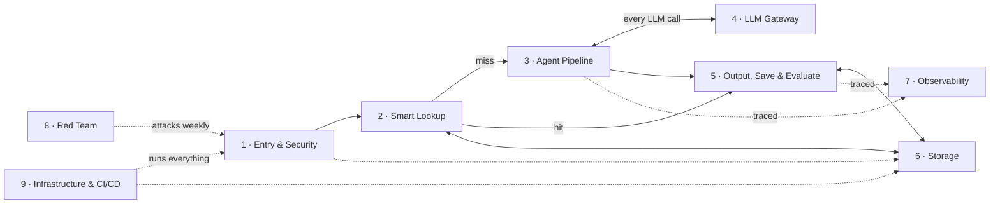
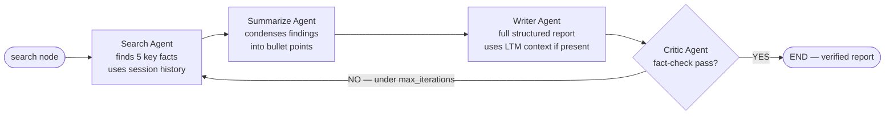

# Case Study — The Research Platform

> **Level** 🟠 Scale, Security, Operations · **Module** 07 · **Doc** 4 of 5 · **Time** ~45 min
> **Prerequisites:** docs 1–3 of this module; Module 02 doc 1 (the AI additions)
> **Source material:** `3. AI_Engineer_Interview_Preparation/Enteprise Multi-Agent AI Research Platform/ARCHITECTURE DIAGRAMS/LAYERS_EXPLAINED.md`; `CODE/README.md`
> **Reference:** `diagrams/` (nine per-layer `.mmd` files, the combined architecture HTML and PNG); `reference_code/` (the deployed AWS application)

## Why this matters

The previous three documents were architecture on a whiteboard. This one is a **deployed** multi-agent system on AWS — FastAPI, LangGraph, a TensorZero gateway, Bedrock guardrails, Redis, Postgres with pgvector, LangSmith, PyRIT, Terraform, GitHub Actions — read one layer at a time. Each layer answers three questions: *what does it do*, *why does it exist*, and *how does it work*. Read top to bottom and you are tracing one user request through the whole system. It is also a worked example of most of Module 02's AI additions in one place: semantic cache, model gateway, guardrails on both sides, agent orchestrator, observability, and red teaming.

The product: give it a topic → it researches, writes a full report, safety-checks it, caches it, and remembers it.

## The nine layers

### 1 · Entry and security

Every request passes three checkpoints, in order, before it becomes a job: **is the caller who they claim** (API key middleware — wrong or missing key → 401 immediately), **are they calling too often** (a Redis counter per client IP, 10 requests per 60 s — one `INCR`, stops retry storms and abuse), and **is the content safe** (AWS Bedrock Guardrails screen for hate, PII, weapons and prompt-injection *before any LLM sees the text*). Only then does the request become a job on a Redis Stream queue, decoupling "accepted" from "processed".

Why it exists: an LLM-backed API is expensive to run and easy to abuse. This layer is the front-door lock, not an afterthought. The ordering — guardrail on *raw user input*, not on an agent's interpretation of it — is a deliberate choice.

### 2 · Smart lookup — cache and memory

Before spending money on four agents, three progressively looser checks:

| Check | Store | Threshold | On hit |
|---|---|---|---|
| Semantic cache | Redis, cosine similarity | ≥ 0.85 | Return the cached answer; no LLM call |
| Exact long-term-memory match | Postgres + pgvector | ≥ 0.88 | Return the stored report; catches what the short-lived cache evicted |
| Related LTM | pgvector | 0.50–0.88 | Not close enough to reuse — but passed to the Writer agent as *context*, so the new report builds on prior research |

Only a total miss enters the pipeline with no prior context. This is Module 06's semantic cache, with the threshold decision made explicit — and note it sits *before* the expensive work, the lesson from Module 02's travel agent.

### 3 · The multi-agent pipeline

A LangGraph state machine of four specialised agents that turns a topic into a fact-checked report:

- **Search** — given the topic and the last four turns of session history, surfaces five key facts.
- **Summarize** — condenses raw findings into structured bullets.
- **Writer** — drafts the report (executive summary, findings, analysis, conclusion), injecting any related prior report from Layer 2.
- **Critic** — re-reads the report for factual consistency and coherence; answers YES or NO with a reason.
- **The loop** — a NO under `agent_max_iterations` routes back to Search. A YES, or an exhausted budget, ends the graph.

Why split rather than one call: a single "write a good research report" prompt produces shallow, unverified output. Narrow, single-purpose agents produce better output *and* give the system a natural place to insert a quality gate (the Critic) and a retry loop. Against doc 1's test: this is a **pipeline with a loop and a gate** — closer to single-agent multi-step than to the triage-and-specialists shape. Its agents share one context and one tool set; what makes it worth the split is the Critic's independent judgement and the bounded retry. Be precise about that when describing it.

### 4 · The LLM gateway

Every agent, plus the evaluator, calls one shared sidecar — **TensorZero** — instead of a provider SDK. Agents `POST /inference` naming a *function* (`research_summarize`, `report_write`), not a model; the gateway maps function → provider/model. Primary: OpenAI GPT-4o. Fallback: Groq `llama-3.1-8b-instant` — faster, cheaper, keeps the system available during an OpenAI outage at some quality cost. Agents add their own retry wrapper on top.

Why: hard-coding a provider into every agent makes every outage, rate limit and pricing change a code change in five places. Centralising means agents know only "call the gateway". This is Module 02's model gateway and Module 06's backup provider, as one component.

### 5 · Output, save and evaluate

Once a report exists — fresh from the pipeline or from a cache hit — three things happen:

- **Output guardrail** — Bedrock Guardrails again, this time on the *generated* content. Checking input is not enough; a model can produce harmful output from a benign prompt.
- **Save** — to Redis (cache entry + session history) and to Postgres (a new LTM vector), so Layer 2 finds it next time.
- **Evaluate** — an LLM-as-judge scores the report on relevance, completeness, hallucination and quality. Runs in parallel with save and does not block the user; it feeds observability.

### 6 · Storage

Two managed services chosen for different access patterns: **Redis ElastiCache** for anything fast and short-lived (rate-limit counters, the semantic cache, session memory, the job queue — all fine to lose on restart), and **RDS PostgreSQL 15 + pgvector** for anything durable and similarity-searchable (every finished report as a 384-dimension embedding plus text). Every other layer talks to these two rather than to each other — the shared state that lets a stateless FastAPI app scale horizontally while still remembering. Module 02's SQL-vs-NoSQL question, answered by access pattern.

### 7 · Observability

Every agent method is decorated `@traceable`, so **LangSmith** captures inputs, outputs and timing as spans in one trace per request. The evaluator's four scores attach to the same trace, so quality data and execution data live together. "Why did this report take three iterations?" and "which agent produced the bad fact?" are trace queries, not log greps. Embeddings come from an in-process **SentenceTransformer** (`all-MiniLM-L6-v2`), so cache, LTM lookup and save add no gateway latency or cost.

### 8 · Red team

A dedicated adversarial service — **PyRIT** — attacks the platform's own `/query` endpoint the way a malicious user would: jailbreaks, cross-prompt injection (XPIA), Crescendo (gradual escalation) and Skeleton Key. On demand via its own dashboard, and automatically every Monday at 02:00 UTC via EventBridge. Critically, PyRIT hits the **same** app endpoint through the **same** auth, rate-limit and guardrail path as a real user — so a passing run is genuine evidence the production defences hold, not a test of a mock. Module 08 develops this.

### 9 · Infrastructure and CI/CD

**Terraform** provisions everything — VPC, subnets, ECS, ALB, RDS, ElastiCache, ECR, Bedrock access, Secrets Manager, IAM, EventBridge, the S3 state lock — as versioned, reviewable text. **GitHub Actions** on every push builds three Docker images (app, PyRIT, TensorZero), pushes to ECR, deploys to **ECS Fargate**, and **rolls back automatically if health checks fail**. **Secrets Manager** holds every key, loaded at container startup, never baked into an image. **CloudWatch** keeps container logs for seven days. Module 08 covers this too.

## One request, end to end

1. Entry and security lets it in, or rejects it.
2. Smart lookup checks whether the work is already done.
3. If not, the agent pipeline researches, calling through the gateway for every model call.
4. Output, save and evaluate safety-checks, persists and scores the result.
5. Storage is the shared state every layer reads and writes.
6. Observability watches all of it.
7. Red team attacks the same path weekly to verify steps 1 and 4 hold.
8. Infrastructure and CI/CD is what it all runs on and how new versions ship.

## What to take from it

| Module 02 AI addition | Where it is here |
|---|---|
| Guardrails, input and output | Layers 1 and 5 — Bedrock, on both sides |
| Semantic cache | Layer 2 — in front of the expensive work, with explicit thresholds |
| Agent orchestrator with a step limit | Layer 3 — the Critic loop under `agent_max_iterations` |
| Model gateway with fallback | Layer 4 — TensorZero, primary and fallback |
| LLM observability | Layer 7 — LangSmith spans with eval scores attached |
| Continuous adversarial testing | Layer 8 — PyRIT, weekly, through the real path |
| Infrastructure as code, auto-rollback | Layer 9 |

And two things it does *not* have that Modules 04–06 insist on: **per-user access control** (there is one API key and no tenant model — every user sees every cached report, which is fine for a research tool and wrong for an enterprise one) and **a deterministic release gate** (the LLM-as-judge scores are observability, not a gate). Knowing which properties a given system has and lacks is the coverage-map habit again.

## Where to look

| Layer | `reference_code/` | `diagrams/` |
|---|---|---|
| 1 | `app/auth.py`, `app/main.py`, `app/guardrails.py` | `01-entry-security.mmd` |
| 2 | `app/cache.py`, `app/memory.py` | `02-smart-lookup.mmd` |
| 3 | `app/agents.py` — `ResearchState`, the four agents, `OrchestratorAgent`, `build_graph` | `03-agent-pipeline.mmd` |
| 4 | `tensorzero/tensorzero.toml`, `tensorzero/templates/`, `app/retry.py` | `04-llm-gateway.mmd` |
| 5 | `app/output.py`, `app/eval.py` | `05-output-eval.mmd` |
| 6 | `app/pool.py`, `app/queue.py` | `06-storage.mmd` |
| 7 | `@traceable` decorators throughout `app/agents.py` | `07-observability.mmd` |
| 8 | `pyrit_dashboard/main.py` | `08-red-team.mmd` |
| 9 | `terraform/main.tf`, `.github/workflows/deploy.yml`, `bootstrap.sh` | `09-infra-cicd.mmd` |
| all | `README.md` (setup, endpoints, teardown) | `ARCHITECTURE.mmd`, `platform-architecture.html`, `platform-architecture.png` |

## Checkpoint

- Name the nine layers in order and the one question each answers.
- Why is the input guardrail run on raw user input rather than on the agent's interpretation?
- Explain the three thresholds in smart lookup and what happens in the 0.50–0.88 band.
- Is Layer 3 multi-agent by doc 1's definition? Argue it.
- Why does PyRIT attack through the same path as a real user, and what would be wrong with a separate test endpoint?
- Name two enterprise properties this system lacks.

**Next →** [Case Study — From Supervisor to Deep Agent](05_Case_Study_Supervisor_To_Deep_Agent.md)
