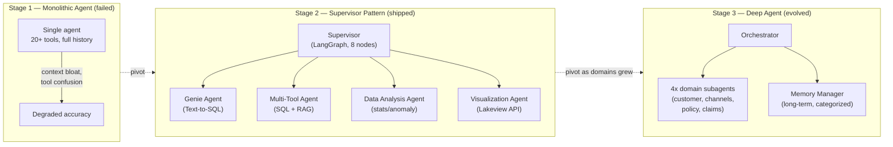

# Case Study — From Supervisor to Deep Agent

> **Level** 🟠 Scale, Security, Operations · **Module** 07 · **Doc** 5 of 5 · **Time** ~30 min
> **Prerequisites:** docs 1–3 of this module; Module 03 doc 2 (memory); Module 04 doc 2 (governance)
> **Source material:** `4. FDE_Related_Preparation/Star_Stories/AIA_Technical_Implementation_Flow.md`

## Why this matters

This is a production multi-agent system in a regulated industry — a governed data assistant for Asia's largest publicly listed life insurer, built on Databricks in an 8–9 week advisory-plus-build engagement — told as an *architecture evolution* rather than a finished diagram. It went through two real pivots, each for a different reason, and the reasoning behind every major tool choice is on record. That makes it the best available illustration of doc 1's judgement actually being exercised: the default was tried, it failed measurably, and each escalation was justified by a specific failure. (The full narrative versions of this engagement live in Module 11.)

## The problem

Actuaries, claims managers and regional analysts needed answers over governed enterprise data, but every question — however routine — went through a BI/analyst queue. An ad-hoc question took 2–10 business days. A new dashboard took roughly four weeks.

## Three stages



Why three stages, not one design up front? Because the first design failed in real testing, not on paper — and the second pivot happened for a different reason than the first. That distinction shows iterative engineering judgement rather than a plan that worked first time.

## Stage 1 → 2: why the monolith failed

A single agent carrying the full system prompt, 20+ tool schemas and the entire conversation history broke on two axes — the two triggers from doc 1, observed in production testing:

- **Context bloat** — every tool's schema and description in context on every turn, degrading reasoning about the actual question.
- **Tool confusion** — with that many tools competing, the agent picked the wrong one often enough that accuracy was unusable for a production advisory engagement.

The fix was not a bigger model or better prompting. It was architectural: split *decide what to do* from *do it*.

## Stage 2: the supervisor pattern

### Why LangGraph, specifically

Evaluated against CrewAI and AutoGen; LangGraph won for three concrete reasons:

| Requirement | Why LangGraph fit |
|---|---|
| **Conditional routing on confidence** | Explicit conditional edges — `classify_intent` routes to `clarify_or_disambiguate` only when confidence < 60%. Role-based delegation frameworks do not expose deterministic branching this cleanly |
| **Durable, resumable state** | Multi-turn conversations backed by Delta checkpoints — a governance requirement; every conversation state must be auditable. LangGraph's checkpointer abstraction maps directly onto a Delta table |
| **Deterministic composition** | A governed insurance environment cannot tolerate open-ended agent-to-agent chat deciding its own flow. The graph is inspectable and fixed at build time — eight nodes, each nameable |

Module 01 doc 5 said what LangGraph gives you and what it does not. This is those properties chosen *for* a reason.

### The eight-node state machine

```
classify_intent → clarify_or_disambiguate → resolve_assets_with_context_index
    → route_to_{genie | multi_tool | analysis | visualization} → compose_answer
```

1. **`classify_intent`** — categorises the question (`simple_kpi`, `deep_analysis`, `document_lookup`, `visualization`, `conversational`) with a confidence score.
2. **`clarify_or_disambiguate`** — fires only below the 60% threshold. "Show me the numbers" gets a clarifying question, not a guess. (Module 02's "low confidence → clarify, don't guess", implemented.)
3. **`resolve_assets_with_context_index`** — the supervisor, and only the supervisor, queries a 16-asset Context Index (Genie Spaces, metric views, tables, document indexes) via Vector Search, with endorsed assets ranked first.
4. **`route_to_*`** — delegates to one of four specialists with the resolved asset list on shared graph state.
5. **`compose_answer`** — synthesises the worker's structured output into a cited answer.

**Why centralise asset resolution at the supervisor** rather than let each worker search independently? Consistency. If the Genie agent and the Multi-Tool agent each ran their own retrieval, they could resolve to *different tables for the same question* — a governance nightmare in insurance, where two answers to one question is worse than one slow answer. Centralising costs one extra hop of latency; it buys a single, auditable source of truth for what data any answer is based on. This is doc 2's handoff principle: what passes to the specialist is a resolved, trusted package, not a licence to go find things.

### The four specialists — each embodying a trade-off

| Agent | Role | Tools | The trade-off it embodies |
|---|---|---|---|
| **Genie** | BI specialist | Genie Space API (managed text-to-SQL) | A managed service over a hand-rolled text-to-SQL chain — less flexible, but far lower prompt- and SQL-injection surface, and non-engineers can curate the underlying tables directly |
| **Multi-Tool** | Generalist | LLM-generated SQL + Vector Search RAG over policy docs | The *one* place hand-generated SQL was allowed — for ad-hoc questions outside Genie's curated scope — under deliberately narrower governance |
| **Data Analysis** | Statistical | Z-score anomaly detection, trend statistics | Kept **deterministic** — thresholds are computed, not "reasoned about", so the model cannot invent a plausible but wrong number |
| **Visualization** | Dashboard creator | Lakeview REST API | Publishes real, clickable dashboards rather than a static chart image — closing the loop on the original four-week dashboard pain |

The Genie-vs-Multi-Tool split is Module 06's "fixed operations over NL-to-query" decision, made per specialist: the safe path is the default; the open path exists, scoped and governed, for what the safe path cannot cover.

### Governance underneath

- **Seven governed metric views**, not raw fact tables. If the agent and a human analyst compute "claims by region" differently — different date logic, different exclusions — trust in the whole system collapses. A metric view makes the KPI definition one versioned artefact every consumer shares.
- **Short-term memory** in a Delta table keyed by `thread_id`, checkpointed at each key node, 30-day retention — chosen over in-memory because conversations had to survive a serving-endpoint restart and be auditable afterwards. Module 03's checkpointer, with a governance reason.
- **Prompt management** — base + overlay prompts in a Delta table with a five-minute cache, so behaviour can be tuned in production without a redeploy, at the cost of a short propagation delay. Module 08's prompt versioning, in practice.
- **MLflow Tracing** on every node with proper span types, so a wrong answer traces to the exact node and tool call — non-negotiable for an insurer's audit.
- **AI Gateway** — rate limiting, PII filtering and guardrails in front of the serving endpoint — required before this could be exposed as an internal chat app at all.

### The regional constraint that shaped the build

Databricks' own managed Multi-Agent Supervisor was not GA in the customer's Azure region at build time. Rather than block on a beta feature's regional rollout, the supervisor was hand-built in LangGraph on GA primitives only (Agent Framework, Model Serving, Genie, Vector Search, Metric Views, MLflow Tracing). **Trade-off:** more code to own and maintain versus a managed service, in exchange for a production path that did not depend on a timeline nobody on the engagement controlled. That is an FDE decision — Module 10's territory — and it is worth recognising as one.

## Stage 2 → 3: the second pivot

As analytics domains grew, the supervisor's *own* tool list started re-approaching the original bloat — the Stage 1 failure, one level up. The fix was the same principle applied again: **specialise further.**

The architecture evolved into a **deep agent** pattern — an orchestrator delegating to fully self-contained sub-agents, each with its own prompt, small toolset and context window, instead of one supervisor whose tool list keeps growing:

- **Four domain-specific analytics sub-agents** (customer analytics, distribution channels, policy and underwriting, claims), each wired to its own Genie Space and its own gold/silver tables.
- **A memory-manager sub-agent** owning long-term, cross-conversation memory in a categorised Delta table (`preference` / `fact` / `decision` / `project` / `feedback`) — the orchestrator is required to check and update it on every turn. Module 03's three layers of memory, with long-term memory given its own owner.

**Trade-off:** more infrastructure surface — more Genie Spaces, more serving endpoints, more moving parts — in exchange for a ceiling on tool-selection degradation that does not reappear as the system grows. For a system meant to scale across business units and markets, that ceiling mattered more than operational simplicity.

## Stack

| Layer | Choice |
|---|---|
| Orchestration | LangGraph `StateGraph`, Databricks Agent Framework |
| Governance | Unity Catalog (bronze/silver/gold/ai_ops), seven governed metric views |
| Retrieval | Databricks Vector Search (Context Index + policy-doc RAG), Genie Spaces |
| Dashboards | Lakeview REST API |
| Serving | Model Serving, AI Gateway |
| Observability | MLflow Tracing, MLflow Agent Evaluation |
| Memory | Delta-backed short-term checkpoints; categorised Delta table for long-term |
| App | Databricks Apps (Dash chat UI) |

## Results, stated honestly

- Time-to-insight: 2–10 business days → minutes.
- Dashboard delivery: ~4 weeks → governed self-serve.
- ~35% year-to-date growth in platform consumption after rollout — **a correlational signal, not a controlled experiment**, and worth saying exactly that.
- MVP in 8–9 weeks.

**If rebuilt today:** instrument resolution-time and accuracy metrics from day one rather than relying on tracing alone for post-hoc debugging, and invest earlier in the offline evaluation dataset — both flagged as phase-2 priorities at the time, both things to pull forward.

## What to take from it

| Principle from this module | Where it shows up |
|---|---|
| One agent by default; escalate on a named trigger | Stage 1 tried and failed on both triggers; Stage 2 justified by that |
| The same trigger can recur one level up | Stage 2 → 3 |
| Handoff = a resolved, trusted package | Centralised asset resolution at the supervisor |
| Specialists scoped by governance, not just by topic | Genie (managed) vs Multi-Tool (open, narrower governance) vs Analysis (deterministic) |
| Durable state is a governance property | Delta checkpoints, 30-day retention, auditable |
| Say what the numbers do and do not prove | The 35% is correlational |

## Checkpoint

- What were the two failure modes of Stage 1, and why was the fix architectural rather than a better model?
- Give the three reasons LangGraph was chosen and map each to a property from Module 01 doc 5.
- Why was asset resolution centralised at the supervisor? What is the cost and what does it buy?
- For each of the four specialists, name the trade-off it embodies.
- What triggered the second pivot, and what did the deep-agent shape cost?
- Why does the results section call the 35% "correlational"?

**Next →** [Module 08 · AgentOps and Platform](../08_AgentOps_And_Platform/README.md)
