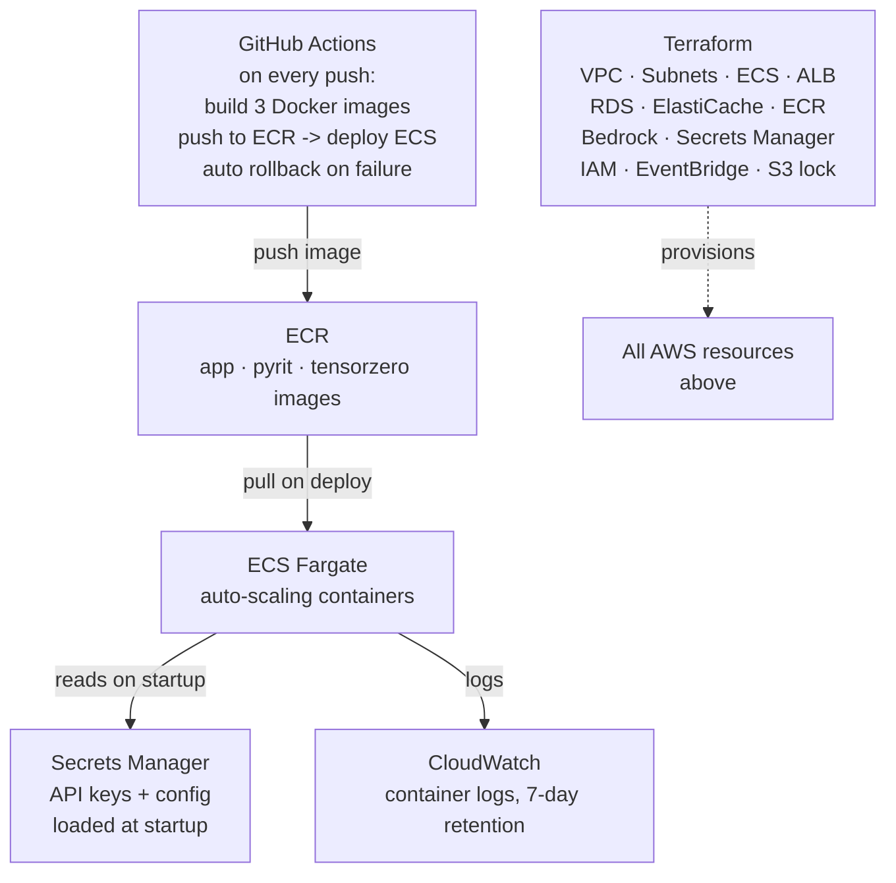

# Infrastructure and CI/CD

> **Level** 🟠 Scale, Security, Operations · **Module** 08 · **Doc** 6 of 6 · **Time** ~20 min
> **Prerequisites:** Module 07 doc 4 (Layer 9), docs 1–3 of this module
> **Source material:** `3. AI_Engineer_Interview_Preparation/Enteprise Multi-Agent AI Research Platform/ARCHITECTURE DIAGRAMS/LAYERS_EXPLAINED.md` §9; `CODE/README.md`; `Enterprise RAG Platform/docs/03-theory-databricks.md` §12
> **Reference:** `../07_Multi_Agent_Systems/reference_code/terraform/main.tf`, `.github/workflows/deploy.yml`, `bootstrap.sh`

## Why this matters

Everything in this handbook runs on something, and new versions of it have to get there. Manually clicking through a cloud console to provision a network, a cluster, a database and IAM roles is slow and impossible to reproduce reliably. Infrastructure as code makes the whole environment a versioned, reviewable text file; a CI/CD pipeline makes every code change become a running container without a human doing it by hand — which also makes every deploy auditable and reversible. This document walks the research platform's setup as the concrete example, then the Databricks equivalent.

## The AWS platform



| Component | Role | The detail that matters |
|---|---|---|
| **Terraform** | Single source of truth for every resource: VPC, subnets, ECS cluster, ALB, RDS, ElastiCache, ECR, Bedrock access, Secrets Manager, IAM roles, EventBridge schedule, the S3 state bucket and DynamoDB lock | The entire environment can be torn down and rebuilt from code. The state backend (S3 + DynamoDB) is bootstrapped once, separately, because Terraform cannot create the place it stores its own state |
| **GitHub Actions** | On every push: build three Docker images (app, PyRIT, TensorZero), push to ECR, trigger an ECS deployment | **If the new deployment fails health checks, it rolls back automatically.** No human decides; the pipeline does |
| **ECR** | Stores the built images | — |
| **ECS Fargate** | Runs the containers, auto-scaling | No EC2 instances to manage; the app is stateless (Module 07 doc 4, Layer 6), so scaling is horizontal |
| **Secrets Manager** | Every API key and config value | Loaded once at container startup — never baked into the image, never committed. Module 06 doc 1's "reference, never the value" |
| **CloudWatch** | Container logs, 7-day retention | The retention window is a decision, stated |

Docker is not needed on a developer's machine; the pipeline builds and pushes. The teardown is one command, which is how you know the environment really is code.

### Setup order, and why

The platform's README lays out a strict order: configure cloud credentials → bootstrap the Terraform backend → create the repo and add its secrets → deploy all infrastructure → obtain API keys → fill Secrets Manager → let the pipeline deploy. The order encodes dependencies: the backend before Terraform; infrastructure before secrets (the vault has to exist); secrets before the first deploy (containers read them at startup). Getting this order wrong is the most common first-day failure, and writing it down is part of the deliverable.

## The Databricks equivalent

On the Lakehouse the same discipline is **Databricks Asset Bundles (DABs)**: pipelines, jobs, Vector Search indexes, serving endpoints, the app — *and the row-filter and column-mask SQL* — as one bundle, deployed dev → staging → prod as environments. Prompts live in the MLflow Prompt Registry. The pipeline gates on: evaluation-score regression, **`no_leak` = 1.0**, and the SQL permission assertions from doc 3. The serving endpoint is canaried via traffic splitting (doc 2).

| Concern | AWS platform | Databricks |
|---|---|---|
| Infrastructure as code | Terraform | DABs |
| Build and deploy | GitHub Actions → ECR → ECS | DABs deploy per environment |
| Secrets | Secrets Manager, read at startup | Secret scopes; OBO tokens at request time |
| Rollback | ECS health-check failure → automatic | Alias repoint + endpoint config |
| Release gate | (none built — evaluation is observability only) | `mlflow.genai.evaluate()` + `no_leak` + SQL assertions |
| Scheduled verification | EventBridge → PyRIT weekly | Scheduled evaluation job; production monitoring |

The right-hand column has a release gate and the left does not. That is not a platform difference; it is a difference in what the two projects chose to build, and it is the kind of thing a coverage map records.

## The pipeline, assembled

Putting this module together, a change to an AI system moves through:

```
  code / prompt / policy change
          │
          ▼
  unit tests · prompt parse tests                       (Module 06 doc 3)
          │
          ▼
  golden-set evaluation vs named baseline               (Module 04 doc 7, Module 08 doc 2)
     security gate = 0 · quality no-regression
          │
          ▼
  build artefacts · register version                    (this doc, doc 2)
          │
          ▼
  deploy to staging · shadow on real traffic            (doc 1)
          │
          ▼
  canary slice · watch live · auto-rollback on failure  (doc 1, this doc)
          │
          ▼
  promote (pointer flip)                                (doc 2)
          │
          ▼
  nightly evaluation · production monitoring · weekly red team   (Module 06 doc 3, doc 2, doc 5)
```

Every arrow is a place a bad change can be stopped, and every stop is automatic.

## Interview lens

> *"Infrastructure is code — Terraform on AWS, bundles on Databricks — so the environment is reviewable and rebuildable. Every push builds, deploys and rolls back automatically on a failed health check; secrets are read from a vault at startup, never baked in. On top of that sits the AI-specific pipeline: an evaluation gate with a zero-leak requirement before any artefact is registered, shadow and canary before promotion, a pointer-flip rollback, and scheduled evaluation and red teaming after."*

## Checkpoint

- Why is the Terraform state backend bootstrapped separately?
- What triggers an automatic rollback in the AWS pipeline, and what is the equivalent on Databricks?
- Why are secrets loaded at container startup rather than baked into the image?
- What does the Databricks bundle include that a typical application bundle would not?
- Walk the assembled pipeline and name the module that owns each stop.

**Next →** [Module 09 · AI System Design Casebook](../09_AI_System_Design_Casebook/README.md)
