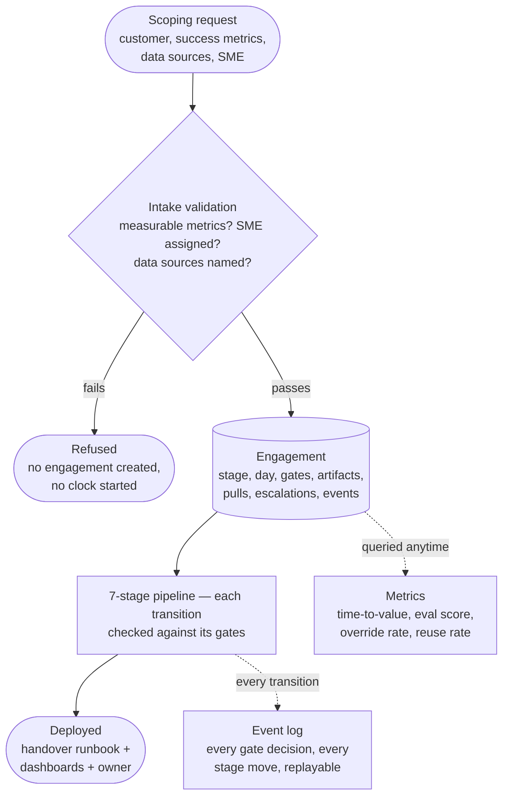
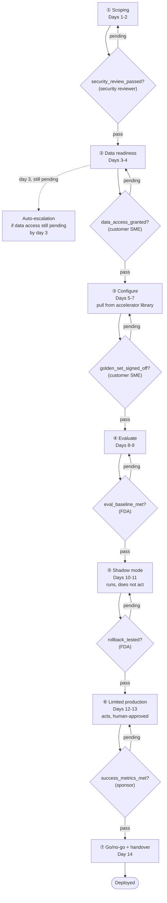
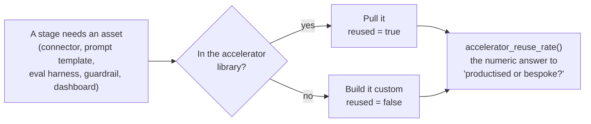

# Scoping Doc to Production in Two Weeks

> **Level** 🔴 The FDE Role · **Module** 10 · **Doc** 3 of 7 · **Time** ~40 min
> **Prerequisites:** Module 05 (staged rollout, the `Decision` shape); Module 04 doc 7 (golden sets)
> **Source material:** `4. FDE_Related_Preparation/Delivery Framework from Scoping to Delivery/docs/01-theory.md`; `docs/02-architecture-end-to-end.md`; `README.md`
> **Lab:** `project/scripts/run_engagement_demo.py`, `project/notebooks/02-hands-on.ipynb`

## Why this matters

The prompt: *"Design a delivery framework that takes a customer from scoping doc to deployed AI agent in under two weeks."* This is a different kind of question from the RAG and agent-platform prompts. It is a **process and operating-model design problem**, and it trips people up because their instinct is "there's nothing to build here, it's a process diagram." Wrong instinct. A system with stages and gates is a state machine, and a state machine is code — so the source project builds one: a real, gate-enforcing engagement pipeline, with the same discipline as the other two projects, applied to an operating model instead of a search index.

## The one-sentence problem

> A new customer signs up wanting an AI agent. Today, day 0, all you have is a rough scoping document. Design the *process* your company runs, end to end, so that by day 14 there is a real agent live in production for that customer — and it got there the same reliable way every time, not through a different set of heroics for each customer.

You are not being asked to design the agent. You are being asked to design **the assembly line that produces the agent**, reliably, in two weeks, for any customer.

## Why two weeks is actually hard

The naive answer is "work faster" or "hire more people". That is the trap. **Two weeks is only possible if most of the work already existed before the customer showed up.** If every engagement starts from a blank page — writing connectors, inventing prompt templates, discovering the right guardrail policy from scratch — two weeks is not a schedule, it is a wish. The only way to hit it *repeatably, for different customers*, is if most of each stage is **pulled from a reusable library** and only the small remainder is built for this customer.

So the real question being tested:

> **Can you design a process where speed is a *side effect* of reuse and hard gates, rather than a target you chase by cutting corners under deadline pressure?**

It is an asset-reuse and risk-containment question wearing a delivery-timeline costume.

## The two things every good answer covers

```
 QUESTION 2   "How do we know each stage is actually safe to leave, not just that time passed?"
                 -> gates: a named, checkable condition, signed off by the RIGHT role — never
                    the person closest to the work rubber-stamping their own progress

 QUESTION 1   "How do we make 2 weeks achievable for a different customer every time?"
                 -> a library of reusable assets (connectors, prompt templates, tool defs,
                    guardrail policies) that most of each stage is assembled from, not written
```

A weak answer draws seven boxes labelled "scoping → data → build → test → launch" and stops. That is a checklist, and checklists get skipped under deadline pressure. A strong answer spends its time on: what is reusable vs bespoke at each stage, and what specific, checkable fact has to be true before the next stage may start.

## The fourteen days

| Days | Stage | What has to be true to leave it |
|---|---|---|
| 1–2 | **Scoping and qualification** | Success metrics written down and *measurable*; a named customer SME assigned; the security review started. If nobody can commit to a measurable metric or an SME, the engagement **does not start** |
| 3–4 | **Data readiness** | Sources connected; access live and *verified* — not "requested" |
| 5–7 | **Configure, do not code** | Assembled from the accelerator library — connectors, prompt templates, tool definitions, guardrail policies — configured for this customer. Where reuse-vs-bespoke is decided in practice |
| 8–9 | **Evaluate and iterate** | A golden set exists, the customer's SME has signed off that it is representative, and the measured baseline clears the bar |
| 10–11 | **Shadow mode** | The agent runs against real traffic, sees everything, decides what it would do, takes no action — while humans compare its answers to their own |
| 12–13 | **Limited production** | The agent acts for real, with a human approving in the loop, and a rollback path that has been *tested*, not documented |
| 14 | **Go/no-go and handover** | The metric written down on day 1 was actually met; if so, a runbook, dashboards and a named owner are handed over |

**The order is not optional.** You cannot configure against data you have not connected; you cannot evaluate against a golden set nobody signed off; you cannot go to limited production without a tested way to undo it. That is why the code models transitions as a state machine with hard gates rather than a checklist.

Shadow mode is the same idea as Module 05's `SHADOW` status; limited production is its `LIVE`. Same two-step trust ladder, same reason: never let a system's first real action also be the first time nobody is watching.

## The architecture



**Intake refuses rather than starts a clock against something unmeasurable.** No `Engagement` object is even created. This is the delivery framework's version of Module 04's "refuse to index a document with no usable ACL": a two-week clock started against a success metric nobody can measure is a worse outcome than never starting it.

## The state machine — the one to draw from memory



Each diamond is the same decision six times: *has the right role signed this off, with evidence, in order?* Wrong role, missing evidence, or an earlier gate still pending are each an independent hard deny; there is no override path.

> *"A stage cannot be entered while any gate blocking it is pending — that ordering is encoded in `advance_stage()`, not left to whoever is running the engagement to remember. The same way `authorize` runs first and `enforce` runs before generation in the RAG project — the property is in the code's structure, not a convention."*

## The accelerator library

Every stage's real work is "get this thing", not "invent this thing":



Pulling is the common case in a healthy delivery. Building custom is the exception — and every one is logged, because too many is the signal that "two weeks" is about to slip. `accelerator_reuse_rate()` turns "we mostly reuse the library" from a claim into a number, the same way Module 04's harness turns "hybrid retrieval helps" into one. On the Northwind demo: **83%** — five of six assets reused, one guardrail policy custom-built.

## The case study: Northwind Logistics

> *"Why did the Northwind Logistics engagement stall at day 3?"*

| Who is asking | What actually happened |
|---|---|
| The FDA, wanting to sign off the security gate themselves | Denied — `wrong_role`. Only a security reviewer can sign that gate, however senior the FDA is |
| The customer SME, signing the data-access gate with "looks good" as evidence | Denied — `no_evidence`. An approval with no artefact behind it is not a sign-off |
| Anyone, on day 3, with data access still not granted | The system escalated automatically — nobody had to notice and raise it |

Getting this right *provably* — not by writing "get security sign-off" in a process doc — is what the project is about.

## If asked to restate the problem in one breath

> *"We're designing a repeatable delivery pipeline — not a one-off project plan — where speed comes from a reusable accelerator library, and safety comes from hard, role-gated checkpoints between stages, so that two weeks is an achievable outcome of the process, not a deadline we hope to hit by cutting corners."*

## In the code

| Concept | Where |
|---|---|
| Intake refusal | `project/src/delivery_framework/pipeline.py` → `intake`, `ScopingRefused` |
| The seven stages | `models.py` → `Stage`, `STAGE_ORDER` |
| Stage transitions, no skip path | `engine.py` → `advance_stage`, `mark_deployed` |
| Auto-escalation on day 3 | `engine.py` → `check_escalation_triggers` |
| The library and the reuse decision | `accelerators.py` → `LIBRARY`, `pull_or_build` |
| The reuse rate | `metrics.py` → `accelerator_reuse_rate` |
| The happy path | `project/scripts/run_engagement_demo.py` — all 14 days, every gate in order |

## Checkpoint

- Restate the problem in one breath and say what kind of problem it is.
- Why is "work faster" the trap, and what makes two weeks achievable?
- Name the seven stages, their day ranges, and what must be true to leave each.
- Why does intake refuse rather than warn? What is its analogue in Module 04?
- What does the reuse rate measure, and what does a rising custom-build count signal?

**Next →** [Gates, Risks and Metrics](04_Gates_Risks_Metrics.md)
