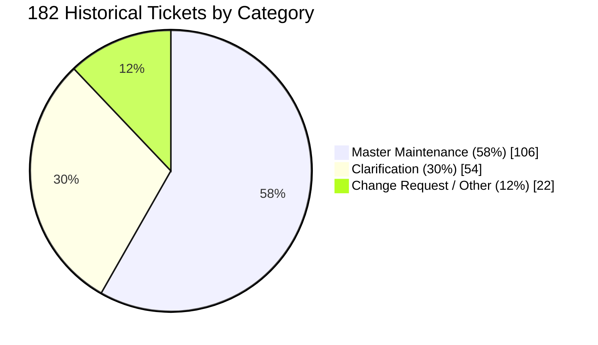
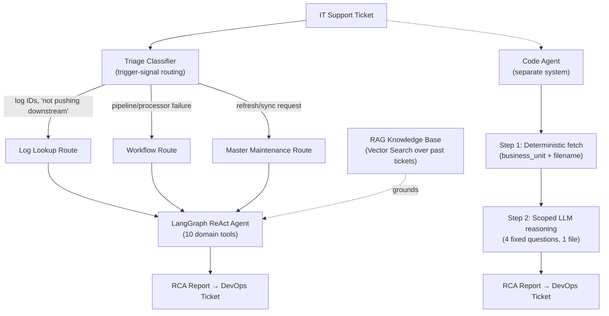
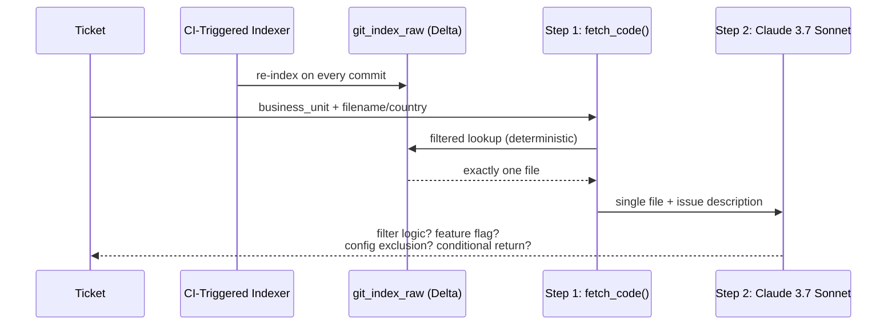

> **Level** 🔴 Telling the Story · **Module** 11 · **stories/** · **Format:** technical implementation flow
> **Source material:** `4. FDE_Related_Preparation/Star_Stories/Bajaj_RapidLR_Technical_Implementation_Flow.md` — kept as a worked example of the format described in [Deep-Dive and Conversational Formats](../01_Deep_Dive_And_Conversational_Formats.md). It is one engineer's own engagement narrative; use it as a template for the shape, not a script to repeat.

---

# Bajaj Finserv — Technical Implementation Flow
### Agentic IT Support for the RapidLR PL Pipeline

---

## 1. The Story in Brief

RapidLR PL is Bajaj Finserv's lead-routing pipeline — it takes inbound leads and routes them, through business rules, into SFDC CRM and their outbound Dialer. When something broke — a lead silently excluded, a feed that stopped flowing, a master table out of sync — an IT engineer had to manually chase it across systems: log tables, master-table configs, control flags, and finally the pipeline's own C# source, before writing it all up in a DevOps ticket.

Before writing any code, I went through Bajaj's own historical ticket log — 182 real tickets — to understand the actual shape of the problem rather than guessing at it. That data shaped every design decision that follows.

---

## 2. Ticket Taxonomy — The Data That Drove the Design

The taxonomy wasn't an assumption — it was the starting point. Three real failure shapes emerged, and the architecture below has one dedicated investigation route per shape, plus a fourth path for the ~12% that were genuine code-level bugs, not data problems.

---

## 3. End-to-End Architecture

Two systems, not one — an **ops agent** for data/config issues and a **Code Agent** for source-level logic issues, because a table-refresh tool and a code-reading tool don't belong in one prompt. This is the same specialization principle I applied at AIA (Supervisor → Deep Agent): don't force one agent to be an expert in everything.

---

## 4. The Ops Agent — Triage, Tools, and Grounding

### 4.1 Why triage before the agent, not inside it

I built a deterministic classifier that routes each ticket down one of three paths **before** the LangGraph agent ever runs, based on trigger signals in the ticket text:

| Route | Trigger signals | Tool chain |
|---|---|---|
| **Log Lookup** | specific log IDs, "data not pushing downstream," exclusion language | `query_log_view → analyze_exclusion_reason → check_control_flags` |
| **Workflow** | pipeline failures, processor errors, feeds stopping | `run_pipeline_check → check_upstream_source → query_log_view` |
| **Master Maintenance** | table refresh/sync/update requests | `update_master_table → refresh_master_table → send_email_notification` |

**Why not let the agent freely choose from all 10 tools on every ticket?** Because the historical data showed the problem space was three narrow, well-defined shapes, not an open-ended one. Pre-narrowing the toolset per route reduces tool-selection error and keeps the agent's reasoning scoped — the same lesson AIA's Stage-1 failure taught, applied proactively here instead of learned the hard way twice.

**Trade-off:** this triage layer is pattern-based, not learned, so it's interpretable and cheap to debug — but brittle to ticket-phrasing drift. The ~30% of tickets that were pure "clarification" round-trips don't map cleanly to any of the three routes today; a production version needs a genuine clarification/human-in-the-loop path, which I'd flag as the next gap to close, not something already solved.

### 4.2 Why LangGraph ReAct, specifically, for the agent itself

Ticket investigation is inherently multi-step and conditional — you don't know whether `query_log_view` will show `EXCLUDED`, `Eligible`, or `no_data` until you run it, and each outcome demands a different next tool. A fixed prompt chain can't branch on an intermediate observation; LangGraph's ReAct loop (think → act → observe → think again) can. This is the same reason I reached for LangGraph at AIA — deterministic, inspectable branching, not open-ended agent chat.

### 4.3 Why RAG over a hardcoded rules engine

I built a knowledge base from real historical tickets and their resolution steps (`docs/kb.json`), chunked and indexed with Databricks Vector Search using managed embeddings (`databricks-gte-large-en`). The alternative — a hand-coded decision tree of "if ticket mentions X, do Y" — would need constant manual maintenance as new ticket phrasing appeared. Retrieval generalizes across phrasing variation without that maintenance burden, at the cost of being only as good as the historical examples it was seeded with.

### 4.4 Why no autonomous writes without human review

Every agent action lands in the Azure DevOps ticket as a finding, not a silent production change. Given the blast radius of a wrong `update_master_table` call on a live lending pipeline, I scoped every tool to one narrow, named operation and kept a human in the loop before anything ships. **Trade-off:** slower time-to-resolution than a fully autonomous fix, deliberately, in exchange for not letting an LLM make unreviewed changes to production lead-routing configuration at a regulated NBFC.

---

## 5. The Code Agent — Grounded, Two-Step Design

### 5.1 Why not just hand the LLM the whole repo or the relevant file blindly

Two failure modes to avoid: (a) an LLM reasoning over an entire repository hallucinates plausible-sounding but wrong root causes, and (b) doing that on every ticket is slow and expensive. So the Code Agent is deliberately two steps, only one of which touches an LLM:

**Step 1 — deterministic, not AI.** `fetch_code(business_unit, country)` filters the Delta table by exact match and returns one file. No ambiguity, no model call, no cost.

**Step 2 — scoped LLM reasoning.** Only that one retrieved file goes to the model, prompted as a senior backend engineer, and asked four fixed questions: is there filter logic, a feature-flag restriction, a config exclusion, or a conditional-return block causing this. The model reasons over real code it was actually shown — grounding by construction, not by prompt instruction alone.

### 5.2 Why Claude 3.7 Sonnet here specifically, not the same model used elsewhere

The ops agent's tool-calling and the code-reasoning step have different demands — code comprehension and precise instruction-following versus general tool orchestration. Databricks Model Serving makes it cheap to point different agents at different endpoints, so I picked the model per task rather than standardizing on one model system-wide. That flexibility is itself a small architectural decision worth naming if asked.

### 5.3 Why Delta tables for the code index, not a dedicated graph database

The repo is indexed into a plain Delta table (`git_index_raw`), tagged by business unit and filename — not a graph store. **Trade-off, made consciously:** staying inside the existing Unity-Catalog-governed Databricks perimeter (one platform, one security model, reuse of existing Spark/Delta tooling) instead of introducing a second system (e.g., Neo4j) for a first version. The cost of that choice is real: this design can only retrieve one file by exact key match — it has no way to follow a function call into a shared validator or a config-resolution helper two hops away. That's precisely the gap the graph-based redesign below closes.

### 5.4 Why CI-triggered re-indexing instead of periodic batch

A GitHub Action trigger re-indexes on every commit rather than on a schedule. For a pipeline routing live loan leads, an agent reasoning over yesterday's version of a filter rule is worse than useless — it's actively misleading. The freshness requirement came directly from the domain, not from a general best practice.

---

## 6. Where I'd Take It Next: Graph-Based Root Cause Analysis

The single-file lookup is fast, cheap, and hallucination-resistant — and it's also the system's clearest limitation. If a defect lives in a function the retrieved file *calls* rather than in the file itself, the current design never sees it.

**The redesign:**

1. **Replace the flat Delta row with a code graph** — parse the repo's AST (Roslyn for C#) into function/method nodes and referenced config-key nodes, with `calls` / `reads_config` / `imports` edges, still stored as Delta tables to stay inside the same governed platform.
2. **Replace the fixed 2-step chain with a LangGraph ReAct agent that can walk it** — tools like `get_function`, `get_callers`, `get_config_value`, and `trace_data_flow`, so the agent decides how many hops it needs instead of stopping at hop zero.
3. **Add function-level embeddings (GraphRAG-style)** for entry-point resolution, so a vague ticket that names no file at all can still be resolved to a starting node.
4. **Add a verification step** — before returning an RCA, re-check the claimed root cause against an actual failing record via `query_log_view`, closing the biggest trust gap in the current design: nothing today confirms the LLM's answer against ground truth.

**Worked example:** a ticket reporting "Japan data missing from the dashboard, business unit LRS" resolves to `EntryFilter.cs` today and stops there — that file looks clean in isolation. The graph-based version follows two hops outward: `EntryFilter` calls `CampaignEligibilityCheck()`, which reads the `sendToSfdc` config flag and calls `DefaultCampaignResolver()` — where the actual defect (a silent fallback to a stale default campaign) lives. Two hops from the file the ticket names; invisible to a single-file lookup, found by following calls and config reads outward.

---

## 7. Full Tech Stack

| Layer | Choice |
|---|---|
| Agent orchestration | LangGraph (ReAct agent) |
| Grounding | Databricks Vector Search (RAG over historical ticket KB), managed embeddings (`databricks-gte-large-en`) |
| Reasoning | `databricks-claude-3-7-sonnet` |
| Data layer | Delta tables, PySpark, log views |
| Code indexing | GitHub API + CI trigger → Delta (`git_index_raw`) |
| Ticket system | Azure DevOps (automated updates with agent findings) |
| Proposed v2 | AST parsing (Roslyn/tree-sitter), graph-as-Delta-tables, function-level GraphRAG, log-based verification |

---

## 8. Results — Stated Honestly

There is no client-confirmed before/after resolution-time metric for this engagement, and that's worth saying directly rather than inventing one. What the data does support: Master Maintenance and Log Lookup together were roughly 70%+ of historical ticket volume, and both are close to fully mechanical — exactly the profile where agentic automation compresses a multi-system, queue-bound investigation from hours-to-a-day down to minutes. A production rollout with per-`ticket_type` before/after resolution-time tracking, instrumented from day one, is what I'd want before quoting a hard number.

---

*Prepared for MongoDB Staff Forward Deployed Engineer interview prep · Aug 27, 2026*
