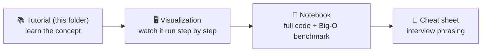

# 📚 Blind 75 — Concept Tutorials

Tutorial-format guides to the **ideas** behind each topic's problems, written in plain language with **mermaid diagrams**. Read the tutorial for a topic first, then work its problems.

> 💡 Mermaid diagrams render automatically on GitHub, in VS Code (with a Markdown Preview Mermaid extension), and in Obsidian/Typora. In a plain text editor you'll see the diagram source inside ` ```mermaid ` code fences.

## Topics

| # | Tutorial | Covers | Core patterns |
|---|----------|:------:|---------------|
| 1 | [Array](Array.md) | 10 problems | Hash map · Two pointers · Running value · Prefix/suffix · Binary search |
| 2 | [String](String.md) | 10 problems | Count letters · Stack · Two pointers · Sliding window · Expand-around-center · Length prefix |
| 3 | [Tree](Tree.md) | 14 problems | DFS/BFS · BST order · Traversal orders · Return+global best · Trie |
| 4 | [Graph](Graph.md) | 8 problems | DFS/BFS+visited · Flood fill · Topological sort · Union-Find |
| 5 | [Dynamic Programming](Dynamic%20Programming.md) | 11 problems | 1-D DP · Build-to-target · 2-D grid · Best-ending-here · Greedy · Backtracking |
| 6 | [Linked List](Linked%20List.md) | 6 problems | Pointer flipping · Fast/slow · Merge · Compose sub-routines |
| 7 | [Binary / Bit](Binary.md) | 5 problems | XOR cancels pairs · Clear/count bits · Build bit-by-bit |
| 8 | [Interval](Interval.md) | 5 problems | Sort-then-sweep · Greedy by end · Count overlaps |
| 9 | [Matrix](Matrix.md) | 4 problems | In-place tricks · Boundary walking · Grid backtracking |
| 10 | [Heap](Heap.md) | 3 problems | Top-K / extremes · Two heaps |

## How the pieces fit together



- **Tutorials** (`tutorials/`) — the concepts and patterns, with diagrams (you are here).
- **Visualizations** (`visualizations/<Topic>/`) — interactive, click-through explainers per problem.
- **Notebooks** (`notebooks/<Topic>/`) — runnable Python: worst → optimal solutions, tests, and empirical complexity plots.
- **Cheat sheets** (`visualizations/<Topic>/patterns.html`) — the tell + a sentence to say in an interview.
- **Tracker** (`../Blind75_Tracker.md`) — progress across all 75.

## Suggested study loop per topic

1. **Read the tutorial** → understand the handful of patterns.
2. **Skim the cheat sheet** → learn to *recognize* each pattern.
3. **For each problem:** try it yourself → check the visualization → read the notebook's approaches and complexity.
4. **Tick it off** in the tracker.
