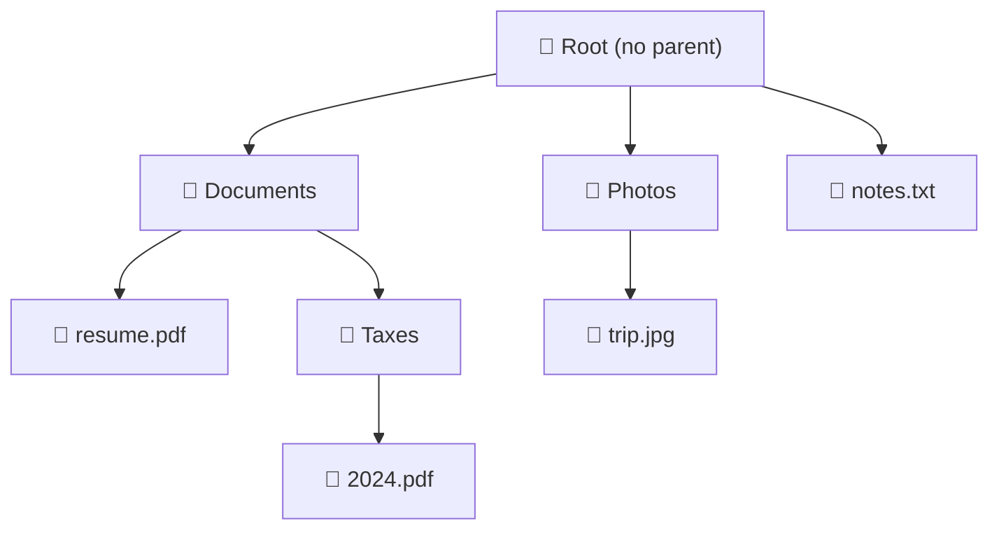
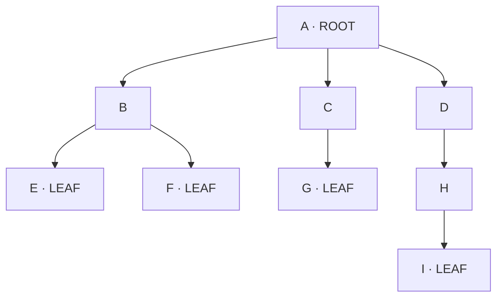
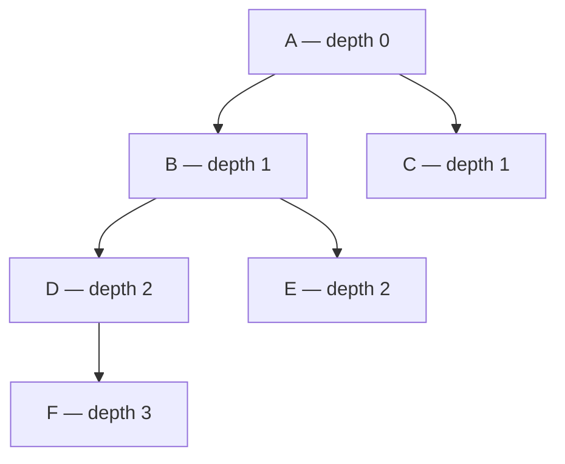
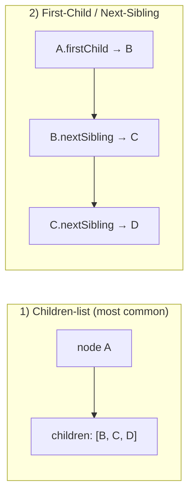
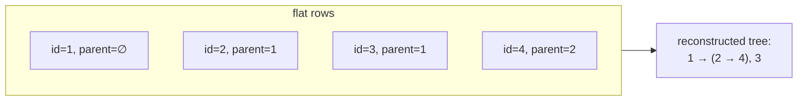
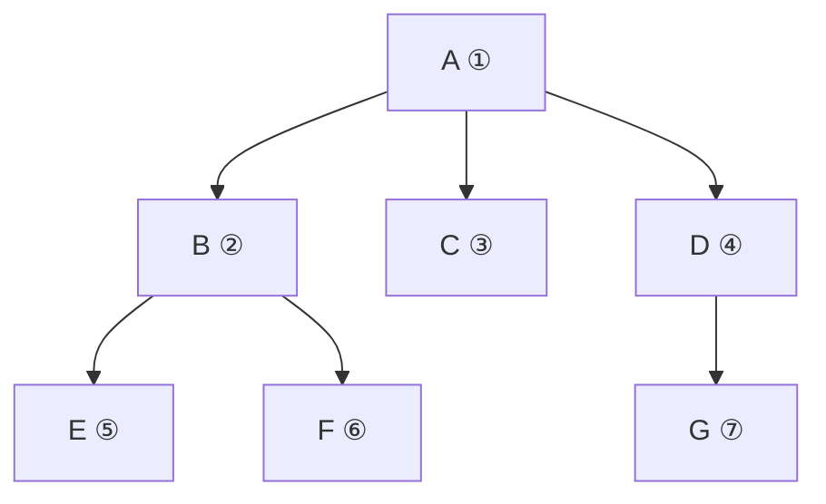

# 🌳 Generic (N-ary) Trees — A Deep Dive

> **Start here.** A *generic tree* (also called an **N-ary tree**) is the most general kind of tree: every node can
> have **any number of children**. Binary trees, BSTs, tries, and heaps are all just *special cases* of this idea, so
> understanding the generic tree first makes everything after it click.

---

## 1. What is a tree, really?

A **tree** is a way to store things that have a **hierarchy** — a "this contains those" or "this comes before those"
relationship. You already use trees every day:

| Real-world thing                     | Root              | Children                            |
| ------------------------------------ | ----------------- | ----------------------------------- |
| Your computer's**file system** | the drive`C:\`  | folders and files inside            |
| A company**org chart**         | the CEO           | direct reports                      |
| A**comment thread**            | the original post | replies, and replies to replies     |
| An**HTML page** (the DOM)      | `<html>`        | `<head>`, `<body>`, …          |
| A**table of contents**         | the book          | chapters → sections → subsections |

The one rule that makes all of these *trees*: **every node has exactly one parent, except the very top node, which
has none.** No loops, no second parents. That single rule is what separates a tree from a general graph.



*A file system is a tree: one root, every file/folder has exactly one parent, and there are no cycles.*

---

## 2. The vocabulary (learn these once, use them forever)

Every tree question uses the same words. Here they are on one picture:



| Term                    | Plain meaning                              | In the picture               |
| ----------------------- | ------------------------------------------ | ---------------------------- |
| **Node**          | one item in the tree                       | A, B, C, …                  |
| **Edge**          | the link between a parent and a child      | the arrows                   |
| **Root**          | the single top node (no parent)            | **A**                  |
| **Parent**        | the node directly above                    | B's parent is A              |
| **Child**         | a node directly below                      | B, C, D are children of A    |
| **Siblings**      | nodes that share a parent                  | B, C, D are siblings         |
| **Leaf**          | a node with**no children**           | E, F, G, I                   |
| **Internal node** | a node**with** children              | A, B, C, D, H                |
| **Ancestor**      | any node on the path up to the root        | A and D are ancestors of I   |
| **Descendant**    | any node below                             | I is a descendant of A, D, H |
| **Subtree**       | a node **plus everything under it** | H and I form a subtree       |
| **Degree**        | how many children a node has               | A has degree 3               |

### Depth, Height, and Level — the three that get confused

- **Depth of a node** = number of edges from the **root down to that node**. (Root has depth 0.)
- **Height of a node** = number of edges on the **longest path down to a leaf**. (A leaf has height 0.)
- **Height of the tree** = height of the root.
- **Level** = depth + 1 (some books start levels at 1, some at 0 — always state which).



*Depth counts **down from the root**; height counts **up from the leaves**. Here the tree's height = 3 (A→B→D→F).*

> **Memory hook:** you **fall down** to your **depth**; you **grow up** to your **height**.

---

## 3. How do we store a generic tree in code?

A node needs to hold its value and a way to reach its children. Since there can be *any* number of children, we use a
**list**.

```python
class Node:
    def __init__(self, val):
        self.val = val
        self.children = []      # a list — any number of children

# build:   A -> [B, C, D]
root = Node("A")
root.children = [Node("B"), Node("C"), Node("D")]
```

### Two common representations



- **Children-list** — each node keeps a `children` array. Simple, and what you'll use 95% of the time.
- **First-Child / Next-Sibling (LCRS)** — each node stores only *two* pointers: its **first child** and its **next
  sibling**. This cleverly turns *any* N-ary tree into a **binary tree** shape (useful theory, rarely coded live).

### The flat `{id, parent_id}` form (how databases store trees)

Databases don't store pointers — they store **rows**, each knowing its `parent_id`. Rebuilding the tree from these
rows is a classic task (index the rows by id in a hash map, then link each to its parent in one pass — `O(n)`).



---

## 4. Walking a generic tree (traversal)

To *visit every node*, you either go **deep first** (DFS) or **level by level** (BFS).

### DFS — go as deep as you can, then back up (recursion)

```python
def dfs(node):
    if node is None:
        return
    visit(node)                 # "pre-order": handle the node BEFORE its children
    for child in node.children: # then recurse into each child, left to right
        dfs(child)
```

For a generic tree there are only **two** natural DFS orders (there's no single "in-between" like binary trees have):

- **Pre-order** — handle the node **before** its children (top-down: copy, print, serialize).
- **Post-order** — handle the node **after** all its children (bottom-up: compute size/height, delete safely).

### BFS — sweep level by level (a queue)

```python
from collections import deque

def bfs(root):
    if root is None:
        return
    q = deque([root])
    while q:
        node = q.popleft()      # take the oldest waiting node (FIFO)
        visit(node)
        for child in node.children:
            q.append(child)     # its children wait their turn
```



*BFS visit order ①→⑦: all of level 1, then all of level 2 — like reading the tree row by row.*

---

## 5. The everyday operations (all are one traversal)

Almost every generic-tree task is *"traverse and combine"*. Notice how similar they look:

```python
def size(node):                              # how many nodes?
    if node is None: return 0
    return 1 + sum(size(c) for c in node.children)

def height(node):                            # longest path down (in edges)
    if node is None: return -1               # empty tree = -1 so a leaf = 0
    if not node.children: return 0
    return 1 + max(height(c) for c in node.children)

def count_leaves(node):                      # how many leaves?
    if node is None: return 0
    if not node.children: return 1
    return sum(count_leaves(c) for c in node.children)

def find(node, target):                      # does the value exist?
    if node is None: return False
    if node.val == target: return True
    return any(find(c, target) for c in node.children)
```

> **The pattern:** solve each child's subtree, then **combine** the answers (sum them, max them, or "any of them").
> This "solve subtrees → combine" shape is the heart of nearly every tree algorithm.

**Complexity:** each visits every node once → **`O(n)` time**. Recursion uses **`O(h)` stack** where `h` is the
height (worst case `O(n)` for a long skinny tree).

---

## 6. Where generic trees show up

- **File systems & UIs:** folders, menus, nested components.
- **Org charts / category trees / BOM (bill of materials).**
- **Comment & ticket threads:** a comment has replies, each reply has replies (a DevRev-style hierarchy).
- **Game/AI decision trees, syntax trees for compilers (an AST is an N-ary tree).**
- **The `{id, parent_id}` reconstruction** you'll meet in any data/integration role.

---

## 7. Cheat sheet

| Question             | Answer                                                                                   |
| -------------------- | ---------------------------------------------------------------------------------------- |
| One-parent rule?     | Every node has exactly**one parent**, except the **root** (none). No cycles. |
| Store children how?  | A**list** per node (or first-child/next-sibling).                                  |
| Visit every node?    | **DFS** (recursion/stack) or **BFS** (queue) — both `O(n)`.               |
| DFS orders on N-ary? | **Pre-order** (top-down) and **post-order** (bottom-up). No "in-order".      |
| Typical cost?        | `O(n)` time, `O(h)` extra space (recursion depth).                                   |
| Interview reflex     | *"I'll traverse once and combine each subtree's result."*                              |

**Next:** [Binary Trees →](02_Binary_Tree.md) — the special case where every node has at most two children, which
unlocks a whole extra traversal (in-order) and neat array tricks.
