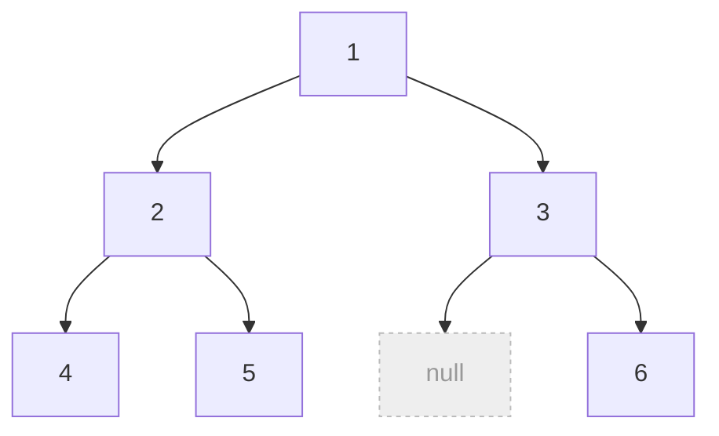
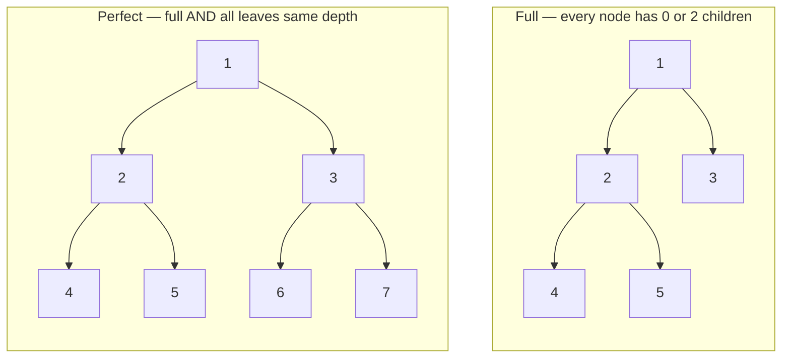
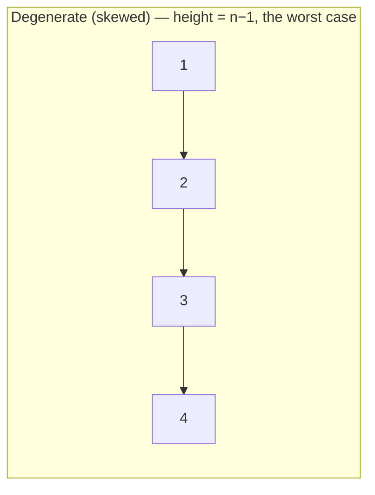
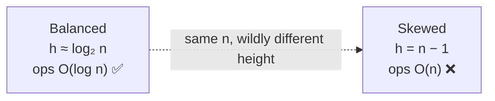
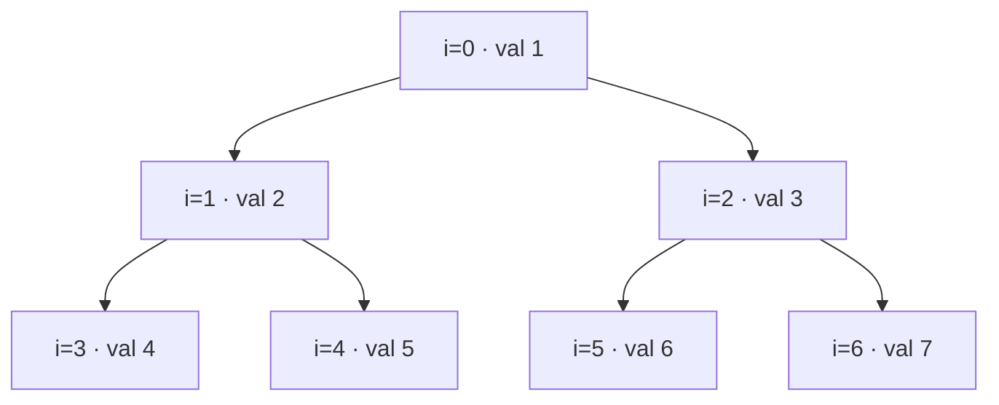
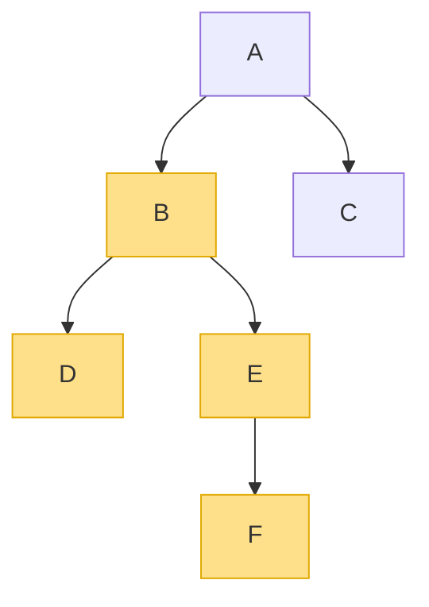

# 🌲 Binary Trees — A Deep Dive

> A **binary tree** is a tree where **every node has at most two children**, always labelled **left** and **right**.
> That tiny restriction — "at most two, and they're ordered" — is what makes binary trees the workhorse of algorithms:
> it unlocks in-order traversal, clean recursion, array packing, and (with one more rule) the binary *search* tree.

Prerequisite: the vocabulary from [Generic Trees](01_Generic_Tree.md) — root, leaf, depth, height, subtree.

---

## 1. The definition and the node

Each node holds a value and **exactly two child links**, either of which may be empty (`None`).

```python
class TreeNode:
    def __init__(self, val):
        self.val = val
        self.left = None      # left child  (or None)
        self.right = None     # right child (or None)
```



*Left and right are **distinct and ordered** — a left child is not interchangeable with a right child. Empty slots are `null`.*

> **Why "ordered" matters:** the tree with 2 on the left and 3 on the right is a *different* tree from 3-left, 2-right.
> This ordering is exactly what a Binary **Search** Tree will exploit.

---

## 2. The family of shapes (know these names)

Interviewers love asking "is this tree *complete*? *balanced*?" Here's the whole family:



| Shape                         | Rule                                                                                  | Why you care                                                 |
| ----------------------------- | ------------------------------------------------------------------------------------- | ------------------------------------------------------------ |
| **Full** (proper)       | every node has**0 or 2** children (never just 1)                                | expression trees, Huffman coding                             |
| **Complete**            | every level full**except possibly the last**, which fills **left→right** | how**heaps** are stored; enables the array trick below |
| **Perfect**             | full*and* every leaf at the **same depth** → exactly `2^h⁺¹ − 1` nodes  | the "ideal" dense tree                                       |
| **Balanced**            | left/right heights differ by**≤ 1** at every node → height stays`O(log n)`        | keeps operations fast (AVL, Red-Black)                       |
| **Degenerate / skewed** | every node has one child → basically a**linked list**                          | the worst case: height`O(n)`                               |



*A skewed tree is a linked list in disguise — this is the case that turns an "O(log n)" tree into O(n).*

---

## 3. The counting laws (quick math that impresses)

For a binary tree of height `h` (edges), and `n` nodes:

| Fact                                     | Formula                   |
| ---------------------------------------- | ------------------------- |
| Max nodes at level`L` (root = level 0) | `2^L`                   |
| Max nodes in a tree of height`h`       | `2^(h+1) − 1`          |
| Min height for`n` nodes (balanced)     | `⌊log₂ n⌋`           |
| Max height for`n` nodes (skewed)       | `n − 1`                |
| A perfect tree with`L` leaves has      | `L − 1` internal nodes |

> **The punchline:** height sits somewhere between `log₂ n` (balanced, great) and `n − 1` (skewed, terrible).
> Since most tree operations cost **`O(h)`**, *keeping the tree balanced is the whole game.*



---

## 4. Two ways to store a binary tree

### 4a. Linked nodes (the default)

Each node points to its `left` and `right`. Flexible, handles any shape, uses `O(n)` pointers. This is what you'll
use almost always.

### 4b. Array / index packing (great for *complete* trees)

Lay the tree out level by level into an array. Then the relationships are pure arithmetic — **no pointers needed:**

```
index:   0   1   2   3   4   5   6
value: [ 1 , 2 , 3 , 4 , 5 , 6 , 7 ]

for the node at index i:
    left child  = 2*i + 1
    right child = 2*i + 2
    parent      = (i - 1) // 2
```



*The same tree packed into an array. `left(i)=2i+1`, `right(i)=2i+2`, `parent(i)=(i−1)/2`. This is exactly how a **binary heap** is stored — cache-friendly and pointer-free.*

> Array packing is efficient **only for complete trees** — a sparse/skewed tree would waste huge gaps of empty slots.

---

## 5. The core operations (all one recursion)

Binary-tree recursion has a beautiful shape: **do something with `left`, do something with `right`, combine.**

```python
def size(node):                          # count nodes
    if not node: return 0
    return 1 + size(node.left) + size(node.right)

def height(node):                        # longest path down, in edges
    if not node: return -1               # empty = -1 → a leaf returns 0
    return 1 + max(height(node.left), height(node.right))

def invert(node):                        # mirror the tree (LeetCode 226)
    if not node: return None
    node.left, node.right = invert(node.right), invert(node.left)  # swap, then recurse
    return node
```

### Diameter — a classic "return one thing, track another"

The **diameter** is the longest path between *any* two nodes (it may not pass through the root). The trick: a single
DFS **returns the height**, while a side variable **records the best left+right sum** seen anywhere.

```python
def diameter(root):
    best = 0
    def depth(node):
        nonlocal best
        if not node: return 0
        L = depth(node.left)
        R = depth(node.right)
        best = max(best, L + R)          # path THROUGH this node = L + R edges
        return 1 + max(L, R)             # height reported to the parent
    depth(root)
    return best
```



*Diameter here is the path D→B→E→F (highlighted) = 3 edges — it doesn't touch the root. The DFS finds it by combining `left height + right height` at node B.*

> **The reusable idea:** when a node needs to *report* one value to its parent (height) but the *answer* depends on
> combining both sides (left + right), **return the report and stash the answer in a side variable.** This single
> pattern solves diameter, max-path-sum, "is balanced?", and more.

---

## 6. Traversals (the headline feature)

Because children are ordered as left/right, a binary tree supports **three** DFS orders — including the special
**in-order** that generic trees don't have:

- **Pre-order** — Node, Left, Right → copy/serialize a tree.
- **In-order** — Left, Node, Right → on a **BST**, prints values **in sorted order**.
- **Post-order** — Left, Right, Node → delete/free, or compute bottom-up (heights, sums).
- **Level-order (BFS)** — row by row → shortest paths, level grouping.

These deserve their own deep dive: **[Tree Traversal →](04_Tree_Traversal.md)**.

---

## 7. Cheat sheet

| Question                  | Answer                                                                                      |
| ------------------------- | ------------------------------------------------------------------------------------------- |
| Max children per node?    | **2**, ordered as left / right.                                                       |
| Best vs worst height?     | `log₂ n` (balanced) … `n − 1` (skewed).                                              |
| Why balance matters?      | Most ops are`O(h)`; balanced keeps `h = O(log n)`.                                      |
| Array packing rule?       | `left=2i+1`, `right=2i+2`, `parent=(i−1)/2` — for **complete** trees / heaps. |
| Recursion shape?          | Solve`left`, solve `right`, **combine**.                                          |
| "Report vs answer" trick? | Return one value up (height); track the real answer in a side variable (diameter).          |

**Next:** [Binary Search Trees →](03_Binary_Search_Tree.md) — add one ordering rule and searching becomes `O(log n)`.
