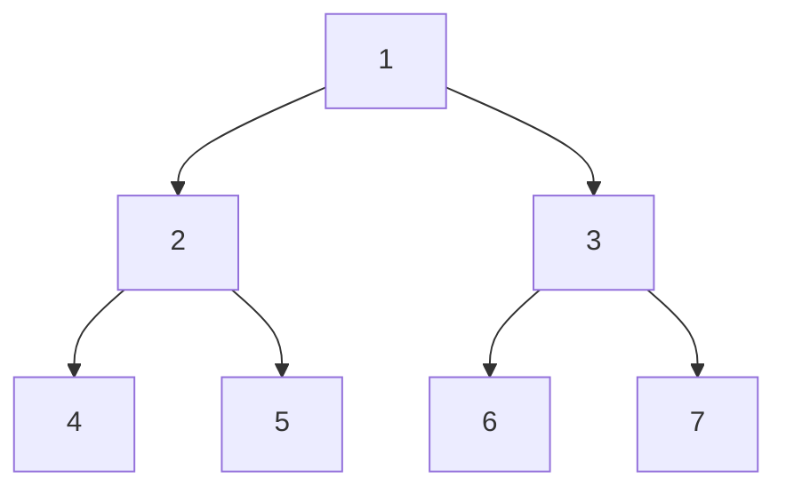
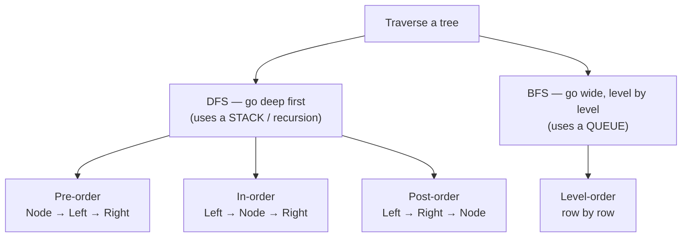
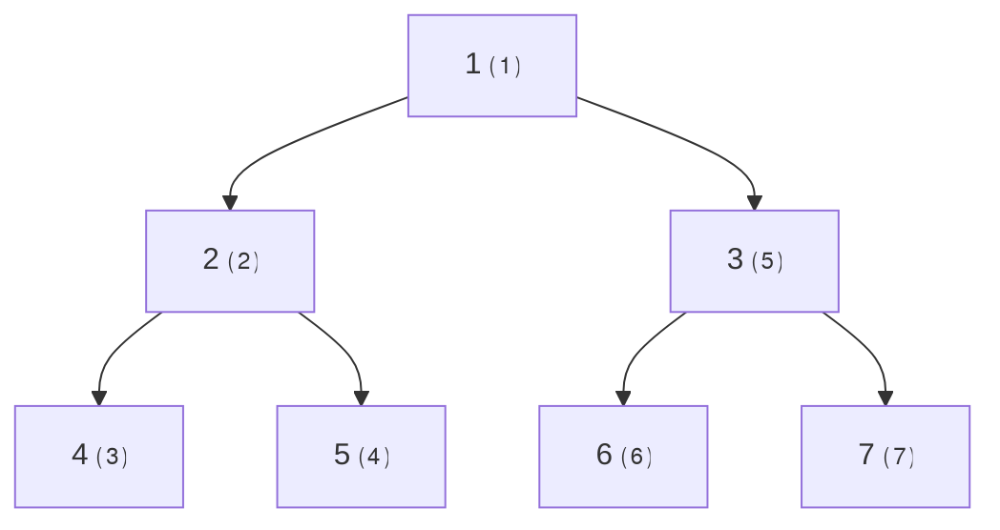
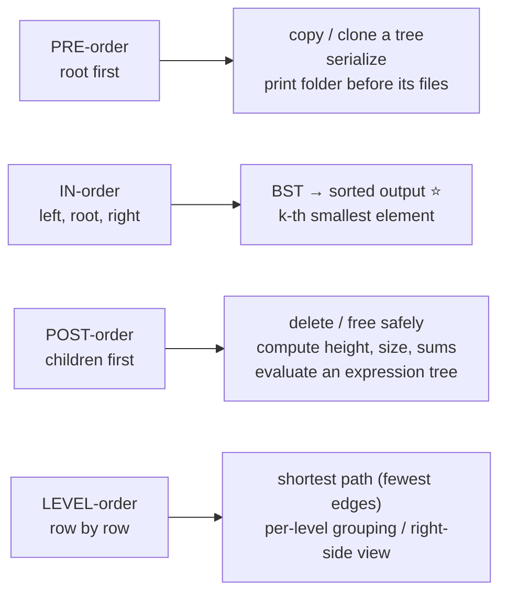
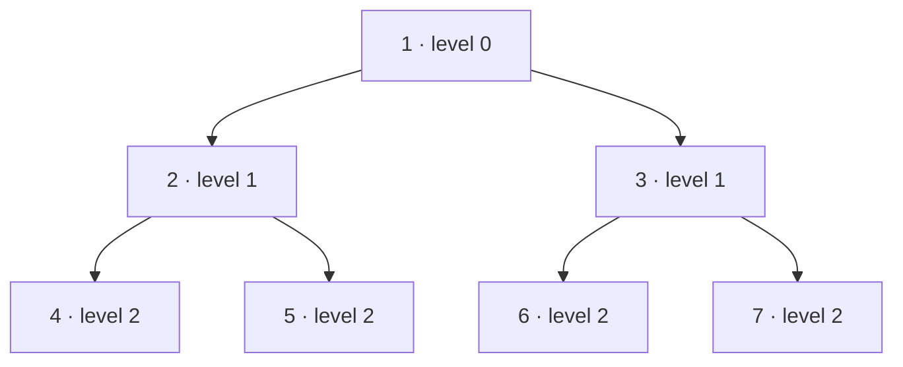
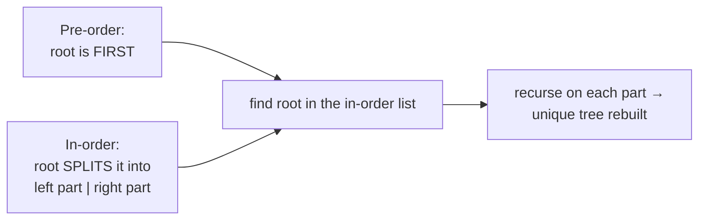

# 🧭 Tree Traversal — A Deep Dive

> **Traversal = visiting every node in some order.** There are only two big ideas — go **deep** (DFS) or go **wide**
> (BFS) — but DFS splits into three orders (**pre / in / post**) and each one is the *right* tool for a different job.
> Get this chapter cold and most tree problems become "pick the order, then do the obvious thing."

Prerequisite: [Binary Trees](02_Binary_Tree.md). We'll use this one tree throughout:



---

## 1. The big picture



The **only** difference between the three DFS orders is **when you "visit" the node** relative to recursing into its
children — *before* (pre), *between* (in), or *after* (post). Same walk, different moment.

---

## 2. Depth-First Search (recursive — the easy version)

```python
def preorder(node):
    if not node: return
    visit(node)              # ← visit BEFORE children
    preorder(node.left)
    preorder(node.right)

def inorder(node):
    if not node: return
    inorder(node.left)
    visit(node)              # ← visit BETWEEN children
    inorder(node.right)

def postorder(node):
    if not node: return
    postorder(node.left)
    postorder(node.right)
    visit(node)              # ← visit AFTER children
```

On our tree they produce:

| Order                | Result                  | The "moment" you visit                |
| -------------------- | ----------------------- | ------------------------------------- |
| **Pre-order**  | `1, 2, 4, 5, 3, 6, 7` | on the way**down** (root first) |
| **In-order**   | `4, 2, 5, 1, 6, 3, 7` | **between** left and right      |
| **Post-order** | `4, 5, 2, 6, 7, 3, 1` | on the way**up** (root last)    |



*Pre-order visit numbers ⑴–⑺: you stamp a node the **first time you reach it**, then dive left, then right.*

> **See the pattern in the outputs:** pre-order **starts** with the root (1); post-order **ends** with the root (1);
> in-order puts the root (1) **in the middle** with its whole left subtree before it and right subtree after it.

---

## 3. Why three orders? Each solves a different job



- **Pre-order** — you handle a node **before** its children, so you can *reproduce structure top-down*: cloning, serializing, or writing a folder's name before descending into it.
- **In-order** — on a **BST** this is the killer feature: it emits values **in sorted order**. Need the k-th smallest? In-order and stop at k.
- **Post-order** — you handle a node **after** its children, so the children's answers are ready: computing height, size, subtree sums, or **deleting** (free the children before the parent, or you'd lose the pointers).
- **Level-order** — visits by distance from the root, so it naturally finds the **fewest-edges** path and groups nodes by level.

> **Rule of thumb:** need *sorted* → in-order. Need *bottom-up* (heights/sums/delete) → post-order. Need *top-down* (copy/serialize) → pre-order. Need *nearest / by level* → BFS.

---

## 4. Iterative DFS (when recursion is banned or the tree is deep)

Recursion uses the **call stack**; the iterative version just makes that stack **explicit**. Useful when a deep,
skewed tree could blow the recursion limit.

```python
def preorder_iter(root):
    if not root: 
      return []
    out, stack = [], [root]
    while stack:
        node = stack.pop()               # LIFO → depth-first
        out.append(node.val)             # visit
        if node.right: 
          stack.append(node.right)   # push RIGHT first...
        if node.left:  
          stack.append(node.left)    # ...so LEFT pops first
    return out

def inorder_iter(root):
    out, stack, node = [], [], root
    while stack or node:
        while node:                      # go as far LEFT as possible
            stack.append(node)
            node = node.left
        node = stack.pop()               # deepest un-visited node
        out.append(node.val)             # visit it (left is done)
        node = node.right                # now handle its right subtree
    return out
```

> **Pre-order stack trick:** push **right before left**, because a stack reverses order — so left comes out on top and
> is processed first, matching Node→Left→Right.

---

## 5. Breadth-First Search (level-order) with a queue

```python
from collections import deque

def level_order(root):
    if not root: return []
    out, q = [], deque([root])
    while q:
        level = []
        for _ in range(len(q)):          # freeze this level's size...
            node = q.popleft()           # FIFO → wide, not deep
            level.append(node.val)
            if node.left:  q.append(node.left)
            if node.right: q.append(node.right)
        out.append(level)                # ...so each `out` entry is one full level
    return out
# our tree → [[1], [2, 3], [4, 5, 6, 7]]
```



*The `for _ in range(len(q))` snapshot is the key idea: it processes **exactly one level** per outer loop, so you can group, average, or grab the last node of each level (the "right-side view").*

> **Stack vs Queue in one line:** DFS uses a **stack** (LIFO → dive deep); BFS uses a **queue** (FIFO → spread wide).
> Swapping the data structure is literally the only change.

---

## 6. Reconstructing a tree from traversals

A single traversal isn't enough to rebuild a tree — but **two** are (as long as one is in-order):



- **Pre-order + In-order** → the pre-order's first element is the root; locate it in the in-order to split left/right;
  recurse. (Post-order + In-order works the same, using the *last* post-order element.)
- **Pre-order + Post-order alone** is **not** enough (it can't disambiguate some shapes).

---

## 7. Advanced: Morris traversal (in-order in O(1) space)

Every method above uses `O(h)` space (the stack/queue). **Morris traversal** does in-order in **`O(1)` extra space**
by temporarily rewiring each node's rightmost-left descendant to point back to it ("threading"), then undoing it.
It's rarely needed but a strong thing to *name* when asked "can you do better than O(h) space?"

---

## 8. Complexity & cheat sheet

| Traversal         | Time     | Space          | Reach for it when…                        |
| ----------------- | -------- | -------------- | ------------------------------------------ |
| Pre-order         | `O(n)` | `O(h)`       | copy, serialize, top-down                  |
| In-order          | `O(n)` | `O(h)`       | **BST sorted output**, k-th smallest |
| Post-order        | `O(n)` | `O(h)`       | height/size/sums, delete, expression eval  |
| Level-order (BFS) | `O(n)` | `O(w)` width | shortest path, per-level work              |
| Morris (in-order) | `O(n)` | `O(1)`       | when space is the constraint               |

| Question                              | Answer                                                 |
| ------------------------------------- | ------------------------------------------------------ |
| DFS vs BFS structure?                 | DFS =**stack/recursion**; BFS = **queue**. |
| Which order for sorted BST output?    | **In-order**.                                    |
| Which for bottom-up (height, delete)? | **Post-order**.                                  |
| Which for copy/serialize?             | **Pre-order**.                                   |
| Rebuild a tree from traversals?       | need**in-order + (pre or post)**.                |
| Better than O(h) space?               | **Morris** in-order, `O(1)`.                   |

**Back to the start:** [Generic Trees](01_Generic_Tree.md) · [Binary Trees](02_Binary_Tree.md) ·
[Binary Search Trees](03_Binary_Search_Tree.md)
