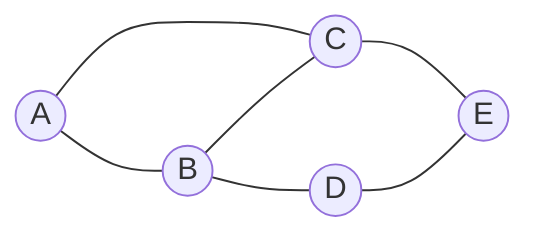
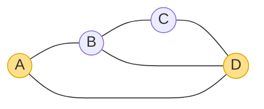
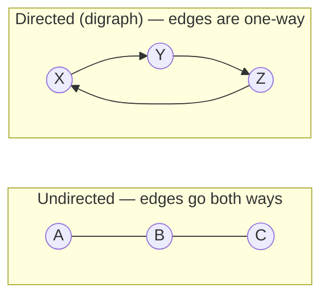
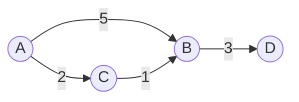
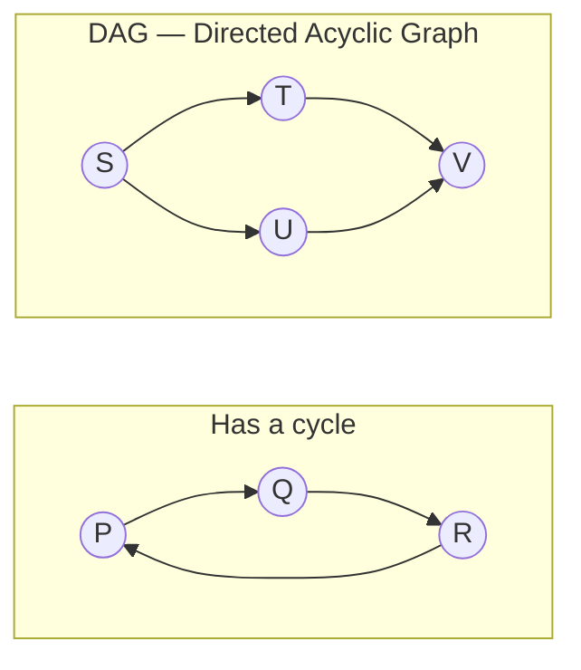
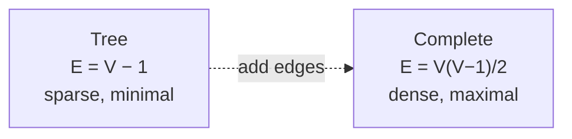

# 🕸️ Graph Fundamentals — A Deep Dive

> A **graph** is the most general "things and the connections between them" structure. A tree is just a graph with
> extra rules; a linked list is a graph in a line. Once you can *see* a problem as vertices and edges, a huge family
> of problems — maps, networks, dependencies, recommendations — becomes one toolkit.

Prerequisite: the tree series ([Generic](01_Generic_Tree.md) → [Traversal](04_Tree_Traversal.md)). A tree is a
**connected, acyclic graph**, so everything you learned there is a special case of what follows.

---

## 1. What is a graph?

A graph is just two things:

- **Vertices** (also called *nodes*) — the things.
- **Edges** — the connections between pairs of things.

That's it. What the things and connections *mean* is up to you:

| Graph | Vertices | Edges |
|---|---|---|
| Social network | people | "is friends with" |
| Road map | intersections | roads |
| The web | pages | hyperlinks |
| Flight network | airports | flights |
| Task pipeline | tasks | "must finish before" |
| Course prerequisites | courses | "is required for" |

*An **undirected** graph: 5 vertices, 6 edges. Each edge just says "these two are connected" — no direction.*

> **Tree vs graph in one line:** a tree has exactly **one path** between any two nodes and **no cycles**; a graph can
> have **many paths, cycles, or none at all**. A tree with `n` nodes has exactly `n − 1` edges — a graph can have
> anywhere from `0` to `~n²`.

---

## 2. The vocabulary

| Term | Plain meaning |
|---|---|
| **Adjacent / neighbours** | two vertices joined by an edge (A and B above) |
| **Degree** | how many edges touch a vertex (B has degree 3) |
| **Path** | a sequence of vertices connected by edges (A→B→C→D) |
| **Cycle** | a path that returns to where it started (A→B→D→A, highlighted) |
| **Connected** | you can reach every vertex from every other |
| **Component** | a maximal "island" of connected vertices |
| **Subgraph** | a graph made of some of the vertices/edges |

For **directed** graphs each vertex has two degrees:
- **In-degree** — arrows coming *in*.
- **Out-degree** — arrows going *out*.

---

## 3. The types of graph (name them fast)

### Undirected vs Directed

- **Undirected** — an edge means a mutual link ("friends", "roads you can drive both ways").
- **Directed (digraph)** — an edge has a direction ("follows", "depends on", "one-way street"). Arrows matter.

### Weighted vs Unweighted

*A **weighted** graph puts a number (cost/distance/time) on each edge. "Shortest path" now means *cheapest*, which needs Dijkstra/Bellman-Ford — not just BFS.*

### Cyclic vs Acyclic — and the all-important DAG

- **Acyclic** — no cycles. A **DAG** (directed + acyclic) is *the* structure for **dependencies / scheduling** — it
  can be **topologically sorted** into a valid order. (This is the workflow-orchestration shape.)
- **Cyclic** — has at least one cycle. A dependency cycle = "can never be scheduled".

### A few more worth knowing

| Type | Meaning |
|---|---|
| **Connected / Disconnected** | one island, or several components |
| **Strongly connected** (directed) | every vertex reaches every other *following arrows* |
| **Dense vs Sparse** | many edges (`E ≈ V²`) vs few (`E ≈ V`) — this drives which **representation** you pick |
| **Complete** | every pair is connected (`V(V−1)/2` edges) |
| **Bipartite** | vertices split into two groups; edges only cross between groups (matchings, 2-colouring) |
| **Simple** | no self-loops, no duplicate edges (the usual assumption) |

---

## 4. How big can a graph get?

For `V` vertices:

- **Minimum edges** to stay connected: `V − 1` (that's a **tree**).
- **Maximum edges** (simple undirected): `V(V − 1) / 2` (a **complete** graph).

> **Why this matters:** whether `E` is closer to `V` (**sparse**) or `V²` (**dense**) decides whether you store the
> graph as an **adjacency list** or an **adjacency matrix** — the subject of the next chapter.

---

## 5. Cheat sheet

| Question | Answer |
|---|---|
| A graph is…? | **vertices + edges** — things and their connections. |
| Tree vs graph? | tree = **connected + acyclic**, exactly `n−1` edges, one path between any two nodes. |
| Directed vs undirected? | one-way arrows vs mutual links. |
| Weighted? | edges carry a cost → shortest path needs Dijkstra, not plain BFS. |
| DAG? | directed + acyclic → can be **topologically sorted** (dependencies/scheduling). |
| Sparse vs dense? | `E ≈ V` vs `E ≈ V²` — picks your representation. |
| Degree? | edges touching a vertex (in/out for directed). |

**Next:** [Graph Representation →](06_Graph_Representation.md) — how to actually store a graph (adjacency **matrix**
vs **list**), and the space/time trade-off that decides which to use.
