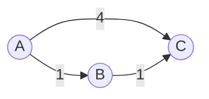
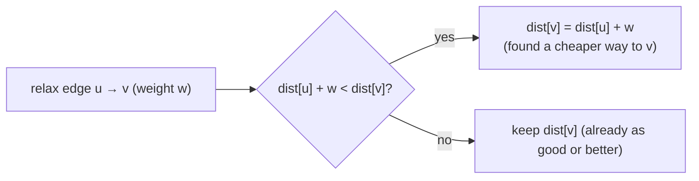
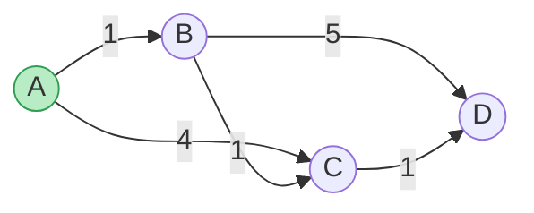
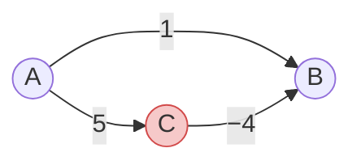
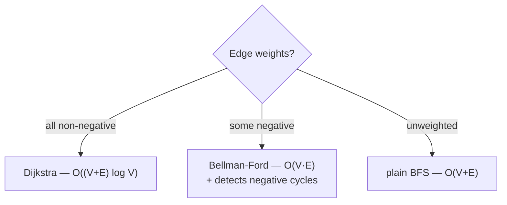

# 🛣️ Weighted Shortest Paths — Dijkstra & Bellman-Ford

> On an **unweighted** graph, BFS finds the shortest path (fewest edges). The moment edges carry **weights** (cost,
> distance, time, latency), "shortest" means **cheapest total**, and BFS is no longer enough. Two algorithms solve
> this: **Dijkstra** (fast, needs non-negative weights) and **Bellman-Ford** (slower, but handles negative edges and
> detects negative cycles).

Prerequisite: [Graph Traversal](07_Graph_Traversal.md) — BFS, adjacency lists, the visited set.

---

## 1. Why BFS breaks on weighted graphs

BFS counts **edges**, not **cost**. Look what goes wrong:


*BFS says A→C is "1 edge" (cost 4). But A→B→C is "2 edges" costing only **2**. Fewest edges ≠ cheapest — so we need a cost-aware algorithm.*

The core operation for both algorithms is **relaxation**: if going *through* `u` reaches `v` more cheaply than the
best we knew, update `v`'s distance.



---

## 2. Dijkstra — greedy, with a priority queue

**Idea:** always settle the **closest unfinished vertex** next. Because weights are non-negative, once a vertex is
picked as the closest, no later path can beat it — so its distance is final. A **min-heap** keyed by distance gives us
"closest unfinished vertex" quickly.

```python
import heapq

def dijkstra(adj, start):
    """adj[u] = list of (v, weight). Returns shortest distance from start to every vertex.
       Requires NON-NEGATIVE weights."""
    dist = {start: 0}
    pq = [(0, start)]                     # (distance so far, vertex) — min-heap by distance
    while pq:
        d, u = heapq.heappop(pq)          # the closest unfinished vertex
        if d > dist.get(u, float("inf")):
            continue                      # stale entry — we already found u cheaper
        for v, w in adj[u]:
            nd = d + w                     # cost to reach v THROUGH u
            if nd < dist.get(v, float("inf")):
                dist[v] = nd               # relax: found a cheaper path to v
                heapq.heappush(pq, (nd, v))
    return dist
```


*From A: settle A(0) → B(1) → C(2, via B) → D(3, via C). The greedy "closest next" order guarantees each settled distance is final.*

- **Complexity:** `O((V + E) log V)` with a binary heap — the heap operations dominate.
- **Why non-negative only:** Dijkstra "locks in" a vertex the moment it's popped. A **negative** edge could later offer
  a cheaper route to an already-locked vertex — but we've stopped looking. That's the fatal flaw:


*Dijkstra locks B at 1, then never reconsiders it — missing A→C→B = 5 + (−4) = **1**… or worse, a case where the negative route is genuinely cheaper. Negative edges ⇒ use Bellman-Ford.*

---

## 3. Bellman-Ford — slower, but handles negative edges

**Idea:** don't be clever about order — just **relax every edge, `V − 1` times**. After `k` rounds, every shortest
path using at most `k` edges is correct; since a simple shortest path has at most `V − 1` edges, `V − 1` rounds
settle everything.

```python
def bellman_ford(vertices, edges, start):
    """edges = list of (u, v, weight). Handles negative weights.
       Returns (dist, has_negative_cycle)."""
    dist = {v: float("inf") for v in vertices}
    dist[start] = 0
    for _ in range(len(vertices) - 1):    # V-1 rounds
        for u, v, w in edges:
            if dist[u] + w < dist[v]:      # relax every edge
                dist[v] = dist[u] + w
    # One more pass: if anything STILL improves, a negative cycle exists.
    neg_cycle = any(dist[u] + w < dist[v] for u, v, w in edges)
    return dist, neg_cycle
```


- **Complexity:** `O(V · E)` — slower than Dijkstra, but strictly more powerful.
- **Negative-cycle detection:** if a `V`-th relaxation *still* improves something, a negative cycle is reachable (you
  could loop forever getting cheaper) — so "shortest path" is undefined. Dijkstra can't detect this; Bellman-Ford can.

---

## 4. Which one? (and the wider family)



| | BFS | Dijkstra | Bellman-Ford |
|---|---|---|---|
| Weights | none | **non-negative** | any (incl. negative) |
| Negative cycles | n/a | can't handle | **detects** |
| Time | `O(V+E)` | `O((V+E) log V)` | `O(V·E)` |
| Idea | rings | greedy "closest next" | relax all edges `V−1×` |

> **Wider family (name-drop these):** **Dijkstra** = single-source, non-negative. **Bellman-Ford** = single-source,
> negatives ok. **A\*** = Dijkstra + a heuristic (games, maps). **Floyd-Warshall** = all-pairs shortest paths in
> `O(V³)` (a tiny DP over "can I go through vertex k?").

---

## 5. Cheat sheet

| Question | Answer |
|---|---|
| Why not BFS on weighted graphs? | BFS counts **edges**, not **cost** — fewest edges ≠ cheapest. |
| Core operation? | **relaxation**: `if dist[u]+w < dist[v]: dist[v] = dist[u]+w`. |
| Dijkstra needs? | **non-negative** weights; a **min-heap** for "closest next"; `O((V+E) log V)`. |
| Why negatives break Dijkstra? | it locks a vertex on pop and never reconsiders it. |
| Bellman-Ford idea? | relax **all edges `V−1` times**; a further improvement ⇒ **negative cycle**. |
| All-pairs? | **Floyd-Warshall**, `O(V³)`. |

**Next:** [Minimum Spanning Tree →](09_Minimum_Spanning_Tree.md) — connect everything for the least total weight,
with Kruskal, Prim, and Union-Find.
