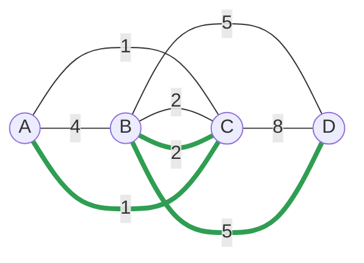
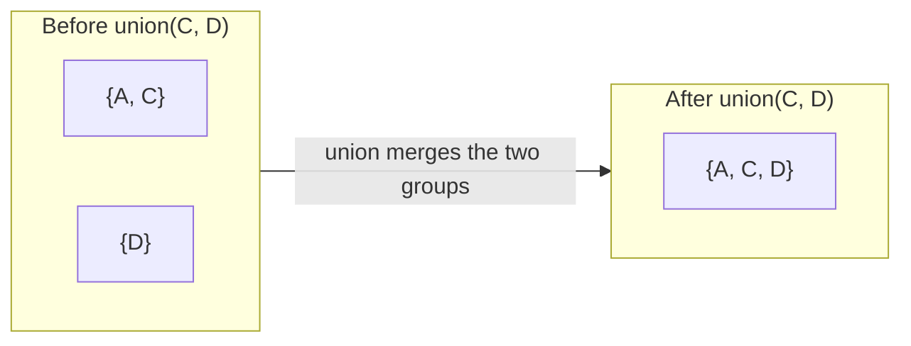
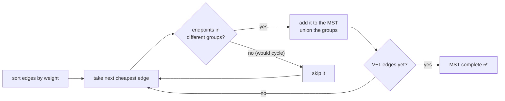
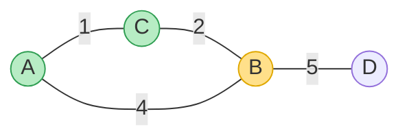

# 🌉 Minimum Spanning Tree — Kruskal, Prim & Union-Find

> A **Minimum Spanning Tree (MST)** connects **all** the vertices of a weighted, undirected graph using the
> **cheapest total set of edges** — with **no cycles**. Think "wire up every house to the network for the least cable",
> or "connect all data centres with minimum total latency". Two greedy algorithms find it: **Kruskal** and **Prim**.

Prerequisite: [Weighted Shortest Paths](08_Weighted_Shortest_Paths.md) — weighted graphs and edge lists.

---

## 1. What exactly is a spanning tree?

Given a connected, weighted, undirected graph:

- A **spanning tree** = a subset of edges that connects **all `V` vertices** with **no cycle** → exactly **`V − 1`
  edges**.
- The **minimum** spanning tree = the spanning tree whose edge weights **sum to the least**.


*The thick green edges (A–C=1, B–C=2, B–D=5) connect all 4 vertices with total weight **8** — the minimum. Any other spanning tree costs more.*

> **Why greedy works — the cut property:** for any way you split the vertices into two groups, the **cheapest edge
> crossing the split** is always safe to include in *some* MST. Both algorithms below are just clever ways to keep
> picking a safe cheapest edge.

---

## 2. Union-Find (Disjoint Set Union) — the cycle-check engine

Kruskal needs to answer, fast: *"would adding this edge create a cycle?"* That's the same as: *"are these two
vertices already in the same connected group?"* **Union-Find** answers it in near-`O(1)`.

```python
class UnionFind:
    """Tracks which 'group' each element is in. Two speed tricks make it near-O(1)."""
    def __init__(self, n):
        self.parent = list(range(n))     # each element starts as its own leader
        self.rank = [0] * n              # tree-height hint for balanced merges

    def find(self, x):
        """Return x's group leader, flattening the path on the way up."""
        while self.parent[x] != x:
            self.parent[x] = self.parent[self.parent[x]]  # path compression
            x = self.parent[x]
        return x

    def union(self, a, b):
        """Merge the groups of a and b. Returns False if they were ALREADY together."""
        ra, rb = self.find(a), self.find(b)
        if ra == rb:
            return False                 # same group already → adding this edge = a cycle
        if self.rank[ra] < self.rank[rb]:  # union by rank: hang the shorter tree
            ra, rb = rb, ra
        self.parent[rb] = ra
        if self.rank[ra] == self.rank[rb]:
            self.rank[ra] += 1
        return True
```



- **`find`** returns a group's leader; **path compression** flattens the tree so future finds are instant.
- **`union`** merges two groups; **union by rank** keeps trees shallow.
- Together: near-**`O(α(n))`** per operation (α = inverse Ackermann ≈ a constant ≤ 4 for any real input).

---

## 3. Kruskal — sort edges, add the cheap ones that don't cycle

**Idea:** consider edges **from cheapest to most expensive**; add an edge **only if** its endpoints are in different
groups (i.e. it doesn't form a cycle). Stop at `V − 1` edges.

```python
def kruskal(n, edges):
    """edges = list of (weight, u, v). Vertices are 0..n-1. Returns (mst_edges, total)."""
    uf = UnionFind(n)
    mst, total = [], 0
    for w, u, v in sorted(edges):        # cheapest edges first
        if uf.union(u, v):               # different groups → safe, no cycle
            mst.append((u, v, w))
            total += w
            if len(mst) == n - 1:        # a spanning tree has exactly V-1 edges
                break
    return mst, total
```



- **Complexity:** `O(E log E)` — dominated by sorting the edges.
- **Best for sparse graphs** and when edges are already sorted or easy to sort. It's **edge-centric**.

---

## 4. Prim — grow one tree outward, always take the cheapest frontier edge

**Idea:** start from any vertex and **grow a single tree**. Repeatedly add the **cheapest edge that connects a new
vertex** to the tree. A **min-heap** of frontier edges gives the cheapest one quickly.

```python
import heapq

def prim(adj, start=0):
    """adj[u] = list of (v, weight). Returns (mst_edges, total)."""
    visited = {start}
    pq = [(w, start, v) for v, w in adj[start]]   # edges leaving the start
    heapq.heapify(pq)
    mst, total = [], 0
    while pq and len(visited) < len(adj):
        w, u, v = heapq.heappop(pq)      # cheapest edge crossing the frontier
        if v in visited:
            continue                     # v already in the tree → skip
        visited.add(v)
        mst.append((u, v, w))
        total += w
        for nxt, w2 in adj[v]:           # v's edges become new frontier candidates
            if nxt not in visited:
                heapq.heappush(pq, (w2, v, nxt))
    return mst, total
```


*Tree so far = {A, C}. The frontier edges are C–B(2) and A–B(4); Prim takes the cheaper (C–B=2), pulling B in next.*

- **Complexity:** `O((V + E) log V)` with a binary heap — like Dijkstra's shape.
- **Best for dense graphs**. It's **vertex-centric** (grows one connected tree the whole time).

---

## 5. Kruskal vs Prim

| | **Kruskal** | **Prim** |
|---|---|---|
| Grows | many small forests that merge | one tree outward from a start |
| Needs | **Union-Find** (cycle check) | **min-heap** (cheapest frontier) |
| Picks | globally cheapest safe edge | cheapest edge touching the tree |
| Time | `O(E log E)` | `O((V+E) log V)` |
| Sweet spot | **sparse** graphs | **dense** graphs |
| Both give | a valid MST (same total weight) | a valid MST |

> Both are greedy and both are correct (the cut property guarantees it). If edge weights are all distinct, the MST is
> **unique** — Kruskal and Prim produce the same tree.

---

## 6. Cheat sheet

| Question | Answer |
|---|---|
| MST is…? | connect all `V` vertices, **no cycle**, **`V−1` edges**, **minimum total weight**. |
| Why greedy works? | the **cut property** — the cheapest edge across any split is safe. |
| Kruskal? | sort edges; add cheapest that **doesn't cycle** (Union-Find); `O(E log E)`. |
| Prim? | grow a tree; add cheapest **frontier** edge (min-heap); `O((V+E) log V)`. |
| Union-Find ops? | `find` (with path compression) + `union` (by rank) ≈ **O(α(n))**. |
| Cycle check = ? | `find(u) == find(v)` → adding `u–v` would form a cycle. |

**Next:** [Topological Sort →](10_Topological_Sort.md) — ordering a DAG so every dependency comes first.
