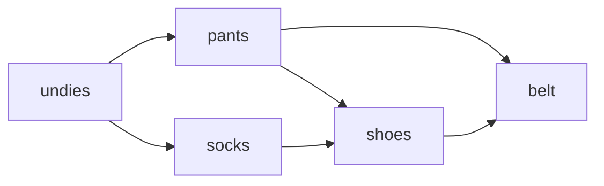
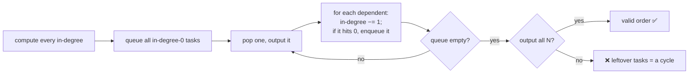
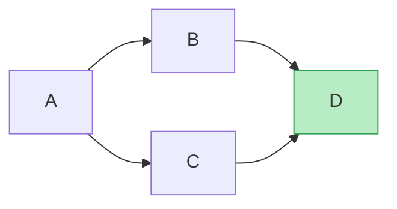

# 🔢 Topological Sort — Ordering a DAG

> A **topological sort** lists the vertices of a **Directed Acyclic Graph (DAG)** so that **every edge points
> forward** — every task comes *before* the tasks that depend on it. It's the algorithm behind build systems, course
> prerequisites, package installers, spreadsheet recalculation, and task pipelines.

Prerequisite: [Graph Traversal](07_Graph_Traversal.md) — directed graphs, in-degree, BFS/DFS.

---

## 1. The problem

Given tasks with "must come before" rules, produce a valid order. An edge `u → v` means **`u` must finish before
`v`**.


*One valid order: undies, socks, pants, shoes, belt. Note there are **several** valid orders — socks can come before or after pants — as long as every arrow points forward.*

> **The one requirement: no cycles.** If tasks depend on each other in a loop, no valid order exists. So topological
> sort only works on a **DAG** — and, handily, *trying* to sort also **detects cycles**.

---

## 2. Kahn's algorithm (BFS-based) — peel off the ready tasks

**Idea:** a task is **ready** when it has **no remaining prerequisites** — its **in-degree** is 0. Repeatedly output a
ready task and "remove" it, which lowers its dependents' in-degrees, exposing the next ready tasks.

```python
from collections import deque

def topo_sort_kahn(n, edges):
    """n vertices (0..n-1); edges = list of (u, v) meaning u must come before v.
       Returns a valid order, or None if the graph has a cycle."""
    indeg = [0] * n
    adj = [[] for _ in range(n)]
    for u, v in edges:
        adj[u].append(v)
        indeg[v] += 1                    # v gains a prerequisite

    q = deque(i for i in range(n) if indeg[i] == 0)   # all initially-ready tasks
    order = []
    while q:
        u = q.popleft()
        order.append(u)                  # u has no prerequisites left → output it
        for v in adj[u]:
            indeg[v] -= 1                # u is done, so v loses a prerequisite
            if indeg[v] == 0:
                q.append(v)              # v just became ready
    return order if len(order) == n else None   # short order ⇒ a cycle blocked some tasks
```



- **Complexity:** `O(V + E)` — each vertex and edge handled once.
- **Cycle detection is free:** if the output has fewer than `V` vertices, some tasks never reached in-degree 0 — they
  were stuck in a cycle.

---

## 3. DFS-based topological sort — finish, then reverse

**Idea:** run DFS; when a vertex **finishes** (all its descendants are done), push it onto a stack. The **reverse** of
finish order is a valid topological order.

```python
def topo_sort_dfs(n, edges):
    adj = [[] for _ in range(n)]
    for u, v in edges:
        adj[u].append(v)
    visited = [0] * n                    # 0 = unseen, 1 = in progress, 2 = done
    order = []
    ok = True
    def dfs(u):
        nonlocal ok
        visited[u] = 1                   # 'in progress' (on the recursion stack)
        for v in adj[u]:
            if visited[v] == 1:          # points back to an in-progress node → cycle!
                ok = False
            elif visited[v] == 0:
                dfs(v)
        visited[u] = 2                   # done
        order.append(u)                  # push on finish
    for i in range(n):
        if visited[i] == 0:
            dfs(i)
    return order[::-1] if ok else None   # reverse of finish order
```


*DFS finishes the **deepest** vertices first (D turns green first), so pushing on finish and reversing puts sources (A) at the front and sinks (D) at the back.*

- **Complexity:** `O(V + E)`.
- **The 3 colours** (unseen / in-progress / done) also detect cycles: an edge to an **in-progress** vertex is a "back
  edge" → a cycle. (This is exactly the [directed cycle detection](11_Cycle_Detection.md) trick.)

---

## 4. Kahn vs DFS, and why order isn't unique

| | **Kahn (BFS)** | **DFS** |
|---|---|---|
| Mechanism | peel off in-degree-0 tasks | push on finish, then reverse |
| Cycle detection | output size `< V` | edge to an in-progress node |
| Feel | "who's ready now?" | "finish descendants first" |
| Extra perk | natural for **level/wave** scheduling | natural with recursion |

Both are `O(V + E)`. A DAG usually has **many** valid topological orders (any time two tasks don't depend on each
other, either can go first) — all algorithms just produce *one* of them.

> **Interview tie-ins:** *Course Schedule* (LeetCode 207/210), *Alien Dictionary*, build/dependency ordering, and the
> "run independent tasks in parallel **waves**" pattern (Kahn's, emitting the whole in-degree-0 frontier at once).

---

## 5. Cheat sheet

| Question | Answer |
|---|---|
| Works on? | a **DAG** (directed, acyclic) only. |
| Edge meaning? | `u → v` = **u before v**. |
| Kahn's idea? | repeatedly output **in-degree-0** tasks; decrement dependents. |
| DFS idea? | push on **finish**, then **reverse**. |
| Cycle detected how? | Kahn: fewer than `V` output. DFS: edge to an **in-progress** node. |
| Unique order? | usually **no** — many valid orders exist. |
| Cost? | `O(V + E)`. |

**Next:** [Cycle Detection →](11_Cycle_Detection.md) — the flip side: proving a graph has (or hasn't) a cycle, in both
undirected and directed graphs.
