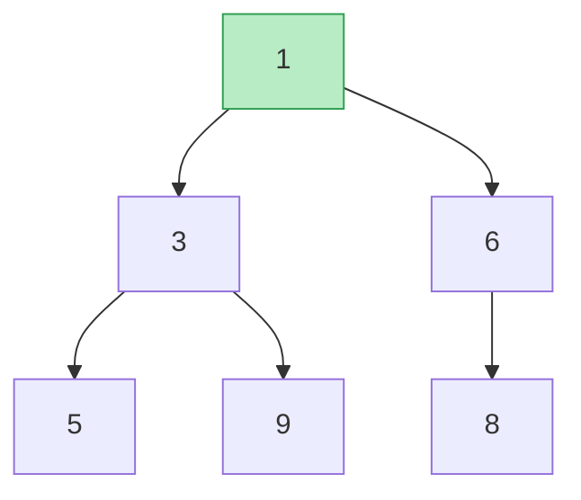
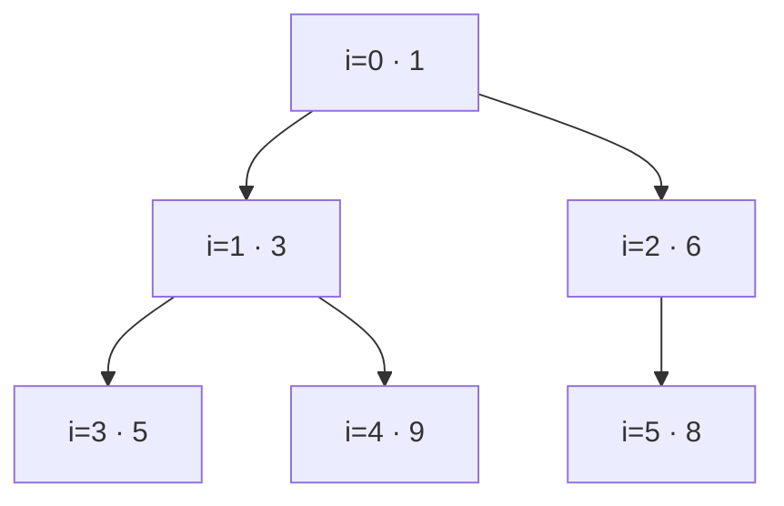
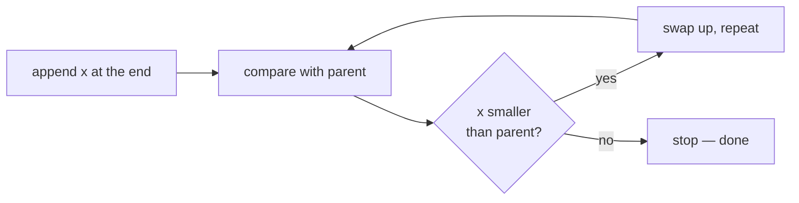
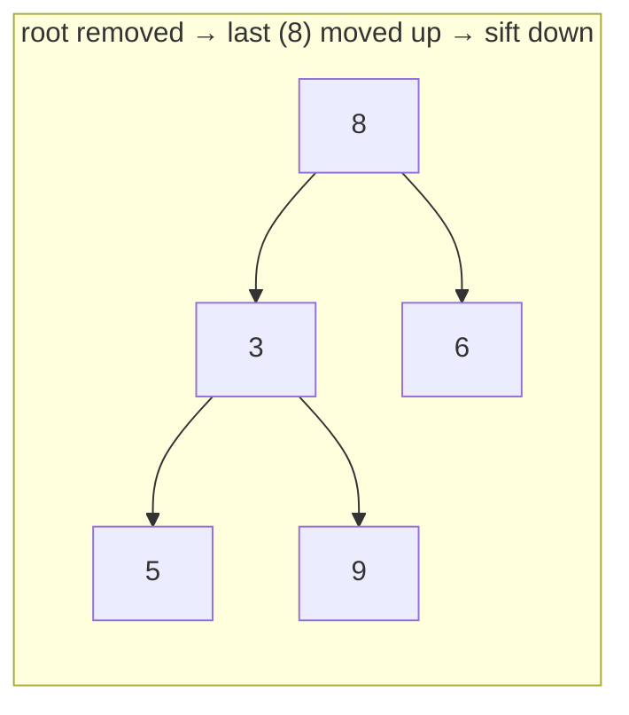
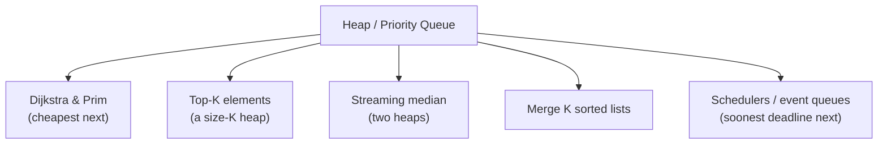

# ⛰️ Heaps & Priority Queues

> A **priority queue** is a collection where you always pull out the **most important** item next — the smallest (or
> largest) — no matter the insertion order. A **heap** is the clever tree that makes both "add" and "remove the
> best" cost only `O(log n)`. It's the engine behind Dijkstra, Prim, top-K, streaming medians, and schedulers.

Prerequisite: [Binary Trees](02_Binary_Tree.md) — complete trees and the `2i+1 / 2i+2` array packing.

---

## 1. The abstract idea: a priority queue

A **priority queue (PQ)** supports:

- **push(x)** — add an item.
- **pop()** — remove and return the **highest-priority** item (min or max).
- **peek()** — look at the best item without removing it.

You *could* implement it with a sorted list (fast peek, slow insert) or an unsorted list (fast insert, slow peek). A
**heap** beats both: `O(log n)` push **and** pop, `O(1)` peek.

| Implementation | push | pop-best | peek |
|---|---|---|---|
| Unsorted array | `O(1)` | `O(n)` | `O(n)` |
| Sorted array | `O(n)` | `O(1)` | `O(1)` |
| **Heap** | **`O(log n)`** | **`O(log n)`** | **`O(1)`** |

---

## 2. What a heap is

A **binary heap** is a **complete binary tree** (every level full, last level filled left-to-right) obeying the
**heap property**:

- **Min-heap:** every parent `≤` its children → the **smallest** value sits at the **root**.
- **Max-heap:** every parent `≥` its children → the **largest** value at the root.


*A **min-heap**: the root (green) is the minimum. Each parent is ≤ its children. Note the tree is NOT fully sorted — only the parent/child relationship is guaranteed, which is exactly enough to find the min instantly.*

### Stored as an array — no pointers

Because a heap is a **complete** tree, it packs perfectly into an array (see [Binary Trees §4b](02_Binary_Tree.md)):

```
index:   0   1   2   3   4   5
value: [ 1 , 3 , 6 , 5 , 9 , 8 ]

for node at index i:   left = 2i+1,  right = 2i+2,  parent = (i-1)//2
```



---

## 3. push — add at the end, then **sift up**

Add the new value at the end of the array (keeps it complete), then **bubble it up** while it's smaller than its
parent, until the heap property holds again.

```python
def push(heap, x):
    heap.append(x)                    # add at the end (keeps the tree complete)
    i = len(heap) - 1
    while i > 0:                      # sift UP
        parent = (i - 1) // 2
        if heap[i] < heap[parent]:    # smaller than parent? swap upward
            heap[i], heap[parent] = heap[parent], heap[i]
            i = parent
        else:
            break                     # in place — heap property restored
```


*A value travels up at most the tree's **height** = `O(log n)` swaps.*

---

## 4. pop — take the root, move the last up, then **sift down**

The best item is always the root. To remove it: put the **last** element at the root (keeps completeness), then
**bubble it down**, swapping with its **smaller child**, until the heap property holds.

```python
def pop(heap):
    top = heap[0]
    last = heap.pop()                 # remove the final element
    if heap:
        heap[0] = last                # move it to the root
        i, n = 0, len(heap)
        while True:                   # sift DOWN
            small, l, r = i, 2*i+1, 2*i+2
            if l < n and heap[l] < heap[small]: small = l
            if r < n and heap[r] < heap[small]: small = r
            if small == i:            # no smaller child → done
                break
            heap[i], heap[small] = heap[small], heap[i]
            i = small
    return top
```


*Pop the root `1`; move the last value `8` to the root; it sinks past its smaller child `3`, restoring the heap. Again `O(log n)`.*

---

## 5. Building a heap from an array — `O(n)`, not `O(n log n)`

Surprisingly, turning an arbitrary array into a heap is **linear**. Sift-down every internal node, from the last
one up to the root. The math works out to `O(n)` because most nodes are near the bottom and barely move.

```python
def heapify(arr):
    n = len(arr)
    for i in range(n // 2 - 1, -1, -1):   # every internal node, bottom-up
        sift_down(arr, i, n)              # (sift_down as in pop)
```

> **Interview gold:** "Building a heap is `O(n)`, but heap-sort is `O(n log n)` because you then pop `n` times, each
> `O(log n)`." Knowing *why* build-heap is linear separates you from the pack.

---

## 6. Python's `heapq` (and the max-heap trick)

Python's `heapq` is a **min-heap** over a plain list:

```python
import heapq
h = []
heapq.heappush(h, 5); heapq.heappush(h, 1); heapq.heappush(h, 3)
heapq.heappop(h)          # -> 1 (the minimum)

heapq.heapify(nums)                       # O(n) in place
heapq.nlargest(k, nums)                   # top-K
# MAX-heap: push negatives, negate on the way out
heapq.heappush(h, -x); -heapq.heappop(h)
```

Store **tuples** `(priority, item)` to order by an explicit key: `heapq.heappush(pq, (dist, node))`.

---

## 7. Where heaps shine



- **Top-K:** keep a **min-heap of size K**; push each item, pop when it exceeds K → the heap holds the K largest in
  `O(n log k)`.
- **Two-heap median:** a max-heap for the lower half + a min-heap for the upper half → median in `O(1)`.
- **Dijkstra/Prim:** the PQ delivers the "closest/cheapest next" vertex.

---

## 8. Cheat sheet

| Question | Answer |
|---|---|
| Heap shape? | a **complete binary tree** → packs into an array (`2i+1`, `2i+2`). |
| Heap property? | min-heap: **parent ≤ children** (min at root). |
| push / pop cost? | `O(log n)` (sift up / sift down); **peek `O(1)`**. |
| Build from array? | **`O(n)`** via bottom-up sift-down. |
| Fully sorted? | **No** — only the root is guaranteed; that's the point. |
| Max-heap in Python? | negate values (`heapq` is min-only). |
| Classic uses? | Dijkstra/Prim, top-K, two-heap median, merge-K, schedulers. |

**Next:** [Tries →](13_Tries.md) — a tree keyed by characters for lightning-fast prefix queries.
