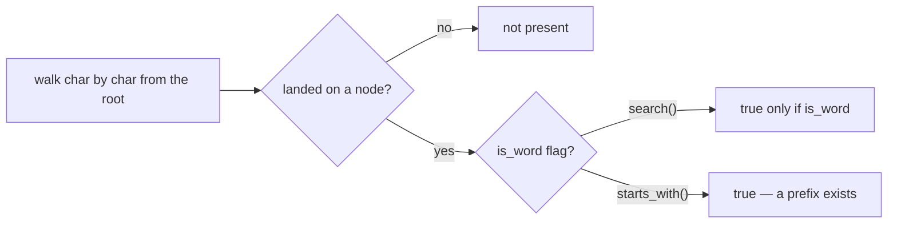
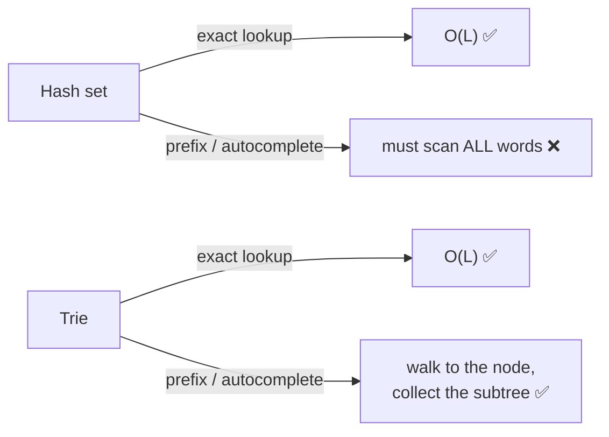
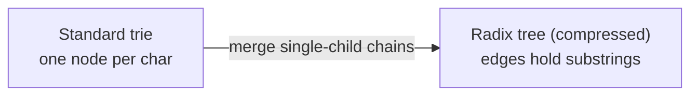

# 🔤 Tries (Prefix Trees)

> A **trie** (pronounced "try", from re**trie**val) is a tree keyed by **characters**: each path from the root spells
> out a string, and words that share a prefix **share the same nodes**. That structure makes prefix questions —
> autocomplete, "does any word start with…", spell-check — cost only `O(length)`, independent of how many words you
> stored.

Prerequisite: [Generic Trees](01_Generic_Tree.md) — a trie is an N-ary tree (one child per possible next character).

---

## 1. The idea: letters on the edges, words along the paths

Store `"cat"`, `"car"`, `"card"`, `"dog"`. Shared prefixes (`ca`, `car`) are stored **once**:

```mermaid
graph TD
    ROOT(("•")) --> C["c"]
    C --> A["a"]
    A --> T["t ✓"]
    A --> R["r ✓"]
    R --> D2["d ✓"]
    ROOT --> D["d"]
    D --> O["o"]
    O --> G["g ✓"]
    classDef end fill:#b7ecc4,stroke:#2f9e52;
    T:::end
    R:::end
    D2:::end
    G:::end
```
*Each green node marks the **end of a word** (`cat`, `car`, `card`, `dog`). "car" and "card" share the whole `car` path — `card` just continues one more step. A node being present ≠ a word ends there; the ✓ flag decides.*

> **The key distinction:** reaching a node means the string so far is a **prefix** of some word. Whether it's a
> complete **word** is a separate boolean flag on the node. `car` is both a prefix (of `card`) and a word.

---

## 2. The node and the three operations

```python
class TrieNode:
    def __init__(self):
        self.children = {}        # char -> TrieNode
        self.is_word = False      # does a word END here?

class Trie:
    def __init__(self):
        self.root = TrieNode()

    def insert(self, word):
        node = self.root
        for ch in word:                       # walk/create one node per character
            if ch not in node.children:
                node.children[ch] = TrieNode()
            node = node.children[ch]
        node.is_word = True                    # mark the final node as a word end

    def search(self, word):
        node = self._walk(word)
        return node is not None and node.is_word   # must land AND be a word

    def starts_with(self, prefix):
        return self._walk(prefix) is not None      # just needs to land

    def _walk(self, s):
        node = self.root
        for ch in s:
            if ch not in node.children:
                return None                    # fell off the trie
            node = node.children[ch]
        return node
```



- **`insert` / `search` / `starts_with`** all cost **`O(L)`** where `L` = length of the word/prefix — **independent of
  how many words** the trie holds. That's the headline win.

---

## 3. Why a trie beats a hash set for prefixes

A hash set gives `O(L)` exact lookup too — but it **cannot** answer "which words start with `ca`?" without scanning
everything. A trie walks to the `ca` node and then **DFS-collects** the subtree:

```python
def words_with_prefix(self, prefix):
    node = self._walk(prefix)
    out = []
    def dfs(n, path):
        if n.is_word:
            out.append(prefix + path)
        for ch, child in n.children.items():
            dfs(child, path + ch)
    if node:
        dfs(node, "")
    return out
# autocomplete "ca" -> ["cat", "car", "card"]
```



| | Hash set | **Trie** |
|---|---|---|
| Exact search | `O(L)` | `O(L)` |
| Prefix / autocomplete | ❌ scan all | **`O(L + results)`** |
| Sorted / ordered walk | ❌ | ✅ (DFS is alphabetical) |
| Space | compact | more (a node per char) — but **shares prefixes** |

---

## 4. Complexity & the space trade-off

- **Time:** insert/search/prefix all `O(L)`.
- **Space:** up to `O(total characters × alphabet)` in the worst case — a trie trades memory for fast prefix queries.
  Shared prefixes claw a lot of that back; a **compressed trie / radix tree** merges single-child chains to save more.



---

## 5. Where tries show up

- **Autocomplete / typeahead** and **spell-checkers** (prefix + edit-distance walks).
- **IP routing tables** (longest-prefix match) — radix tries.
- **Word games / dictionaries** (Boggle, Scrabble solvers).
- **T9 / predictive text**, and **LeetCode 208** (Implement Trie), **212** (Word Search II — a trie over a grid).

---

## 6. Cheat sheet

| Question | Answer |
|---|---|
| What's a trie? | a tree keyed by **characters**; a path = a string; shared prefixes share nodes. |
| Node holds? | `children` (char → node) + an **`is_word`** flag. |
| Costs? | insert / search / prefix all **`O(L)`**, independent of word count. |
| vs hash set? | same exact-lookup, but the trie also does **prefix / autocomplete** and ordered walks. |
| The classic trap? | a node existing ≠ a word ending there — check **`is_word`**. |
| Save space? | **compressed trie / radix tree** merges single-child chains. |

**Next:** [A\* & Floyd-Warshall →](14_AStar_Floyd_Warshall.md) — heuristic-guided and all-pairs shortest paths.
