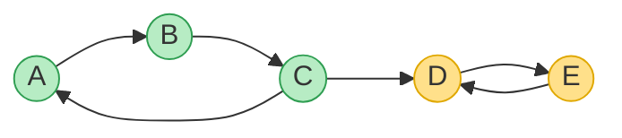
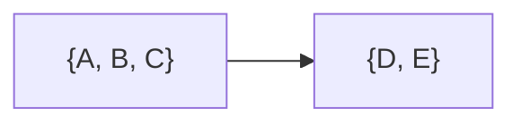
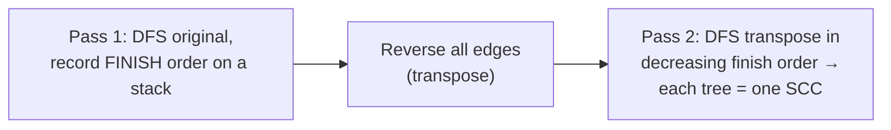
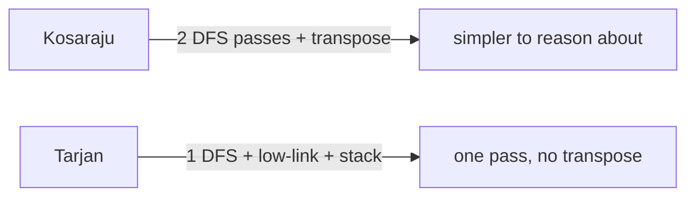

# 🔗 Strongly Connected Components — Tarjan & Kosaraju

> In a **directed** graph, a **Strongly Connected Component (SCC)** is a maximal group of vertices where **every
> vertex can reach every other** (following the arrows). Finding SCCs reveals the "mutually-dependent clusters" in a
> system — cyclic module dependencies, deadlock groups, 2-SAT solutions, tightly-linked web pages.

Prerequisite: [Graph Traversal](07_Graph_Traversal.md) and [Cycle Detection](11_Cycle_Detection.md) — directed DFS.

---

## 1. What "strongly connected" means

In an **undirected** graph, "connected" just means there's a path. In a **directed** graph you need paths **both
ways**: `u` reaches `v` **and** `v` reaches `u`. An SCC is a maximal set where that's true for every pair.


*Two SCCs: **{A, B, C}** (green — a 3-cycle, all reach each other) and **{D, E}** (yellow — a 2-cycle). The edge C → D links them but isn't *mutual*, so they stay separate components.*

### Collapse each SCC → a DAG (the "condensation")

Shrink every SCC to a single super-node and the graph becomes a **DAG** — always acyclic, because any cycle would
have merged those nodes into one SCC.


*The condensation of the graph above. This DAG-of-SCCs is what makes SCCs so useful: it exposes the acyclic "big picture" of a cyclic graph.*

---

## 2. Kosaraju's algorithm — two passes of DFS

The most intuitive method. Three steps:

1. **DFS the graph**, pushing each vertex onto a stack **when it finishes** (post-order).
2. **Reverse every edge** (the transpose graph).
3. **DFS the reversed graph** in **decreasing finish order** (pop the stack). Each DFS tree you get is one **SCC**.



```python
def kosaraju(n, adj):
    """adj[u] = vertices u points to. Returns a list of SCCs (each a list of vertices)."""
    # Pass 1: finish order
    seen = [False] * n
    order = []
    def dfs1(u):
        seen[u] = True
        for v in adj[u]:
            if not seen[v]:
                dfs1(v)
        order.append(u)                    # push on finish (post-order)
    for i in range(n):
        if not seen[i]:
            dfs1(i)

    # Build the transpose (all edges reversed)
    radj = [[] for _ in range(n)]
    for u in range(n):
        for v in adj[u]:
            radj[v].append(u)

    # Pass 2: DFS transpose in decreasing finish order
    comp = [-1] * n
    sccs = []
    def dfs2(u, label, bag):
        comp[u] = label
        bag.append(u)
        for v in radj[u]:
            if comp[v] == -1:
                dfs2(v, label, bag)
    label = 0
    for u in reversed(order):              # largest finish time first
        if comp[u] == -1:
            bag = []
            dfs2(u, label, bag)
            sccs.append(bag)               # this DFS tree is one SCC
            label += 1
    return sccs
```

- **Why it works (intuition):** the vertex that finishes **last** in pass 1 lies in a "source" SCC of the
  condensation. Reversing the edges traps each DFS inside a single SCC, so pass 2 peels them off one at a time.
- **Complexity:** `O(V + E)` — two linear DFS passes plus building the transpose.

---

## 3. Tarjan's algorithm — one pass, with low-link numbers

Tarjan finds all SCCs in a **single** DFS using two numbers per vertex and a stack:

- **`disc[u]`** — the discovery time (order visited).
- **`low[u]`** — the smallest discovery time reachable from `u`'s subtree (including via one back-edge).

Keep vertices on a stack as you enter them. When a vertex has **`low[u] == disc[u]`**, it's the **root of an SCC** —
pop the stack down to `u` to emit that component.

```python
def tarjan(n, adj):
    disc = [-1] * n
    low = [0] * n
    on_stack = [False] * n
    stack = []
    sccs = []
    counter = [0]
    def dfs(u):
        disc[u] = low[u] = counter[0]; counter[0] += 1
        stack.append(u); on_stack[u] = True
        for v in adj[u]:
            if disc[v] == -1:              # tree edge: recurse
                dfs(v)
                low[u] = min(low[u], low[v])
            elif on_stack[v]:              # back edge to a vertex still on the stack
                low[u] = min(low[u], disc[v])
        if low[u] == disc[u]:             # u is an SCC root → pop its component
            comp = []
            while True:
                w = stack.pop(); on_stack[w] = False
                comp.append(w)
                if w == u:
                    break
            sccs.append(comp)
    for i in range(n):
        if disc[i] == -1:
            dfs(i)
    return sccs
```



- **Complexity:** `O(V + E)` in a **single** pass — no transpose needed, so it's often preferred in practice.
- **`low[u] == disc[u]`** is the key test: nothing in `u`'s subtree can reach an earlier vertex, so `u` caps an SCC.

---

## 4. Kosaraju vs Tarjan

| | **Kosaraju** | **Tarjan** |
|---|---|---|
| DFS passes | **two** (+ build transpose) | **one** |
| Extra state | a finish-order stack | `disc`, `low`, an on-stack marker |
| Intuition | easier to explain | trickier (low-link), but elegant |
| Time | `O(V + E)` | `O(V + E)` |
| In practice | fine, needs the reversed graph | often preferred (single pass) |

> **Where SCCs matter:** cyclic dependency detection (which modules form a mutually-dependent knot), **2-SAT**
> (satisfiable iff no variable shares an SCC with its negation), condensing a graph to its DAG for further DP, and
> link-analysis clustering.

---

## 5. Cheat sheet

| Question | Answer |
|---|---|
| SCC definition? | maximal set where **every vertex reaches every other** (directed). |
| Condensation? | collapse each SCC → a **DAG** (always acyclic). |
| Kosaraju? | DFS finish-order → **reverse edges** → DFS in that order; each tree = SCC. |
| Tarjan? | one DFS with **`disc` / `low`** + a stack; `low[u]==disc[u]` ⇒ SCC root. |
| Cost? | both **`O(V + E)`**. |
| Why care? | dependency knots, **2-SAT**, condensation DAG, clustering. |

**Back to the map:** [README](README.md) — the full tree + graph + advanced deep dive.
