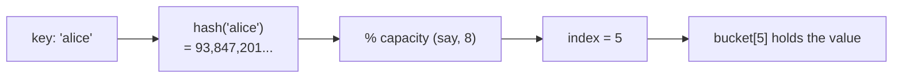
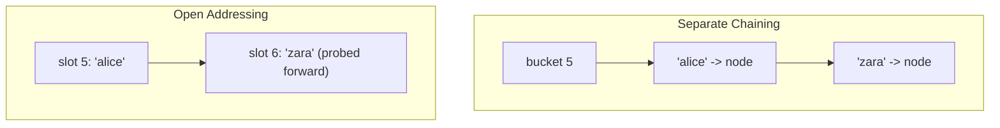
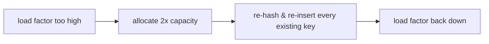
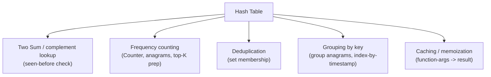

# 🗂️ Hash Tables

> A **hash table** turns "where is this key stored?" into a single arithmetic calculation instead of a search. That
> one idea — compute an index directly from the key — is what makes lookup, insert, and delete all **O(1) on
> average**, and it's the single most-used data structure in real interview solutions.

Prerequisite: none — this is a pure fundamental, useful before every other topic in this folder.

---

## 1. The problem hashing solves

Given a collection of key → value pairs, you want `get(key)`, `put(key, value)`, and `delete(key)` to be fast,
**regardless of how many items are stored**.

| Structure | get | put | delete |
|---|---|---|---|
| Unsorted list | `O(n)` (scan) | `O(1)` (append) | `O(n)` (scan) |
| Sorted array | `O(log n)` (binary search) | `O(n)` (shift) | `O(n)` (shift) |
| **Hash table** | **`O(1)` average** | **`O(1)` average** | **`O(1)` average** |

The trick: don't *search* for the key — **compute** where it lives.

---

## 2. The core idea: hash function → array index

A **hash function** takes a key and produces a number. Reduce that number modulo the table's capacity, and you get
a slot (**bucket**) index into a plain array:

```
index = hash(key) % capacity
```



Because computing a hash and taking a modulo are both `O(1)` (for keys of bounded size), landing on the right
bucket costs `O(1)` — no comparisons against other keys needed to find *where to look*.

A good hash function is:
- **Deterministic** — same key always hashes to the same value.
- **Fast** — `O(1)` (or `O(length of key)` for strings — still treated as O(1) for reasonably-sized keys).
- **Well-distributed** — different keys should spread evenly across buckets, not pile up in a few.

---

## 3. Collisions: two keys, one bucket

Different keys *can* hash to the same bucket (a **collision**) — with enough keys and a fixed number of buckets,
this is unavoidable (pigeonhole principle). Two standard fixes:



- **Separate chaining:** each bucket holds a small list (or tree) of everything that hashed there. Collision just
  means "append to this bucket's list" — lookup then scans that one short list.
- **Open addressing:** on a collision, **probe** forward (linear probing, quadratic probing, or double hashing)
  to find the next free slot, all within the same array — no extra list structures, better cache locality.

Python's `dict` uses open addressing internally (with pseudo-random probing) — but you never need to implement
this yourself; knowing it exists explains *why* hash tables can degrade to `O(n)` in pathological cases (see §4).

---

## 4. Load factor and resizing — why it's "average" O(1), not guaranteed

**Load factor** = `(number of items) / capacity`. As it climbs, buckets get crowded, chains get longer, and
lookups slow down. The fix: when load factor crosses a threshold (commonly ~0.66–0.75), **resize** — allocate a
bigger array (usually double) and re-insert everything.



Resizing itself is `O(n)` — but it happens rarely (only when the table has roughly doubled since the last resize),
so its cost **amortizes** to `O(1)` per insert averaged over many inserts (the same doubling argument used for
Python's dynamic arrays / `list.append`).

> **Worst case is still O(n).** If every key collided into the same bucket (a maliciously bad hash function, or an
> adversarial input against a known hash), every operation degrades to scanning one long chain — `O(n)`. This is
> why "hash map lookup is O(1)" always comes with the word **average** attached.

---

## 5. Hash Map vs Hash Set

- **Hash map** (`dict` in Python): stores key → value pairs.
- **Hash set** (`set` in Python): stores keys only — it's really a hash map that only cares about *membership*,
  with the "value" being nothing.

```python
seen = set()               # hash set: "have I seen this before?"
counts = {}                 # hash map: "how many times have I seen this?"
```

Reach for a **set** the moment you only need "is X present?" — it's the same O(1) guarantee with less memory and
a clearer intent than a dict mapping every key to `True`.

---

## 6. Python's `dict` / `set`

```python
d = {}
d["alice"] = 30                       # O(1) average insert
d.get("alice", 0)                     # O(1) average lookup, with a default
"alice" in d                           # O(1) average membership test
del d["alice"]                        # O(1) average delete

from collections import defaultdict, Counter
freq = defaultdict(int)               # auto-creates missing keys with a default value
freq["x"] += 1                        # no manual "if key not in d" check needed

counts = Counter(["a", "b", "a"])     # {'a': 2, 'b': 1} -- purpose-built frequency dict
```

Since Python 3.7, `dict` also **preserves insertion order** as an implementation detail made official — a useful
side benefit, but the O(1) average-case guarantee is the real reason to reach for it.

---

## 7. Where hash tables shine



- **Complement lookups (Two Sum):** for each number, check `target - x in seen` — turns an `O(n²)` nested loop
  into `O(n)`.
- **Frequency counting:** `Counter` for word/character frequency, anagram detection, majority element.
- **Grouping:** `defaultdict(list)` to bucket items by a shared key (e.g., all prices at one timestamp — see the
  *Highest Price* problem in `Atlassian_Prep/`).
- **Memoization:** cache `function(args) -> result` so repeated calls with the same input are `O(1)` lookups
  instead of recomputation.

---

## 8. Cheat sheet

| Question | Answer |
|---|---|
| Core idea? | compute an **index** from the key (`hash(key) % capacity`) instead of searching for it. |
| Average complexity? | **`O(1)`** for get/put/delete. |
| Worst case? | `O(n)` — many keys colliding into one bucket (rare with a good hash function). |
| Collision handling? | **chaining** (list per bucket) or **open addressing** (probe for the next free slot). |
| Why "amortized" O(1)? | resizing is `O(n)` but rare — the cost spreads thin over many inserts. |
| Map vs Set? | map stores key→value; set stores keys only (membership). |
| In Python? | `dict`, `set`, `collections.defaultdict`, `collections.Counter`. |
| Classic uses? | complement lookup, frequency counting, grouping, memoization, deduplication. |

**Next:** [Sorting Algorithms →](../17_Sorting_Algorithms/README.md) — putting data in order, and why some sorts
guarantee stability (which later powers multi-key sorting).
