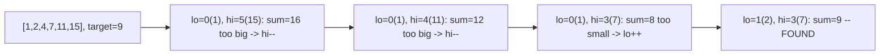
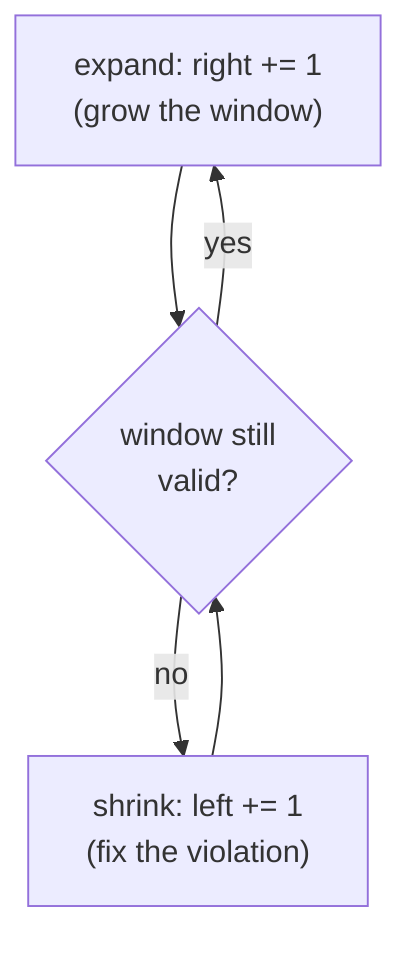
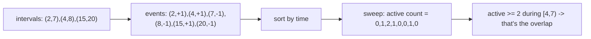

# 👉👈 Two Pointers & Sliding Window

> A whole family of `O(n)` techniques replace a naive `O(n²)` nested loop with **two indices that only ever move
> forward**. Whether they start at opposite ends and converge, or both crawl left-to-right defining a shrinking
> and growing window, the key idea is the same: never re-examine the same pair of elements twice.

Prerequisite: [Sorting Algorithms](../17_Sorting_Algorithms/README.md) — the "opposite ends" variant needs sorted
input to know which side to move.

---

## 1. Two pointers on a sorted array — opposite ends converging

**Setup:** one pointer at the start, one at the end. Move whichever side is "wrong" inward, based on a sorted
array's ordering guarantee.



```python
def two_sum_sorted(arr, target):
    """arr is SORTED. Find two indices whose values sum to target."""
    lo, hi = 0, len(arr) - 1
    while lo < hi:
        s = arr[lo] + arr[hi]
        if s == target:
            return [lo, hi]
        elif s < target:
            lo += 1              # sum too small -> need a bigger left value
        else:
            hi -= 1              # sum too big -> need a smaller right value
    return []
```

**Why it's correct and `O(n)`:** at every step, one pointer moves and never moves back — so each index is visited
at most once total across the whole run, for `O(n)` total work instead of `O(n²)` for checking every pair.

Other classics in this shape: **Container With Most Water** (move the shorter wall inward — it can never be part
of a better answer than what you already have), **3Sum** (fix one element, two-pointer the rest of the sorted
array).

---

## 2. Sliding window — a variable-size window over one pass

**Setup:** both pointers start at the left and only ever move right. Expand the window (`right += 1`) to include
more; shrink it (`left += 1`) when some condition is violated. The window's size grows and shrinks, but the
*pointers* never go backward.



```python
def longest_substring_without_repeat(s):
    seen = {}                       # char -> most recent index
    left = best = 0
    for right, ch in enumerate(s):
        if ch in seen and seen[ch] >= left:
            left = seen[ch] + 1     # shrink: jump left past the previous occurrence
        seen[ch] = right
        best = max(best, right - left + 1)
    return best
```

**Why it's `O(n)`:** `right` advances exactly `n` times; `left` also only ever advances, so it moves at most `n`
times total across the *whole* run (not per iteration of `right`) — total pointer movement is `O(n)`, not `O(n²)`.

This is the general pattern behind "longest/shortest substring or subarray satisfying condition X" problems.

---

## 3. Fast & slow pointers — a different kind of "two pointers"

A third variant: both pointers start at the same place and move at **different speeds** (typically 1 step vs. 2
steps) through a linked structure. If the structure has a cycle, the fast pointer will eventually lap the slow one
and they'll meet — impossible on a cycle-free structure, where fast simply reaches the end first.

```python
def has_cycle(head):
    slow = fast = head
    while fast and fast.next:
        slow = slow.next
        fast = fast.next.next
        if slow is fast:             # they meet -> there's a cycle
            return True
    return False
```

This is a different mechanism from the "converging" or "sliding window" variants above, but it's grouped under
the same "two pointers" umbrella because it's still two indices doing coordinated, non-redundant work instead of
one full re-scan per step.

---

## 4. The event / sweep-line technique — two pointers, generalized to intervals

When the data is a set of **intervals** rather than a flat array, the two-pointer idea generalizes into a
**sweep line**: convert each interval into a `start (+1)` and `end (-1)` event, sort all events by time, then
sweep through once while tracking a running "how many things are active right now" counter.



```python
def max_overlap(intervals):
    events = []
    for start, end in intervals:
        events.append((start, 1))
        events.append((end, -1))
    events.sort(key=lambda e: (e[0], -e[1]))    # process starts before ends at the same timestamp

    active = best = 0
    for _, delta in events:
        active += delta
        best = max(best, active)
    return best

print(max_overlap([(2, 7), (4, 8), (15, 20)]))   # -> 2 (bookings [4,7) overlap)
```

The active count only ever changes at a start or an end — so sweeping through the `2n` sorted events (`O(n log n)`
for the sort) captures everything a naive "check every point in time" scan would need `O(n · range)` to find.
This exact technique powers the *CI/CD Jobs* and *Tennis Club* problems in `Atlassian_Prep/`.

---

## 5. Cheat sheet

| Question | Answer |
|---|---|
| Opposite-ends two pointers? | needs **sorted** input; move the pointer on the "wrong" side inward. |
| Sliding window? | both pointers move only **right**; expand then shrink — `O(n)` total movement. |
| Fast/slow pointers? | different speeds through a linked structure — detects **cycles**. |
| Sweep line? | intervals -> `+1`/`-1` events, sort, sweep — generalizes two pointers to overlap-counting. |
| Common complexity? | **`O(n)`** (or `O(n log n)` if a sort is needed first), replacing an `O(n²)` nested loop. |
| Tie-break at equal event times? | decide start-before-end or end-before-start based on the problem's definition of "overlap". |

**Next:** [Greedy Algorithms →](../20_Greedy_Algorithms/README.md) — making the locally-best choice at each step,
and proving it's globally optimal.
