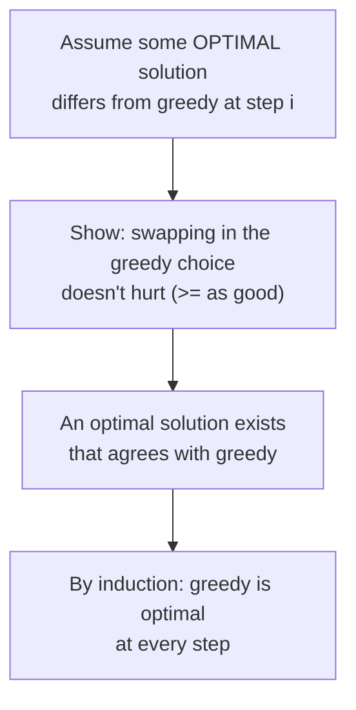
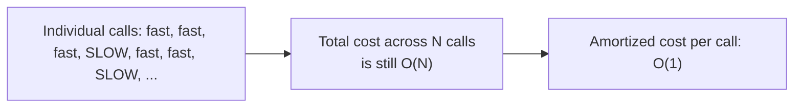

# 🌱 Greedy Algorithms & Amortized Analysis

> A **greedy** algorithm makes the locally-best choice at every step and never looks back — no backtracking, no
> reconsidering. Sometimes that's provably optimal; sometimes it's provably wrong. This chapter covers how to
> *prove* greedy works when it does, and pairs it with **amortized analysis** — the tool for showing an operation
> that looks expensive is actually cheap, averaged over a whole sequence of calls.

Prerequisite: [Sorting Algorithms](../17_Sorting_Algorithms/README.md) (most greedy algorithms sort first) and
[Heaps & Priority Queues](../12_Heaps_Priority_Queues/README.md) (many greedy algorithms are priority-driven).

---

## 1. What makes greedy work — the exchange argument

Greedy isn't "the obvious idea that happens to work" — it needs a proof. The standard proof technique is an
**exchange argument**: show that if some optimal solution made a *different* choice at this step, you can swap it
for the greedy choice **without making the solution any worse**. If that swap is always possible, an optimal
solution exists that agrees with greedy at every step — so greedy itself is optimal.



**When greedy does NOT work:** the classic warning example is **coin change with arbitrary denominations**. With
US coins (25, 10, 5, 1), greedily taking the largest coin that fits happens to give the optimal count. But with
denominations `{1, 3, 4}` and a target of `6`, greedy picks `4 + 1 + 1` (3 coins) while the optimal answer is
`3 + 3` (2 coins). **Always check whether an exchange argument actually holds** — don't assume greedy works just
because a locally-sensible rule exists.

---

## 2. Interval scheduling — the textbook greedy success story

**Problem:** given intervals, select the **maximum number of non-overlapping** ones. **Greedy rule:** sort by
**end time**, and take an interval whenever it starts after the last one taken ends.


**Why "sort by end time" (not start time) is the right rule:** finishing earliest leaves the most room for
everything that comes after — an exchange argument shows that swapping any optimal solution's first choice for the
earliest-finishing interval never leaves less room than before.

```python
def max_non_overlapping(intervals):
    intervals = sorted(intervals, key=lambda iv: iv[1])   # sort by END time
    count, last_end = 0, float("-inf")
    for start, end in intervals:
        if start >= last_end:            # doesn't overlap the last one taken
            count += 1
            last_end = end
    return count
```

---

## 3. Interval partitioning — greedy + a heap

A close cousin: instead of picking a subset, assign **every** interval to one of several "resources" (rooms,
machines, courts) so nothing on the same resource overlaps, using the **minimum number of resources**.

**Key fact:** the minimum number of resources needed equals the **maximum number of intervals overlapping at any
single instant** — you provably can't do better, and a greedy assignment achieves exactly that bound.

**Greedy rule:** process intervals sorted by start time. For each one, reuse whichever existing resource frees up
**earliest**, if it's already free by this interval's start; otherwise, open a new resource. A **min-heap** of
"when does each resource free up" gives `O(log n)` access to "which one frees up soonest".

```python
import heapq

def min_resources(intervals):
    intervals = sorted(intervals, key=lambda iv: iv[0])   # sort by START time
    heap = []                                               # end times of resources in use
    for start, end in intervals:
        if heap and heap[0] <= start:      # earliest-freeing resource is free by now
            heapq.heappop(heap)
        heapq.heappush(heap, end)
    return len(heap)                        # resources still "in use" at the end = the peak count
```

This exact pattern (sort by start, min-heap of availability times) is what solves the *Tennis Club* court
assignment problem in `Atlassian_Prep/`.

---

## 4. Amortized analysis — when a "slow" operation is cheap on average

Some operations look expensive in the worst case, but if you can show the **total** cost across a whole sequence
of calls is bounded, the *average* cost per call is small — even though no single call is individually guaranteed
to be fast. This is different from best-case or worst-case per call: it's a statement about a **sequence** of
operations, not any one of them.



**Classic example — dynamic array doubling** (how Python's `list.append` works): most appends are `O(1)`, but
occasionally the array is full and must be **reallocated and copied** — an `O(n)` operation. Doubling the capacity
each time means resizes happen at sizes `1, 2, 4, 8, ..., n` — the total copying work across all resizes is
`1 + 2 + 4 + ... + n < 2n`, which is `O(n)` spread across `n` appends: **`O(1)` amortized per append**.

**Another example — the score-bucket walk-down** (from the *Content Popularity Tracker* problem in
`Atlassian_Prep/`): a `while` loop that walks a "current max score" pointer downward *looks* like it could be
`O(n)` per call, but each distinct score value can only be vacated **once** across the whole sequence of
operations — so the total walking work across `N` operations is bounded by `O(N)`, giving `O(1)` amortized per
call.

```python
# Doubling array: watch resizes happen only at sizes 1, 2, 4, 8, ... -- rare, and each one
# does more work, but the running TOTAL of all resize work stays O(n) across n appends.
class DoublingArray:
    def __init__(self):
        self.capacity = 1
        self.size = 0
        self.data = [None] * self.capacity
        self.resize_events = []          # track when (and how big) resizes happen

    def append(self, x):
        if self.size == self.capacity:
            self.capacity *= 2
            new_data = [None] * self.capacity
            for i in range(self.size):
                new_data[i] = self.data[i]
            self.data = new_data
            self.resize_events.append(self.capacity)
        self.data[self.size] = x
        self.size += 1
```

**The two standard proof techniques** (both prove the same thing, different bookkeeping):
- **Aggregate method:** sum the *total* cost across all `N` operations directly, then divide by `N`.
- **Accounting method:** overcharge cheap operations a little, banking the surplus as "credit" to pay for the
  occasional expensive one — as long as the credit never goes negative, the amortized bound holds.

---

## 5. Cheat sheet

| Question | Answer |
|---|---|
| What proves a greedy choice is safe? | an **exchange argument**: swapping it into any optimal solution never makes it worse. |
| Does greedy always work? | **No** — check with an exchange argument; coin change with arbitrary denominations is the classic counterexample. |
| Interval scheduling (max non-overlapping)? | sort by **end time**, greedily take non-overlapping intervals. |
| Interval partitioning (min resources)? | sort by **start time** + a **min-heap** of resource availability times. |
| Min resources needed? | equals the **maximum simultaneous overlap** — provably optimal. |
| Amortized analysis proves? | total cost over a **sequence** of operations is bounded, even if individual calls vary. |
| Classic amortized example? | dynamic array doubling — resizes are `O(n)` but rare, `O(1)` amortized per append. |
| Two proof methods? | **aggregate** (sum total, divide by N) and **accounting** (bank credit on cheap ops). |

**This closes the "Algorithmic Foundations" set** — combined with Hash Tables, Sorting, Binary Search, and Two
Pointers/Sliding Window, these five plus the Trees/Graphs/Heaps/Tries tracks above cover every technique used
across the problems in `Atlassian_Prep/` (see `Atlassian_Prep/DSA_Used.md` for the full map).
