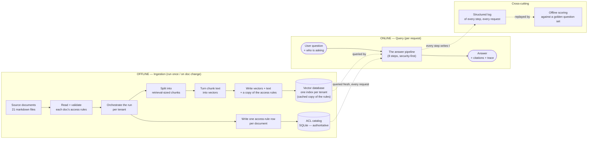
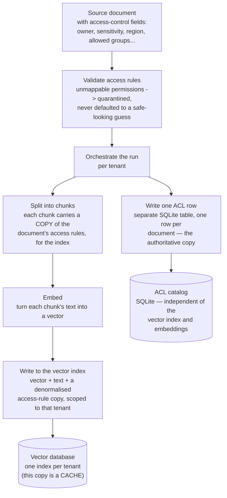
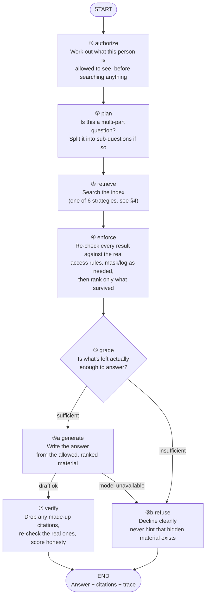
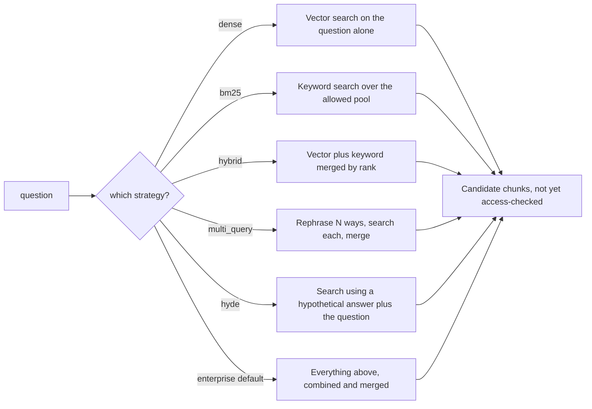
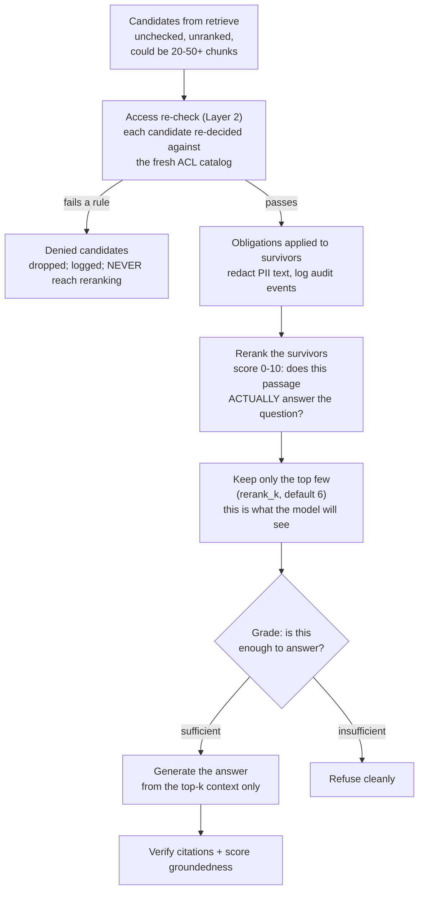
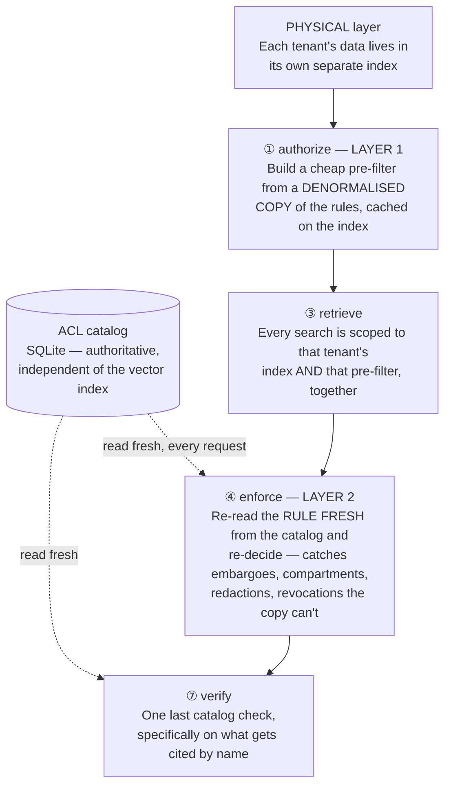
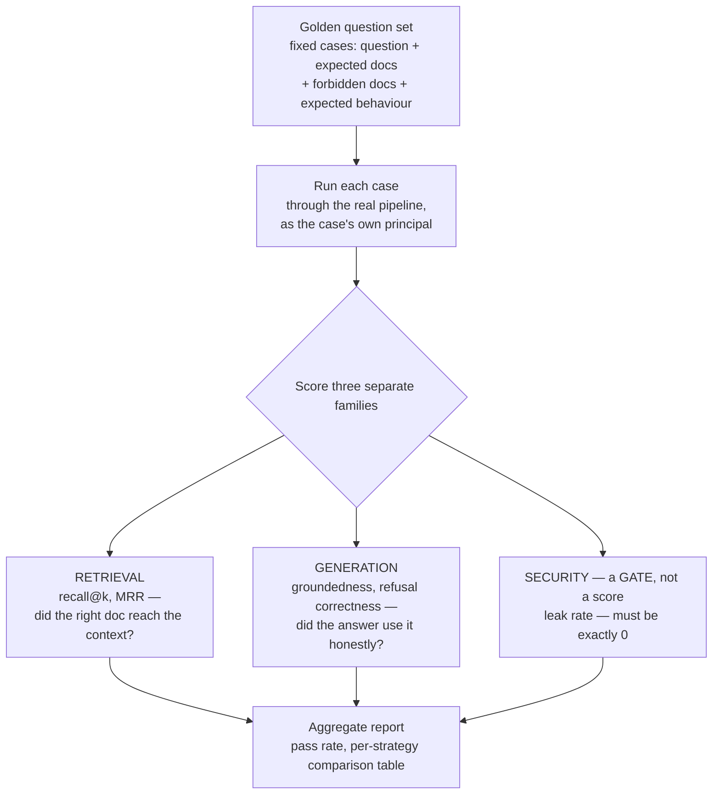

# End-to-End Architecture

**What this is:** one diagram for the whole platform, ingestion through answer. Every box is plain
English — what happens at that stage, not which file it lives in. Built for a last-minute scan before
an interview — find the box, say the one-liner. If you're asked "which file is that in," §8 has the
answer.

**How to use it:** §1 is the 30,000-ft picture. §2 is ingestion. §3 is the query-time pipeline (the one
that matters most). §4 is the retrieval fan-out inside the `retrieve` step. §5 is everything that
happens to the candidates *after* they're retrieved — enforce, rerank, grade, generate, verify. §6 is
the security checkpoints overlaid on the same pipeline. §7 is the evaluation harness. §8 is the
pointer table — file and function for every box above, the fastest way to answer "where is X
implemented?".

---

## 1. The 30,000-ft picture

**One paragraph:** documents are chunked and embedded once, offline, into a per-tenant Chroma
collection, and their access rules are written once into a separate local SQLite catalog (§2). Every
query runs through an 8-step pipeline (§3) that resolves identity, compiles a cheap pre-filter from
the vector store's cached rule-copy, retrieves via one of six swappable strategies (§4), then
re-checks access against the **fresh** catalog copy — the authoritative decision — grades whether it
has enough to answer, generates, and verifies citations before returning. Every step emits a
structured trace, and the evaluation harness replays golden questions to score retrieval,
groundedness, and — the one metric that gates a release — leaked documents (must be zero).

**One line per box:**

- **Source documents** — the 21 documents this demo ingests, each carrying its own access rules.
- **Read + validate** — parses a doc's access rules; anything unmappable is quarantined, not guessed at.
- **Orchestrate the run** — drives two independent things per document: chunk/embed, and catalog the rules.
- **Split into chunks** — breaks a document into retrieval-sized pieces, each tagged with a copy of its rules.
- **Turn chunk text into vectors** — the embedding call; the expensive, content-dependent step.
- **Write vectors + text + a copy of the access rules** — into the tenant's vector index.
- **Vector database** — the queryable index; its rule-copy is a cache, only used for the cheap pre-filter.
- **Write one access-rule row per document** — a plain SQLite write, no embedding involved at all.
- **ACL catalog** — the authoritative rules store; queried fresh on every single request.
- **The answer pipeline** — one question + one identity in, one answer out (see §3).
- **Structured log** — records every step's input/output for one request.
- **Offline scoring** — replays golden questions against the pipeline and grades the traces.

---

## 2. Ingestion path — offline, one-time per document set

**One line per step:**

- **A.** Raw markdown, one file per document, front-matter holds every field the policy engine needs.
- **B.** Parse + validate front-matter into `ResourceAttributes`; unmappable ACL → document quarantined, not ingested.
- **D.** Orchestrates the whole run, per tenant: hands validated documents down two independent paths.
- **C.** Break the validated document into chunks; each chunk gets its own copy of the doc's access rules.
- **E.** Calls the embedding model in batches to turn chunk text into vectors.
- **F.** Upserts ids + vectors + text + a denormalised access-rule copy into that tenant's Chroma collection.
- **H.** The resulting per-tenant Chroma collection — the physical isolation boundary (§6) and Layer 1's data source.
- **G.** Writes the document's access rules once, into a separate local database — no vectors involved.
- **I.** The ACL catalog — the single authoritative source Layer 2 reads fresh on every request.

**The point of the two branches (§6 and `docs/04` §0):** F's copy is denormalised and allowed to go
stale — it only feeds the cheap Layer-1 pre-filter. I is what the post-retrieval Layer-2 check
actually reads, so an access-rule change only ever needs a write to **G**, never to E/F. No
re-embedding, no touching the vector index.

**Check A on ingest (§6 of doc 04):** `loader.py` is also the ACL-validation gate — a document with an
unmappable permission model is refused outright, never silently defaulted to `internal`. This is
called out as *"the number one cause of enterprise RAG leaks"* in `docs/04-security-checks-reference.md`.

---

## 3. Query path — the LangGraph pipeline (the one to draw from memory)

Entry point: one question in, one identity in, one answer out.

**One line per node:**

- **① authorize** — compiles the principal's ABAC policy into a Chroma `where` clause, before anything is retrieved.
- **② plan** — a cheap regex check decides if the question is multi-hop and needs decomposing into sub-questions.
- **③ retrieve** — runs the selected strategy (§4); every store call inside it carries the compiled filter.
- **④ enforce** — re-runs the full policy on every candidate (the authoritative check), applies redaction/audit obligations, then reranks only the survivors.
- **⑤ grade** — decides sufficient / partial / insufficient, refusing to answer confidently on weak or missing context.
- **⑥a generate** — synthesizes the answer from the reranked, already-authorized context; falls back to refuse if the model is down.
- **⑥b refuse** — the clean no-answer path; never reveals that a withheld document exists, routes to escalation.
- **⑦ verify** — drops hallucinated citations, re-checks the survivors against live policy, and scores groundedness before returning.

**The one line that matters:** *"`authorize` runs first, `enforce` runs before anything reaches the
model — that ordering is encoded in the graph edges, not left to a convention someone can forget."*
(`graph/nodes.py` module docstring, verbatim.)

**Why `enforce` comes before rerank, not after:** the reranker must only ever see chunks this
principal is allowed to read — otherwise the "best" answer could be shaped by content the user never
sees, and top-k slots get wasted scoring material that will be thrown away anyway.

---

## 4. Inside step ③ `retrieve` — the six swappable strategies

Six interchangeable search strategies share the same shape (question in, ranked candidates out), so
the pipeline can pick one at runtime and results can be A/B tested against each other on the same
question set. Every strategy searches only within what this person is allowed to see — there is no
path that skips that.

**One line per strategy:**

- **dense** — plain vector search on the raw question; the baseline everything else is compared against.
- **bm25** — keyword search only, run over the already-authorized pool; best for exact identifiers/error codes.
- **hybrid** — dense + BM25 merged by rank, not raw score, so the two scales don't fight each other.
- **multi_query** — asks the LLM for N rephrasings, searches each, fuses; catches phrasing mismatches (RAG-Fusion).
- **hyde** — embeds a hypothetical answer instead of the question itself, fused with the literal question as an anchor.
- **enterprise** — the production default: every signal above, fused together, then reranked downstream.
- **`retrieval/expansion.py`** — `decompose()` (multi-hop split), `generate_multi_queries()` (N
  paraphrases), `generate_hyde_passage()` (hypothetical-answer probe). All LLM calls; all degrade
  gracefully to `dense` if the model is unavailable (`LLMUnavailable` caught in `nodes.retrieve`).
- **`retrieval/fusion.py`** — `reciprocal_rank_fusion()` merges N ranked lists into one by rank, not
  raw score (score scales differ across dense/lexical/probes).
- **`retrieval/lexical.py`** — `BM25Index` built **only** over `store.fetch_all_allowed()`, i.e. the
  already-ACL-filtered pool. BM25 can't push an ACL filter down the way the vector store can, so the
  index is built over the authorized subset instead.
- **`retrieval/rerank.py`** — `LLMReranker.rerank()`, called from `nodes.enforce()` **after** the ACL
  re-check, never before.

---

## 5. After retrieval — enforce → rerank → grade → generate → verify

Step ③ `retrieve` hands back a pile of **candidates**: whatever the chosen strategy found, still
unchecked and unranked. Everything that turns that pile into an actual answer happens across steps
④-⑦. This is the part most summaries compress into "then it enforces and reranks" — worth unpacking,
because reranking specifically is called out (in `retrieval/rerank.py`'s own docstring) as *"the
single biggest quality win in enterprise RAG."*

**One line per box:**
- **Candidates from retrieve** — the raw output of step ③; nothing here has been access-checked yet.
- **Access re-check (Layer 2)** — the authoritative decision, re-run per candidate against the fresh catalog (§6).
- **Denied candidates** — dropped before reranking ever runs; a denied chunk never gets scored, ranked, or shown to anything.
- **Obligations applied** — allowed chunks that carry PII get emails/phones masked; sensitive reads get logged for audit.
- **Rerank the survivors** — an LLM scores each surviving passage 0-10 on "does this actually answer the question" (not "is this well-written" or "is this important") — a genuinely different judgment from the vector/BM25 scores that got it retrieved in the first place.
- **Keep only the top few** — only `rerank_k` (default 6) chunks make it into the model's context; everything else is discarded here.
- **Grade** — a separate LLM call judges the *kept* context as sufficient / partial / insufficient before generation is even attempted.
- **Generate** — writes the answer from only the top-k, already-authorized, already-reranked material.
- **Refuse** — the clean no-answer path when grading says there isn't enough.
- **Verify** — drops hallucinated citations, re-checks the real ones against the catalog again, scores groundedness.

**Why rerank is a separate step from retrieval, not folded into it:** retrieval (dense/BM25/fusion)
optimizes for *recall* cheaply across the whole corpus — cast a wide net, over-fetch 20-50 candidates.
Reranking optimizes for *precision* expensively over that small set. The reason it catches things
retrieval misses: a dense search embeds the query and each chunk **separately** and can only compare
those two vectors — it never actually reads the query and the passage side by side. A reranker is
shown the query and the passage **together** and can directly judge relevance, which is strictly more
information than a vector similarity score.

**Why rerank runs *after* enforce, not before (worth repeating from §3):** reranking a chunk this
principal isn't allowed to read would waste one of the precious top-k slots on material that gets
discarded anyway — a restricted user's top-6 is the best of *their own* authorized pool, never a
diluted mix that includes stuff they'll never see.

**Two reranker implementations, same interface** (`retrieval/rerank.py`):
- **`LLMReranker`** (the default) — one batched LLM call scores every candidate 0-10 with a one-line
  reason each; degrades gracefully to plain fusion order (skips scoring) if the model is unavailable,
  rather than failing the request.
- **`CrossEncoderReranker`** — a local cross-encoder model, no API cost, same `rerank()` interface — a
  one-line swap if you want to avoid a provider dependency for the highest-quality-impact step.

---

## 6. Security checkpoints overlaid on the same pipeline

*(Full detail: `docs/04-security-checks-reference.md`. This is the map of where each piece from that
doc physically sits in the graph above.)*

**One line per box:**

- **ACL catalog** — the separate SQLite database; the one place access rules are actually authoritative.
- **Physical layer** — one Chroma collection per tenant; a missing filter still can't cross this wall.
- **① authorize (Layer 1)** — compiles a pre-filter from the *cached copy* on the index, before retrieval runs.
- **③ retrieve** — every query is scoped by both the physical collection and the Layer-1 filter at once.
- **④ enforce (Layer 2)** — re-fetches each doc's rule from the catalog (not the cached copy) and re-decides; catches everything Layer 1 structurally can't (embargo, need-to-know, obligations, live revocation).
- **⑦ verify** — one more catalog lookup on citations specifically, because naming a document is itself a disclosure.
- **Physical vs. Logical**, **Layer 1 vs. Layer 2** — full terminology breakdown in
  `docs/04-security-checks-reference.md` §0.
- **Layer 1 can overshoot on purpose** (e.g. an embargoed advisory passes the pre-filter) — Layer 2 is
  what's actually trusted, and a disagreement between them is logged as a `security_event`
  (`enforcement.py :: enforce()`, `filter_disagreements`).
- **Why a separate catalog matters:** without it, "Layer 2" would just re-read the same cached copy
  Layer 1 already used — re-running the policy logic against stale data twice, not a real second
  opinion. The catalog is what makes Layer 2 genuinely independent.
- **No LLM is ever an enforcement point.** Unauthorized text is filtered out at ④ before node ⑥
  (`generate`) ever sees it — there is nothing in the prompt to "leak," architecturally.

---

## 7. Evaluation harness — how "this strategy is better" gets proven

`evaluation/harness.py` runs the same fixed set of golden questions through the pipeline and scores
three genuinely different families of thing — deliberately kept separate, because they fail for
different reasons and would hide each other's regressions if merged into one score.

**One line per box:**
- **Golden question set** — a fixed JSON file of cases, each tagged with expected docs, forbidden docs, and/or an expected refusal.
- **Run each case** — calls the real `RAGPlatform.ask()` for that case's actual principal and strategy — no shortcuts, no mocked retrieval.
- **RETRIEVAL family** — `recall@k` (did all expected docs show up?) and `MRR` (how high did the first one rank?) — a retrieval-quality signal.
- **GENERATION family** — `groundedness` (does the answer's content actually follow from the passages?) and refusal correctness (did it refuse exactly when it should have?).
- **SECURITY — a gate, not a score** — any forbidden document reaching the context *or* being cited counts as a leak. Target is exactly **0**; a leak blocks the release outright rather than lowering a number.
- **Aggregate report** — `EvalReport.summary_row()` — recall@k, MRR, groundedness, leak count, pass rate, latency, cost — one row per strategy, so different strategies (dense vs. hybrid vs. enterprise) can be compared on the same fixed question set.

**Why security is a gate and not a metric:** a retrieval regression is a bug — recall drops, someone
notices, it gets fixed. A leak is an incident. Averaging a leak into a 0-1 quality score lets it hide
inside "pretty good this week"; gating on it means one leaked document fails the whole run, full stop.

**A subtlety worth stating:** a *citation* alone counts as a leak, even if the model never quotes the
document's text — naming a forbidden document is itself confirmation that it exists and is relevant,
which is a disclosure on its own (same principle as `verify_citations()` in §6).

**What is deliberately NOT gated:** `distracted` (retrieving a document the user *is* allowed to read,
but which doesn't answer the question) is tracked as a precision signal only — it's a quality miss,
not a security one, and gating on it would train people to ignore the alarm. Similarly, refusal
correctness on *security* cases specifically is recorded as an advisory, not a hard gate — whether the
model refuses vs. thinly answers from public material is a probabilistic LLM judgment, while the leak
check itself is deterministic (decided by the policy engine, no model involved) and is what actually
gates.

---

## 8. Pointer table — "where is X implemented?"

| Ask about...                                               | File                        | Function / class                                                                            |
| ---------------------------------------------------------- | --------------------------- | ------------------------------------------------------------------------------------------- |
| Principal / Chunk / Answer data shapes                     | `models.py`               | `Principal`, `Chunk`, `Answer`, `ScoredChunk`, `ResourceAttributes`               |
| How identity is resolved                                   | `identity.py`             | (resolves fresh per request — never cached)                                                |
| All tunables (k values, thresholds)                        | `config.py`               | `SETTINGS`                                                                                |
| The 7 ABAC rules + deny/allow order                        | `authz/policy.py`         | `decide()`, `DENY_RULES`, `ALLOW_RULES`                                               |
| Compiling the pre-filter (Layer 1)                         | `authz/policy.py`         | `compile_prefilter()`, `explain_prefilter()`                                            |
| Authoritative re-check (Layer 2)                           | `authz/enforcement.py`    | `enforce()` — fetches fresh attrs via `store.get_doc_attrs()`                          |
| PII redaction obligation                                   | `authz/enforcement.py`    | `redact_pii()`, `_apply_redaction()`                                                    |
| Citation ACL re-check                                      | `authz/enforcement.py`    | `verify_citations()`                                                                      |
| Reading source`.md` + front-matter                       | `ingest/loader.py`        | `load_corpus()`                                                                           |
| Splitting a doc into chunks                                | `ingest/chunker.py`       | `chunk_document()`                                                                        |
| Orchestrating the whole ingest run                         | `ingest/pipeline.py`      | `ingest()`                                                                                |
| Chroma client / collections                                | `ingest/store.py`         | `get_client()`, `get_collection()`                                                      |
| Writing chunks + embeddings to Chroma                      | `ingest/store.py`         | `upsert_chunks()`                                                                         |
| Vector search with ACL filter                              | `ingest/store.py`         | `dense_search()`                                                                          |
| Full authorized pool (for BM25)                            | `ingest/store.py`         | `fetch_all_allowed()`                                                                     |
| Doc attrs for citation re-check                            | `ingest/store.py`         | `get_doc_attrs()` — delegates to `catalog.get_doc_attrs()`                             |
| **ACL catalog (new)** — the authoritative ACL store | `ingest/catalog.py`       | `get_doc_attrs()`, `upsert_doc_attrs()`, `upsert_many()`, `update_attr()`           |
| BM25 keyword index                                         | `retrieval/lexical.py`    | `BM25Index`                                                                               |
| Query rewrites / decomposition / HyDE                      | `retrieval/expansion.py`  | `generate_multi_queries()`, `decompose()`, `generate_hyde_passage()`                  |
| Merging ranked lists                                       | `retrieval/fusion.py`     | `reciprocal_rank_fusion()`                                                                |
| Cross-encoder / LLM reranking                              | `retrieval/rerank.py`     | `LLMReranker.rerank()`, `CrossEncoderReranker.rerank()`                                    |
| The 6 named strategies                                     | `retrieval/strategies.py` | `STRATEGIES`, `get_strategy()`, `enterprise()`                                        |
| LLM calls (chat, chat_json, embed)                         | `llm/client.py`           | `LLMClient`, `LLMUnavailable`                                                           |
| The 8 LangGraph nodes                                      | `graph/nodes.py`          | `authorize/plan/retrieve/enforce/grade/generate/verify/refuse`                            |
| Graph wiring + public entry point                          | `graph/build.py`          | `build_graph()`, `RAGPlatform.ask()`                                                    |
| Prompt templates                                           | `graph/prompts.py`        | `SYNTHESIS_SYSTEM`, `SUFFICIENCY_SYSTEM`, `GROUNDEDNESS_SYSTEM`, `REFUSAL_TEMPLATE` |
| Request-scoped state shape                                 | `graph/state.py`          | `RAGState`                                                                                |
| Per-run structured trace                                   | `observability/trace.py`  | `RunTrace`                                                                                |
| Golden-set scoring (recall, MRR, leak)                     | `evaluation/harness.py`   | `run_eval()`, `_score_case()`, `CaseResult.passed`, `EvalReport`                            |
| Comparing strategies on the same question set              | `evaluation/harness.py`   | `compare_strategies()`                                                                       |

---

## See also

- `01-theory.md` — concepts in plain language
- `04-security-checks-reference.md` — every ABAC field/rule/persona worked in detail, §0 for the
  physical/logical vs. layer-1/layer-2 terminology
- `05-src-modules-reference.md` — every function in `src/enterprise_rag`, 2-3 lines each
- `02-hands-on.ipynb` — build and run it locally
- `INTERVIEW_SCRIPT.md` — the 60-minute whiteboard script
